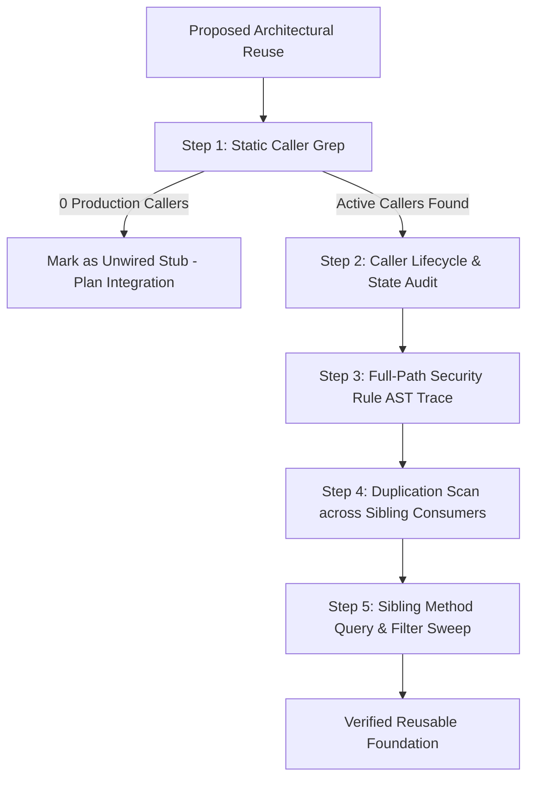

# Call-Graph & Rules-AST Verification Gate

**Category**: Process Pattern & Verification Gate  
**Applies to**: Architecture Reviews, Council Investigations, Service Layer Audits, Security Rules  
**Origin**: 2026-08-18 (INC-082 & `ARCH-REV-260818-EOD-COVERAGE` Review 1.1)  
**Status**: VALIDATED  

---

## Pattern — Call-Graph & Rules-AST Verification Gate

### Problem
Architectural evaluations, council reviews, and feature planning sessions declare an existing service layer or aggregation mechanism "100% reusable" and "verified" because the function exists in code and has passing unit tests. In reality:
1. The function is an orphaned specification stub with 0 callers in production UI pages.
2. The production page actually calls a legacy or buggy query path with different filtering semantics.
3. The underlying database write paths hit default-deny security rules that fail silently due to error-swallowing in telemetry wrappers (`try/catch` with `console.error`).

### Why it happens
1. **Surface-Existence Confirmation Bias**: An agent checks that a method signature and JSDoc match an architectural specification (e.g. ADR-029) and assumes it is active in production without verifying the call graph.
2. **Lexical Rules Pattern Matching**: An agent greps for a keyword in security rules (e.g. `match /events/{eventId}`) without checking which parent collection owns the rule or whether the HTTP verb (`create` vs `read, list`) is authorized.
3. **Mock-Induced False Confidence**: Unit tests mock database clients, causing permission-denied errors and swallowed runtime rejections to pass undetected in test suites.

### Solution
Before asserting that an existing subsystem, service method, or security rule is "reusable", "verified", or "complete", enforce the following **5-Step Verification Gate**:

1. **Step 1: Static Caller Grep (Anti-Orphan Check)**:
   - Run `grep_search` across `src/pages/` and `src/components/` for the exact function name.
   - If caller count is 0, explicitly record: *"Function exists in service layer but has 0 production UI callers; integration is a new wiring path, not an existing reuse."*
2. **Step 2: Actual Caller Lifecycle & Filter Audit**:
   - Inspect what the UI pages actually call today (e.g. `listPendingForUser` vs `getUnifiedDailyAgendaForUser`).
   - Check whether the active call path filters out in-progress states (`status === 'partial'`) or relies on client-side storage (`localStorage`).
3. **Step 3: Full-Path Security Rule AST Trace**:
   - When verifying a write path (e.g. `addDoc(collection(db, 'users', userId, 'events'))`), trace the full path from database root (`/databases/{db}/documents/users/{userId}/events/{eventId}`).
   - Verify that the enclosing `match` block grants the specific HTTP verb (`allow create`). Never rely on leaf keyword matches or collection group read rules.
4. **Step 4: Math & Logic Duplication Grep**:
   - Before recommending a helper, grep for parallel inline implementations (`flatMap`, `reduce`, `filter`) of the same calculation across sibling components.
   - If multiple duplicate implementations exist, plan the extraction of a single canonical utility before adding a new consumer.
5. **Step 5: Sibling Method Query & Filter Sweep**:
   - When remediating a query or filter defect on a service method (e.g. fixing `listPendingForUser` dropping `status === 'partial'`), scan all sibling methods in the same service class (e.g. `listPendingForPosition`) and across related services for identical filtering patterns.
   - Fixing only the reported method while leaving identical defect logic on a sibling method in the same file is an anti-pattern.

### Failure Mode
Declaring an architecture ready for feature expansion when production pages lose data upon refresh, progress bars report disjointed metrics, and compliance audit logs are silently dropped at the database gate.

### Task-Dashboard instance
During the investigation of `ARCH-REV-260818-EOD-COVERAGE` (INC-082):
- `getUnifiedDailyAgendaForUser` had 0 callers in `src/pages/`, while `MyDayPage.jsx` used `listPendingForUser` which dropped `status === 'partial'` routines.
- `listPendingForPosition(positionId)` in the same service class harbored the identical `status === 'pending'` bug, which would have dropped partial routines on `PositionWorkspacePage.jsx:29` if sibling method sweep had not been conducted.
- Progress calculation was duplicated across 9 files.
- `users/{userId}/events` lacked an `allow create` rule in `firestore.rules`, silently dropping checklist telemetry.

---

## Anti-Pattern — Surface-Existence Blindness & Lexical Rules Matching

### What it is
Assuming that because code compiles, unit tests pass against mocks, and ADR documentation is written, the underlying system is correctly wired, reachable, and authorized in production.

### Symptoms
- Review notes state "Existing architecture reused: 100%" for functions that have no production callers.
- Security rules audited by keyword rather than document path hierarchy.
- Passing unit tests despite runtime console errors like `FirebaseError: Missing or insufficient permissions`.

### Why it fails
It substitutes theoretical architecture for empirical reality, hiding critical integration gaps from reviewers and engineers.

### Correction
Always verify the call graph, check the full Firestore rule match hierarchy, and consolidate duplicated algorithms into canonical utilities.
