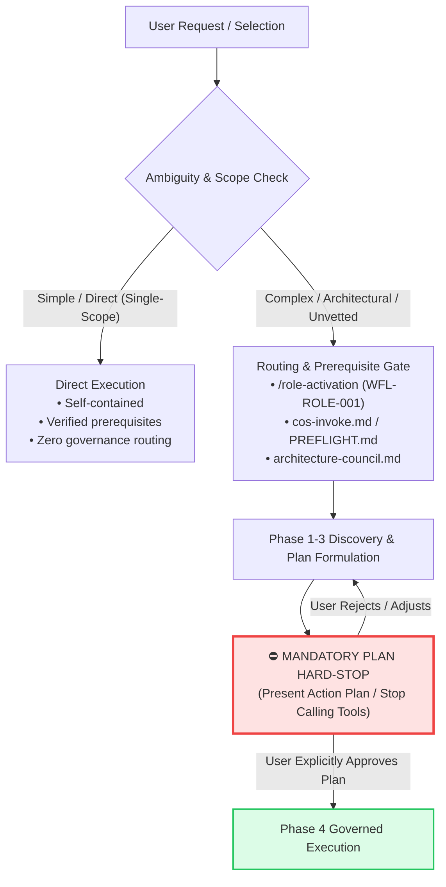

# Intent Decoupling, Decision Sufficiency, and Plan Hard-Stop Protocol

**Category**: Governance / AI Reasoning & Execution Control  
**Applies to**: `prompt-clarity`, `writing-plans`, `/role-activation`, `cos-invoke.md`, `architecture-council.md`  
**Origin**: 2026-08-18 Prompt Clarity Governance Upgrade (INC-079 / Discussion Thread 260818)  
**Status**: VALIDATED  

---

## 1. Executive Summary & Core Principle

> **Core Invariant**: 
> *"A clarified prompt is a clarified intent, NOT an implementation specification or execution authorization."*

When an AI agent or engineer assists in disambiguating user requests, presenting alternative interpretations resolves **what was meant**, not **how to build it** or **permission to execute immediately**. 

Premature commitment occurs when the system treats the selection of an option as a direct green light to mutate code, bypassing domain discovery, architectural evaluation, and explicit user plan review.

---

## 2. The Failure Mode: The "Blind Commitment" Trap

### The Anti-Pattern
```
User Prompt (Ambiguous / Multi-Surface)
  ↓
Agent Disambiguates (Presents Options A vs. B)
  ↓
User Selects Option A
  ↓
[FATAL LEAP] Agent assumes Option A is the final working spec
  ↓
Agent immediately begins file edits / database mutations in the same turn
```

### Why It Fails
1. **Unvetted Infrastructure Assumptions**: Options are often drafted before the agent inspects actual physical write sites or existing automation scripts. (e.g., assuming a marker parser exists when none does).
2. **Invisible Workstream Blast Radius**: The user selects an outcome ("Universal Sync") without knowing it touches 4 repositories and requires building new merge scripts.
3. **Execution Chaining (Violating Protocol 3)**: Chaining plan synthesis directly into tool-based execution without pausing for standalone plan approval.

---

## 3. The 3-Tier Resolution Framework

To eliminate blind commitment while preserving fast execution for trivial tasks, requests must be evaluated through three distinct gates:



### Gate 1: Intent Disambiguation vs. Solution Design
- **Semantic Ambiguity**: Phrasing, tone, simple parameter choices $\rightarrow$ 1-turn clarification is sufficient.
- **Strategic / Architectural Forking**: Distinct technical paths or unvetted dependencies $\rightarrow$ requires grounding in existing repository infrastructure before committing.

### Gate 2: The Routing vs. Execution Gate
When the user picks a non-trivial option:
- The agent **MUST NOT** immediately edit files.
- The agent **MUST** restate the clarified intent in one line and route to the governing workflow (`/role-activation`, `cos-invoke.md`, `architecture-council.md`, `plan.md`).

### Gate 3: The Plan Hard-Stop Gate
- When an implementation plan or course of action is presented, the agent **MUST HARD-STOP** (terminate turn without calling mutating tools).
- **Rule**: Zero file edits, terminal write commands, or database writes are permitted until the user provides a standalone, explicit "Go" / "Approved" confirmation.

---

## 4. AI Reasoning Safeguards (AKCS-BEH-001 Upgrades)

To prevent cognitive drift, all agents operating in this ecosystem must adhere to five behavioral rules:

| Rule ID | Principle | Behavioral Mandate |
| :--- | :--- | :--- |
| **R1** | **Inventory First, Invent Never** (Rung 2 Grounding) | Grep `.agent/` and `docs/ssot/` before proposing new schemas, gates, cards, or taxonomies. Wire to existing infrastructure (`architecture-council.md` 3-question gate, `IS-007` blast radius scope, `cos-invoke.md`); never build duplicate machinery. |
| **R2** | **Resist the Manifest Anchor Trap** | Treat complex user manifests and multi-tier blueprints as *hypotheses to audit against codebase reality*, not unvetted mandates to build immediately. |
| **R3** | **Smallest Working Diff Pressure Test** | Always ask: *"What is the absolute smallest diff that closes this root failure mode?"* Never build an 11-stage pipeline when a 5-line routing patch solves the bug. |
| **R4** | **Non-Goals Consistency Assertion** | Actively assert that every part of a proposed plan strictly complies with its declared Non-Goals. |
| **R5** | **Zero Cross-Repo Vocabulary Smuggling (`CGO-001`)** | Verify that acronyms, protocol IDs, and workflow names match the local repository's SSOT (e.g. `RFG-001` in this repo is *Reality-First Grounding Policy*; never import foreign definitions from linked repos). |

---

## 5. Transferable Intelligence vs. Repo-Specific Mechanics

### Transferable (Universal Knowledge)
- **Decoupling Intent from Execution**: Universally applicable to any conversational agent or engineering workflow.
- **The Plan Hard-Stop**: Universal safeguard against runaway agent execution.
- **Inventory First**: Universal heuristic against AI over-engineering and architectural duplication.

### Repo-Specific Mechanics
- The specific routing endpoints (`/role-activation`, `cos-invoke.md`, `architecture-council.md`, `plan.md`).
- Specific truth-tag markers (`*(unverified)*` in `meta-prompt.md`).
- The 4-PPSD payload structures in `.agent/session/mode1-output.json`.

---

## 6. Verification and Acceptance Criteria

- **AC-1**: Selecting an option in `prompt-clarity` that requires planning or architecture routing never produces file diffs in the same turn.
- **AC-2**: All multi-step proposals present a clear course of action and terminate in an explicit hard-stop waiting for user input.
- **AC-3**: `meta-prompt.md` and `SKILL.md` remain byte-compatible in logic without divergent conditions.
- **AC-4**: All reasoning safeguards are checked mechanically via `npm run verify:governance-wiring`.

<!-- SSOT: docs/incidents/INC-084-prompt-clarity-blind-commitment-and-plan-hardstop.md — INC-084 -->
