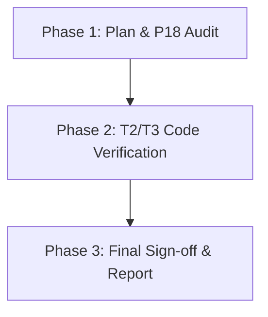

# COS Integration Verifier Skill

> **System**: Cognitive Orchestration System (COS) | **COS Role**: MODE 3 — Integration Verifier
> **Triggers**: `"run verifier"` | `"verify this change"` | `"review before execute"`
> **Purpose**: COS MODE 3 specialist designed to review feature plans, assert P18 data-chain integration integrity, and govern the T2/T3 Definition of Done (DoD) verification gates.

---

## 1. Quick Start

When the session is routed to **MODE 3 (Verification)**, the Verifier role takes custody of the execution.

### Execution Invocation
```bash
# Triggers the verifier validation sequence
run verifier
```

---

## 2. Verification Core State Machine

The Verifier executes a three-stage validation pipeline before signing off on plan reviews or code changes:



### 2.0 Input Contract (ENH-INFRA-071 Phase 2 — cannot start without)

> [!CAUTION]
> **MODE 3 cannot begin until this check passes.** Read `.agent/session/mode2-output.json` and confirm the following before executing any verification step:
>
> - [ ] `.agent/session/mode2-output.json` exists and is valid JSON
> - [ ] `git_diff_status` key is present (if value is `"none"` → no code was written; skip to §3 and write `mode3-output.json` with `verdict: "PASS"` and a `p18_trace` noting no changes)
> - [ ] `scope_violations` array is empty — if non-empty, halt; do not verify out-of-scope changes
>
> If `mode2-output.json` is absent → halt with: `"MODE 3 blocked: mode2-output.json not found — MODE 2 must complete its exit contract first."`

### 2.1 Phase 1: Plan & P18 Integration Audit
Before execution begins, the Verifier scans the proposed implementation plan to ensure P18 compliance:
1.  **UI Action Mapping**: Confirm the specific React event handler or entry route is declared.
2.  **Hook State Lifecycle**: Validate the custom hook (e.g., `useProfile()`) is identified as the context owner.
3.  **Service/Logic Layer**: Assert that business logic resides inside a service helper or action runner.
4.  **Firestore/DB Target**: Validate that no direct `collection()` queries violate **ADR-001** and they go through owning context hooks.
5.  **Integration Test Contract**: Assert that at least one end-to-end integration scenario is defined.

### 2.2 Phase 2: T2/T3 Code Verification (DoD Checklist & Evidence Contract)

> [!CAUTION]
> **NO BLIND TRUST / NO SELF-CERTIFICATION**: You MUST NOT mark T2 or T3 gates as PASS in the report based on memory, assumption, or belief. You MUST physically execute the verification commands in the terminal and attach the actual exit codes and stdout/stderr as proof. Reports containing self-certified checklists without command output citations are invalid.

During validation, the Verifier performs mechanical checks on target files using physical and automated validation:

*   **T2 Verification (Automated & Structured)**:
    1.  **Run structural validation check**: Execute `npm run sg:scan` in the terminal. Capture the stdout and confirm 0 violations.
    2.  **Verify zero undefined "ghost" CSS classes**: Execute `npm run sg:p55` (if UI was modified) to scan for test instrumentation issues and invalid classes.
    3.  **Assert 100% z-index compliance**: Verify z-index properties utilize design system tokens (`--z-*`).
*   **T3 Verification (E2E & Component Instrumentation)**:
    1.  Ensure all new dynamic panels/lists/tables have unique test anchors: `id` + `data-testid` on root containers.
    2.  Assert that leaf-level buttons/inputs are queryable via parent-scoped E2E queries.
    3.  Confirm responsive layout overrides (`@media`) exist for smaller viewports.
    4.  **Execute testing commands**: Run `npm run test:quick` or the target Playwright/Cypress spec and capture the test report stdout.

---

## 3. PASS/FAIL Decision Structure & Output Contract

### 3.1 JSON Output Contract (mode3-output.json)

> [!CAUTION]
> **GovernanceActivation cannot fire until this JSON file exists and passes schema validation.** Writing a Verifier Gate Report block (§3.2) in the session output is not sufficient alone — the orchestrator reads `.agent/session/mode3-output.json` directly and validates all 6 required fields before allowing GovernanceActivation to proceed. "I verified it" is not a Verifier Gate Report JSON.
>
> **`stdout_citation` and `exit_code` are mandatory, not optional.** They are the structural enforcement of the §2.2 "physically execute" requirement — a report without actual command output in `stdout_citation` and a real exit code in `exit_code` is self-certified and therefore invalid.

The Verifier MUST write the validation results to `.agent/session/mode3-output.json`. This JSON file is the mechanical handoff contract consumed by the orchestrator before GovernanceActivation is authorized.

**Required JSON Contract Structure** (all 6 bold fields are mandatory — missing any one blocks GovernanceActivation):
```json
{
  "mode": "MODE_3_VERIFICATION",
  "timestamp": "YYYY-MM-DDTHH:MM:SSZ",
  "status": "PASS | FAIL",
  "trigger_reason": "verification_complete | p18_failure | t2_t3_failure",
  "p18_trace": [
    "1. UI Event / Entry point description",
    "2. Hook State / Context handler details",
    "3. Service Layer / Business logic call details",
    "4. Firestore / DB Collection write audit",
    "5. Integration / End-to-end test validation path",
    "6. ADR-001 / Relationship Cardinality validation check"
  ],
  "t2_result": "pass | fail",
  "t3_result": "pass | fail",
  "verdict": "PASS | FAIL",
  "stdout_citation": "Paste exact command stdout/stderr snippet here",
  "exit_code": 0,
  "blocking_items": [],
  "next_expected_input": "governance_activation | user_remediation"
}
```

### 3.2 🛡️ VERIFIER ROLE GATE REPORT (Markdown format)
In addition to the JSON output contract, the Verifier outputs the following report in the session logs:

- **Verification Target**: [Component/File/Plan Path]
- **Execution Mode**: MODE 3 (Verification)
- **JSON Contract Path**: `.agent/session/mode3-output.json`

#### 📋 Metrics & Gates Checklist:
- [ ] **P18 Integration Trace**: [PASS | FAIL | N/A] (Must contain all 6 links/traces)
- [ ] **T2 Automated Scan (sg:scan)**: [PASS | FAIL | N/A]
- [ ] **T3 E2E Instrumentation (P55)**: [PASS | FAIL | N/A]
- [ ] **ADR-001 Profile Linkage**: [PASS | FAIL | N/A]

#### 📊 Physical Execution Proof (Mandatory Evidence):
```powershell
# [Evidence Block 1: npm run sg:scan Output]
# [Paste actual CLI stdout/stderr here]
# Exit Code: [0 | 1]
```
```powershell
# [Evidence Block 2: npm run sg:p55 / test run Output]
# [Paste actual CLI stdout/stderr here]
# Exit Code: [0 | 1]
```

#### 🔍 Findings & Deficiencies:
> 1. [Finding 1] - Action required: [Resolution]
> 2. [Finding 2] - Action required: [Resolution]

#### 🚦 Verification Verdict:
- [ ] **APPROVED TO PROCEED** (All critical gates passed with verifiable proof; mode3-output.json written successfully)
- [ ] **NEEDS REVISION** (Blockers detected or evidence missing)


---

## 4. Related Resources

*   [Feature Plan Review Workflow](../../workflows/plan-review.md)
*   [P55 Instrumentation Guide](../../../docs/development-guidelines/P55-INSTRUMENTATION-GUIDE.md)
*   [Relationship Cardinality SSOT](../../../docs/ssot/architecture-hub/RELATIONSHIP-CARDINALITY-SSOT.md)
