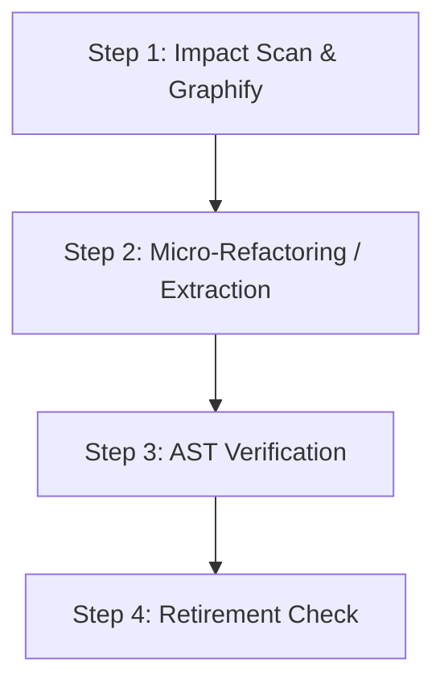

# COS Safe Refactor Specialist Skill

> **System**: Cognitive Orchestration System (COS) | **COS Role**: MODE 5 — Safe Refactor Specialist
> **Triggers**: `"safe refactor this"` | `"P11 safe refactor mode"` | `"large refactor safety"` | `"bundles_active >= 3"`
> **Purpose**: COS MODE 5 specialist designed to coordinate large refactors, mitigate regression risk on god-nodes/large files (P11), perform change-impact analysis, execute AST structural checks, evaluate `bundles_active >= 3` decomposition triggers, and govern the Retirement Evaluation gates.


---

## 1. Quick Start

When the session is routed to **MODE 5 (Safe Refactor)**, the Safe Refactor role takes custody of the execution.

### Execution Invocation
```bash
# Triggers the safe refactor analysis sequence
safe refactor this
```

---

## 2. Safe Refactor Core Protocol

The Safe Refactor role enforces a rigorous, multi-stage protocol to prevent regression when modifying heavily coupled components:



### 2.0 Input Contract (ENH-INFRA-071 Phase 3 — cannot start without)

MODE 5 is triggered by one of the following signals from `SESSION_GOVERNANCE_STATE.json`. At least one must be active before execution begins:

- [ ] **P11 signal** — target file exceeds 600 lines (or edit would push it past the threshold)
- [ ] **P65 signal** — target touches shared state contexts, Positional Profiles, or user assignments
- [ ] **`bundles_active ≥ 3`** — orchestrator §2.3.2.2 decomposition trigger fired

Additionally confirm:
- [ ] `SESSION_GOVERNANCE_STATE.json` present in `.agent/session/` with the triggering risk signal recorded
- [ ] Graphify output available (or `graphify` invoked as Step 1 below) — MODE 5 MUST NOT skip the impact scan

If none of P11, P65, or the bundles_active trigger is present → MODE 5 was invoked incorrectly; halt and route back to the orchestrator for re-evaluation.

### 2.1 Step 1: Pre-Refactor Impact Scan & Graphify
Before editing any lines, map out the semantic dependency landscape of the target component:
1.  **Graphify Mapping**: Identify the target component's community using `graphify-out/GRAPH_REPORT.md` (Protocol 26).
2.  **Shared State Enlistment**: Identify every shared state setter (e.g. `setX`) used in the component's community. Enumerate all call sites and assert 100% payload shape parity to prevent runtime TypeErrors.
3.  **Run Change Impact Analysis**: Run `change-impact-analysis` workflow to document the list of direct and transitive dependents.

### 2.2 Step 2: Micro-Refactoring & File Extraction (P11 Threshold)
If target files exceed the 600-line threshold or edit would add 100+ lines:
*   **Rule**: Extract focused submodules, logic utilities, or custom hooks.
*   **Cap**: 800 lines is an absolute hard ceiling.
*   **Execution**: Extract logic from UI wrappers into separate pure service files or custom hooks. Apply **SSOT-First Module Discovery (Protocol 60)** before opening new files.

### 2.3 Step 3: AST & Regression Verification (Evidence Contract)

> [!CAUTION]
> **PHYSICAL TERMINAL EXECUTION REQUIRED**: You MUST NOT assume the refactored code passes structural rules. You MUST execute `npm run sg:scan` and `npm run sg:p55` (if UI components changed) and physically capture the command execution outcomes, documenting the exit codes and output shapes as proof in your session records.

After refactoring, verify structural safety:
1.  **Run Structural Linter**: Execute AST-based validator to verify semantic bridge and styling tokens:
    ```powershell
    npm run sg:scan
    ```
<!-- shared:proto.cos-safe-refactor.ast-parity-gate:start -->
3.  **Verify Function Parity & Signature Preservation**: Execute mechanical parity audit against baseline to ensure zero dropped functions:
    ```powershell
    node .agent/skills/systematic-debugger/scripts/audit-parity.js --ref-git "HEAD~1:src/path/to/component.jsx" --target-files "src/path/to/component.jsx,src/hooks/useExtracted.js" --strict
    ```
<!-- shared:proto.cos-safe-refactor.ast-parity-gate:end -->

---

## 3. Retirement Evaluation Gate & Evidence Contract

At the end of the refactoring cycle, evaluate the component's stability and retirement conditions. You MUST physically run the search commands below and document the exact matches as proof:

### 3.1 Retirement Checklist & Search Proofs

*   **Condition A (Stability Deficit Verification)**: Run the log scanner to check past incidents:
    ```powershell
    Select-String -Path "docs/PIRR_RECONCILIATION_LOG.md" -Pattern "COMPONENT_NAME"
    ```
    *   **Evidence Citation (Mandatory)**: Document the exact number of matching incident lines returned.
    *   *Trigger*: If the component has $\ge 3$ recorded incident logs, it is flagged for immediate retirement.
*   **Condition B (Bloat Deficit Verification)**: Inspect the physical file size and lines after refactoring.
    *   *Trigger*: If the file size remains above 600 lines even after micro-refactoring, it is flagged for retirement/complete replacement.

### 3.2 Escalation Protocol & Output Report

If **EITHER** Condition A or B is met, generate the following escalation report block and exit immediately:

```markdown
### ⚠️ SAFE REFACTOR ROLE: RETIREMENT ESCALATION REPORT

- **Target Component**: [Component Name/Path]
- **Status**: RETIREMENT SIGNAL TRIGGERED
- **Verification Evidence**:
  - **Condition A (Incident Count)**: [N] incidents found in log file.
    - *Command run*: `Select-String -Path "docs/PIRR_RECONCILIATION_LOG.md" -Pattern "COMPONENT_NAME"`
    - *Matches*: [Paste matching lines here]
  - **Condition B (File Size)**: [N] lines remaining post-refactor.
- **Escalation Reason**: [Brief explanation of stability/bloat deficit]
- **Action**: Escalated directly to session coordinator for deprecation planning. Stopping execution.
```

If neither condition is met, proceed to produce the **Extraction Plan Output Contract** (defined in §3.3) before handoff.

---

## 3.3 MODE 5 Extraction Plan Output Contract

> [!CAUTION]
> **MODE 2 cannot begin until this exit gate passes.** The Safe Refactor Specialist MUST write `.agent/session/mode5-output.json` with all required fields before handing off to MODE 2. The orchestrator reads this file directly — a prose summary or session output block is not sufficient. MODE 2's input contract (§2.3.4, MODE 2 Input Contract) accepts `mode5-output.json` as equivalent to `mode1-output.json` — the `blast_radius_scope` field is the key that unlocks MODE 2 entry.

When executing refactoring or responding to a `bundles_active >= 3` trigger, the Safe Refactor Specialist MUST write `.agent/session/mode5-output.json` with the following minimum required fields:

**Required JSON Contract Structure**:
```json
{
  "mode": "MODE_5_SAFE_REFACTOR",
  "timestamp": "YYYY-MM-DDTHH:MM:SSZ",
  "trigger": "P11 | P65 | bundles_active_gte_3",
  "impacted_modules": [
    "src/components/TargetComponent.jsx",
    "src/hooks/useRelatedHook.js"
  ],
  "blast_radius_scope": {
    "UI": true,
    "DB": false,
    "Reactive": false,
    "Service": false,
    "Module": true,
    "Doc": false
  },
  "bounded_contract": {
    "impacted_surfaces": ["UI", "Module"],
    "files_in_scope": ["src/components/TargetComponent.jsx"],
    "files_out_of_scope": ["src/pages/AdminPage.jsx"]
  },
  "retirement_evaluation": {
    "condition_a_incident_count": 0,
    "condition_a_triggered": false,
    "condition_b_lines_post_refactor": 0,
    "condition_b_triggered": false,
    "retirement_required": false
  },
  "decomposition_decision": "proceed_sequenced | split_into_independent_cycles",
  "bundles_candidate": ["arch_execution", "ui_execution"]
}
```

**Minimum required fields** (missing any one blocks MODE 2 entry):
- `impacted_modules` — array; non-empty
- `blast_radius_scope` — object; at least one field `true`
- `retirement_evaluation.condition_a_triggered` — boolean
- `retirement_evaluation.condition_b_triggered` — boolean
- `retirement_evaluation.retirement_required` — boolean (if `true` → halt; do not proceed to MODE 2)
- `decomposition_decision` — string; one of `"proceed_sequenced"` or `"split_into_independent_cycles"`

**Handoff to MODE 2** (same contract as MODE 1):
The orchestrator reads `mode5-output.json` and extracts `blast_radius_scope` + `bounded_contract` as the declared boundary constraints for MODE 2, identical to how it consumes `mode1-output.json`. MODE 2 must not begin code edits without this handoff confirmed.


---

## 4. Related Resources

*   [Change Impact Analysis Workflow](../../workflows/change-impact-analysis.md)
*   [File Placement Guardrail](../../workflows/file-placement-guardrail.md)
*   [P11 File Growth Standard](../../../docs/ssot/architecture-hub/README.md)
