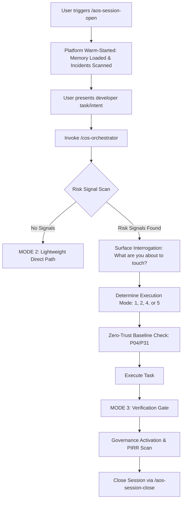

# COS Orchestrator Workflow

> **System**: Cognitive Orchestration System (COS) | **Legacy title**: Interactive Session Orchestrator Workflow
> **Purpose**: Standardized COS workflow for intercepting, assessing, and routing task intents within an active developer session.
> 
> **Core Philosophy**: Keeps **Platform Booting** (`aos-session-open.md`) and **Active Task Routing** (`cos-orchestrator` skill) decoupled to avoid user prompt fatigue on read-only sessions, while ensuring strict governance for all active coding tasks.

---

## 🚀 Execution Flow: After Warm Start



---

## 📋 The 4-Phase Intent Routing Protocol

### Phase 1: Initialize Task Intent
Upon receiving an active development request from the user, invoke the orchestrator skill by writing:
> `"route this intent"` or `"run orchestrator"`

---

### Phase 2: Heuristic Blast-Radius Scan
The orchestrator performs a rapid, automatic scan of the proposed files and task description:
* **P11 (File Growth)**: Does any target file exceed 600 lines?
* **P68 (Firestore)**: Does the intent require Firestore queries or collection schema changes? → If yes, the MODE 1 investigation should include live schema verification via `db-inspect` (see `.agent/workflows/db-inspect.md`) to validate query bounds and collection structure before proposing changes.
* **P65 (Positional Profiles)**: Does the change touch shared state, Positional Profiles, or user assignments?
* **P-SVC (Service Blast Radius)**: Does the task modify files under `src/services/`, `src/hooks/`, or `src/contexts/`?

---

### Phase 3: Surface Interrogation & Mode Selection
If **any** risk signals are found, the orchestrator prompts the user with the primary question:
> 💬 **"What are you about to touch?"**
> 1. `UI only` $\rightarrow$ Routes to **MODE 2 (Implementation)**
> 2. `Data` $\rightarrow$ Routes to **MODE 1 (Topology)**
> 3. `Shared state` $\rightarrow$ Routes to **MODE 5 (Safe Refactor)** (if P11 also fires) or **MODE 1**
> 4. `Service` $\rightarrow$ Routes to **MODE 1 (Topology)**
> 5. `Mixed` $\rightarrow$ Routes conservatively to **MODE 1 (Topology)**
> 6. `Not sure` $\rightarrow$ Follow-up: *"Does the change touch Firestore or a shared state setter?"*

---

### Phase 4: The Zero-Trust Baseline Audit (P04/P31 Gate)
Before writing any code or proposing plans under the selected Mode, the agent **must** physically open and inspect all related existing logic to prevent duplicate capabilities. It then emits the canonical audit block:

```markdown
## As-Is Baseline Audit — [Component/Feature in Scope]

| File | Lines Inspected | Relevant Existing Logic | Status |
|------|----------------|------------------------|--------|
| `ComponentName.jsx` | L{start}-{end} | [Brief description of what already exists] | LIVE / ABSENT |
| `ContextName.jsx` | L{start}-{end} | [State or query that exists] | LIVE / ABSENT |

### Capability Existence Check
- Proposed: [Enhancement description]
- Verdict: ALREADY IMPLEMENTED → DROP | NOT FOUND → PROCEED | PARTIALLY IMPLEMENTED → EXTEND
```

---

## 🏁 Post-Execution Verification (MODE 3)
Once changes are made, they are locked down before commit:
1. **Vitest Unit Suite**: Confirm 100% green (`npm run test:unit:run`).
2. **AST Ghost Class Check**: Ensure no undefined background styles are introduced (`npm run sg:scan`).
3. **P55 Dual-Anchor Scan**: Assert DOM tests elements are instrumented correctly (`npm run sg:p55`).
4. **PIRR & Session Closeout**: Invoke `/aos-session-close` to reconcile documents and finalize the audit trail.

---

*Axis: Architecture / Governance | Layer: Task Routing | Revision: 2026-05-23 (Decoupled & Standardized)*
