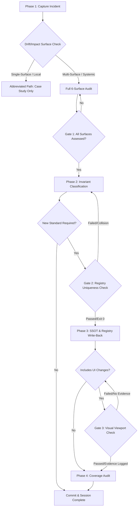

# Portable Workflow: Post-Incident Governance

**Purpose:** This workflow prevents the same bug from happening twice by institutionalizing lessons learned into structural invariants and discoverable case studies. A bug is not "fixed" until it is institutionalized.

---

## Trigger Conditions

Invoke this workflow whenever:
- A production bug is resolved.
- A repeated debugging failure occurs (wasting significant time).
- A systemic learning is identified ("we should always/never...").

---

## Workflow Routing & Decision Flow



---

## Phase 1 — Capture (Case Study)

Write a formal Case Study in your project's troubleshooting log (e.g., `docs/incidents/INC-XXX.md`).

### ❓ Decision Node 1: Drift/Impact Surface Check
Evaluate the incident against the 6 surfaces:
1. **UI Surface** (styles, responsive layouts, viewport sizes, component display)
2. **Data Surface** (Firestore schema, rules, Sheets layout, database write APIs)
3. **Reactive Surface** (React state setters, context providers, state payload structures, hooks)
4. **Service Surface** (Cloud Functions, Apps Script controllers, authentication layer, external services)
5. **Module Surface** (Package dependencies, route registration, file structure/monolith limits)
6. **Governance Surface** (Standards catalog, GEMINI.md, violation patterns, ADR compliance)

*Routing Rule*:
* If the incident affects **only a single surface** (e.g. standard typo in a UI label, minor visual padding fix) and does not represent a systemic design pattern breach -> Run **Abbreviated Path** (document Case Study, then exit).
* If the incident affects **2 or more surfaces** (e.g. UI layout fix requires custom JS hook update or registers a new standard that collides with an existing registry ID) -> Run **Full 6-Surface Audit** (must document all 6 surfaces in the case study).

### 🔍 Validation Gate 1: Case Study Surface Completeness Check
Before proceeding to Phase 2:
* **Requirement**: The Case Study document MUST contain an `Architectural Surface Mapping` header.
* **Halt Condition**: If any of the 6 surfaces are marked as "N/A" without a written justification explaining why the surface was unaffected by the bug or the fix, the gate is BLOCKED. Return to Phase 1.

---

## Phase 2 — Invariant Classification

Determine if the bug reveals a **Structural Invariant** (a rule that the entire codebase relies upon).

- *Is this a violation of a systemic design pattern?* (e.g., missing API wrappers, incorrect deployment order, missing auth guards).
- If YES, proceed to Phase 3.
- If NO, Phase 1 is sufficient.

**ADR Gap Check:**
- Does an ADR exist that covers the pattern this bug violated?
- If **YES** and the bug still happened → the ADR was not enforced. Strengthen it in your project's rules SSOT (Phase 3).
- If **NO** → the missing ADR is itself a root cause. Write the ADR as part of this workflow.

---

## Phase 3 — SSOT Extension & Standards Catalog Write-Back

### 🔍 Validation Gate 2: Registry Uniqueness & Wiring Check (Collision & PACT Prevention)
Before editing `GEMINI.md` or `.agent/standards-catalog.json`:
* **Requirement**: Execute the standards validation and wiring gates:
  ```powershell
  # Check for standard collisions and semantic overlaps
  node scripts/verify-standards-integrity.cjs
  # Check for PACT/governance wiring completeness
  npm run verify:governance-wiring
  ```
* **Halt Condition**: If either script returns exit code `1` (indicating standard ID collision, duplicate definitions, or unwired artifacts/broken PACT back-links), the registration is BLOCKED. Remap standard IDs or wire triggers, and re-run check until it returns exit code `0`.

### Execution Steps:
1. **Extend SSOT (`GEMINI.md`)**: Add the new protocol detailing the constraint and the *Why* behind the rule.
2. **Catalog Write-Back (`standards-catalog.json`)**: Add the new standard entry mapping to category, severity, references, and `surfaces[]`.
3. **Pattern Mapping (`violation-patterns.json`)**: Add the detection pattern with the matching `standardId`.
4. **Wire Consumption (PACT Compliance)**: If adding a standard/pattern, ensure it is wired into the agent's consumption layer:
   - Add trigger phrases to `.agent/skill-router.yaml` triggers array.
   - Add standard routing entries to `.agent/PREFLIGHT.md`.
   - Add reference pointer to `CLAUDE.md`.
5. **Process Pattern Gate**: If the incident revealed a *process failure* (an agent workflow was missing a check, a step was consistently skipped, a discovery that should be repeatable) rather than only a code invariant — run `/capture-pattern` to archive the corrective process into `.agent/patterns/`. (For monolith splits or modular coordination changes, see [.agent/patterns/monolith-split-verification-patterns.md](../patterns/monolith-split-verification-patterns.md) for verification guidelines).

   Distinction:
   - Code invariant → `GEMINI.md` + `standards-catalog.json` (steps 1-4 above)
   - Process/methodology pattern → `/capture-pattern` → `.agent/patterns/`
   - Both → do both

---

## Phase 4 — Coverage Audit

If a new Structural Invariant was defined, audit the rest of the codebase for existing violations.

1. **Search**: Use global search to find similar patterns.
2. **Remediate**: Fix any non-compliant code immediately to ensure the rule is consistent.
3. **Integrity Check**: Re-run all tests to verify that registry updates did not break the build.

---

## Phase 5 — Verification & Commit Close

### 🔍 Validation Gate 3: Viewport & Integration Verification Gate
Before staging and committing changes:
* **Halt Condition 1**: If UI changes were made, verify that the walkthrough file (`walkthrough.md`) lists the visual verification evidence (paths to visual verification screenshots at 768px, 1024px, and 1280px).
* **Halt Condition 2**: If code files were changed, verify that `npm run test:unit:run` and `npm run sg:scan` have run and returned exit code `0`.

---

## Litmus Test

Before finishing, ask:
> *"If a new developer touches this codebase tomorrow, is it physically impossible for them to make this same mistake without violating a written protocol?"*
> *"Is there an ADR that would have made this bug architecturally impossible to introduce — and if not, has one been written now?"*
> *"If this incident was caused by a missing process step (not just missing code enforcement), has that step been captured in `.agent/patterns/` via `/capture-pattern`?"*

If all YES, the workflow is complete.

