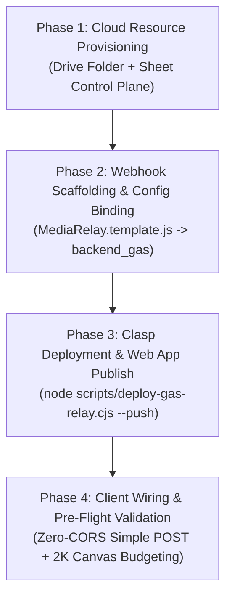

# Portable Workflow: Sheet-Drive Media Relay Setup & Orchestration (`/sheet-drive-relay`)

> **Purpose**: Guides an engineer or AI agent through scaffolding, configuring, deploying, and verifying a zero-billing, zero-CORS Google Apps Script Media Relay backed by Google Drive and Google Sheets in ANY repository.
> 
> **Standard**: `STD-DRIVE-MEDIA-RELAY-001` / `P-DRIVE-MEDIA-RELAY-001` (`AC-DEC-2026-055` / `SK-015`)  
> **Associated Skill**: `.agent/skills/sheet-drive-relay/SKILL.md`  

**Trigger phrases**:
- "setup drive upload"
- "sheet drive relay"
- "drive media relay"
- "configure drive storage"
- "deploy media relay"
- "/sheet-drive-relay"

---

## ⚡ 4-Phase Execution Pipeline



---

## Phase 1: Cloud Resource Provisioning

1. **Create Google Drive Root Folder**:
   - In Google Drive, create a dedicated folder (e.g. `Project_Media`).
   - Extract `ROOT_FOLDER_ID` from the URL:
     `https://drive.google.com/drive/folders/{ROOT_FOLDER_ID}`
2. **Create Control Spreadsheet**:
   - In Google Sheets, create a new spreadsheet (e.g. `Project_Media_Relay`).
   - Extract `SPREADSHEET_ID` from the URL:
     `https://docs.google.com/spreadsheets/d/{SPREADSHEET_ID}/edit`
   - Create 3 tabs conforming to [SHEET_SCHEMA_SPEC.md](file:///d:/GitHub_Repo/Sree_Krushna/.agent/skills/sheet-drive-relay/resources/SHEET_SCHEMA_SPEC.md):
     - `Config_Settings` (Columns: `SettingKey`, `SettingValue`, `Notes`)
     - `Config_Routing` (Columns: `Module`, `Event`, `Category`, `SubfolderPath`, `Status`)
     - `Upload_Ledger` (Columns: `Timestamp`, `UploaderEmail`, `ItemId`, `Module`, `Event`, `Category`, `FileName`, `FileSizeKB`, `FileId`, `DriveUrl`, `ThumbnailCdnUrl`, `SubfolderPath`)

---

## Phase 2: Webhook Scaffolding & Parameter Binding

1. **Scaffold Backend Directory**:
   ```powershell
   mkdir backend_gas -ErrorAction SilentlyContinue
   ```
2. **Copy Templates**:
   - Copy `.agent/skills/sheet-drive-relay/templates/MediaRelay.template.js` to `backend_gas/MediaRelay.js`.
   - Copy `.agent/skills/sheet-drive-relay/templates/appsscript.json` to `backend_gas/appsscript.json`.
3. **Bind Configuration**:
   - Replace `{{ROOT_FOLDER_ID}}` with your actual Google Drive Root Folder ID.
   - Replace `{{SPREADSHEET_ID}}` with your actual Google Sheet ID.
   - Replace `{{AUTHORIZED_EMAILS}}` with your authorized email allowlist array.

---

## Phase 3: Clasp Deployment & Web App Publish

1. **Initialize `.clasp.json`**:
   ```json
   {
     "scriptId": "YOUR_APPS_SCRIPT_PROJECT_ID",
     "deploymentId": "YOUR_DEPLOYMENT_ID",
     "rootDir": "."
   }
   ```
2. **Deploy via Cross-Platform Deployer**:
   ```powershell
   node scripts/deploy-gas-relay.cjs --target-dir=backend_gas --push
   ```
   *(When `deploymentId` is present in `.clasp.json`, this command automatically pushes the code AND updates the live versioned deployment in-place, eliminating manual UI deployment steps).*
3. **Publish in Google Apps Script Console (First-Time Only)**:
   - If setting up the very first deployment: Open Apps Script &rarr; `Deploy` &rarr; `New deployment` &rarr; Select `Web app` &rarr; Execute as: `Me` &rarr; Who has access: `Anyone`.
   - Copy the deployed Web App URL and Deployment ID into `.clasp.json` and client config. All future updates use Step 2 automatically.

---

## Phase 4: Client Wiring & Pre-Flight Validation

1. **Configure Web Client**:
   - Store the webhook URL in your app configuration (e.g. `config.js`):
     ```javascript
     window.appConfig = {
       driveUploadWebhookUrl: 'https://script.google.com/macros/s/.../exec'
     };
     ```
2. **Enforce Browser Invariants**:
   - Verify `INV-RELAY-CORS-001`: Client fetch uses `headers: { 'Content-Type': 'text/plain' }` and `redirect: 'follow'`.
   - Verify `INV-RELAY-CANVAS-002`: Image files are downscaled to max 2048px at 0.88 quality before sending.
3. **Execute Contract Tests**:
   ```powershell
   node scripts/test-sheet-drive-relay-contract.cjs
   ```
4. **Execute Verification Suites**:
   ```powershell
   npm run verify:governance-wiring:all
   ```
