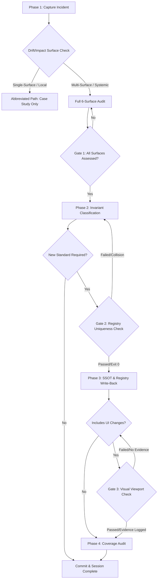

# Portable Workflow: Post-Incident Governance

**Purpose:** This workflow prevents the same bug from happening twice by institutionalizing lessons learned into structural invariants and discoverable case studies. A bug is not "fixed" until it is institutionalized.

---

## Trigger Conditions

Invoke this workflow whenever:
- A production bug is resolved.
- A repeated debugging failure occurs (wasting significant time).
- A systemic learning is identified ("we should always/never...").

---

## Workflow Routing & Decision Flow



---

## Phase 1 — Capture (Case Study)

Write a formal Case Study in your project's troubleshooting log (e.g., `docs/incidents/INC-XXX.md`).

> **Token/CSS-custom-property incident?** Query `npm run query -- --token <name>` for the token(s) involved before writing the case study — it gives you the definition/consumption facts (which themes, gradient-or-solid, orphan/phantom status) in one command instead of a fresh grep, and those facts belong verbatim in the case study's root-cause section.

> [!WARNING]
> **Visual Edit Attempt Cap (VEA-001) — mandatory for UI surface incidents.**
> If this incident involved any CSS/layout fix attempt that the user reported as "still wrong" or "didn't work":
> - That attempt SHOULD have stopped and requested a screenshot (VEA-001).
> - If it did not, record the missed gate as a **Process Failure** in the Case Study (surface: Governance) and include it in the invariant classification below.
> - Reference: `.agent/patterns/css-bridge-specificity-management.md § Visual Edit Attempt Cap`

### ❓ Decision Node 1: Drift/Impact Surface Check
Evaluate the incident against the 6 surfaces:
1. **UI Surface** (styles, responsive layouts, viewport sizes, component display)
2. **Data Surface** (Firestore schema, rules, Sheets layout, database write APIs)
3. **Reactive Surface** (React state setters, context providers, state payload structures, hooks)
4. **Service Surface** (Cloud Functions, Apps Script controllers, authentication layer, external services)
5. **Module Surface** (Package dependencies, route registration, file structure/monolith limits)
6. **Governance Surface** (Standards catalog, GEMINI.md, violation patterns, ADR compliance)

*Routing Rule*:
* If the incident affects **only a single surface** (e.g. standard typo in a UI label, minor visual padding fix) and does not represent a systemic design pattern breach -> Run **Abbreviated Path** (document Case Study, then exit).
* If the incident affects **2 or more surfaces** (e.g. UI layout fix requires custom JS hook update or registers a new standard that collides with an existing registry ID) -> Run **Full 6-Surface Audit** (must document all 6 surfaces in the case study).

### 🔍 Validation Gate 1: Case Study Surface Completeness Check
Before proceeding to Phase 2:
* **Requirement**: The Case Study document MUST contain an `Architectural Surface Mapping` header.
* **Halt Condition**: If any of the 6 surfaces are marked as "N/A" without a written justification explaining why the surface was unaffected by the bug or the fix, the gate is BLOCKED. Return to Phase 1.

---

## Phase 2 — Invariant Classification

Determine if the bug reveals a **Structural Invariant** (a rule that the entire codebase relies upon).

- *Is this a violation of a systemic design pattern?* (e.g., missing API wrappers, incorrect deployment order, missing auth guards).
- If YES, proceed to Phase 3.
- If NO, Phase 1 is sufficient.

**ADR Gap Check:**
- Does an ADR exist that covers the pattern this bug violated?
- If **YES** and the bug still happened → the ADR was not enforced. Strengthen it in your project's rules SSOT (Phase 3). If updating the ADR is required, apply the **ADR Amendment vs. Supersession standard** defined in [docs/adr/README.md](file:///d:/GitHub_Repo/Task-Dashboard/docs/adr/README.md#adr-lifecycle).
- If **NO** → the missing ADR is itself a root cause. Write the ADR as part of this workflow.

---

## Phase 3 — SSOT Extension & Standards Catalog Write-Back

### 🔍 Validation Gate 2: Registry Uniqueness & Wiring Check (Collision & PACT Prevention)
Before editing `GEMINI.md` or `.agent/standards-catalog.json`:
* **Requirement**: Execute the standards validation and wiring gates:
  ```powershell
  # Check for standard collisions and semantic overlaps
  node scripts/verify-standards-integrity.cjs
  # Check for PACT/governance wiring completeness
  npm run verify:governance-wiring
  ```
* **Halt Condition**: If either script returns exit code `1` (indicating standard ID collision, duplicate definitions, or unwired artifacts/broken PACT back-links), the registration is BLOCKED. Remap standard IDs or wire triggers, and re-run check until it returns exit code `0`.
* **Evidence requirement**: Quote the literal output of the passing run in this session — a stated "returned exit code 0" with no pasted output is not verification, it is a claim. If the wording used to report the result does not match any string the script actually prints, that is itself a gate failure, equal in severity to skipping the run.

### Execution Steps:
1. **Extend or Create SSOT (`GEMINI.md` / ADR)**: Add the new protocol detailing the constraint and the *Why* behind the rule. Before assuming "extend" — check whether the affected subsystem has an SSoT at all (`docs/protocols/SSOT-001.md` coverage criteria). "Extend" presumes one exists; if it doesn't, this incident is also a documentation-coverage gap, and the missing doc must be created (not just the incident/protocol note), or the same subsystem will keep surfacing as undocumented in future incidents. If extending an existing ADR, apply the **ADR Amendment vs. Supersession standard** defined in [`docs/adr/README.md`](file:///d:/GitHub_Repo/Task-Dashboard/docs/adr/README.md#adr-lifecycle) (amend in-place with a dated blockquote for minor/descriptive changes; write a new superseding ADR for reversals).
2. **Catalog Write-Back (`standards-catalog.json`)**: Add the new standard entry mapping to category, severity, references, and `surfaces[]`.
3. **Pattern Mapping (`violation-patterns.json`)**: Add the detection pattern with the matching `standardId`.
4. **Wire Consumption (PACT Compliance)**: If adding a standard/pattern, ensure it is wired into the agent's consumption layer:
   - Add trigger phrases to `.agent/skill-router.yaml` triggers array.
   - Add standard routing entries to `.agent/PREFLIGHT.md`.
   - Add reference pointer to `CLAUDE.md`.
5. **Process Pattern Gate**: If the incident revealed a *process failure* (an agent workflow was missing a check, a step was consistently skipped, a discovery that should be repeatable) rather than only a code invariant — run `/capture-pattern` to archive the corrective process into `.agent/patterns/`. (For monolith splits or modular coordination changes, see [.agent/patterns/monolith-split-verification-patterns.md](../patterns/monolith-split-verification-patterns.md) for verification guidelines).
    - See `.agent/patterns/layout-linter-neutrality-gate.md` for the linter neutrality protocol.
    - See `.agent/patterns/css-bridge-specificity-management.md` for the cascade specificity protocol.
    - See `.agent/patterns/service-import-without-write-wiring.md` for the service write-wiring check.
    - See `.agent/patterns/centralized-mutation-delegation.md` for the centralized mutation delegation check.
    - See `.agent/patterns/event-metadata-contract-drift.md` for the grep-before-write check on shared free-form metadata objects (e.g. `appendTaskEvent` meta fields).
    - See `.agent/patterns/scoped-query-ui-presentation-gap.md` for the check that a "show all X" fix verifies the render path, not just the data query, before being reported complete.
    - See `.agent/patterns/write-without-reader.md` for the write-without-reader validation pattern.
    - See `.agent/patterns/derive-dont-declare-guardrails.md` — a guard rail must READ the fact it protects, never restate it in a hardcoded list. A restated fact drifts (INC-062: the list went stale *and* its risk note was inverted, leaving the guard blind and misleading).
    - See `.agent/patterns/proxy-signal-verdicts.md` — never act on a proxy (import counts, filenames, mtimes, header comments) when deleting/merging. Measure the fact, and re-measure immediately before editing.

   Distinction:
   - Code invariant → `GEMINI.md` + `standards-catalog.json` (steps 1-4 above)
   - Process/methodology pattern → `/capture-pattern` → `.agent/patterns/`
   - Both → do both

6. **Discoverability Self-Check (DISC-001)**: Before declaring Phase 3 complete, verify the new invariant is reachable without grep:
   - [ ] **SSOT → Source (1-hop)**: The spoke doc or standards entry names the exact source file where the rule is enforced or implemented.
   - [ ] **Source → SSOT (back-link)**: The source file (CSS, JS, rule file) has a comment pointing back to the SSOT entry. Format: `/* SSOT: <path> § "<section>" — <standard-ID> */`
   - [ ] **Zero-grep reachability**: An agent navigating `AGENTS.md → GEMINI.md → hub → spoke` can find both the rule and its source in ≤3 hops.

    > [!NOTE]
    > **DISC-001 Temporary Guidance (Expanded Scope)**: The scope of DISC-001 includes all custom thresholds, utilities, breakpoints, token maps, auth-related states (like custom claims/refresh triggers), security rules, custom React contexts/hooks, database schema fields, and service API contracts. Any custom logic, constraints, config flags, or structural overrides must carry bidirectional links (SSOT-to-Source and Source-to-SSOT) so future agents can trace operational boundaries instantly without grepping the codebase or Firestore rules.

   If any box is unchecked: add the missing back-link or spoke entry before proceeding to Phase 4.

7. **SAP Cross-Repo Propagation (PACT-001)**: If this post-incident governance run captured a new universal pattern (`.agent/patterns/`), updated `.agent/standards-catalog.json`, or modified universal governance workflows/skills, execute `/sap-sync` (or copy updated assets) immediately to ensure newly institutionalized bug guardrails reach canonical `Task-Dashboard` and sibling repositories without waiting for session close.

---

## Phase 4 — Coverage Audit

If a new Structural Invariant was defined, audit the rest of the codebase for existing violations.

> **If the incident is token/CSS-custom-property-shaped** (a definition/consumption name mismatch, a dead override, a gradient read where a solid was required): this is exactly the "did the same defect exist on a sibling variant?" question INC-064 exposed — the 260711 Council fixed the primary-button suffix mismatch and never checked whether the secondary button had the identical bug (it did). Before hand-searching, run `npm run cache:build:tokens && npm run query -- --token <name>` for every token adjacent to the one that broke (same prefix family, same component's other variants — primary/secondary/tertiary, hover/active). The `orphans`/`phantoms` sections of `.cache/token-map.json` are a pre-computed answer to "does this defect shape recur elsewhere," not something to re-derive by grep each time.

1. **Search**: Use global search to find similar patterns.
2. **Remediate**: Fix any non-compliant code immediately to ensure the rule is consistent.
3. **Stale-Reference Sweep (mandatory if the fix retired/renamed/deleted anything)**: If the incident's fix removed, renamed, or replaced any file, pipeline, token, CSS class, script, or npm command — grep **all guidance surfaces** for references to the retired name before closing:
   ```bash
   grep -rn "<retired-name>" .agent/workflows/ .agent/patterns/ .agent/skills/ docs/ CLAUDE.md GEMINI.md AGENTS.md
   ```
   Every hit is either (a) a historical record (incident docs, PIRRs, retired-systems tables — leave, they're dated), or (b) **live guidance that will now mislead** (a debug track, a protocol step, a decision-tree entry, an SSOT claim) — fix those in the same session. Do not rely on the retirement's own DoD "SSOT sync" list; that list names known targets, and the whole failure mode is the target nobody named. **Origin**: 2026-07-14 — TASK-218 retired both theme CSS files and both JS token trees across five compliant sessions, each syncing its named SSOT targets, while `debug-frontend.md` Track I kept instructing agents to check the retired files and to avoid a token family whose "deprecated" verdict had been formally reversed. A fully-followed workflow still produced a stale, actively-misleading debug track, because no step ever asked "what still points at the thing we just deleted?"
4. **Integrity Check**: Re-run all tests to verify that registry updates did not break the build.

---

## Phase 5 — Verification & Commit Close

### 🔍 Validation Gate 3: Viewport & Integration Verification Gate
Before staging and committing changes:
* **Halt Condition 1**: If UI changes were made, verify that the walkthrough file (`walkthrough.md`) lists the visual verification evidence (paths to visual verification screenshots at 768px, 1024px, and 1280px).
* **Halt Condition 2**: If code files were changed, verify that `npm run test:unit:run` and `npm run sg:scan` have run and returned exit code `0` — quote the actual terminal output as evidence, not a paraphrased or reconstructed summary of what it would say.

---

## Litmus Test

Before finishing, ask:
> *"If a new developer touches this codebase tomorrow, is it physically impossible for them to make this same mistake without violating a written protocol?"*
> *"Is there an ADR that would have made this bug architecturally impossible to introduce — and if not, has one been written now?"*
> *"If this incident was caused by a missing process step (not just missing code enforcement), has that step been captured in `.agent/patterns/` via `/capture-pattern`?"*

If all YES, the workflow is complete.
