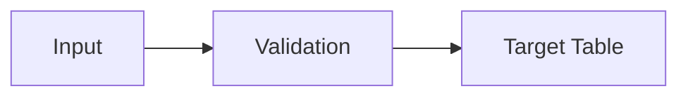

# Table Schema Documentation Workflow

A reusable guide for documenting production database/spreadsheet schemas across any codebase.

## When to Use
- New module creation
- Backend readiness checks
- Onboarding new developers
- Before major refactoring

## Step 1: Identify All Tables

// turbo
```bash
# Search for table/sheet references in backend
grep -r "getSheetByName\|getTable\|FROM\s" backend/src --include="*.js"
```

List all production tables by module:
```markdown
| Module | Table/Sheet | Purpose |
|--------|-------------|---------|
|        |             |         |
```

## Step 2: Find Column SSOTs

Search for existing column definitions:
```bash
grep -r "HEADERS\|SCHEMA\|COLUMNS\|COL\s*=" backend/src
```

Common patterns to look for:
- `const XXX_HEADERS = [...]`
- `const XXX_SCHEMA = {...}`
- `const COL = { DATE: 0, ...}` (index mapping)
- Inline comments like `// Column B: Customer_Name`

## Step 3: Create Schema File

Create `SHEET_SCHEMAS.md` in module's SSOT folder:
```
docs/<Module>_Module_SSOT/SHEET_SCHEMAS.md
```

## Step 4: Document Each Table

### Template

```markdown
# [Module] Module - Sheet Schemas

> **Purpose**: Production table schemas for [Module]
> **SSOT Source**: `[file.js]`
> **Last Updated**: YYYY-MM-DD

---

## Quick Reference

| Sheet | Purpose | Primary Key | Est. Rows |
|-------|---------|-------------|-----------|
| X     | Y       | Z           | ~100      |

---

## 1. [Table Name]

### Purpose
[One sentence describing what this table stores]

### Operations

| Operation | Role | Description |
|-----------|------|-------------|
| **READ** | [roles] | [when/why] |
| **INSERT** | [roles] | [when/why] |
| **UPDATE** | [roles] | [when/why] |
| **DELETE** | [roles] | [when/why] |

### Schema

| Col | Column Name | Type | Required | Validation | Notes |
|-----|-------------|------|----------|------------|-------|
| A | | | | | |

### Business Rules
1. [Rule 1]
2. [Rule 2]

### Relationships
| Related Table | Type | Description |
|---------------|------|-------------|
```

## Step 5: Essential Fields per Column

Based on Perplexity best practices:

| Field | Required | Example |
|-------|----------|---------|
| Column Position | ✅ | Col A, Col B |
| Column Name | ✅ | `Customer_Name` |
| Data Type | ✅ | String, Number, Date, Boolean |
| Required/Optional | ✅ | ✅ or ❌ |
| Validation Rules | ⚠️ | `> 0`, `valid URL`, `enum` |
| Operations | ✅ | R/W, R only |
| Default Value | ⚠️ | `0`, `null`, auto-generated |
| Notes | ⚠️ | Business context |

## Step 6: Add Data Flow Diagrams

Use ASCII for portability:
```
[Source] ──(action)──► [Target]
    │
    ▼
 [Calculated]
```

Or reference Mermaid if supported:


## Step 7: Link to Code SSOTs

Always reference the actual code:
```markdown
### Related Files
| File | Purpose |
|------|---------|
| [validation.js](path) | Schema SSOT |
| [operations.js](path) | Column mapping |
```

## Step 8: Validation Checklist

Before marking complete:
- [ ] All production tables documented
- [ ] Column positions match actual sheet
- [ ] Required/optional matches validation code
- [ ] Operations match access control
- [ ] Business rules extracted from code
- [ ] Relationships documented
- [ ] Links to code SSOTs included

## Anti-Patterns to Avoid

| ❌ Don't | ✅ Do Instead |
|---------|---------------|
| Hardcode values twice | Reference SSOT file |
| Skip optional columns | Document ALL columns |
| Guess column positions | Verify from code |
| Forget audit columns | Include Timestamp, CreatedBy |
| Ignore calculated fields | Document formulas |

## Example Output Structure

```
docs/
├── Expense_Module_SSOT/
│   ├── SHEET_SCHEMAS.md      ← Created by this workflow
│   ├── DATA_Reference_Schema.md
│   └── ...
├── Ledger_Module_SSOT/
│   ├── SHEET_SCHEMAS.md      ← Created by this workflow
│   └── README.md
```

## Maintenance

1. **On Schema Changes**: Update SHEET_SCHEMAS.md in same PR
2. **Quarterly Audit**: Run grep to find undocumented tables
3. **New Dev Onboarding**: Point to SHEET_SCHEMAS.md first

---

## References

- [Perplexity: Schema Documentation Best Practices](https://www.timelytext.com/database-documentation/)
- [GeeksForGeeks: Database Design Documentation](https://www.geeksforgeeks.org/dbms/best-practices-for-documenting-database-design/)
