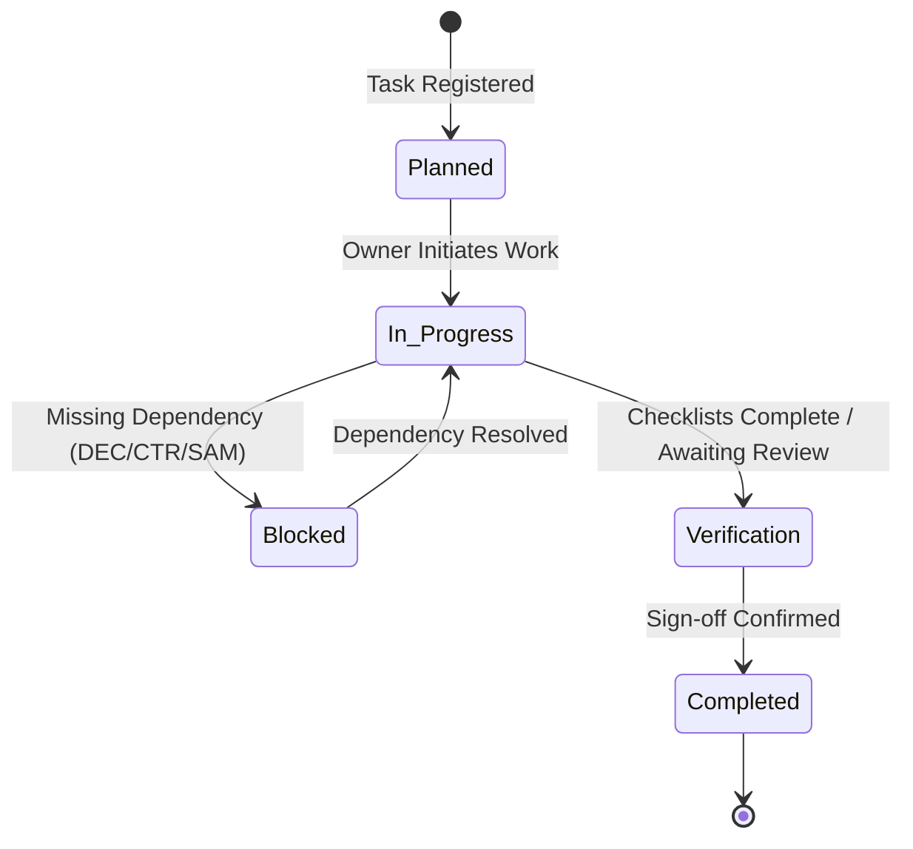

# 🏷️ Activity, Task & Subtask Taxonomy Specification

**Specification Code:** `SPEC-GOV-TAXONOMY-001`  
**System Scope:** Standardized Classification, Lifecycle State Machines & Tagging Standards  
**Version:** `1.0.0` (Production Baseline)  
**Parent SSOT:** [`ARCHITECTURE_SPEC.md`](file:///d:/GitHub_Repo/Sree_Krushna/ARCHITECTURE_SPEC.md) & [`MASTER_WBS_BLUEPRINT.md`](file:///d:/GitHub_Repo/Sree_Krushna/00_GOVERNANCE/MASTER_WBS_BLUEPRINT.md)

---

## 1. Hierarchy & Level Decomposition

All operational work in the Sree Krushna Marriage OS follows a strict **4-Level Taxonomic Model**:

```
Level 1: Milestone Phase (Temporal Horizon: Phase 1 to Phase 6)
  └── Level 2: Control Account (Domain Pillar: WBS 1.0 to 7.0)
        └── Level 3: Work Package (Category Pack / Deliverable)
              └── Level 4: Atomic Subtask / Verification Item (TSK-### / Checklist Node)
```

---

## 2. Standard Taxonomy Categories & Badges

Every task and subtask must be tagged with exactly one **Primary Category** and one **Operational Track**:

### Primary Domain Categories

| Category Key | Display Badge | Description | Governing Entity / Directory |
| :--- | :--- | :--- | :--- |
| `GOVERNANCE` | `🏛️ Governance & Strategy` | High-level approvals, budget master, authority matrix, and risk mitigation. | `00_GOVERNANCE/` |
| `LITURGY` | `🕉️ Vedic Liturgy & Rites` | Odia Brahmin rituals, samagri procurement, mantras, and Purohit logistics. | `02_RITUALS_CULTURE/` |
| `PROCUREMENT`| `🤝 Vendor & Contracting` | Venues, catering SLAs, media contracts, floral decor, and makeup trials. | `04_PROCUREMENT_VENDORS/` |
| `WARDROBE` | `👑 Attire & Gold Custody` | Silk sarees, Sherwani, silver Mukutas, and 22K bank vault custody (`AST-###`). | `04_PROCUREMENT_VENDORS/attire_and_jewellery/` |
| `HOSPITALITY` | `🏨 Guest Experience & Fleet`| Guest directory, digital cards, hotel room mapping, airport cabs, hampers. | `03_PEOPLE_GUESTS/` & `05_OPERATIONS_LOGISTICS/` |
| `DAY_OF_EXEC` | `⚡ Live Day-of Swimlanes` | Minute-by-minute execution across the 6 parallel tracks and gate handshakes. | `05_OPERATIONS_LOGISTICS/day_of_run_sheets/` |
| `FINANCE` | `💰 Settlements & Ledger` | Cash dakshina envelopes, invoice settlements (`PAY-###`), bank vault re-deposit.| `06_FINANCE_COMMERCIALS/` |
| `LEGAL` | `⚖️ Legal & Compliance` | Marriage registration, ID/witness documentation, venue permits, insurance. | `00_GOVERNANCE/tasks/TSK_PACK_06_LEGAL_DOCUMENTATION.md` |
| `TRIALS` | `💄 Trials & Rehearsals` | MUA/mehendi trials, sangeet rehearsals, attire fittings, day-before dry run. | `00_GOVERNANCE/tasks/TSK_PACK_07_TRIALS_REHEARSALS.md` |
| `DIGITAL` | `💌 Digital Guest Experience` | Wedding website, RSVP portal, save-the-dates, WhatsApp broadcast groups. | `00_GOVERNANCE/tasks/TSK_PACK_08_DIGITAL_GUEST_EXPERIENCE.md` |
| `TRAVEL` | `✈️ Outstation & NRI Travel` | Flight/visa tracking for outstation and international guests. | `00_GOVERNANCE/tasks/TSK_PACK_09_TRAVEL_VENDOR_TRIALS.md` |
| `VENDOR_TRIAL`| `🔍 Vendor Trial Runs` | Catering tastings, decor mockups, and sound-check site visits before sign-off.| `00_GOVERNANCE/tasks/TSK_PACK_09_TRAVEL_VENDOR_TRIALS.md` |
| `BRAND` | `🎨 Monograms & Stationery` | SK Royal Monogram, physical box cards, video invites, wax seals, QR pass. | `00_GOVERNANCE/tasks/TSK_PACK_10_BRAND_STATIONERY.md` |
| `SHOPPING` | `🛍️ Shopping & Trousseau` | Bridal/groom trousseau, Sambalpuri handloom, family gifting (*Bhaar*), samagri. | `00_GOVERNANCE/tasks/TSK_PACK_11_SHOPPING_TROUSSEAU.md` |

---

### Operational Swimlane Tracks

| Track ID | Track Name | Theme Color | Target Focus & Scope |
| :--- | :--- | :--- | :--- |
| `TRACK_A` | **Bride Sanctum** | Rose Silk (`#ff758f`) | Green room, MUA artistry, bridal silk draping, bridal party readiness. |
| `TRACK_B` | **Groom & Barajatri** | Sapphire Royal (`#3b82f6`)| Sherwani dressing, Mukuta tying, Barat band procession, entrance reception. |
| `TRACK_C` | **Purohit Mandap** | Sacred Gold (`#ffd15c`) | Vedic yajna kunda, sacred samagri, Kanyadaan, Hastaganthi, Saptapadi. |
| `TRACK_D` | **Dining & Feast** | Sacred Emerald (`#10b981`)| Traditional banana-leaf dining, VIP service, buffet replenishment, water. |
| `TRACK_E` | **Photo & Cinema** | Royal Purple (`#a855f7`) | Drone sweeps, mandap macros, couple portraits, live stream broadcast. |
| `TRACK_F` | **Fleet & Custody** | Amber Gold (`#fbbf24`) | Airport Innovas, luggage shuttles, Shagun cash safe, gold vault transport. |

---

## 3. Lifecycle State Machine

Tasks progress through a deterministic state machine:



### State Definitions:
1. **Planned (`status-planned`)**: Scoped in WBS with target deadline and assigned owner (`PER-###`). Not yet active.
2. **In-Progress (`status-progress`)**: Actively being worked on or negotiated with vendors/priests.
3. **Blocked (`status-blocked`)**: Stalled due to missing parental decision (`DEC-###`), unsigned contract (`CTR-###`), or unresolved dependency.
4. **Verification (`status-verification`)**: Physical item procured or setup complete; undergoing inspection (e.g. Purohit samagri check or MUA trial).
5. **Completed (`status-completed`)**: Fully delivered, verified against SLA, and marked closed.

---

## 4. Priority Rubric & SLA Matrix

| Priority Level | Criteria | Escalation Protocol |
| :--- | :--- | :--- |
| `CRITICAL` | Directly on the Vedic Muhurat critical path, legal venue contract, or high-value gold custody (`AST-###`). Delay halts wedding. | Immediate Tier 1 (Couple & Parents Council) escalation within 2 hours. |
| `HIGH` | Key vendor deliverables (catering menu lock, invitation dispatch, room blocks, photography package). | Lead review within 24 hours. |
| `MEDIUM` | Standard operational logistics (welcome kits, non-critical decor enhancements, transportation buffers). | Weekly planning review. |
| `LOW` | Optional aesthetic enhancements, post-event photo sorting, or non-urgent archival. | Handled in backlog order. |

---

## 5. Metadata Schema for Task Entity Packs (`TSK_PACK_*.md`)

```yaml
---
id: TSK-###
wbs_code: "1.1.1"
title: "Actionable deliverable name (Noun Phrase)"
category: "GOVERNANCE | LITURGY | PROCUREMENT | WARDROBE | HOSPITALITY | DAY_OF_EXEC | FINANCE | LEGAL | TRIALS | DIGITAL | TRAVEL | VENDOR_TRIAL"
track: "TRACK_A | TRACK_B | TRACK_C | TRACK_D | TRACK_E | TRACK_F | NONE"
phase: "Phase 1 | Phase 2 | Phase 3 | Phase 4 | Phase 5 | Phase 6"
owner_id: "PER-###"
priority: "Critical | High | Medium | Low"
deadline_offset: "T-XX Days | Day 0 HH:MM"
depends_on:
  - "DEC-###"
  - "CTR-###"
  - "TSK-###"
status: "Planned | In-Progress | Blocked | Verification | Completed"
---
```
