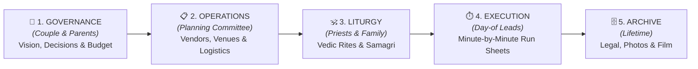
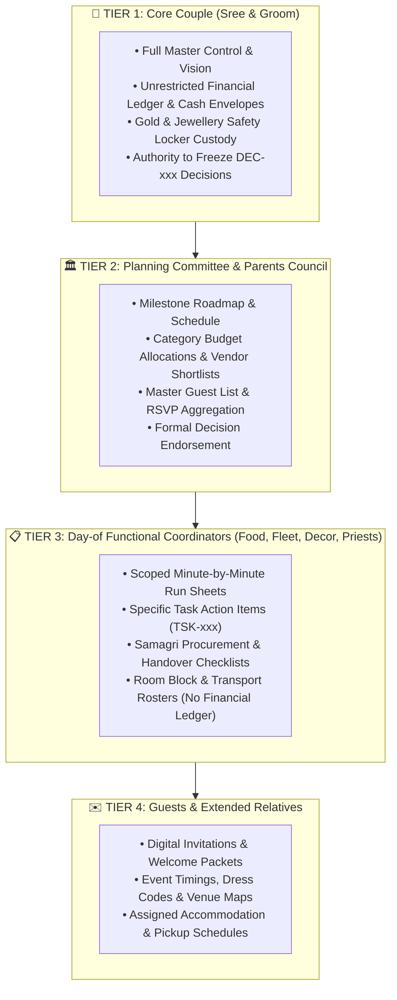

# 💍 Sree Krushna Marriage Operating System (SSOT)
## Architecture, Role-Based Access & Presentation Blueprint
**Document Reference:** `DOC-ARCH-PRESENTATION-001`  
**Target Audience:** Sree, Couple, Parents Council, Planning Committee & External Reviewers  
**Status:** FOR STAKEHOLDER REVIEW & FORMAL SIGN-OFF  
**Version:** `1.0.0 (Release Candidate)`  

---

## 🌟 1. Executive Summary

### The Challenge
Modern weddings involve **hundreds of moving parts**—sacred Vedic liturgies, multiple venues, dozens of commercial vendor contracts, high-value financial transactions, outstation guest logistics, and minute-by-minute day-of coordination. 

When managed through fragmented WhatsApp groups and disconnected spreadsheets:
- Critical decisions get buried in chat logs.
- Financial figures become inconsistent across multiple versions.
- Coordinators on the wedding day lack clear, minute-by-minute operational run-sheets.
- Sensitive financial data and private discussions risk unintended exposure.

### The Solution: The Marriage Operating System
The **Sree Krushna Marriage OS** is a centralized, durable **Single Source of Truth (SSOT)**. It bridges the gap between high-level family decision-making and live operational execution. Every contact number, ritual item, contract value, and itinerary detail has exactly **one authoritative home**.



---

## 🏛️ 2. The 9-Pillar Repository Architecture

The knowledge base is structured into **9 core pillars**, eliminating duplicate records and ensuring bidirectional traceability:

```text
d:\GitHub_Repo\Sree_Krushna\
├── 00_GOVERNANCE/                 # Control Tower: Master Dashboard, Decisions (DEC), Tasks (TSK), Risks (RSK), Closure
├── 01_TIMELINE_EVENTS/            # Master Chronology: Pre-Wedding, Main Day, Reception & Post-Wedding Specs (EVT)
├── 02_RITUALS_CULTURE/            # Liturgical Specs (RIT), Sacred Samagri Lists (SAM) & Odia Brahmin Customs
├── 03_PEOPLE_GUESTS/              # Master Directory (PER), Family Units (FAM), RSVPs, Rooms & RACI Matrix
├── 04_PROCUREMENT_VENDORS/        # Vendor Profiles (VDR), Contracts (CTR), Photography, Decor, Food & Attire
├── 05_OPERATIONS_LOGISTICS/       # Venues (VEN), Hotel Allocations, Vehicle Fleet & Day-of Run Sheets
├── 06_FINANCE_COMMERCIALS/        # Budget Master (Planned/Committed/Paid), Vouchers (PAY) & Cash Envelopes
├── 07_DOCUMENTS_ARCHIVE/          # Statutory Registrations, Signed Contracts & Cloud Digital Media Catalog
└── 08_RESEARCH_REFERENCE/         # Vedic Slokas, Market Vendor Benchmarks & Aesthetic Moodboards
```

---

## 🔐 3. Four-Tier Role-Based Access Control (RBAC) & Visibility Model

To ensure **absolute privacy for sensitive financial information** while providing **operational clarity for coordinators and guests**, the system implements a strict 4-Tier Persona and Visibility Model (inspired by enterprise RBAC standards):



### Access & Permission Summary Table

| Information Category | Tier 1: Core Couple | Tier 2: Committee & Parents | Tier 3: Day Leads | Tier 4: Guests |
| :--- | :---: | :---: | :---: | :---: |
| **Overall Budget & Real Cash Ledger** | **Full Access** | Category Totals Only | ❌ Hidden | ❌ Hidden |
| **Vendor Contracts & Pricing** | **Full Access** | View & Consult | Operational Scope Only | ❌ Hidden |
| **Formal Decision Making (`DEC-###`)**| **Authoritative Sign-off** | Co-Deciders / Consulted | ❌ Hidden | ❌ Hidden |
| **Master Task Management (`TSK-###`)** | **Full Access** | Assign & Track | Execute Assigned Tasks | ❌ Hidden |
| **Vedic Ritual & Samagri Checklists** | **Full Access** | Review & Support | On-Ground Custody | View Schedule |
| **Guest Itinerary, Venues & Attire** | **Full Access** | Full Access | Full Access | **Personal View** |

---

## ⏱️ 4. Multi-Track Swimlane Execution Engine (Day-of Coordination)

On live event days, operations run across **6 parallel tracks** that synchronize at pre-defined handover points (*"handshakes"*). Coordinators filter strictly by their own track:

```mermaid
flowchart TD
    subgraph Track_Bride ["👰 Track 1: Bride Team"]
        B1["08:00 AM: Makeup & Styling"]
        B2["06:00 PM: Bridal Attire & Mukuta Ready"]
        B3["07:30 PM: Await Barat Arrival"]
        B4["08:00 PM: Stage Entry for Varamala"]
        B5["09:30 PM: Mandap Entry for Kanyadaan"]
    end

    subgraph Track_Groom ["🤵 Track 2: Groom Team"]
        G1["04:00 PM: Safa & Mukuta Styling"]
        G2["06:30 PM: Barat Assembly & Procession"]
        G3["07:30 PM: Baranugam Entrance Reception"]
        G4["08:00 PM: Varamala Exchange"]
        G5["09:30 PM: Mandap Entry"]
    end

    subgraph Track_Mandap ["🕉️ Track 3: Vedic Purohits"]
        P1["06:00 PM: Mandap Shuddhi & Homa Prep"]
        P2["07:00 PM: Verify SAM-005 Samagri Checklist"]
        P3["09:30 PM: Kanyadaan & Saptapadi Liturgy"]
    end

    subgraph Track_Hospitality ["🍲 Track 4: Catering & Food"]
        H1["07:00 PM: Welcome Drinks Counter Active"]
        H2["08:30 PM: Grand Odia Dinner Buffet Opens"]
        H3["10:00 PM: Fasting Elders & Priest Meals"]
    end

    subgraph Track_Media ["📸 Track 5: Photo & Video"]
        M1["04:00 PM: Bride/Groom Prep Candids"]
        M2["06:30 PM: Drone Barat Coverage"]
        M3["08:00 PM: Varamala Priority Shoot"]
        M4["09:30 PM: Mandap Rites Closeup"]
    end

    subgraph Track_Fleet ["🚗 Track 6: Fleet & Custody"]
        L1["03:00 PM: Guest Hotel Shuttles"]
        L2["06:00 PM: Bridal Car Ready (VEH-01)"]
        L3["09:30 PM: Cash Custody for Dakshina (CSH-01)"]
    end

    %% Key Synchronization Handshakes
    G2 --> G3
    H1 -.->|Welcome drinks| G3
    M2 -.->|Capture entrance| G3
    
    G3 --> G4
    B4 --> G4
    M3 -.->|Shoot Varamala| G4
    
    G4 --> H2
    
    G4 --> G5
    B4 --> B5
    P3 --> G5
    P3 --> B5
    M4 -.->|Capture Rites| P3
    L3 -.->|Release Dakshina| P3
```



---

## 🕉️ 5. Cultural Alignment: Traditional Odia Hindu / Brahmin Lifecycle

The system incorporates the complete liturgical lifecycle of Odia Vedic rites, ensuring sacred traditions are observed with precision:


---

## 📊 6. Three Delivery Surfaces for Committee & Stakeholders

To ensure zero technical barrier for all family members, the system communicates through **three tailored presentation surfaces**:

1. **Executive 1-Page Summaries (BMS Pattern):**
   - High-level 30-second snapshot dashboards for committee meetings.
   - Summarizes total estimated budget, committed contracts, open decisions, and critical countdown.
2. **Interactive Portable Visual Swimlane Console (UG-Farmhouse Pattern):**
   - Single standalone HTML file (`00_GOVERNANCE/console.html`) that opens in **any mobile or desktop web browser without a server**.
   - Allows zooming in/out of the timeline, filtering by team (Bride, Groom, Food, Photo), and viewing task dependencies.
3. **Printable / Pocket Run Sheets & WhatsApp Action Cards:**
   - Compact, high-contrast 1-page checklists tailored for individual coordinators on event days with exact timestamps and emergency phone numbers.

---

## 📅 7. Implementation & Rollout Roadmap

```text
┌──────────────────────────────────────────────────────────────────────────────────┐
│  PHASE 1: REPOSITORY ARCHITECTURE & STANDARDS BASELINE             [COMPLETED]   │
│  • 9-Pillar Directory Taxonomy established in GitHub repository                 │
│  • Canonical entity schemas (EVT, RIT, PER, FAM, VEN, VDR, CTR, TSK, DEC, PAY)  │
│  • Pre-scaffolded Odia Vedic ritual specs (RIT-001 through RIT-012) & Samagri    │
├──────────────────────────────────────────────────────────────────────────────────┤
│  PHASE 2: PLANNING COMMITTEE ALIGNMENT & REVIEW                    [CURRENT]     │
│  • Share this blueprint with Sree, Parents Council & Planning Committee          │
│  • Incorporate feedback and freeze core decision principles                      │
├──────────────────────────────────────────────────────────────────────────────────┤
│  PHASE 3: PORTABLE VISUAL CONSOLE & INTERACTIVE DASHBOARDS        [NEXT]        │
│  • Deploy standalone interactive swimlane console (00_GOVERNANCE/console.html)   │
│  • Configure automated Markdown formatting tools for discussion logs             │
├──────────────────────────────────────────────────────────────────────────────────┤
│  PHASE 4: MASTER DATA INGESTION                                                  │
│  • Populate actual dates, budget allocations, vendor shortlists & guest list     │
│  • Issue official invitation cards and log RSVPs                                 │
├──────────────────────────────────────────────────────────────────────────────────┤
│  PHASE 5: DAY-OF MISSION CONTROL & POST-WEDDING CLOSURE                          │
│  • Live execution using multi-track run sheets                                   │
│  • Financial reconciliation, marriage certificate registration & digital archive │
└──────────────────────────────────────────────────────────────────────────────────┘
```

---

## ✍️ 8. External Review & Stakeholder Feedback Sign-off

Please review the proposed architecture and provide your feedback on the following focus areas:

- [ ] **1. Hierarchy & Organization:** Does the 9-Pillar structure logically cover all operational and family needs?
- [ ] **2. Access & Privacy Boundaries:** Is the 4-Tier RBAC model appropriate for maintaining financial confidentiality while empowering day-of coordinators?
- [ ] **3. Ritual Inclusivity:** Are all family-specific Odia Brahmin customs and regional traditions adequately represented in the ritual specs?
- [ ] **4. Presentation Surfaces:** Are the 3 proposed presentation formats (Executive 1-Pager, Mobile Visual Swimlane Console, Printable Run Sheets) practical for on-ground family coordination?

---

*For technical adjustments or structural additions, please log feedback directly into [`00_GOVERNANCE/decisions/`](file:///d:/GitHub_Repo/Sree_Krushna/00_GOVERNANCE/decisions/) or reply to this review document.*
