# 🏛️ Master Wedding Work Breakdown Structure (WBS) Blueprint

**Specification Code:** `SPEC-GOV-WBS-001`  
**System Scope:** Sree Krushna Marriage OS — Canonical Decomposition & Milestone Architecture  
**Version:** `1.0.0` (Production Baseline)  
**Parent SSOT:** [`ARCHITECTURE_SPEC.md`](file:///d:/GitHub_Repo/Sree_Krushna/ARCHITECTURE_SPEC.md)

---

## 1. Architectural Purpose & WBS Foundation

This document defines the **Canonical Work Breakdown Structure (WBS)** for the wedding of Sree and Krushna. Operating as an executive operating system, the WBS translates high-level milestones into manageable, deliverable-oriented **Control Accounts** and **Work Packages (WP)** adhering to PMBOK and EMBOK standards.

Every item in this WBS is hierarchical, deliverable-focused (nouns), and mapped to:
1. **Pillar Control Account** (`WBS 1.0` through `7.0`)
2. **Standard Entity Identifiers** (`EVT-###`, `RIT-###`, `PER-###`, `VDR-###`, `CTR-###`, `AST-###`, `TSK-###`)
3. **Temporal Phase** (T-180 to T+15)
4. **RACI Ownership Matrix** (Responsible, Accountable, Consulted, Informed)

```mermaid
flowchart TD
    WBS["👑 MASTER WEDDING WBS"]
    
    WBS --> CA1["1.0 Governance & Strategy"]
    WBS --> CA2["2.0 Liturgies & Vedic Culture"]
    WBS --> CA3["3.0 Commercials & Vendor Procurement"]
    WBS --> CA4["4.0 Wardrobe, Jewellery & Asset Custody"]
    WBS --> CA5["5.0 Hospitality, Guest Relations & Fleet"]
    WBS --> CA6["6.0 Live Day-of Multi-Track Execution"]
    WBS --> CA7["7.0 Finance Settlement & Post-Wedding"]

    CA1 --> G1["1.1 Muhurat & Council Decisions"]
    CA1 --> G2["1.2 Master Budget & Contingency Pool"]
    CA1 --> G3["1.3 Access Tiers & Operational Security"]
    CA1 --> G4["1.5 Legal & Marriage Registration Compliance"]

    CA2 --> L1["2.1 Deva Nimantrana & Pre-Wedding Rites"]
    CA2 --> L2["2.2 Mangan Snana & Haldi Operations"]
    CA2 --> L3["2.3 Mandap Vedic Liturgies & Saptapadi"]
    CA2 --> L4["2.4 Sacred Samagri Custody (SAM-001..006)"]
    CA2 --> L5["2.5 Post-Wedding Chauthi & Astamangala"]

    CA3 --> V1["3.1 Venues & Mandap Infrastructure"]
    CA3 --> V2["3.2 Traditional Feast Catering & SLAs"]
    CA3 --> V3["3.3 Photo, Cinema & Drone Production"]
    CA3 --> V4["3.4 Floral Architecture & Light Styling"]
    CA3 --> V5["3.5 Bridal Hair/MUA & Groom Grooming"]
    CA3 --> V6["3.6 Barajatri Brass Band & Procession Tech"]
    CA3 --> V7["3.8 Trial Runs & Rehearsal Coordination"]

    CA4 --> A1["4.1 Bridal Silk & Baula Patani Sarees"]
    CA4 --> A2["4.2 Groom Attire, Dhoti & Mukuta"]
    CA4 --> A3["4.3 Precious Gold Vault Custody (AST-001..006)"]
    CA4 --> A4["4.4 Extended Family & VIP Wardrobe Alignment"]

    CA5 --> H1["5.1 Master Guest Register & Digital RSVPs"]
    CA5 --> H2["5.2 Hotel Room Blocks & Key Allocations"]
    CA5 --> H3["5.3 Airport / Transit Fleet & Dispatch"]
    CA5 --> H4["5.4 Welcome Hampers, Pana Gua & Kits"]
    CA5 --> H5["5.6 Digital Guest Experience & RSVP Platform"]
    CA5 --> H6["5.7 Outstation/NRI Travel & Vendor Trial Runs"]

    CA6 --> D1["6.1 Track A: Bride Sanctum & Green Room"]
    CA6 --> D2["6.2 Track B: Groom & Barajatri Procession"]
    CA6 --> D3["6.3 Track C: Purohit Mandap Sanctum"]
    CA6 --> D4["6.4 Track D: Dining & Feast Flow Management"]
    CA6 --> D5["6.5 Track E: Cinematography & Shot Wishlists"]
    CA6 --> D6["6.6 Track F: Fleet, Shagun & Vault Transport"]

    CA7 --> F1["7.1 Cash Dispersal & Purohit Dakshina"]
    CA7 --> F2["7.2 Vendor Balance Audits & Invoicing"]
    CA7 --> F3["7.3 Bank Vault Return & Asset De-escalation"]
```

---

## 2. Master Work Breakdown Structure Dictionary

### 1.0 Governance, Strategy & Authority
* **Accountable:** Tier 1 (Core Couple — Sree & Krushna) & Tier 2 (Parents Council)
* **Description:** Macro-level decision frameworks, temporal baseline locks, budget controls, and security tiers.

| WBS Code | Work Package Title | Key Deliverable / Scope | Lead Owner | Temporal Phase | Related Entities |
| :--- | :--- | :--- | :--- | :--- | :--- |
| **1.1** | **Muhurat & Calendar Freeze** | Astrological horoscope matching, lagna muhurat selection, and date confirmation. | PER-005 / PER-007 | Phase 1 (T-180) | `DEC-001`, `EVT-001..007` |
| **1.2** | **Budget Allocation & Reserve Fund** | Total budget formulation across 9 pillars with 15% emergency contingency envelope. | Sree & Krushna | Phase 1 (T-160) | `06_FINANCE_COMMERCIALS/budget_master.md` |
| **1.3** | **Authority Matrix & Access Tiers** | Separation of Duty (SoD) definitions across Tier 1 (Couple), Tier 2 (Parents), Tier 3 (Leads), Tier 4 (Guests). | Sree & Krushna | Phase 1 (T-150) | `00_GOVERNANCE/authority_and_access_matrix.md` |
| **1.4** | **Risk Register & Contingency SOPs** | Playbooks for weather disruption, power loss, priest delay, and medical contingencies. | PER-014 | Phase 2 (T-90) | `CP-001..013`, `RSK-001..005` |
| **1.5** | **Legal & Marriage Registration Compliance** | Hindu Marriage Act registration, ID/witness documentation, venue NOCs, and event insurance. | Sree & Krushna | Phase 2 (T-90) to Phase 6 | `TSK_PACK_06` |

---

### 2.0 Liturgies, Vedic Culture & Samagri (`RIT-###`)
* **Accountable:** Chief Vedic Purohit & Parents Council
* **Description:** Comprehensive Odia Brahmin wedding rituals, sacred material inventories, and altar coordination.

| WBS Code | Work Package Title | Key Deliverable / Scope | Lead Owner | Temporal Phase | Related Entities |
| :--- | :--- | :--- | :--- | :--- | :--- |
| **2.1** | **Deva Nimantrana Protocol** | Consecrated card offering at Lord Jagannath Temple (Puri), Lingaraj Temple, and Grama Devati. | PER-005 / PER-007 | Phase 2 (T-60) | `RIT-002`, `SAM-002` |
| **2.2** | **Nirbandha & Ashirbad Liturgy** | Engagement ceremony, sankalpa vows, horoscope exchange, and blessing ring ritual. | PER-005 | Phase 2 (T-45) | `EVT-001`, `RIT-001`, `SAM-001` |
| **2.3** | **Mangan & Mangalakrutya Operations** | 7 married women (*Sadhaba*) turmeric grinding, dawn bath, and auspicious brass lamp setup. | PER-006 (Bride Mother) | Phase 4 (T-2) | `EVT-003`, `RIT-003`, `SAM-003` |
| **2.4** | **Baranugam & Barat Welcoming** | Traditional reception of Groom party, floral garland exchange, and arati by bride's mother. | PER-006 / PER-014 | Phase 5 (Day 0) | `EVT-004`, `RIT-004`, `SAM-004` |
| **2.5** | **Kanyadaan & Hastaganthi Sanctum** | Sacred water pouring, sacred grass knotting (*Hastaganthi*), and parental handover rite. | Kanyadata (Father/PER-005) | Phase 5 (Day 0) | `EVT-004`, `RIT-005`, `SAM-005` |
| **2.6** | **Lajahoma, Saptapadi & Sindoor Daan** | Puffed rice fire offering (*Lajahoma*), seven sacred vows around 7 betel nuts (*Saptapadi*), vermilion application. | Chief Purohit | Phase 5 (Day 0) | `EVT-004`, `RIT-006..008`, `SAM-005` |
| **2.7** | **Kanyavida & Grihapravesh Transition** | Emotional farewell ceremony, transit convoy, and consecrated threshold welcome with milk/rice pot. | PER-007 (Groom Mother) | Phase 5 (Day +1) | `EVT-006`, `RIT-009..010` |
| **2.8** | **Chauthi & Astamangala Customs** | 4th night consummation puja with floral bed arrangement, and 8th day return feast at bride's parental home. | Family Elders | Phase 6 (Day +4 to +8)| `EVT-006..007`, `RIT-011..012` |
| **2.9** | **Master Samagri Custody & Verification**| Procurement and double-checked packaging of all 6 sacred samagri packs (`SAM-001`..`006`). | PER-005 / Purohit | Phase 4 (T-5) | `02_RITUALS_CULTURE/samagri_checklists/` |

---

### 3.0 Commercials & Vendor Procurement (`VDR-###`, `CTR-###`)
* **Accountable:** Sree & Krushna (Commercial Approvals) & PER-014 (Logistics Lead)
* **Description:** End-to-end contracting, milestone payments, technical riders, and performance verification.

| WBS Code | Work Package Title | Key Deliverable / Scope | Lead Owner | Temporal Phase | Related Entities |
| :--- | :--- | :--- | :--- | :--- | :--- |
| **3.1** | **Main Venue & Mandap Contracting** | Mayfair / Convention center agreement, hall bookings, parking reservations, and advance deposit. | Sree & Krushna | Phase 1 (T-120) | `VEN-001..003`, `CTR-001` |
| **3.2** | **Odia Feast Catering & Menu SLA** | Multi-course traditional Odia menu selection, live counters, per-plate tasting, and hygiene SLA. | PER-014 (Food Lead) | Phase 2 (T-90) | `VDR-001`, `CTR-002` |
| **3.3** | **Cinematography, Photo & Drone Suite** | 4K cinematic video, drone aerial coverage, traditional album specs, and live stream link setup. | Sree & Krushna | Phase 2 (T-90) | `VDR-003`, `CTR-003` |
| **3.4** | **Floral Architecture & Ambient Lighting** | Vedic tuberose/marigold mandap dome, entrance arch, walkway fairy lights, and generator backup. | PER-006 / PER-008 | Phase 3 (T-45) | `VDR-002`, `CTR-004` |
| **3.5** | **Bridal Makeup & Groom Styling Suite** | HD airbrush bridal makeup trial, bridal party styling schedule, groom hair/beard styling. | Sree (Bride) | Phase 3 (T-30) | `VDR-005`, `CTR-005` |
| **3.6** | **Barajatri Brass Band, Dhol & Pyrotechnics**| Consecrated traditional brass band, royal Punjabi dhol, cold pyrotechnic fireworks, safety permits. | PER-008 (Groom Lead) | Phase 3 (T-30) | `VDR-006`, `CTR-006` |
| **3.7** | **Sound, Acoustics & AV Tech Setup** | High-fidelity PA system, collar mics for Purohits, mandap speakers, and reception DJ acoustics. | PER-014 | Phase 4 (T-7) | `VDR-007`, `CTR-007` |
| **3.8** | **Trial Runs & Rehearsal Coordination** | Bridal MUA/mehendi trials, sangeet choreography rehearsals, attire fitting rounds, and day-before dry run. | Sree (Bride) / PER-014 | Phase 3 (T-45) to Phase 4 (T-1) | `TSK_PACK_07` |

---

### 4.0 Wardrobe, Jewellery & Precious Asset Custody (`AST-###`)
* **Accountable:** Sree & Krushna (Selection) & Parents Custody Team (Vault)
* **Description:** Handcrafted bridal silks, groom attire, silver crowns (*Mukuta*), and bank vault chain of custody.

| WBS Code | Work Package Title | Key Deliverable / Scope | Lead Owner | Temporal Phase | Related Entities |
| :--- | :--- | :--- | :--- | :--- | :--- |
| **4.1** | **Bridal Silk & Baula Patani Procurement**| Authentic Sambalpuri / Berhampuri silk sarees, yellow-red *Baula Patani* for rituals, designer reception lehenga. | Sree (Bride) | Phase 2 (T-75) | `04_PROCUREMENT_VENDORS/attire_and_jewellery/` |
| **4.2** | **Groom Traditional Attire & Royal Sherwani**| Matka silk Kurta-Dhoti for Vedic mandap rites, royal velvet Sherwani for Barat, tailored reception suit. | Krushna (Groom) | Phase 2 (T-75) | `04_PROCUREMENT_VENDORS/attire_and_jewellery/` |
| **4.3** | **Traditional Odia Mukuta Silver Crafting** | Custom-fitted handcrafted silver filigree / solapitha bridal & groom *Mukutas* with velvet headbands. | PER-006 / PER-008 | Phase 3 (T-40) | `AST-005`, `AST-006` |
| **4.4** | **Precious Gold Vault Protocol (`AST-###`)** | 22K Gold Choker (`AST-001`), Kada Bangles (`AST-002`), Mangalsutra (`AST-003`) vault withdrawal and handover log. | PER-007 (Parents Custodian) | Phase 4 (T-3) to Phase 6 | `AST-001..006`, `00_GOVERNANCE/console.html` |
| **4.5** | **Emergency Wardrobe & Steam Ironing Unit** | Mobile steam iron, sewing emergency kit, safety pins, extra dupattas, and footwear backups. | Green Room Attendant | Phase 5 (Day 0) | `05_OPERATIONS_LOGISTICS/` |
| **4.6** | **Couple Identity & Royal Monogram Brand** | Interlocking SK crest vector, Kalinga arch motif, wax seal stamp, and color tokens. | Sree & Krushna | Phase 2 (T-90) | `SPEC-BRAND-ID-001`, `TSK_PACK_10` |
| **4.7** | **Master Shopping & Trousseau Procurement** | Multi-city sourcing (Bhubaneswar, Cuttack, Puri, Bargarh), family gifting suites (*Bhaar*), and samagri. | Sree & Krushna / Parents | Phase 2 (T-75) to Phase 4 | `SPEC-PROC-SHOP-001`, `TSK_PACK_11` |

---

### 5.0 Hospitality, Guest Experience & Fleet Logistics
* **Accountable:** PER-014 (Operations Lead) & Hospitality Committee
* **Description:** Master guest registers, room blocks, transport shuttles, and traditional welcome kits.

| WBS Code | Work Package Title | Key Deliverable / Scope | Lead Owner | Temporal Phase | Related Entities |
| :--- | :--- | :--- | :--- | :--- | :--- |
| **5.1** | **Master Guest Register & RSVP Tracking** | Compilation of 350+ invited guests across 85 family units (`FAM-001`..`085`), RSVP status, and dietary notes. | Sree & Krushna | Phase 2 (T-60) | `03_PEOPLE_GUESTS/directory/`, `PER-001..050` |
| **5.2** | **Invitation Card Printing & Digital Dispatch**| Consecrated physical invitation box packing with betel nuts (*Pana Gua*), sweets, and WhatsApp digital cards. | Sree & Krushna | Phase 3 (T-45) | `03_PEOPLE_GUESTS/` |
| **5.3** | **Hotel Room Block Reservations & Key Allotment**| 30+ deluxe AC rooms reserved at venue hotel, family unit room mapping, and early check-in coordination. | PER-014 (Hospitality) | Phase 3 (T-30) | `05_OPERATIONS_LOGISTICS/accommodation/` |
| **5.4** | **Airport & Railway Transit Fleet Dispatch**| Fleet of 8 AC Innovas/sedans assigned with drivers, pickup schedules for VIP outstation relatives. | PER-014 (Fleet Lead) | Phase 4 (T-3) | `05_OPERATIONS_LOGISTICS/transport_and_fleet/` |
| **5.5** | **Welcome Kits & Hospitality Helpdesk** | In-room gift hampers, itinerary pocket cards, bottled water, snacks, and 24/7 lobby concierge desk. | Hospitality Team | Phase 4 (T-1) | `05_OPERATIONS_LOGISTICS/` |
| **5.6** | **Digital Guest Experience & RSVP Platform** | Wedding website/RSVP link, save-the-dates, WhatsApp broadcast groups, and guest helpdesk number. | Sree & Krushna | Phase 2 (T-90) | `TSK_PACK_08` |
| **5.7** | **Outstation/NRI Travel & Vendor Trial Runs** | Flight/visa coordination for international guests, catering tasting, decor mockup, and sound-check visits. | PER-014 | Phase 3 (T-45) to Phase 4 (T-7) | `TSK_PACK_09` |

---

### 6.0 Live Day-of Multi-Track Execution (6 Parallel Swimlanes)
* **Accountable:** Operational Track Leads & Stage Managers
* **Description:** Minute-by-minute day-of execution synchronized across 4 operational gate handshakes (`GATE-01` to `GATE-04`).

| WBS Code | Work Package Title | Key Deliverable / Scope | Lead Owner | Temporal Phase | Related Entities |
| :--- | :--- | :--- | :--- | :--- | :--- |
| **6.1** | **Track A: Bride Sanctum & Readiness** | MUA arrival, bridal hair, Baula Patani draping, jewellery handover, green room refreshments. | PER-006 (Bride Mother) | Phase 5 (Day 0) | `05_OPERATIONS_LOGISTICS/day_of_run_sheets/` |
| **6.2** | **Track B: Groom & Barajatri Procession** | Groom sherwani dressing, Mukuta tying, Barat assembly, brass band coordination, venue arrival. | PER-008 (Groom Lead) | Phase 5 (Day 0) | `05_OPERATIONS_LOGISTICS/day_of_run_sheets/` |
| **6.3** | **Track C: Purohit Mandap Sanctum** | Yajna kunda setup, ghee warming, sacred wood placement, samagri readiness, muhurat clock check. | Chief Purohit / PER-005 | Phase 5 (Day 0) | `GATE-01..04`, `RIT-004..009` |
| **6.4** | **Track D: Dining & Catering Operations** | Buffet line opening, VIP seated banana-leaf dining, water supply, dessert replenishment, midnight snacks. | PER-014 (Food Lead) | Phase 5 (Day 0) | `05_OPERATIONS_LOGISTICS/day_of_run_sheets/` |
| **6.5** | **Track E: Photo & Video Production Run** | First look shoot, family portraits, mandap ritual macro captures, drone flybys, live video feed. | VDR-003 Lead | Phase 5 (Day 0) | `04_PROCUREMENT_VENDORS/photography/` |
| **6.6** | **Track F: Shagun, Cash & Custody Run** | Shagun envelope safe box custody, driver cash tips, venue manager handshakes, jewellery lockbox return. | PER-007 (Custody Lead)| Phase 5 (Day 0) | `06_FINANCE_COMMERCIALS/cash_logistics.md` |

---

### 7.0 Financial Settlements, Reconciliation & Post-Wedding Wrap-up
* **Accountable:** Tier 1 (Couple) & Finance Lead
* **Description:** Final invoice clearance, cash ledger audits, thank-you notes, and asset de-escalation.

| WBS Code | Work Package Title | Key Deliverable / Scope | Lead Owner | Temporal Phase | Related Entities |
| :--- | :--- | :--- | :--- | :--- | :--- |
| **7.1** | **Purohit Dakshina & Temple Offerings** | Consecrated honorarium envelopes with new currency, coconuts, and silk shawls for all priests. | PER-005 / PER-007 | Phase 6 (Day +1) | `PAY-015`, `06_FINANCE_COMMERCIALS/ledger/` |
| **7.2** | **Vendor Final Invoice Audits & Settlements**| Final bill verification (plate count audit, extra hours, generator diesel), final balance transfers. | Sree & Krushna | Phase 6 (Day +5) | `PAY-001..020`, `CTR-001..010` |
| **7.3** | **Bank Vault Asset Re-deposit Protocol** | Safe transit of bridal gold jewelry (`AST-001`..`004`) back to the secure bank safe deposit locker. | PER-007 (Parents Custodian) | Phase 6 (Day +7) | `AST-001..006`, `00_GOVERNANCE/console.html` |
| **7.4** | **Media Deliverable Review & Archival** | Raw photo drive collection, highlight teaser video approval, master photo album print proofing. | Sree & Krushna | Phase 6 (Day +15)| `07_DOCUMENTS_ARCHIVE/` |

---

## 3. RACI Responsibility Assignment Matrix

| WBS Category | Tier 1: Couple (Sree & Krushna) | Tier 2: Parents Council | Tier 3: Operational Leads (PER-014) | Tier 4: Extended Family & Guests |
| :--- | :---: | :---: | :---: | :---: |
| **1.0 Governance & Strategy** | **A / R** | **C** | **I** | **I** |
| **2.0 Liturgies & Culture** | **C / R** | **A** | **R** | **I** |
| **3.0 Vendor Procurement** | **A** | **C** | **R** | **I** |
| **4.0 Wardrobe & Gold Custody** | **A / R** | **A (Custody)** | **R (Green Room)** | **I** |
| **5.0 Hospitality & Fleet** | **I** | **C** | **A / R** | **I** |
| **6.0 Day-of Execution** | **C (Focus on Rites)** | **C** | **A / R** | **I / Participants** |
| **7.0 Finance Settlements** | **A / R** | **C** | **R (Audit support)** | **I** |

*Legend: **R** = Responsible (Does the work), **A** = Accountable (Final sign-off authority), **C** = Consulted (Provides input), **I** = Informed (Receives updates)*

---

## 4. Verification & SSOT Linkages

*   **Timeline Events (`01_TIMELINE_EVENTS/`):** Aligns directly with [`master_timeline.md`](file:///d:/GitHub_Repo/Sree_Krushna/01_TIMELINE_EVENTS/master_timeline.md).
*   **Vedic Liturgies (`02_RITUALS_CULTURE/`):** Aligns directly with [`ritual_master_index.md`](file:///d:/GitHub_Repo/Sree_Krushna/02_RITUALS_CULTURE/ritual_master_index.md).
*   **Asset Custody (`AST-###`):** Aligns directly with [`00_GOVERNANCE/console.html`](file:///d:/GitHub_Repo/Sree_Krushna/00_GOVERNANCE/console.html) and [`PRODUCT.md`](file:///d:/GitHub_Repo/Sree_Krushna/PRODUCT.md).
