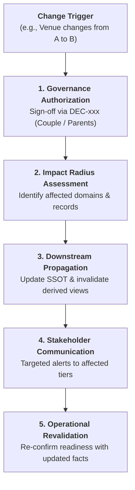

# 🔄 Change Management & Impact Propagation Protocol

**Specification:** `SPEC-CHANGE-MGMT-001`  
**Purpose:** Formal governance protocol to manage changes to core entities (Date, Venue, Muhurat, Budget, Key People) and systematically propagate operational impacts without data corruption or communication failure.

---

## 1. The Change Event Model (`CHG-###`)

When a core entity attribute is modified, it is not merely overwritten. A formal **Change Event (`CHG-###`)** is generated to track why the change occurred, who authorized it, and what downstream systems require invalidation/revalidation.



---

## 2. Impact Propagation Checklists by Entity Type

### Scenario A: Venue / Hall Change
1. **Pillar 01 (Timeline):** Re-verify travel times, arrival buffers, and barat starting point.
2. **Pillar 02 (Rituals):** Re-check mandap spatial dimensions, homa fire ventilation, and water source for Snana.
3. **Pillar 03 (People):** Update guest invitation messages, transport pickup routes, and hotel-to-venue shuttle plans.
4. **Pillar 04 (Procurement):** Notify decorator (new stage dimensions), sound vendor (acoustic setup), and caterer (kitchen layout).
5. **Pillar 05 (Operations):** Update floor plans, generator backup specs, parking routes, and green room allocations.
6. **Pillar 06 (Finance):** Reconcile venue rental contract, advance adjustment, and catering transportation surcharge.
7. **Pillar 07 (Documents):** Issue updated venue directions & GPS pin via WhatsApp broadcast.

---

### Scenario B: Vedic Muhurat / Timing Shift
1. **Pillar 01 (Timeline):** Shift event start/end timestamps and notify day coordinators.
2. **Pillar 02 (Rituals):** Officiating purohit re-aligns Sankalpa chanting time and homa duration.
3. **Pillar 04 (Procurement):** Photographer shifts crew call-time; Makeup artist shifts bridal prep start time.
4. **Pillar 05 (Operations):** Adjust catering buffet opening time to prevent food cooling or wastage.
5. **Pillar 00 (Governance):** Shift Operational Gate tolerance windows in day-of run sheets.

---

## 3. Standard Change Record Schema (`CHG-###`)

```markdown
---
id: CHG-001
entity_type: "VENUE | TIMELINE | VENDOR | BUDGET | RITUAL"
entity_id: "VEN-001"
change_title: "Main Wedding Venue Shift to Convention Center"
requested_by: "PER-005"
approved_by: "DEC-008 (Couple & Parents)"
date_recorded: "YYYY-MM-DD"
effective_timestamp: "YYYY-MM-DD HH:MM"
previous_value: "Venue A (Mayfair Main Hall)"
new_value: "Venue B (Convention Grand Ballroom)"
status: "Propagated | Revalidated | Closed"
---

# Downstream Propagation Audit
- [x] Invalidate old floor plans in `05_OPERATIONS_LOGISTICS/venues/`
- [x] Re-brief Decorator `VDR-002` on stage dimensions (Done by PER-008 on YYYY-MM-DD)
- [x] Broadcast WhatsApp update to Tier 4 guest list with updated Google Maps pin
- [x] Re-confirm generator backup with new venue management
```
