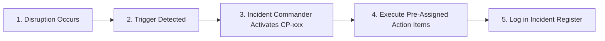

# 🚨 Operational Contingency Playbooks (`CP-###`)

**Specification:** `SPEC-CONTINGENCY-PLAYBOOKS-001`  
**Purpose:** Pre-formulated, battle-tested standard operating procedures (SOPs) for live event-day disruptions. When a disruption occurs, the Incident Commander immediately activates the corresponding playbook.

---

## 📚 Master Playbook Catalog

| Playbook ID | Disruption Scenario | Primary Trigger | Incident Authority | Recovery Playbook Summary |
| :--- | :--- | :--- | :--- | :--- |
| **`CP-001`** | **Heavy Rain / Storm Impact** | Waterlogging / High Wind | PER-005 & Venue Lead | Transition Mandap & Dining to covered indoor halls; activate waterproof canopy. |
| **`CP-002`** | **Venue Space Unavailable / Power Trip** | Main Grid Outage > 30s | Venue Coordinator | Auto-switch to silent backup diesel generator; notify sound/lighting tech. |
| **`CP-003`** | **Barat Procession Delayed (>30 mins)** | Barat Traffic / Assembly Slip | PER-014 (Day Commander) | Delay Varamala stage; open snack counters early; compress photo session. |
| **`CP-004`** | **Critical Vendor No-Show (Photo/DJ)**| Vendor Unreachable 2h out | PER-008 (Procurement Lead)| Dispatch standby backup vendor from `08_RESEARCH_REFERENCE/vendor_benchmarks/`. |
| **`CP-005`** | **Photographer Equipment Failure** | Camera / SD Card Corrupted | Lead Photographer | Switch to secondary camera body; duplicate memory cards; dispatch backup crew. |
| **`CP-006`** | **Catering Food Shortage (>50 surprise pax)**| Guest RSVP Overflow | PER-014 (Hospitality Lead)| Caterer activates express buffer menu (Puri, Dalma, Paneer, Rice replenishment). |
| **`CP-007`** | **Medical Emergency / Guest Illness** | Acute distress / injury | PER-010 (Hospitality Lead)| First-aid response; dispatch dedicated standby vehicle (`VEH-03`) to nearest hospital. |
| **`CP-008`** | **Transport Vehicle Breakdown** | Fleet Bus / Shuttles stalled | PER-012 (Fleet Lead) | Activate local taxi fleet standby; re-route secondary shuttle for stranded guests. |
| **`CP-009`** | **Day-of Payment Dispute / Overtime Demanded**| Vendor halts work for cash | PER-007 (Cash Custodian) | Disburse from Emergency Petty Cash Envelope (`CSH-06`) against signed voucher; resolve later. |
| **`CP-010`** | **Missing Sacred Item / Samagri Shortage**| Priest identifies missing item| PER-005 (Ritual Lead) | Dispatch emergency runner to pre-identified temple bazaar shop with cash. |
| **`CP-011`** | **Vedic Muhurat Delay (>45 mins slip)** | Liturgy timing compressed | Officiating Purohit | Priest conducts core Vedic rites (Kanyadaan, Saptapadi, Sindoor) with utmost priority. |
| **`CP-012`** | **Hotel Room Allocation Deficit** | Hotel overbooked rooms | PER-011 (Room Lead) | Upgrade guests to partner hotel block pre-reserved under backup SLA. |
| **`CP-013`** | **Critical Change in Venue/Schedule Post-Card**| Last-minute venue change | Digital Communications | WhatsApp priority broadcast blast with new GPS coordinates and call-center lead. |

---

## 🛠️ Playbook Activation Workflow

