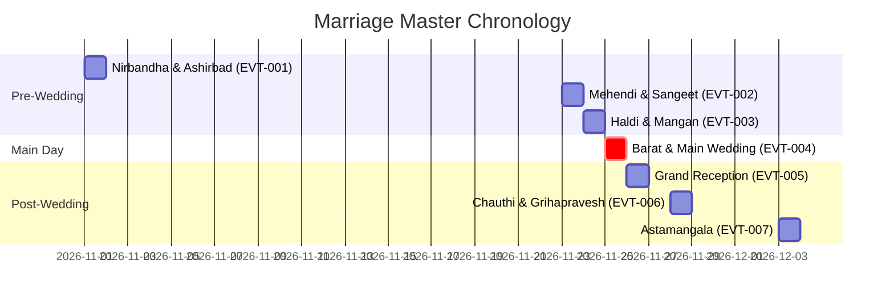

# ⏳ Master Marriage Timeline & Event Sequence

**SSOT Scope:** Chronological sequence of all events, pre-wedding milestones, wedding day rituals, reception, and post-marriage ceremonies.

---

## 📅 High-Level Event Sequence

---

## 📜 Master Event Register

| Event ID | Event Name | Category | Planned Date | Target Venue | Lead Coordinator | Status |
| :--- | :--- | :--- | :--- | :--- | :--- | :--- |
| [`EVT-001`](file:///d:/GitHub_Repo/Sree_Krushna/01_TIMELINE_EVENTS/pre_wedding/EVT-001_nirbandha_ashirbad.md) | **Nirbandha & Ashirbad** | Pre-Wedding | YYYY-MM-DD | VEN-001 | PER-005 | Planned |
| [`EVT-002`](file:///d:/GitHub_Repo/Sree_Krushna/01_TIMELINE_EVENTS/pre_wedding/EVT-002_mehendi_sangeet.md) | **Mehendi & Sangeet** | Pre-Wedding | YYYY-MM-DD | VEN-002 | PER-008 | Planned |
| [`EVT-003`](file:///d:/GitHub_Repo/Sree_Krushna/01_TIMELINE_EVENTS/pre_wedding/EVT-003_haldi_mangan.md) | **Mangan & Haldi Ceremony** | Pre-Wedding | YYYY-MM-DD | VEN-001 | PER-006 | Planned |
| [`EVT-004`](file:///d:/GitHub_Repo/Sree_Krushna/01_TIMELINE_EVENTS/wedding_day/EVT-004_barat_and_wedding.md) | **Barat, Kanyadaan & Saptapadi** | Wedding Day | YYYY-MM-DD | VEN-003 | PER-014 | Planned |
| [`EVT-005`](file:///d:/GitHub_Repo/Sree_Krushna/01_TIMELINE_EVENTS/reception/EVT-005_grand_reception.md) | **Grand Reception** | Reception | YYYY-MM-DD | VEN-003 | PER-014 | Planned |
| [`EVT-006`](file:///d:/GitHub_Repo/Sree_Krushna/01_TIMELINE_EVENTS/post_wedding/EVT-006_chauthi_grihapravesh.md) | **Chauthi & Grihapravesh** | Post-Wedding | YYYY-MM-DD | VEN-001 | PER-005 | Planned |
| [`EVT-007`](file:///d:/GitHub_Repo/Sree_Krushna/01_TIMELINE_EVENTS/post_wedding/EVT-007_astamangala.md) | **Astamangala Custom** | Post-Wedding | YYYY-MM-DD | VEN-001 | PER-005 | Planned |

---

## 🔍 Detailed Sub-Directories
- [Pre-Wedding Events](file:///d:/GitHub_Repo/Sree_Krushna/01_TIMELINE_EVENTS/pre_wedding/)
- [Wedding Day Events](file:///d:/GitHub_Repo/Sree_Krushna/01_TIMELINE_EVENTS/wedding_day/)
- [Reception Events](file:///d:/GitHub_Repo/Sree_Krushna/01_TIMELINE_EVENTS/reception/)
- [Post-Wedding Customs](file:///d:/GitHub_Repo/Sree_Krushna/01_TIMELINE_EVENTS/post_wedding/)
