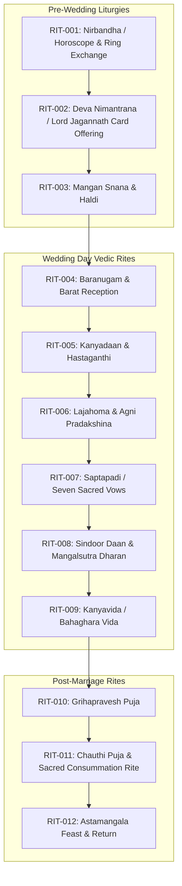

# 🕉️ Ritual Master Index & Odia Brahmin Liturgical Sequence

**SSOT Scope:** Master liturgical inventory of all traditional Odia Hindu / Brahmin Vedic wedding rituals, sequence, officiating priests, and participant requirements.

---

## Master Ritual Sequence

---

## 📜 Canonical Ritual Register (`RIT-###`)

| Ritual ID | Ritual Name | Phase / Event | Priest Req | Primary Participants | Samagri ID | Status |
| :--- | :--- | :--- | :--- | :--- | :--- | :--- |
| [`RIT-001`](file:///d:/GitHub_Repo/Sree_Krushna/02_RITUALS_CULTURE/specs/RIT-001_nirbandha.md) | **Nirbandha** | EVT-001 | Yes | Couple, Parents, Family Elders | SAM-001 | Template |
| [`RIT-002`](file:///d:/GitHub_Repo/Sree_Krushna/02_RITUALS_CULTURE/specs/RIT-002_deva_nimantrana.md) | **Deva Nimantrana** | Pre-Wedding | Yes | Family Representatives | SAM-002 | Template |
| [`RIT-003`](file:///d:/GitHub_Repo/Sree_Krushna/02_RITUALS_CULTURE/specs/RIT-003_mangan_haldi.md) | **Mangan & Mangalakrutya**| EVT-003 | Optional | Bride/Groom, Married Women | SAM-003 | Template |
| [`RIT-004`](file:///d:/GitHub_Repo/Sree_Krushna/02_RITUALS_CULTURE/specs/RIT-004_baranugam.md) | **Baranugam & Barat Reception** | EVT-004 | Yes | Groom, Bride Mother & Family | SAM-004 | Template |
| [`RIT-005`](file:///d:/GitHub_Repo/Sree_Krushna/02_RITUALS_CULTURE/specs/RIT-005_kanyadaan.md) | **Kanyadaan & Hastaganthi**| EVT-004 | Yes | Bride, Groom, Kanyadata (Father/Parents) | SAM-005 | Template |
| [`RIT-006`](file:///d:/GitHub_Repo/Sree_Krushna/02_RITUALS_CULTURE/specs/RIT-006_lajahoma_agni_pradakshina.md) | **Lajahoma & Agni Pradakshina** | EVT-004 | Yes | Bride, Groom, Purohit | SAM-005 | Template |
| [`RIT-007`](file:///d:/GitHub_Repo/Sree_Krushna/02_RITUALS_CULTURE/specs/RIT-007_saptapadi.md) | **Saptapadi (Seven Vows)** | EVT-004 | Yes | Bride, Groom, Purohit | SAM-005 | Template |
| [`RIT-008`](file:///d:/GitHub_Repo/Sree_Krushna/02_RITUALS_CULTURE/specs/RIT-008_sindoor_daan.md) | **Sindoor Daan** | EVT-004 | Yes | Groom, Bride | SAM-005 | Template |
| [`RIT-009`](file:///d:/GitHub_Repo/Sree_Krushna/02_RITUALS_CULTURE/specs/RIT-009_kanyavida.md) | **Kanyavida (Farewell)** | EVT-004 | No | Bride, Parents, Family | — | Template |
| [`RIT-010`](file:///d:/GitHub_Repo/Sree_Krushna/02_RITUALS_CULTURE/specs/RIT-010_grihapravesh.md) | **Grihapravesh** | EVT-006 | Yes | Couple, Groom Mother & Family | — | Template |
| [`RIT-011`](file:///d:/GitHub_Repo/Sree_Krushna/02_RITUALS_CULTURE/specs/RIT-011_chauthi_puja.md) | **Chauthi Puja** | EVT-006 | Yes | Couple, Family Elders | SAM-006 | Template |
| [`RIT-012`](file:///d:/GitHub_Repo/Sree_Krushna/02_RITUALS_CULTURE/specs/RIT-012_astamangala.md) | **Astamangala Feast** | EVT-007 | No | Couple, Bride Family | — | Template |

---

## 🔍 Sub-Directories
- [Liturgical Specifications (`specs/`)](file:///d:/GitHub_Repo/Sree_Krushna/02_RITUALS_CULTURE/specs/)
- [Sacred Materials & Samagri Checklists (`samagri_checklists/`)](file:///d:/GitHub_Repo/Sree_Krushna/02_RITUALS_CULTURE/samagri_checklists/)
- [Family Customs Reference Guide](file:///d:/GitHub_Repo/Sree_Krushna/02_RITUALS_CULTURE/family_customs_reference.md)
