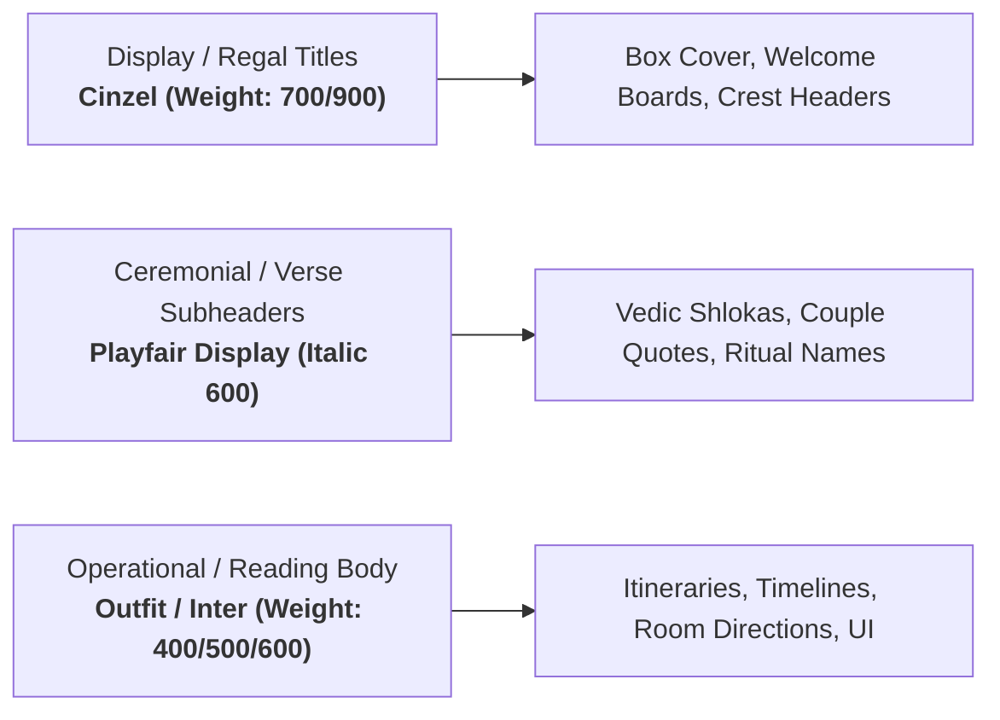

# 🎨 Sree & Krushna Monogram, Visual Identity & Creative Brand System

**Specification Code:** `SPEC-BRAND-ID-001`  
**Domain Pillar:** `04_PROCUREMENT_VENDORS`  
**WBS Scope:** `4.6 Couple Visual Identity & Brand System`  
**Version:** `1.0.0` (Production Baseline)  
**Parent SSOT:** [`ARCHITECTURE_SPEC.md`](file:///d:/GitHub_Repo/Sree_Krushna/ARCHITECTURE_SPEC.md) & [`MASTER_WBS_BLUEPRINT.md`](file:///d:/GitHub_Repo/Sree_Krushna/00_GOVERNANCE/MASTER_WBS_BLUEPRINT.md)

---

## 1. The Royal `SK` Monogram Design System

The visual identity of Sree and Krushna's wedding synthesizes **regal Odia temple aesthetics (Kalinga architectural motifs)** with modern haute-couture minimalism.

```
                  👑
             .---''''---.
            /   S  ×  K   \
           |   𑒮𑒹   𑒏𑒵    |
            \   .====.   /
             '---....---'
           SREE  &  KRUSHNA
       25.11.2026 • BHUBANESWAR
```

### Monogram Composition Anatomy:
1. **The Interlocking Initials (`S × K`)**:
   - Primary Glyph: Serif Latin capitals `S` and `K` intertwined with a delicate lotus vine (*Padma Lata*).
   - Auspicious Sacred Sub-glyph: Ancient Odia/Devanagari script glyphs (*ଶ୍ରୀ* / *କୃଷ୍ଣ*).
2. **The Kalinga Arch Crest**:
   - Inspired by the *Torana* archways of Mukteshvara Temple and the Konark wheel floral filigree.
3. **Usage Matrix**:
   - **Full Crest**: Hardbound Invitation Box, Welcome Arch Screen, Master Video Title Card.
   - **Compact Monogram (`SK`)**: Wax Seal Stamps, Welcome Hamper Tags, Sweet Box Ribbon Embossing, Key Card Sleeves.
   - **Subtle Watermark**: Itinerary Pocket Cards, Table Number Placards, Luggage Tags.

---

## 2. Canonical Color Token Palette

| Token Name | Hex Code | Visual Reference | Sacred & Emotional Association | Primary Application |
| :--- | :--- | :--- | :--- | :--- |
| `--gold-primary` | `#f5c518` | 🟡 Temple Brass & Sandalwood | Prosperity, Surya blessings, Vedic warmth | Foil stamp on cards, UI active buttons, jewelry highlights |
| `--gold-bright` | `#ffd15c` | 🌕 Consecrated Champak Flower | Radiance, divinity, illumination | Ticker timers, headings, active filter badges |
| `--crimson-royal` | `#9d0208` | 🔴 Odia Pata Silk Vermilion | Auspicious union, Kumkum, life energy | Wedding ritual accents, velvet ribbons, critical alerts |
| `--rose-silk` | `#ff758f` | 🌸 Lotus Blossom | Bridal grace, Mehendi joy, tenderness | Bride Track A, floral mandap trims, Mehendi stationery |
| `--sapphire-royal`| `#03045e` | 🌌 Midnight Nilachakra Sky | Depth, stability, divine majesty | Groom Track B, evening reception stationery, blazer trims |
| `--emerald-sacred`| `#10b981` | 🍃 Betel Leaf (*Pana*) & Mango Twig| New beginnings, fertility, natural bounty | Dining Track D, samagri badges, welcome kits |
| `--marigold-sun` | `#ffb703` | 🏵️ Fresh Genda Phula | Sunlight courtyard, vitality, Haldi dawn | Haldi stationery, photo album cover cloth, dhol ribbons |

---

## 3. Typography Hierarchy & Font Pairing



---

## 4. Wax Seal & Physical Embossing Specifications

*   **Stamp Dimension**: 30mm diameter circular solid brass stamp head with rosewood handle.
*   **Wax Material**: Flexible antique metallic gold wax (non-brittle formulation to survive postal transit).
*   **Relief Depth**: 1.8mm 3D CNC engraved relief of the compact `SK` crest.
*   **Production Volume**: 400 wax seal seals created for physical invitation envelopes, gift hampers, and VIP envelopes.
*   **Foil Stamping Die**: Hot foil stamping magnesium die (Gold Foil Kurz 220) for 400 GSM handmade cotton cardstock.
