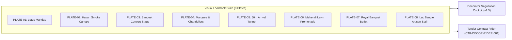
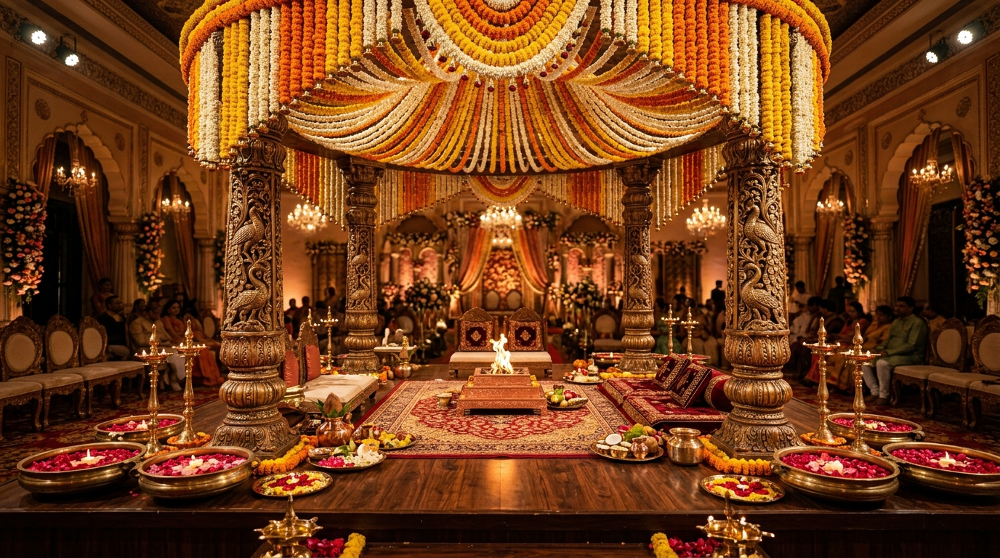
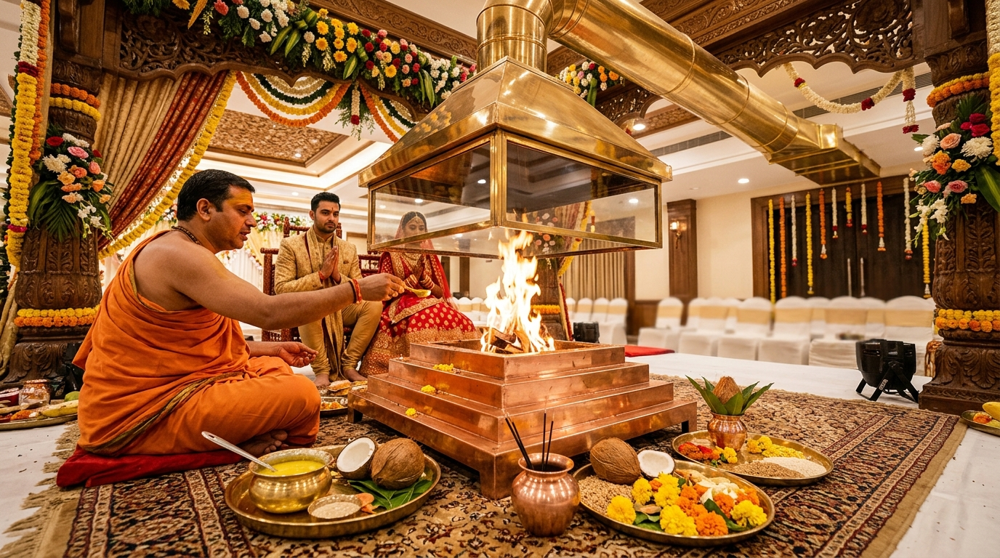
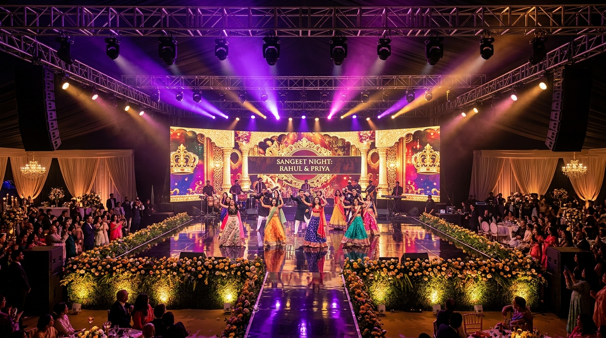
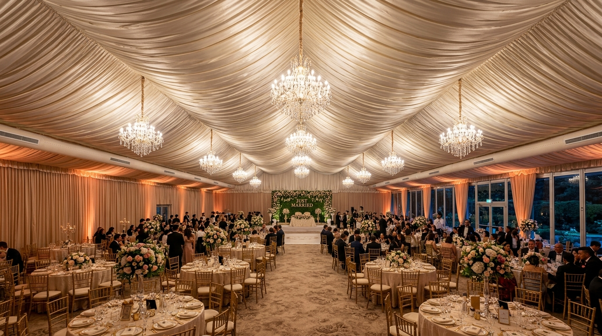
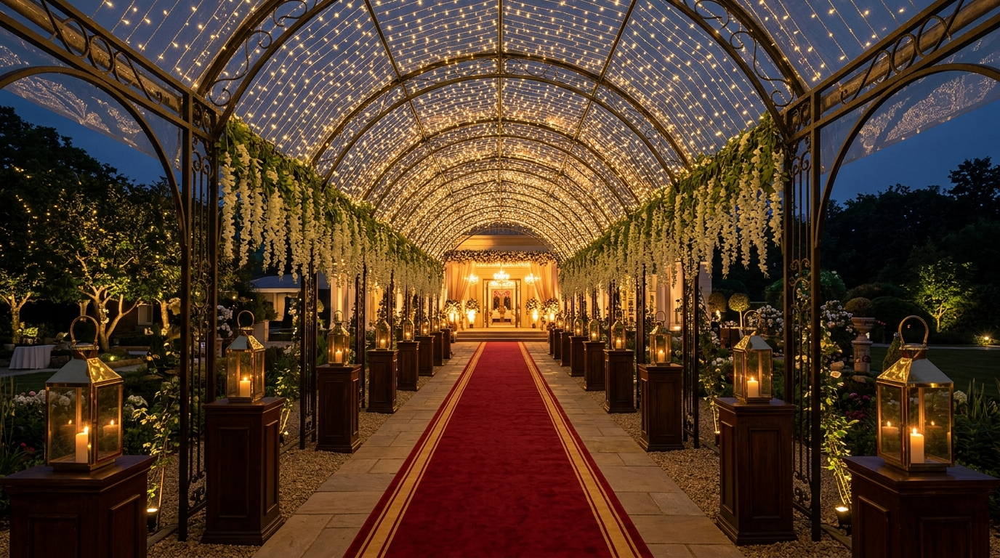
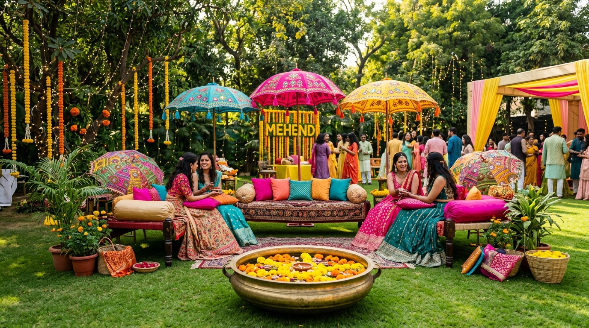
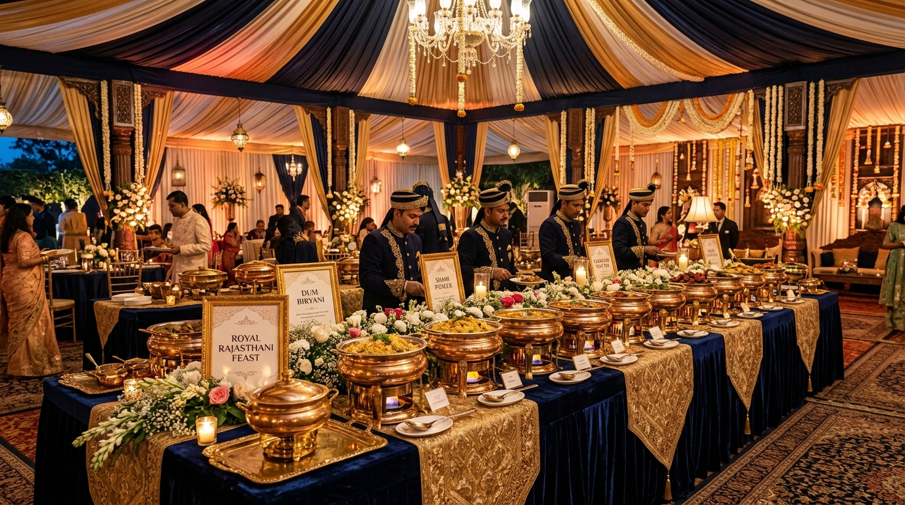
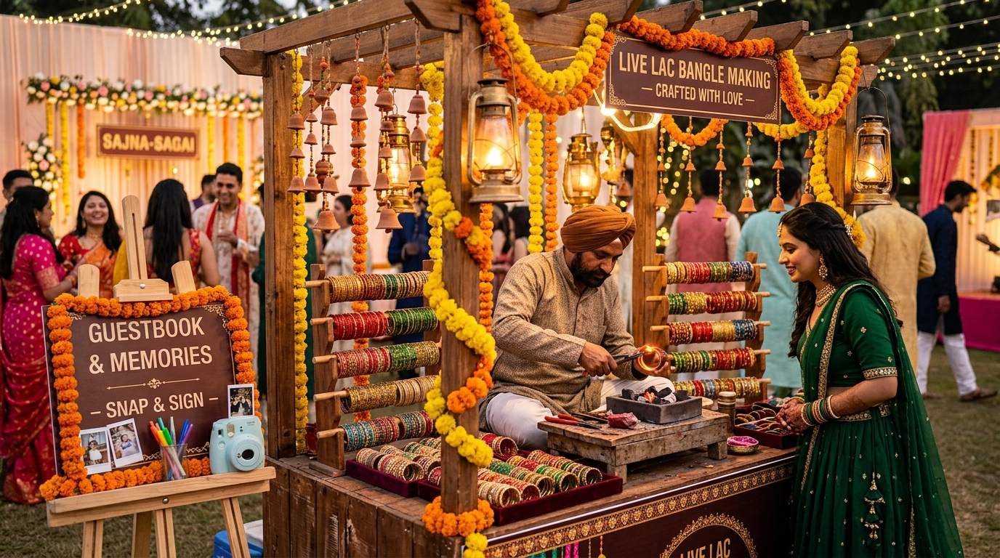

# 🎨 Sree Krushna Marriage OS — Decor Generative Prompt Catalog & Tweak Matrix
**Document ID**: `SPEC-PROC-DECOR-PROMPTS-001`  
**Parent Hub**: [`04_PROCUREMENT_VENDORS/HUB.md`](../HUB.md)  
**Governing Rulings**: [`AC-DEC-2026-009` / `UI-DEC-2026-005`](../../User_Created/Discussion%20Threads/Council/260913_arch_council_image_prompt_catalog_and_tweak_matrix.md)  
**Contractual Linkage**: Binds visual expectations for [`CTR-DECOR-RIDER-001`](../contracts/DECORATOR_RFP_RIDER_GROUND_MARQUEE.md)  
**Cockpit Application**: Rendered dynamically inside [`public/decorator-cockpit.html`](../../public/decorator-cockpit.html)

---

## 1. Executive Summary & Master Style Directives

This document serves as the canonical Source-of-Truth (SSOT) catalog of all **photorealistic generative AI prompts** used to construct the official 8-plate visual lookbook for the Sree Krushna wedding venue and marquee operations.

### Master Stylistic Directives & Global Seeds
- **Core Aesthetic**: Royal Vedic Indian Wedding Architecture, dignified temple luxury, authentic sacred liturgical fidelity.
- **Aspect Ratio**: `16:9` (1920×1080 / 3840×2160 widescreen cinematic standard).
- **Lighting Temperature**: Dual-zone calibrated — **3200K warm tungsten/amber** for indoor sacred sanctuary and evening stages; **5500K bright natural daylight** for afternoon garden mehendi.
- **Rendering Depth**: Wide architectural depth-of-field (`f/4.0` – `f/8.0` on 24mm–35mm full-frame cinema glass) to maintain sharp focus across structural columns, ceiling trusses, and floral altars.
- **Global Negative Tokens**: `low resolution, cartoon, 3d render, CGI, plastic sheen, distorted anatomy, modern plastic chairs, cold fluorescent white lighting, messy cabling, blurry, oversaturated neon, western chapel altar`.

---

## 2. The 8 Architectural Reference Plates & Generative Prompts



---

### Plate 01: Vedic Lotus Mandap & Elevated Altar

- **Plate ID**: `PLATE-01`
- **Zone**: Zone A — Sacred Sanctuary
- **Contract Rider**: `CTR-DECOR-RIDER-001 Cl 1 & 2` (`SPEC-PROC-DECOR-MARQUEE-001 §3.1`)
- **Dimensions**: `24'-0" (7.32m)` clear width • `18"` treated timber riser
- **Canonical Photo Asset**: [`../../public/assets/decor/mandap/photo-mandap-inspiration.jpg`](../../public/assets/decor/mandap/photo-mandap-inspiration.jpg)



#### Verbatim Generative Prompt
```text
A breathtaking luxury Indian Vedic wedding mandap setup inside a grand hall or marquee. An elevated 18-inch wooden platform featuring a sacred lotus-shaped floral canopy dome decorated with thousands of cascading marigold and fragrant white jasmine garlands. Four intricately hand-carved traditional wooden and brass pillars frame the altar. Polished brass samai oil lamps and brass urlis filled with floating red rose petals and floating candles surround the perimeter. In the center is a sacred square havan fire altar with a polished copper kund. Atmospheric warm golden amber lighting, photorealistic, 8k resolution, elegant Indian royal aesthetic.
```

#### Midjourney v6 Format
```text
/imagine prompt: A breathtaking luxury Indian Vedic wedding mandap setup inside a grand hall, elevated 18-inch treated wooden platform, sacred lotus-shaped floral dome with cascading orange marigold and white mogra jasmine garlands, four hand-carved brass and teakwood pillars, brass samai oil lamps, antique brass urlis with floating red rose petals, central square copper havan kund with gentle flame, cinematic 3200K amber lighting, photorealistic, architectural photography, shot on Sony FX3 24mm lens --ar 16:9 --v 6.0 --style raw --q 2
```

#### Modular Tweak Matrix
| Variation Goal | Keyword Replacements / Additions |
|---|---|
| **Modern Pastel Aesthetic** | Replace `orange marigold and jasmine` with `blush pink English garden roses, white hydrangeas, baby's breath, and champagne silk drapery`. |
| **Night Ceremony Mood** | Add `dramatic candlelight illumination, 100 diya clay lamps lining the riser steps, deep twilight blue ambient background, moody golden fire glow`. |
| **Temple Stone Pillars** | Replace `hand-carved teakwood pillars` with `antiqued sandstone monolithic temple pillars with intricate Vedic deity relief carvings`. |

---

### Plate 02: Havan Smoke Extraction Canopy & Ducting

- **Plate ID**: `PLATE-02`
- **Zone**: Zone A — Fire & Thermodynamic Isolation
- **Contract Rider**: `CTR-DECOR-RIDER-001 Cl 5` (`SPEC-PROC-DECOR-MARQUEE-001 §3.2`)
- **Dimensions**: `1200 CFM` capacity • `150mm` flexible duct • `6'6"` suspended elevation
- **Canonical Photo Asset**: [`../../public/assets/decor/mandap/photo-havan-fire-ritual.jpg`](../../public/assets/decor/mandap/photo-havan-fire-ritual.jpg)



#### Verbatim Generative Prompt
```text
A close-up architectural and liturgical interior photo of a sacred Hindu Vedic Havan ritual inside an upscale wedding mandap. A polished stepped copper Havan Kund with sacred Vedic fire burning cleanly. Directly suspended above the fire altar at 6.5 feet elevation is an elegant, polished brass and clear heat-resistant glass smoke extraction hood and ducting system designed seamlessly to evacuate smoke without dispersing into the air-conditioned hall. Surrounding the altar are brass puja thalis with ghee, coconuts, flowers, and mango leaves, set upon an ornate ceremonial carpet. Photorealistic, warm golden fire glow, architectural photography, 8k resolution.
```

#### Midjourney v6 Format
```text
/imagine prompt: Close-up architectural interior photo of a sacred Hindu Vedic Havan ritual, stepped copper havan kund with clean ceremonial flame, suspended polished brass and glass smoke extraction cowl hood at 6.5ft elevation with ducted overhead pipe, brass puja thalis with coconuts and mango leaves, red silk ceremonial floor seating, warm golden firelight illumination, photorealistic, 8k, Hasselblad 50mm lens --ar 16:9 --v 6.0 --style raw
```

#### Modular Tweak Matrix
| Variation Goal | Keyword Replacements / Additions |
|---|---|
| **Spun Brass Antique Cowl** | Replace `brass and clear heat-resistant glass` with `hand-beaten traditional antique brass bell cowl with engraved Sanskrit shlokas`. |
| **High Smoke Flow Engineering** | Add `subtle transparent vortex airflow lines rising cleanly into the extraction hood, zero ambient haze in surrounding hall, crystal clear air`. |
| **Purohit Vedic Detail** | Add `revered Vedic priest in saffron dhoti performing ahuti offering ghee with wooden sruk ladle into the sacred fire`. |

---

### Plate 03: Sangeet Production Stage & Cinema Lighting

- **Plate ID**: `PLATE-03`
- **Zone**: Zone A — Performance Stage
- **Contract Rider**: `CTR-DECOR-RIDER-001 Cl 3` (`SPEC-PROC-DECOR-MARQUEE-001 §3.3`)
- **Dimensions**: `36'-0" × 16'-0"` stage (`3ft` riser) • `24ft × 12ft P3` LED wall
- **Canonical Photo Asset**: [`../../public/assets/decor/sangeet/photo-sangeet-stage-lighting.jpg`](../../public/assets/decor/sangeet/photo-sangeet-stage-lighting.jpg)



#### Verbatim Generative Prompt
```text
A magnificent Indian wedding Sangeet concert production stage inside a luxury marquee event venue. A wide 36-foot wide elevated performance stage with glossy dark reflective dance floor. Backdrop features a massive ultra-high-definition LED video wall showcasing vibrant golden royal motifs. Overhead aluminum box truss rigging with concert-grade moving head spotlights, warm 3200K cinema profile keylights, and subtle haze beams in violet, magenta, and warm gold. Front stage dressed with floral hedges and soft uplighting. Luxurious Bollywood wedding concert aesthetic, photorealistic, 8k.
```

#### Midjourney v6 Format
```text
/imagine prompt: Luxury Indian wedding Sangeet performance stage, 36ft wide elevated black reflective glossy runway, giant 24ft P3 LED video backdrop displaying royal Rajasthani palace arches, aluminum box truss with moving head beam spotlights in magenta, violet, and warm amber gold, CRI 95 keylights, foreground floral hedge rim lighting, Bollywood grand sangeet concert, cinematic wide shot 24mm --ar 16:9 --v 6.0 --style raw
```

#### Modular Tweak Matrix
| Variation Goal | Keyword Replacements / Additions |
|---|---|
| **Intimate Acoustic Sangeet** | Replace `LED video wall and concert truss` with `fairy-light cascading curtain backdrop, Edison filament bulbs suspended at staggered heights, acoustic lounge seating`. |
| **EDM / DJ Afterparty** | Replace `golden royal motifs` with `geometric laser beams, haze atmosphere, neon turquoise and ultraviolet strobes, DJ console riser`. |
| **Royal Sufi Night** | Add `oriental Persian rugs covering stage, brass Moroccan lanterns, velvet bolsters, candle clusters, warm deep amber illumination`. |

---

### Plate 04: Modular Aluminum Marquee & Dual-Zone HVAC

- **Plate ID**: `PLATE-04`
- **Zone**: Whole Venue — Infrastructure & Shell
- **Contract Rider**: `CTR-DECOR-RIDER-001 Cl 1 & 4` (`SPEC-OPS-VENUE-GROUND-001`)
- **Dimensions**: `120ft × 80ft (9,600 sq. ft.)` • `14ft` eaves / `24ft` apex
- **Canonical Photo Asset**: [`../../public/assets/decor/marquee/photo-luxury-marquee-chandeliers.jpg`](../../public/assets/decor/marquee/photo-luxury-marquee-chandeliers.jpg)



#### Verbatim Generative Prompt
```text
Interior wide-angle architectural photograph of a grand, luxury German aluminum clear-span marquee wedding hall (120ft by 80ft). The ceiling is completely draped in elegant pleated ivory and champagne satin drapes with multiple grand crystal chandeliers suspended from the ridge line. Along the sides, subtle concealed air conditioning ducts deliver climate control. The floor is lined with plush carpeting and round guest banquet tables with floral centerpieces and Chiavari chairs. Ambient warm architectural up-lighting washing the fabric sidewalls. Ultra-luxury wedding pavilion interior, photorealistic, 8k.
```

#### Midjourney v6 Format
```text
/imagine prompt: Wide-angle interior architectural photograph of a German clear-span wedding marquee pavilion, 9600 sq ft hall, billowing pleated ivory satin ceiling drapery, central row of magnificent crystal chandeliers, perimeter concealed AC plenum vents, plush champagne carpeting, round banquet tables with gold Chiavari chairs, soft amber fabric wall uplighting, ultra-luxury wedding reception --ar 16:9 --v 6.0 --style raw
```

#### Modular Tweak Matrix
| Variation Goal | Keyword Replacements / Additions |
|---|---|
| **Glass House / Transparent Roof** | Replace `ivory pleated satin ceiling` with `crystal clear transparent glass roof revealing starry night sky, suspended fairy lights, and weeping wisteria floral chandeliers`. |
| **Traditional Shamiana Motifs** | Replace `champagne satin` with `royal cream fabric with printed gold marigold block-print borders and scalloped Mughal valances`. |
| **Dark Moody Banquet** | Replace `ivory satin` with `midnight navy ceiling drapes, pin-spot lighting on floral centerpieces, dramatic high-contrast luxury hotel gala aesthetic`. |

---

### Plate 05: 50m Weatherproof Grand Arrival Canopy Corridor

- **Plate ID**: `PLATE-05`
- **Zone**: Zone E — Arrival & Transit Corridor
- **Contract Rider**: `CTR-DECOR-RIDER-001 Cl 7` (`SPEC-OPS-VENUE-GROUND-001 §2.1`)
- **Dimensions**: `50m` length • `10ft` clear width • `10ft` arched clearance
- **Canonical Photo Asset**: [`../../public/assets/decor/tunnel/photo-fairy-light-tunnel-walkway.jpg`](../../public/assets/decor/tunnel/photo-fairy-light-tunnel-walkway.jpg)



#### Verbatim Generative Prompt
```text
Architectural evening photograph of a grand 50-meter covered wedding arrival walkway and tunnel. The arched pathway has a rich crimson red carpet runner, arched metal framework covered with warm golden fairy light tunnels, cascading jasmine floral strings, and weather-proof waterproof canopy lining above. Polished brass lanterns on wooden pedestals line both sides of the corridor. In the distance, the entrance to an illuminated luxury wedding pavilion glows. Cinematic perspective down the center of the illuminated tunnel, photorealistic, 8k.
```

#### Midjourney v6 Format
```text
/imagine prompt: Cinematic symmetrical one-point perspective of a 50-meter wedding entry walkway tunnel at dusk, arched iron pergola framework enveloped in thousands of warm golden fairy lights, suspended fragrant white wisteria and jasmine strands, rich crimson red velvet carpet runner, antique brass candle lanterns on timber bollards, glowing luxury marquee entrance in distance, photorealistic, 35mm lens --ar 16:9 --v 6.0 --style raw
```

#### Modular Tweak Matrix
| Variation Goal | Keyword Replacements / Additions |
|---|---|
| **Daytime Fresh Foliage** | Replace `fairy lights and lanterns` with `dense green eucalyptus foliage, trailing ivy, hanging glass baubles, white orchids, soft diffused natural daylight canopy`. |
| **Royal Heritage Torches (Mashal)** | Replace `brass lanterns` with `authentic flaming brass mashal torches on stone pedestals with marigold garland wraps`. |
| **Shuttle Cart Transit View** | Add `open-sided luxury white golf-cart shuttle moving gracefully along the side lane transporting elderly guests`. |

---

### Plate 06: Mehendi Zone D Garden Promenade & Lounge

- **Plate ID**: `PLATE-06`
- **Zone**: Zone D — Lawn Promenade
- **Contract Rider**: `EVT-002 Phase 2 / AC-DEC-2026-007 Cl 8`
- **Dimensions**: Open-air lawn promenade • `8` parasol lounge nodes
- **Canonical Photo Asset**: [`../../public/assets/decor/mehendi/photo-mehendi-garden-lounge.jpg`](../../public/assets/decor/mehendi/photo-mehendi-garden-lounge.jpg)



#### Verbatim Generative Prompt
```text
An outdoor afternoon Indian wedding Mehendi ceremony setup on an emerald green lawn garden. Vibrant colorful decor featuring handcrafted Rajasthani embroidered parasols with mirror-work in yellow, hot pink, and teal. Low wooden charpai diwan seating with plush silk bolsters and vibrant printed cushions. In the center is a large antique brass urli vessel filled with water and floating yellow marigolds and orange rose petals. Elegant garden party atmosphere with fairy lights in the surrounding trees and floral hangings. Photorealistic, bright natural daylight, 8k.
```

#### Midjourney v6 Format
```text
/imagine prompt: Vibrant Indian wedding Mehendi ceremony setup on lush manicured garden lawn, bright sunny afternoon, authentic handcrafted Rajasthani mirror-work umbrellas in fuchsia pink and sunshine yellow, low wooden charpai daybeds with silk bolsters, large antique brass urli bowl filled with floating marigolds and rose petals in foreground, festive marigold strings hanging from banyan trees, photorealistic, 8k, Canon 50mm f/1.8 --ar 16:9 --v 6.0 --style raw
```

#### Modular Tweak Matrix
| Variation Goal | Keyword Replacements / Additions |
|---|---|
| **Bohemian Chic Mehendi** | Replace `Rajasthani parasols and charpai` with `macramé swings, pampas grass arrangements, rattan cane furniture, cream rugs, and terracotta pots`. |
| **Sunset Mehendi into Sangeet** | Replace `bright natural daylight` with `golden hour sunset lighting, warm festoon bistro string bulbs glowing between trees, fire bowls`. |
| **Mughal Baradari Cabana** | Add `scalloped Mughal chhatri tents with printed floral jaali curtains and low gaddi mattress seating`. |

---

### Plate 07: BOH Satellite Finishing Kitchen & Linear Buffets

- **Plate ID**: `PLATE-07`
- **Zone**: Zone C & Rear BOH — Food Operations
- **Contract Rider**: `CTR-DECOR-RIDER-001 Cl 6` (`SPEC-OPS-VENUE-GROUND-001 §2.4`)
- **Dimensions**: Dual `24ft` linear buffet runs • `640 sq. ft.` screened BOH pass
- **Canonical Photo Asset**: [`../../public/assets/decor/stalls_catering/photo-wedding-buffet-setup.jpg`](../../public/assets/decor/stalls_catering/photo-wedding-buffet-setup.jpg)



#### Verbatim Generative Prompt
```text
A grand, opulent royal Indian wedding dining buffet spread inside a decorated marquee dining pavilion. Long linear buffet counters draped in midnight navy and gold brocade linens, presenting an array of polished brass and copper chafing dishes with live flame burners below. Fresh aromatic floral runners of tuberoses and baby's breath along the center of the buffet. Elegant menu signage stands with gold calligraphy. Behind the service counter, impeccably uniformed banquet staff in turbans. Warm ambient lighting creating an inviting royal feast ambiance. Photorealistic, 8k.
```

#### Midjourney v6 Format
```text
/imagine prompt: Opulent Indian wedding royal dining buffet spread inside luxury banquet marquee, long continuous buffet line dressed in midnight blue velvet and gold brocade runners, polished ornate brass chafing warmers with glowing blue Sterno flames, tuberose floral garlands, illuminated calligraphic menu stands, uniformed catering stewards in traditional turbans, warm welcoming banquet lighting, architectural interior shot --ar 16:9 --v 6.0 --style raw
```

#### Modular Tweak Matrix
| Variation Goal | Keyword Replacements / Additions |
|---|---|
| **Modern Live Gourmet Counters** | Replace `linear chafing dishes` with `individual live interactive chef stations, butcher block tables, suspended copper heat lamps, slate presentation boards`. |
| **Rajasthani Thali Dining** | Replace `buffet counter` with `traditional low bajot dining tables with silver and brass thali plates and brass tumblers on royal floor carpets`. |
| **Outdoor Lawn Buffet Island** | Replace `inside marquee` with `open-air garden buffet island with wooden pergolas, chalkboard menu signboards, and live tandoori ovens safely enclosed behind heat screens`. |

---

### Plate 08: Interactive Wedding Engagement & Activity Stalls

- **Plate ID**: `PLATE-08`
- **Zone**: Zone D & Foyer — Guest Engagement
- **Contract Rider**: `SPEC-PROC-DECOR-MARQUEE-001 §3.4` (Operational Scope Cl 9)
- **Dimensions**: 3 Modular wooden pergolas (`8ft × 8ft` each)
- **Canonical Photo Asset**: [`../../public/assets/decor/stalls_catering/photo-bangle-craft-stall.jpg`](../../public/assets/decor/stalls_catering/photo-bangle-craft-stall.jpg)



#### Verbatim Generative Prompt
```text
An authentic traditional Indian wedding live interactive guest activity stall. A charming rustic wooden canopy pergola booth decorated with hanging marigold flowers, clay bells, and brass lanterns. In the stall, a skilled traditional Indian lac artisan craftsman is shaping handcrafted colorful lac and glass bangles over a small gentle coal burner for female wedding guests. Rows of gleaming glittering traditional bangles in red, green, and gold are neatly displayed on wooden dowels and velvet trays. Beside the stall is a vintage instant polaroid guestbook station with wooden easel. Warm evening fairy-lit ambiance, photorealistic, 8k.
```

#### Midjourney v6 Format
```text
/imagine prompt: Live traditional Indian wedding activity booth, rustic timber pergola decorated with marigold garlands and terracotta bells, skilled Rajasthani lac artisan shaping custom glass bangles over gentle coal brazier, shimmering colorful bangles on velvet display stands, vintage Polaroid instant camera station with wooden guestbook easel, happy female guests in sarees, warm golden fairy lights, photorealistic documentary wedding photo --ar 16:9 --v 6.0 --style raw
```

#### Modular Tweak Matrix
| Variation Goal | Keyword Replacements / Additions |
|---|---|
| **Attar / Ittar Perfume Bar** | Replace `lac bangle making` with `custom luxury royal Indian organic Ittar perfume blending stall with crystal dropper decanters and dried botanicals`. |
| **Instant 360 Spin Booth** | Replace `vintage polaroid` with `modern 360-degree slow-motion spinning video platform with cold-spark fountain bursts and floral arch backdrop`. |
| **Pottery & Clay Workshop** | Replace `lac artisan` with `live potter shaping miniature clay diyas and terracotta kulhads on a wooden pottery wheel for guests to personalize`. |

---

## 3. Quick Reference Matrix: Image Prompt Directory

| Plate ID | Tactical Focus | Primary Image Model Parameters | Asset File Link |
|---|---|---|---|
| **`PLATE-01`** | Vedic Lotus Mandap | `16:9`, `3200K`, 24mm Wide, Amber/Gold/Crimson | [`photo-mandap-inspiration.jpg`](../../public/assets/decor/mandap/photo-mandap-inspiration.jpg) |
| **`PLATE-02`** | Havan Smoke Extraction | `16:9`, `3200K`, 50mm Normal, Copper/Brass/Flame | [`photo-havan-fire-ritual.jpg`](../../public/assets/decor/mandap/photo-havan-fire-ritual.jpg) |
| **`PLATE-03`** | Sangeet Stage & Lighting | `16:9`, Concert Rig, 24mm, Magenta/Violet/3200K | [`photo-sangeet-stage-lighting.jpg`](../../public/assets/decor/sangeet/photo-sangeet-stage-lighting.jpg) |
| **`PLATE-04`** | German Marquee & HVAC | `16:9`, Clear-Span Interior, 20mm, Ivory/Gold/Crystal | [`photo-luxury-marquee-chandeliers.jpg`](../../public/assets/decor/marquee/photo-luxury-marquee-chandeliers.jpg) |
| **`PLATE-05`** | 50m Arrival Tunnel | `16:9`, Symmetrical Corridor, 35mm, Crimson/Fairy Light | [`photo-fairy-light-tunnel-walkway.jpg`](../../public/assets/decor/tunnel/photo-fairy-light-tunnel-walkway.jpg) |
| **`PLATE-06`** | Mehendi Garden Promenade | `16:9`, Natural 5500K Daylight, 50mm, Pink/Yellow/Teal | [`photo-mehendi-garden-lounge.jpg`](../../public/assets/decor/mehendi/photo-mehendi-garden-lounge.jpg) |
| **`PLATE-07`** | Royal Banquet Buffet | `16:9`, Banquet Lighting, 35mm, Midnight Navy/Brocade | [`photo-wedding-buffet-setup.jpg`](../../public/assets/decor/stalls_catering/photo-wedding-buffet-setup.jpg) |
| **`PLATE-08`** | Lac Bangle & Guest Stalls | `16:9`, Warm Evening Mood, 50mm, Timber/Marigold/Lac | [`photo-bangle-craft-stall.jpg`](../../public/assets/decor/stalls_catering/photo-bangle-craft-stall.jpg) |

---

## 4. Verification & Change Control

- **Pre-flight Gate Integrity**: This document complies with repository rule `P-SSOT-DOCS` and does not alter any live build hashes.
- **Synchronized Artifacts**:
  - Technical Specs: [`SPEC-PROC-DECOR-MARQUEE-001`](./open_ground_marquee_modular_base_spec.md)
  - Tender Rider: [`CTR-DECOR-RIDER-001`](../contracts/DECORATOR_RFP_RIDER_GROUND_MARQUEE.md)
  - Interactive Application: [`public/decorator-cockpit.html`](../../public/decorator-cockpit.html)
