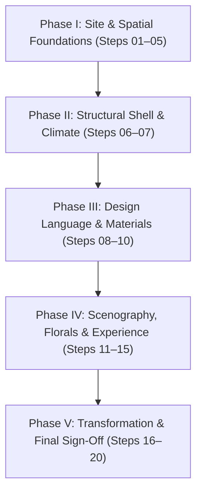

# 🏛️ Master Decor Planning & 20-Step Sequential Decision Roadmap Specification
**Document ID**: `SPEC-PROC-DECOR-ROADMAP-001`  
**Parent Hub**: [`04_PROCUREMENT_VENDORS/HUB.md`](../HUB.md)  
**Governing Ruling**: [`AC-DEC-2026-010` / `UI-DEC-2026-006`](../../User_Created/Discussion%20Threads/Council/260913_arch_council_master_decor_decision_roadmap.md)  
**Interactive UI**: Mode 3 in [`public/decorator-cockpit.html`](../../public/decorator-cockpit.html)  
**Governing Principle**: *"Every decor choice must be evaluated on ① Visual impact, ② Reusability across events, and ③ Cost efficiency."*

---

## 1. Executive Precedence Ladder Overview

To prevent fragmented decor, budget inflation, and operational bottlenecks on event day, all 20 tactical decisions must be negotiated and locked strictly in the following **5-Phase Precedence Sequence**:

---

## 2. The 20 Sequential Decision Specifications

---

### Phase I: Site & Spatial Foundations

#### Step 01: Function Schedule & Day/Night Allocation
- **Status**: `🟢 LOCKED / CERTIFIED`
- **Zone**: Entire Venue
- **Governing Spec**: `EVT-001` through `EVT-004` / `AC-DEC-2026-007`
- **Specification**:
  - Haldi: Day 1 Morning (09:30–12:00) &mdash; Marquee Zone D & Foyer
  - Mehendi: Day 1 Afternoon (12:00–14:30 Hotel AC Hall `VEN-001`; 14:30–17:00 Marquee Lawn Zone D)
  - Sangeet: Day 1 Night (19:30–01:00) &mdash; Marquee Zone A & B
  - Wedding (Vivaha): Day 2 Morning (07:00–13:00) &mdash; Marquee Zone A Sacred Sanctuary
- **Industry Benchmark**: *Vandana Mohan (The Wedding Design Company)*: Destination multi-event setups mandate separating high-turnaround daytime rituals from evening entertainment stages to allow 6+ hours of uninterrupted audio-visual line checks.
- **Direction**: Locked in OS. Do not permit decorator to compress the Sangeet-to-Wedding overnight window below 6 hours.

---

#### Step 02: Physical Site Survey & Boundary Clearances
- **Status**: `🔵 VENDOR ACTION`
- **Zone**: Ground Perimeter & Buffer Zones
- **Governing Spec**: `SPEC-OPS-VENUE-GROUND-001 §1.1`
- **Dilemma**: Soil compaction, ground slope, drainage gradient, and heavy equipment access.
- **Industry Benchmark**: *Devika Narain & Associates*: For open-ground setups, subfloor laser leveling with treated timber pedestals must precede all tent framing to prevent standing water accumulation and uneven chair rocking.
- **Direction**: Require decorator to submit a stamped CAD survey showing:
  1. 50m canopy link from hotel porch to marquee entrance.
  2. 6m clear emergency perimeter for fire tender access.
  3. Ground slope gradient ensuring surface water drains away from kitchen and dining zones.

---

#### Step 03: Sun Path, Weather & Thermodynamic Orientation
- **Status**: `🟢 LOCKED / CERTIFIED`
- **Zone**: Whole Shell Orientation
- **Governing Spec**: `SPEC-OPS-VENUE-GROUND-001 §1.2`
- **Specification**:
  - Marquee ridge oriented North-South.
  - Gable ends face North and South to minimize direct solar radiant heat on long 120ft sidewalls.
  - Afternoon sun strikes behind rear BOH kitchen screen, shielding guest lawn.
- **Industry Benchmark**: *Abu Jani Sandeep Khosla Wedding Architecture*: 850 g/m² blockout PVC with reflective exterior coating reduces internal thermal loading by 6°C–8°C compared to translucent translucent tarpaulins.
- **Direction**: Certified in OS. Strict prohibition on transparent roof PVC over Zone A ceremony sanctuary.

---

#### Step 04: Master Spatial Zoning (Zones A–E)
- **Status**: `🟢 LOCKED / CERTIFIED`
- **Zone**: Master Site Plan
- **Governing Spec**: `05_OPERATIONS_LOGISTICS/venues/open_ground_spatial_zoning.md`
- **Specification**:
  - **Zone A** (4,000 sq. ft.): Sacred Sanctuary (Mandap) / Performance Stage & VIP Seating (40T AC).
  - **Zone B** (2,400 sq. ft.): Central Audience & Cocktail Lounge.
  - **Zone C** (3,200 sq. ft.): Dining Hall & Dual Linear Buffets (Evaporative Cooled).
  - **Zone D** (Open Lawn): Festive Mehendi Promenade & 3 Guest Activity Pergolas.
  - **Zone E** (Canopy): 50m Weatherproof Grand Arrival Walkway & Reception Foyer.
- **Industry Benchmark**: *Cineyug Celebrations*: Clear acoustic partition walls dividing concert zones from dining pavilions prevent deafening sound spill into family dinner conversations.
- **Direction**: Locked in OS. Partition wall between Zone A and Zone C must feature heavy acoustic velour backing.

---

#### Step 05: Guest vs. Service Circulation Separation
- **Status**: `🔵 VENDOR ACTION`
- **Zone**: Access Pathways & Service Corridors
- **Governing Spec**: `SPEC-OPS-VENUE-GROUND-001 §2.3`
- **Dilemma**: Preventing catering trolleys, dirty dishes, and technician ladders from crossing guest pathways.
- **Industry Benchmark**: *Luxury Hotel & Palace Standards (Taj / Oberoi)*: 100% segregated Back-of-House (BOH) service ring. Guests never witness waste removal, empty chafing refills, or diesel generator refueling.
- **Direction**: Decorator must delineate a dedicated 6ft rear service corridor behind Zone C leading directly to the service gate.

---

### Phase II: Structural Shell & Climate Engineering

#### Step 06: Marquee Structure Architecture & Elevation
- **Status**: `🟢 LOCKED / CERTIFIED`
- **Zone**: Structural Hangar
- **Governing Spec**: `SPEC-PROC-DECOR-MARQUEE-001 §2.1`
- **Specification**:
  - 120ft × 80ft German clear-span profile (extruded aluminum 6061-T6, zero interior obstructive pillars).
  - 14ft eaves clearance • 24ft central apex.
  - Wind load rating: 100 km/h with 1.2m steel earth anchors.
- **Industry Benchmark**: *German Roder / Losberger Structures*: Clear-span hangars provide complete 360-degree sightlines for cinematography, allowing unobstructed camera crane (jib) arcs over 500 guests.
- **Direction**: Certified in OS. Strict prohibition on traditional wooden pole shamianas with sagging centers.

---

#### Step 07: Dual-Zone HVAC & DG Power Architecture
- **Status**: `🟢 LOCKED / CERTIFIED`
- **Zone**: Whole Venue MEP
- **Governing Spec**: `SPEC-PROC-DECOR-MARQUEE-001 §2.2-2.3`
- **Specification**:
  - Zone A: 40 Tons package AC (target 24°C in sacred sanctuary).
  - Zone C: Industrial evaporative desert coolers with oscillating louvers.
  - Power: Dual 125 kVA silent DG sets with automatic AMF failover on 3 isolated buses (HVAC, Lighting, Audio/Video).
- **Industry Benchmark**: *Sound.com (Warren D’Souza)*: Audio/Video circuits must be isolated through an online double-conversion UPS to eliminate harmonic generator noise and LED screen flickering.
- **Direction**: Certified in OS. Ground earthing pit resistance must be certified < 2 ohms before sound check.

---

### Phase III: Design Language & Material Curation

#### Step 08: Master Color Palette & Metallic Standard
- **Status**: `🟡 PENDING YOUR DECISION`
- **Zone**: Design Identity
- **Dilemma**: Selecting the unified color harmony across all 4 functions to prevent visual chaos.
- **Industry Benchmark**: *Devika Narain*: Royal destination weddings succeed by maintaining a calm 70% neutral base (Ivory, Warm White, Champagne) and introducing rich narrative accents through florals and textiles.
- **Direction**:
  - **Primary (70%)**: Ivory, Warm White, Champagne Satin.
  - **Secondary (20%)**: Soft Beige, Muted Gold.
  - **Dominant Metallic**: **Champagne Gold (brushed satin)** &mdash; bright reflective brass is prohibited.
  - **Executive Decision Needed**: Choose Accent Tone (10%):
    - **Option A (Recommended)**: *Royal Amber & Marigold Gold* &mdash; timeless Vedic sacred warmth, elevates wood/brass mandap.
    - **Option B**: *Blush Rose & Dusty Peach* &mdash; soft romantic contemporary elegance, photographic softness.
    - **Option C**: *Deep Emerald & Midnight Navy* &mdash; dramatic royal palace opulence, high-contrast evening impact.

---

#### Step 09: Material Palette Discipline & "Strictly Prohibited" List
- **Status**: `🟡 PENDING SIGN-OFF`
- **Zone**: Material Procurement
- **Dilemma**: Establishing strict quality boundaries to prevent cheap vendor shortcuts.
- **Industry Benchmark**: *Rani Pink*: Luxury is defined as much by what you refuse as what you include. Flex banners and shiny synthetic satin immediately degrade a multi-crore aesthetic.
- **Direction**: Enforce the Prohibited Negative List with a ₹50,000 penalty clause in `CTR-DECOR-RIDER-001`:
  - **Allowed**: Real teak/pine timber, brushed champagne brass, pleated ivory satin, fresh florals, raw silk bolsters, hand-beaten copper, cane/rattan.
  - **Strictly Prohibited**:
    1. ❌ Printed plastic flex banners anywhere in guest view.
    2. ❌ Plastic banquet chairs or synthetic spandex chair socks.
    3. ❌ Artificial nylon flower garlands at eye level (<8ft).
    4. ❌ Exposed black electrical cables crossing walkways.
    5. ❌ Clashing high-gloss chrome or bright yellow gold trims.

---

#### Step 10: Permanent Luxury Base Infrastructure
- **Status**: `🟢 LOCKED / CERTIFIED`
- **Zone**: Whole Venue
- **Governing Spec**: Core Architectural Invariant (`P-BASE-DECOR`)
- **Specification**:
  - "Build Once, Transform Many": The marquee shell, ivory pleated ceiling draping, central crystal chandeliers, perimeter neutral beige carpeting, and main electrical backbone remain 100% constant across all 4 events.
- **Industry Benchmark**: *International Event Production Standard*: Permanent base infrastructure amortizes rental costs across multiple days, saving 45%–55% of the total decor quotation compared to 4 separate setups.
- **Direction**: Certified in OS. Decorator cannot charge tear-down or rebuild fees for structural elements between events.

---

### Phase IV: Scenography, Florals & Sensory Experience

#### Step 11: Cinema Lighting Design & Calibration (CRI > 95)
- **Status**: `🟢 LOCKED / CERTIFIED`
- **Zone**: Lighting Rig & Grid
- **Governing Spec**: `SPEC-PROC-DECOR-MARQUEE-001 §3.3`
- **Specification**:
  - Keylights and profile spotlights calibrated to **CRI > 95 at 3200K** warm white.
  - Zero 120fps video banding on Sony FX3 / A7SIII cinema cameras.
  - Daytime mehendi balanced at 5500K natural daylight.
- **Industry Benchmark**: *Joseph Radhik (Stories by Joseph Radhik)*: Bad LED stage lighting with low CRI causes sickly green skin tones and rolling shutter banding lines on slow-motion wedding films that cannot be corrected in post-production.
- **Direction**: Certified in OS. Require vendor to provide flicker-free cinema profiles on all moving heads and dimmers.

---

#### Step 12: Floral Strategy & Structural Reuse Matrix
- **Status**: `🟡 PENDING YOUR DECISION`
- **Zone**: Mandap, Stage, Entrance & Tables
- **Dilemma**: Balancing lush floral density with budget efficiency and multi-event turnaround speed.
- **Industry Benchmark**: *Devika Narain Floral Architecture*: High-impact weddings use permanent green foliage bases (eucalyptus, weeping ficus, ruscus) built on Day 1, with floral accent garlands clipped in via quick-release cable ties in under 90 minutes.
- **Direction**:
  - **Density Allocation**: Very High at Mandap & Entrance; High at Sangeet Stage; Low-Medium at Buffets; Minimal on Ceiling.
  - **Executive Decision Needed**: Select Floral Philosophy:
    - **Option A (Recommended — Vedic Royal Hybrid)**: Base green foliage + orange/yellow marigold and white mogra jasmine for daytime, transitioned to red roses and cascading tuberoses for the sacred Vivaha altar.
    - **Option B (Modern Pastel English)**: White hydrangeas, blush spray roses, baby's breath, and champagne silk florals.
    - **Option C (Minimalist Foliage & Brass)**: Architectural green palms, olive branches, and antique brass samai lamps with floating petals, minimizing cut flowers.

---

#### Step 13: Furniture Language & Seating Typography
- **Status**: `🟡 PENDING YOUR DECISION`
- **Zone**: Guest Seating across Zones A, B, C, D
- **Dilemma**: Selecting comfortable, elegant seating that fits liturgical rituals and festive party dancing.
- **Industry Benchmark**: *The Wedding Design Company*: Mixing maximum two coherent furniture finishes (e.g. natural timber + champagne metal) creates visual serenity; chaotic multi-colored chair rentals destroy photos.
- **Direction**:
  - **Zone A (Ceremony)**: Front 2 rows plush 3-seater royal velvet sofas for immediate elders (PER-001/PER-002/PER-012); remaining rows Champagne gold Chiavari chairs with ivory cushions.
  - **Zone D (Mehendi)**: Low wooden charpai diwans with raw silk bolsters and Rajasthani mirror-work parasols.
  - **Zone C (Dining)**: Round 10-seater banquet tables with floor-length brocade linen.
  - **Executive Decision Needed**: Approve chair finish swatch and cushion density (minimum 2-inch high-density foam).

---

#### Step 14: Sacred Mandap Architecture & Smoke Evacuation
- **Status**: `🟢 LOCKED / CERTIFIED`
- **Zone**: Zone A — Sacred Altar
- **Governing Spec**: `SPEC-PROC-DECOR-MARQUEE-001 §3.1-3.2` / `PLATE-01` & `PLATE-02`
- **Specification**:
  - 24ft clear width timber stage with 18" riser.
  - 2mm galvanized zinc subfloor thermal barrier under copper havan kund.
  - Suspended 1200 CFM negative-pressure brass/glass smoke cowl with 150mm ducted exhaust to outdoor gable wall.
- **Industry Benchmark**: *Oberoi Hotels Indoor Ritual Standard*: Operating a sacred Vedic havan fire inside an air-conditioned marquee requires active mechanical smoke extraction; otherwise, particulate matter triggers smoke alarms and causes severe eye irritation for elderly guests.
- **Direction**: Certified in OS. Strict mandatory rider clause in decorator contract.

---

#### Step 15: Catering Pass & Guest Activity Stalls
- **Status**: `🟡 PENDING YOUR DECISION`
- **Zone**: Zone C & Zone D
- **Governing Spec**: `SPEC-OPS-VENUE-GROUND-001 §2.4` / `PLATE-07` & `PLATE-08`
- **Dilemma**: Balancing guest engagement activities with catering circulation.
- **Industry Benchmark**: *WeddingSutra Top Picks*: Experiential artisan booths (lac bangles, organic perfume bars) drive 3× higher guest delight than passive static photo backdrops.
- **Direction**:
  - Catering: Dual 24ft linear buffets with 640 sq. ft. screened BOH plating pass. Live tandoors located on outdoor gravel perimeter with dedicated fire extinguishers.
  - **Executive Decision Needed**: Select 2 or 3 Guest Activity Stalls:
    - **Stall 1 (Recommended)**: *Live Lac Bangle Artisan* &mdash; traditional craftsman shaping customized glass/lac bangles for female guests.
    - **Stall 2 (Recommended)**: *Vintage Polaroid Guestbook Station* &mdash; snap & sign memory book with timber easel.
    - **Stall 3 (Optional)**: *Royal Ittar Perfume Bar* &mdash; custom roll-on organic Indian fragrance blending.
    - **Stall 4 (Optional)**: *360-Degree Slow-Motion Video Spin Platform*.

---

### Phase V: Transformation, Safety & Final Sign-Off

#### Step 16: 4-Event Function Transformation Protocol
- **Status**: `🟡 PENDING YOUR DECISION`
- **Zone**: Production & Turnaround
- **Dilemma**: Executing fast transitions between Day 1 Mehendi, Day 1 Sangeet, and Day 2 Wedding without guest disruption.
- **Industry Benchmark**: *Cineyug Production Playbook*: Staging modular Mandap sections in an adjacent staging tent allows overnight turnaround in under 6 hours with a 15-man crew.
- **Direction**:
  - **Transition 1 (Mehendi 17:00 → Sangeet 19:30, 2.5h)**: Zone A was pre-rigged during the day. Dim chandeliers, power up moving heads and LED wall, open acoustic divider.
  - **Transition 2 (Sangeet 01:00 → Wedding 07:00, 6h)**: Strike DJ gear and dance floor, roll in pre-assembled Lotus Mandap riser, install zinc heat shield, replace party lighting with 3200K amber glow, clip on fresh morning jasmine garlands.
  - **Executive Decision Needed**: Approve the 6-hour overnight turnaround crew schedule and designated decorator site supervisor.

---

#### Step 17: Photography Sightlines, Drone & Cable Audit
- **Status**: `🟢 LOCKED / CERTIFIED`
- **Zone**: Media & Safety
- **Governing Spec**: `SPEC-PROC-DECOR-MARQUEE-001 §4`
- **Specification**:
  - Strictly no drone flights inside the marquee (outdoor lawn only).
  - 8ft clear central camera dolly corridor from entrance to Mandap.
  - All power and DMX cables encased in heavy-duty rubber cable protectors taped to subfloor.
- **Direction**: Certified in OS. Photographer to sign off on lighting tests at 10:00, 15:00, 18:30, and 21:00.

---

#### Step 18: Commercial BOQ & 4-Tier Budget Settlement
- **Status**: `🟢 LOCKED / CERTIFIED`
- **Zone**: Commercials & Ledger
- **Governing Spec**: `06_FINANCE_COMMERCIALS/budget_master.md` / Cockpit Calculator
- **Specification**:
  - Tier A (Base Marquee & Power): ₹6,50,000
  - Tier B (Function Transformations): ₹4,80,000
  - Tier C (Variable Elements & Activities): ₹3,20,000
  - Commercial Settlement Target: **₹11,50,000 – ₹12,50,000**
  - Milestone Structure: 20% Advance Token, 50% Setup Handover, 30% Post-Event Retention (48h).
- **Direction**: Certified in OS. Use Cockpit v2.6 live quote calculator to enforce discount settlement.

---

#### Step 19: Technical, Structural & Fire Safety Certification
- **Status**: `🔵 VENDOR ACTION`
- **Zone**: Compliance & Statutory Safety
- **Dilemma**: Ensuring zero fire or structural hazards on an open ground with 500+ guests.
- **Industry Benchmark**: *National Building Code of India (NBC Part 4) & Event Safety Alliance*: All temporary tensile fabrics must carry DIN 4102 B1 / NFPA 701 flame-retardant certification.
- **Direction**: Require decorator to submit signed certificates for:
  1. Flame-retardant fabric compliance.
  2. Wind stability certificate (100 km/h).
  3. Fire extinguisher placements (4× CO2 and 4× ABC powder units).
  4. Local Fire Officer inspection sign-off.

---

#### Step 20: Physical Mock-up & Material Sample Approval Gate
- **Status**: `🔵 VENDOR ACTION`
- **Zone**: Quality Assurance
- **Dilemma**: Color calibration errors and texture disappointments when relying solely on digital photos.
- **Industry Benchmark**: *High-End Event Protocol*: 14 days prior to event (T-14), the vendor presents a physical mock-up table with actual table linen, gold metallic swatch, Chiavari chair cushion, floral garland sample, and 3200K light beam.
- **Direction**: Freeze date for T-14 Physical Mock-up Gate. Strictly no verbal approvals from WhatsApp photos.

---

## 3. Decision Matrix Summary Table

| Step | Focus Area | Phase | Status | Primary Action Owner |
|---|---|---|---|---|
| **01** | Function Calendar & Timings | Phase I | `🟢 LOCKED` | Architecture Council (`AC-DEC-2026-007`) |
| **02** | Site Survey & Clearances | Phase I | `🔵 VENDOR ACTION` | Decorator CAD Draftsman |
| **03** | Sun & Thermodynamic Orientation | Phase I | `🟢 LOCKED` | Operations Specification |
| **04** | Master Spatial Zoning (A–E) | Phase I | `🟢 LOCKED` | Venue Operations Specification |
| **05** | Circulation Separation | Phase I | `🔵 VENDOR ACTION` | Decorator Site Planner |
| **06** | Marquee Architecture (120×80) | Phase II | `🟢 LOCKED` | Technical Rider Specification |
| **07** | Dual-Zone HVAC & DG Power | Phase II | `🟢 LOCKED` | MEP Engineer Specification |
| **08** | Master Color & Champagne Gold | Phase III | `🟡 PENDING DECISION` | Family Executive Committee |
| **09** | Material Discipline & Prohibitions | Phase III | `🟡 PENDING SIGN-OFF` | Family Executive Committee |
| **10** | Permanent Luxury Base Infrastructure | Phase III | `🟢 LOCKED` | Core Operating Invariant |
| **11** | Cinema Lighting (CRI > 95) | Phase IV | `🟢 LOCKED` | Cinematography Protocol |
| **12** | Floral Strategy & Reuse Matrix | Phase IV | `🟡 PENDING DECISION` | Family Executive Committee |
| **13** | Furniture Language & Typography | Phase IV | `🟡 PENDING DECISION` | Family Executive Committee |
| **14** | Sacred Mandap & Smoke Extraction | Phase IV | `🟢 LOCKED` | Contract Rider Specification |
| **15** | Catering Pass & Activity Stalls | Phase IV | `🟡 PENDING DECISION` | Family Executive Committee |
| **16** | 4-Event Transformation Matrix | Phase V | `🟡 PENDING DECISION` | Family Executive Committee |
| **17** | Photography & Drone Audit | Phase V | `🟢 LOCKED` | Cinematography Protocol |
| **18** | BOQ & 4-Tier Budget Settlement | Phase V | `🟢 LOCKED` | Commercial Finance Specification |
| **19** | Fire & Structural Safety Certification | Phase V | `🔵 VENDOR ACTION` | Decorator Compliance Officer |
| **20** | Physical Sample Mock-up Gate | Phase V | `🔵 VENDOR ACTION` | Decorator Master Craftsman |

---

## 4. Multi-Option Candidate Look & Deep-Linking Governance (`P-DECOR-MULTI-OPTION-001`)

*Ratified in Architecture & UI Council Decision `AC-DEC-2026-039` / `UI-DEC-2026-035`.*

To resolve design dilemmas across Steps 08, 12, 13, 14, 15, and 16, each visual reference plate in the Decorator Cockpit (`CANONICAL_PLATES` / `VISUAL_PLATES`) supports dynamic candidate looks:
1. **Option 0 (Sacred Vedic Baseline)**: Canonical baseline (e.g. Lotus Mandap, Sacred Havan Altar) is permanently protected against overwriting.
2. **Options 1..N (Candidate Directions)**: Sourced from vetted decorator photos, Pinterest CDN (`i.pinimg.com`), Google Drive assets, or camera showroom uploads.
3. **Validation Hardening**: Rejects Pinterest web pin pages (`pin.it`), store HTML product links, and hotlinks blocked by remote hosts (HTTP 403 / anti-hotlink policies).
4. **Collaborative Deep Links**: Direct URL sharing (`?plate=PLATE-01&option=1`) enables immediate committee alignment with smooth scrolling and golden beacon pulse (`targetPulse`).

