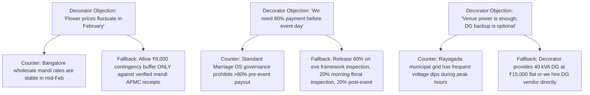

# 🌺 Decorator Negotiation Cockpit & Procurement Battlecard Specification
## Rayagada Engagement (11 Feb 2027) & Wedding Mandap (10 Mar 2027)

**Specification Code:** `SPEC-PROC-DECOR-COCKPIT-001`  
**Parent Hub:** [`04_PROCUREMENT_VENDORS/HUB.md`](file:///d:/GitHub_Repo/Sree_Krushna/04_PROCUREMENT_VENDORS/HUB.md)  
**Cross-References:** [`SPEC-PROC-DECOR-EVAL-001`](file:///d:/GitHub_Repo/Sree_Krushna/04_PROCUREMENT_VENDORS/decor_and_design/decorator_selection_questionnaire.md), [`SPEC-PROC-DECOR-ENG-001`](file:///d:/GitHub_Repo/Sree_Krushna/04_PROCUREMENT_VENDORS/decor_and_design/rayagada_decor_spec.md)  
**Governing Decision:** `AC-DEC-2026-004` (Architecture Council Certified Hybrid Standard)  
**Production Cockpit URL:** `https://sree-krushna-forever.web.app/decorator-cockpit`

---

## 1. Executive Purpose & Strategic Mandate

This specification codifies the operational rules, negotiation levers, fallback boundaries, and pricing sensitivity formulas for evaluating and contracting venue decoration, floral fabrication, and lighting production for **Sree & Krushna's** wedding events.

The vendor conversation is governed by an **Air-Gapped Dual-Lens Architecture**:
1. **Public Presentation Lens:** High-fidelity spatial blueprints, 3D zone layouts, color palettes, and mandatory delivery SLAs displayed to the vendor.
2. **Private Negotiator HUD:** Real-time margin scrutiny, market mandi benchmarks, tri-tone dialogue scripts, objection counters, and walk-away price thresholds.

---

## 2. Event Parameters & Scope of Work

| Parameter | Rayagada Engagement (`EVT-001`) | Main Wedding Mandap & Reception (`EVT-002`) |
| :--- | :--- | :--- |
| **Date & Muhurat** | **11 February 2027** (Morning 10:00 – 15:30 IST) | **10 March 2027** (Vedic Muhurat & Evening Reception) |
| **Venue** | Rayagada Convention Center / Kalyan Mandap | Grand Wedding Venue & Lawn |
| **Capacity** | 300–450 Invited Family & Guests | 600–800 Invited Guests |
| **Color Palette** | Imperial Gold (`#f5c518`), Sacred Marigold (`#ffb703`), Ivory Jasmine (`#fbf9f4`), Royal Saffron (`#fb8500`) | Royal Vermilion (`#d90429`), Temple Gold (`#ffd700`), Ivory Silk, Amber Glow |
| **Floral Standard** | 100% fresh flowers for Mandap, Stage Ring, Torana | 100% fresh flowers for Sacred Mandap, Varmala stage, Entrance |
| **Stage Dimension** | 30 ft (W) × 18 ft (D) × 2.5 ft (H) elevated stage | 40 ft (W) × 24 ft (D) × 3 ft (H) Vedic Mandap stage |
| **Load Capacity** | Minimum 2.5 metric tons (25–30 people standing) | Minimum 4.0 metric tons (40+ people standing) |

---

## 3. The 6 Non-Negotiable Contractual Guardrails (Walk-Away Boundaries)

These six clauses are absolute. If a vendor refuses these terms during negotiation, the negotiation terminates immediately:

1. **The 20% Post-Event Retention Gate:**
   - **Payment Structure:** Exactly **30% advance on contract signing**, **50% upon verified physical completion of the truss/fabrication framework on the eve of the event (20:00 IST)**, and **20% strictly retained until event conclusion**.
   - **Sign-Off Condition:** The final 20% is disbursed only after post-event joint inspection verifying zero floral wilting before muhurat, stage structural integrity, and no vendor-caused property damage.
2. **Fresh Floral Authenticity SLA:**
   - Entrance Torana, Nirbandha Stage backdrop, and Mandap ring must use **100% fresh grade-A blooms** (Bangalore Marigolds, Kolkata Rajnigandha/Tuberoses, Dutch Roses, Natural Jasmine). Zero artificial plastic/cloth flowers in prime sacred visual zones.
   - Harvest & transit must guarantee on-site delivery by **04:00 AM** on event day, with floral misting completed by **07:00 AM**.
3. **Cinema-Grade 4K Lighting Rider (No Strobe / No Flicker):**
   - All LED PARs, profile spots, and amber washes must operate at high-frequency modulation (**zero flicker at 120fps on cinema cameras**).
   - Color temperature calibrated to **3200K warm tungsten** or **5600K daylight**. Zero harsh cool-white (6500K) industrial floodlights on the couple.
   - A dedicated lighting technician board operator must remain stationed at the master console throughout the ceremony.
4. **Autonomous Power & Generator Contingency:**
   - Dedicated **minimum 40 kVA silent Diesel Generator (DG)** with an automatic Automatic Mains Failure (AMF) switchover (< 8 seconds switch time).
   - Mandatory separate Electrical Distribution Box (DB) with dedicated MCB/RCD circuit breakers for the Mandap stage to prevent lighting trips from blacking out the sacred rites.
5. **Eve-of-Event Framework Readiness (20:00 IST Inspection):**
   - Full structural trussing, backdrop carpentry, ceiling draping, and base cabling must be physically erected, bolted, and inspected by **20:00 IST on 10th February** (eve of engagement).
   - This prevents last-minute hammering, power tool noise, or unpainted plywood visible on event morning.
6. **All-Inclusive Turnkey Quotation (Zero "Surprise" Add-Ons):**
   - The agreed quotation must explicitly cover 300 banquet chair covers with gold organza bows, VIP sofas, carpet aisles, labor boarding/lodging, transport freight, and local municipality permits. Zero post-quote supplementary bills.

---

## 4. Vendor Shortlist & Commercial Benchmark Matrix

| Vendor Entity | Entity ID | Base City | Quoted Estimate (₹) | Target Settlement (₹) | Walk-Away Ceiling (₹) | Tactical Leverage / Weakness |
| :--- | :--- | :--- | :--- | :--- | :--- | :--- |
| **Rayagada Local Decorator A** | `VDR-010` | Rayagada | ₹2,80,000 | ₹2,10,000 | ₹2,35,000 | **Leverage:** Zero travel/lodging cost; local warehouse. **Weakness:** Limited 4K cinema lighting inventory; relies on plastic floral mixes unless pressed. |
| **Berhampur / Vizag Decorator B** | `VDR-011` | Berhampur | ₹3,40,000 | ₹2,60,000 | ₹2,85,000 | **Leverage:** High production polish; premium floral supply chain. **Weakness:** High freight markup; needs local labor management. |
| **Bhubaneswar Lead Decorator C** | `VDR-012` | Bhubaneswar | ₹4,20,000 | ₹3,10,000 | ₹3,40,000 | **Leverage:** State-level portfolio, luxury mandap designs. **Weakness:** Over-priced overheads; 400km transit risk for fresh flowers. |

---

## 5. Spoken Script Engine (Dynamic Tri-Tone Dialogue)

The interactive cockpit provides three dynamic tonal modes for each negotiation phase:

### Phase 1: Opening Framing & Mutual Standard
- **Warm (Collaborative):** *"Namaste ji, thank you for sitting with us. Sree and Krushna's engagement is a very sacred milestone for our family, and we want your decor to be the highlight that every guest remembers. We want you to treat this like your own family event."*
- **Data (Market Analytical):** *"We have benchmarked the Rayagada Convention Center layout with two other decorators from Berhampur and local suppliers. For a 30x18ft stage and 300 banquet chairs, current mandi flower rates and fabrication labor put competitive turnkey pricing between ₹2.1L and ₹2.4L."*
- **Firm (Boundary-Setting):** *"Before we discuss aesthetics, we must be aligned on delivery standards. We have written contracts with strict milestone gates: 30% advance, 50% upon verified erection on the eve at 20:00, and 20% strictly post-event. If this milestone structure is acceptable, we can proceed to design."*

### Phase 2: Fresh Flowers vs. Wilting Defense
- **Warm:** *"You know how important the morning muhurat photos are for the bride and groom. We want fresh rajnigandha and marigolds that smell divine when elders bless the couple."*
- **Data:** *"The muhurat is at 10:00 AM under ambient hall temperatures of 28°C. Tuberoses cut before 24 hours lose turgidity and brown at the tips. We require 04:00 AM delivery from Bangalore cold-chains and cold-water misting up to 08:30 AM."*
- **Firm:** *"We will not accept artificial plastic flowers on the entrance torana or the main stage backdrop. If we discover wilted or plastic flowers on event morning, a 25% liquidated damage clause will be deducted directly from the 20% retention fund."*

### Phase 3: Commercials & Closing the Deal
- **Warm:** *"We want to lock you in today so you don't take any other booking for 11th Feb. If you meet us at our target figure of ₹2.25L, we will immediately disburse the 30% advance token today."*
- **Data:** *"Your quote of ₹2.80L includes ₹45,000 for lighting and ₹35,000 for chair covers. Local equipment rental for 24 warm PARs and a follow spot is ₹18,000, and 300 chair slipcovers are ₹12,000. We are ready to close at ₹2,20,000 all-inclusive."*
- **Firm:** *"₹2.35L is our absolute walk-away ceiling for the engagement scope. If you cannot do it at this price with the 20% post-event retention and 40 kVA DG included, we will sign with our Berhampur alternative this evening."*

---

## 6. Objection Handling & Curveball Battlecards

---

## 7. Web Cockpit Architecture & Deployment Invariants

1. **Single-File Zero-Dependency Engine:**
   - The interactive tool is deployed at `public/decorator-cockpit.html` and mirrored at `decorator-cockpit.html`.
   - All fonts (`Outfit`, `Inter`, `JetBrains Mono`) are base64 embedded directly in the `<style>` block.
   - Zero external scripts, zero CDNs, zero NPM build dependencies.
2. **Dual-Lens Privacy Protection:**
   - Public View (`#presentationWorkspace`): Projector-safe. Shows 3D floor plan, floral specifications, and SLA timelines.
   - Private HUD (`#hudWorkspace`): PIN-gated (`7799`). Shows private budgets, counter-scripts, and negotiation levers.
3. **Production URL & Reachability:**
   - Canonical URL: `https://sree-krushna-forever.web.app/decorator-cockpit` (served via Firebase Hosting `cleanUrls: true`).
   - GitHub Pages URL: `https://goldenage399.github.io/Sree_Krushna/decorator-cockpit.html`.
