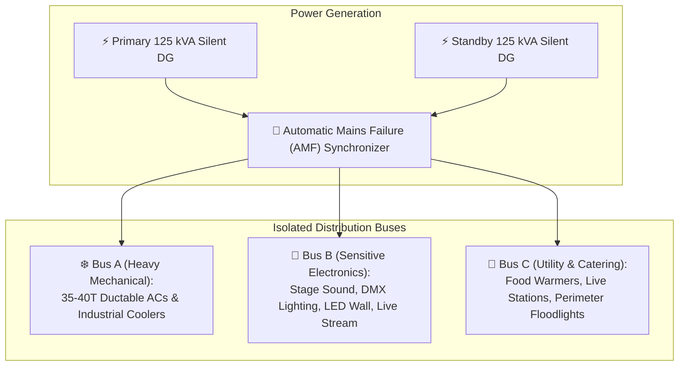

# 🎪 Open-Ground Luxury Blackout Marquee & Modular Base Decor Specification
## Haldi (`EVT-003`), Mehendi (`EVT-002`), Sangeet (`EVT-002`) & Vedic Marriage (`EVT-004`)

**Specification Code:** `SPEC-PROC-DECOR-MARQUEE-001`  
**Parent Hub:** [`04_PROCUREMENT_VENDORS/HUB.md`](file:///d:/GitHub_Repo/Sree_Krushna/04_PROCUREMENT_VENDORS/HUB.md)  
**Cross-References:** [`SPEC-OPS-VENUE-GROUND-001`](file:///d:/GitHub_Repo/Sree_Krushna/05_OPERATIONS_LOGISTICS/venues/open_ground_spatial_zoning.md), [`CTR-DECOR-RIDER-001`](file:///d:/GitHub_Repo/Sree_Krushna/04_PROCUREMENT_VENDORS/contracts/DECORATOR_RFP_RIDER_GROUND_MARQUEE.md), [`SPEC-PROC-DECOR-COCKPIT-001`](file:///d:/GitHub_Repo/Sree_Krushna/04_PROCUREMENT_VENDORS/decor_and_design/decorator_negotiation_cockpit_spec.md)  
**Governing Decision:** `AC-DEC-2026-006` (Architecture Council Certified Tri-Surface Standard)  
**Source Threads:** `260913_DecoratorDiscussion.md:L705-L1267` (Query 1.2 & Addendum)

---

## 1. Executive Purpose & Strategic Philosophy

The primary objective is to design the entire outdoor open ground (approximately 50 metres from the hotel) as **one coherent luxury production environment that evolves across functions**, rather than creating completely separate decoration setups for Haldi, Mehendi, Sangeet, and the morning wedding ceremony. The formal Engagement is held separately inside the hotel banquet hall (`EVT-001`).

### The Central Governing Axiom:
$$\text{"Build once } \longrightarrow \text{ reuse extensively } \longrightarrow \text{ transform selectively."}$$

> *"Ek baar achha luxury base bana do — phir har function mein usi base ko intelligently transform karo. Structure same rahega, look aur mood function ke hisaab se change hoga."*

The decorator must approach this as a **venue transformation system**, not four independent decoration projects.

---

## 2. The Permanent Luxury Base Architecture

The underlying structure, marquee shell, flooring, ceiling treatment, major chandeliers, structural framework, guest circulation, and primary luxury finishes form the common base that remains 100% intact across all functions:

| Base Structural Element (Common to All 4 Functions) | Technical Specification | Operational Retention Standard |
| :--- | :--- | :--- |
| **Main Marquee Shell** | German clear-span aluminum structure (15m × 40m / 50ft × 130ft) | Erected once; zero dismantling until post-wedding clearance. |
| **Flooring Sub-Base** | Elevated moisture-barrier wooden sub-decking + needle-felt carpet | Sealed against ground dampness; vacuum-cleaned between functions. |
| **Ceiling Architecture** | Grand paneless ivory textured graphic fabric + champagne-gold borders | Permanent rigging; zero modification between events. |
| **Centerpiece Chandeliers** | 8–12 Statement faceted crystal tiered chandeliers on DMX dimmers | Stationary; dimmed and programmed for distinct moods. |
| **Core Rigging & Lighting Truss** | Matte-black box trusses with warm profile follow-spots and ambient washes | Fixed position; reprogrammed via lighting board scenes. |
| **Climate Infrastructure** | Dual-Zone 40-ton ductable AC + 8 industrial evaporative coolers | Fixed ducting and insulated air curtains throughout. |
| **Back-of-House / Service Grid** | Segregated catering circulation spine, utility trenches, DG cabling | Zero interference with guest experience or photo sightlines. |

---

## 3. Function-to-Function Transformation Matrix

Between functions, the venue mood transforms rapidly through selective, high-impact overlays:

| Function | Dominant Mood & Visual Language | Selective Overlays (What Changes) | Common Base (What Remains) |
| :--- | :--- | :--- | :--- |
| **Haldi** (`EVT-003`)<br>*(Day 1 Morning)* | Fresh, bright, sunlit Vedic celebration; yellow & gold vibrancy | • Yellow marigold garlands & hanging brass urlis<br>• Carved wooden low bajots & silk yellow asanas<br>• Floral backdrop ring with fresh sunflower accents | Marquee shell, ivory ceiling, crystal chandeliers, flooring, AC/cooler grid. |
| **Mehendi** (`EVT-002`)<br>*(Day 1 Afternoon)* | Bohemian, intimate, festive luxury garden lounge | • Pastel cushion floor seating & cane wicker lounges<br>• Colorful tassel/kaleera hangings & printed cabana drapes<br>• Interactive Mehendi artist kiosks & live bangle stalls | Marquee shell, ivory ceiling, chandeliers, flooring, cooling infrastructure. |
| **Sangeet** (`EVT-002`)<br>*(Day 1 Night)* | Dramatic, electric, high-energy Bollywood gala | • High-definition LED backdrop screen on central stage<br>• Moving head beam lights, strobe arrays, haze effects<br>• Velvet lounge sofas, cocktail high-tables & bar counters | Marquee shell, ivory ceiling, chandeliers, flooring, cooling infrastructure. |
| **Vedic Marriage** (`EVT-004`)<br>*(Day 2 Morning)* | Serene, majestic, deeply sacred Vedic temple grandeur | • 4-pillar sacred Mandap with 100% fresh Rajnigandha & rose bells<br>• Fireproof copper Havan Kund with zinc safety barrier<br>• Purohit Vedic altar seating with ivory & vermilion fabrics | Marquee shell, ivory ceiling, chandeliers, flooring, AC sanctuary zone. |

---

## 4. Full-Blackout Marquee & Solar Control Engineering

The marquee operates on an **outer protective shield with an inner luxury lining** philosophy:

```
┌─────────────────────────────────────────────────────────────────────────────┐
│                    MARQUEE CROSS-SECTION THERMAL MEMBRANE                   │
├─────────────────────────────────────────────────────────────────────────────┤
│  ☀️ OUTSIDE DIRECT SUNLIGHT & AMBIENT HEAT (32°C - 38°C)                    │
│  ────────────────────────────────────────────────────────                   │
│  ▼ 1. Heavy Blackout PVC Outer Membrane (850 g/m² Blockout)                 │
│     • Reflects UV & eliminates greenhouse solar heat radiation.             │
│  ▼ 2. Air Insulation Gap (Dead-Air Thermal Buffer)                          │
│  ▼ 3. Interior Decorative Luxury Lining (Flame-Retardant Fabric)            │
│     • Ivory, warm-white, champagne-gold border trim, blush-pink velvet piping│
│  ────────────────────────────────────────────────────────                   │
│  ❄️ INSIDE AIR-CONDITIONED / COOLED ENVIRONMENT (22°C - 24°C)               │
└─────────────────────────────────────────────────────────────────────────────┘
```

### Strategic Solar-Block Sidewalls:
- **East-Facing Sidewalls (Morning Sun):** Fitted with 100% opaque thermal sandwich panels to prevent blinding sun glare and heat spikes during morning Haldi and Wedding Mandap ceremonies.
- **South-West Sidewalls (Afternoon/Evening Sun):** Fitted with opaque blackout panels to insulate against intense afternoon heat during Mehendi and Sangeet setup.
- **North & Garden-Facing Facades:** Kept open or fitted with clear French glass panels to preserve the expansive, grand feeling of an outdoor pavilion without compromising climate efficiency.

> *"Bahar se open-ground ka grand feel, andar se controlled luxury environment."*

---

## 5. Grand Paneless Ceiling Architecture

The ceiling is the single most dominant visual asset of the venue. It must convey monumental scale and proportion through architectural restraint rather than visual clutter:

1. **Fabric Palette:** Fine-textured flame-retardant ivory and warm-white fabric draped in uninterrupted, sweeping architectural bays.
2. **Champagne-Gold Trimming:** Structural truss beams and perimeter arches finished with metallic champagne-gold fabric borders.
3. **Subtle Blush-to-Pink Piping:** Delicate velvet piping/taping accentuating the ceiling rafters to impart warmth and romance to cinema photography.
4. **Statement Crystal Chandeliers:** 8 to 12 multi-tiered European crystal chandeliers suspended along the central axis, wired to master DMX dimmer consoles.
5. **Architectural Lighting Integration:** Zero exposed wires, clip-on cables, or plastic ties. All cable runs concealed inside truss sleeves.

---

## 6. The 4-Tier Budgeting Standard

The decorator must provide quotations strictly structured according to the **4-Tier Unbundled Commercial Model**:

$$\text{Total Decor Commitment} = \text{Tier A} + \text{Tier B} + \text{Tier C} + \text{Tier D}$$

| Tier | Category | Scope & Inclusions | Commercial Rule |
| :--- | :--- | :--- | :--- |
| **Tier A** | **Common Base Infrastructure** | Marquee structure, wooden flooring, carpets, ceiling draping, chandeliers, base trussing, cooling infrastructure, power distribution. | **Billed ONCE.** Absolutely zero daily rental multiplier for days 2, 3, or 4. |
| **Tier B** | **Function-Wise Transformations** | Labor and materials to alter floral accents, lighting programming, table styling, and stage backdrops between functions. | Itemized by function (Haldi, Mehendi, Sangeet, Wedding). |
| **Tier C** | **Function-Specific Additions** | Items genuinely unique to a single event (e.g. Sangeet LED screen, Wedding Vedic Mandap altar, Mehendi photo booths). | Quoted as standalone modular line items. |
| **Tier D** | **Optional Enhancements** | Luxury upgrades (e.g. cold-pyro fountains, kinetic ceiling lights, imported floral varieties) evaluated purely on incremental ROI. | Optional approval by Sree & Krushna. |

---

## 7. The 13 Mandatory Decorator Deliverables Checklist

Every shortlisted decorator must submit a proposal answering all 13 criteria:

1. **Master Ground Layout:** 2D CAD/vector plan of the 50m open ground with ingress/egress.
2. **Marquee Structural Design:** Engineering certification of the German aluminum clear-span frame.
3. **Solar-Control & Blackout Strategy:** Specific layout of opaque vs. open sidewalls based on ground orientation.
4. **Ceiling Concept Rendering:** Detailed architectural drawings of the ivory fabric, champagne-gold borders, and chandelier layout.
5. **Mandap / Reception / Buffet Separation Plan:** Physical acoustic and visual zoning plan.
6. **Cooling & Climate Management Integration:** Ducting routes, AC tonnage calculation (35–40T), and cooler CFM placement.
7. **Lighting Architecture & DMX Rider:** Circuit layout for warm 3200K tungsten vs. 5600K daylight cinema fixtures.
8. **Floral Strategy & Cold-Chain Logistics:** Fresh vs. artificial ratios and harvest delivery schedules.
9. **Activity & Interactive Booth Framework:** Standardized modular kiosks for Mehendi artists, snacks, and photo-ops.
10. **Catering & Service Integration:** Buffet circulation, live counter staging, and service corridor isolation.
11. **Function-Wise Transformation Plan:** Detailed turnover schedule (Haldi $\rightarrow$ Mehendi $\rightarrow$ Sangeet $\rightarrow$ Wedding).
12. **Reuse Matrix:** Explicit declaration of every single component reused across multiple functions.
13. **Consolidated 4-Tier Budget:** Formal itemized quotation structured into Tiers A, B, C, and D.

---

## 8. Sacred Havan Smoke Extraction & Fire Safety Engineering (AC Integration)

To resolve the thermodynamic clash between the sealed 35–40T air-conditioned sanctuary (`SPEC-OPS-VENUE-GROUND-001`) and the Vedic sacred fire liturgy ([`RIT-006` Lajahoma](file:///d:/GitHub_Repo/Sree_Krushna/02_RITUALS_CULTURE/specs/RIT-006_lajahoma_agni_pradakshina.md) & [`SAM-005` Mandap Homa](file:///d:/GitHub_Repo/Sree_Krushna/02_RITUALS_CULTURE/samagri_checklists/SAM-005_kanyadaan_mandap_homa_samagri.md)):

```
┌─────────────────────────────────────────────────────────────────────────────┐
│                 MANDAP HAVAN SMOKE EXTRACTION CANOPY SYSTEM                 │
├─────────────────────────────────────────────────────────────────────────────┤
│  ▲ Negative-Pressure Sidewall Exhaust Blower (Discharges Outside Marquee)   │
│  │                                                                          │
│  └── 200mm Flexible Fire-Rated Aluminum Spiral Duct                         │
│      │                                                                      │
│      └── Suspended Telescopic Extraction Hood (Clear Flame-Retardant Poly   │
│          or Hammered Brass Bonnet, Suspended 6 ft Above Altar)              │
│          │                                                                  │
│          ▼ Captures 100% Ghee & Wood Smoke at Source (Zero Eye-Sting/Fogging│
│                                                                             │
│  🔥 Sacred Vedic Havan Fire Altar (Purohit & Couple Rites)                  │
│  ─────────────────────────────────────────────────────────                  │
│  🛡️ 2mm Galvanized Zinc Fire-Barrier Subfloor Plate                         │
│  🧱 Elevated Non-Slip Fireproof Hardwood Mandap Stage                       │
└─────────────────────────────────────────────────────────────────────────────┘
```

1. **Forced Extraction Hood:** A suspended, visually integrated clear poly/brass exhaust hood positioned directly over the havan altar, linked to an external negative-pressure inline exhaust blower venting through an upper sidewall louver. Prevents smoke dispersion into the sealed AC space.
2. **Zinc Fire-Barrier Subfloor:** A certified 2mm galvanized zinc plate installed beneath the copper havan pit to protect the raised wooden stage from radiant heat or runaway embers.
3. **Dedicated Fire Suppression:** 4× clean-agent / CO2 fire extinguishers positioned discreetly behind rear Mandap pillars with trained decorator safety marshals.

---

## 9. Cinema-Grade Lighting & Color Calibration Rider

To guarantee broadcast and 4K cinema film fidelity ([`SPEC-PROC-PHOTO-001`](file:///d:/GitHub_Repo/Sree_Krushna/04_PROCUREMENT_VENDORS/photography/photo_production_spec.md)):

1. **Color Rendering Index (CRI):** All stage, mandap, and entrance profile fixtures must deliver **minimum 95 CRI and 90+ TLCI**. Generic RGB LED par cans with poor color fidelity are strictly forbidden.
2. **Color Temperature Harmonization:**
   - Morning Ceremonies (Haldi, Mandap): Calibrated **5600K Daylight** or warm-fill balance.
   - Evening Gala (Sangeet): Calibrated **3200K Tungsten Warm Amber** perimeter washes.
3. **High-Speed Camera Compatibility:** All LED controllers must operate with high-frequency digital DMX dimming (minimum 25 kHz PWM) to eliminate 120fps slow-motion video banding and rolling-shutter flicker on cinema cameras.

---

## 10. Single-Line Diagram (SLD) & 3-Bus Power Distribution

To prevent electrical trips from crashing stage audio or Vedic rituals, the decorator’s electrical contractor must provide an engineered **Single-Line Diagram (SLD)** with isolated distribution:



- **Bus A (Heavy Mechanical):** Dedicated to AC tower compressors and evaporative cooler pumps.
- **Bus B (Electronics & Audio):** Dedicated clean power with independent spike suppressors for PA audio consoles, Purohit wireless lapels, DMX lighting boards, and 1080p broadcast streaming encoders.
- **Bus C (Utility & Catering):** Dedicated to caterer induction warmers, deep fryers, live snack stalls, and security lighting.

---

## 11. Commercial Tax & Invariant Locking (18% GST Standard)

- **Tax Inclusivity:** The agreed contract rate must be explicitly **18% GST All-Inclusive**. No subsequent tax surcharges, labor cess, or generator fuel levies may be added to any milestone invoice.
- **Milestone Payment Protocol:** In strict accordance with [`CTR-DECOR-RIDER-001`](file:///d:/GitHub_Repo/Sree_Krushna/04_PROCUREMENT_VENDORS/contracts/DECORATOR_RFP_RIDER_GROUND_MARQUEE.md): 30% Advance on signing • 50% on Base Marquee & AC Commissioning Handover (Day 1, 20:00) • 20% Final Post-Event Punch-list Sign-off.

