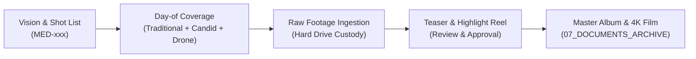

# 📸 Photography, Cinematography & Media Management

**SSOT Scope:** Photography creative briefs, must-have shot lists, crew logistics, raw file ingestion, and album approval pipeline.

---

## Media Workflow Pipeline

---

## Must-Have Coverage Checklists

1. **Pre-Wedding Rites:** Ring exchange, Deva Nimantrana, Mangan Haldi candids.
2. **Bride & Groom Preparation:** Makeup details, jewelry closeups, family emotional moments.
3. **Barat & Baranugam:** Groom entry, welcome aarti, gate fun ceremonies.
4. **Mandap Vedic Liturgies:** Kanyadaan handover, Hastaganthi, Saptapadi, Sindoor Daan, Kanyavida tears.
5. **Stage & Family Portraits:** Segmented family shot lists with coordinator escort.
