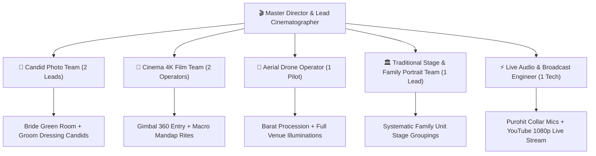
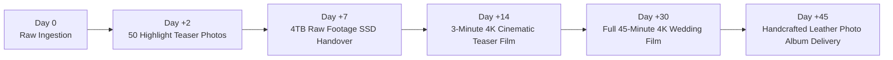

# 📸 Master Photography, Cinematography & Media Production Specification

**Specification Code:** `SPEC-PROC-PHOTO-001`  
**Domain Pillar:** `04_PROCUREMENT_VENDORS`  
**WBS Scope:** `3.3 Cinematography, Photo & Drone Suite`  
**Version:** `1.0.0` (Production Baseline)  
**Parent SSOT:** [`ARCHITECTURE_SPEC.md`](file:///d:/GitHub_Repo/Sree_Krushna/ARCHITECTURE_SPEC.md) & [`MASTER_WBS_BLUEPRINT.md`](file:///d:/GitHub_Repo/Sree_Krushna/00_GOVERNANCE/MASTER_WBS_BLUEPRINT.md)

---

## 1. Media Production Crew Allocation & Technical Rider

### Approved Technical Equipment Rider:
*   **Cameras**: 4× Sony Alpha 7 IV / FX3 Full-Frame Cinema Cameras.
*   **Optics**: G-Master Prime Lenses (24mm f/1.4, 35mm f/1.4, 50mm f/1.2, 85mm f/1.4, 90mm f/2.8 Macro for jewelry & Sindoor).
*   **Stabilization**: 2× DJI RS 3 Pro Gimbals + EasyRig support vests.
*   **Aerial Drone**: DJI Mavic 3 Pro Cine (Triple-camera system, Apple ProRes recording, dual operator setup).
*   **Audio Recording**: 2× Sennheiser EW-DP Wireless Lapel Systems anchored to Chief Purohit.
*   **Storage & Ingestion**: Dual-slot simultaneous recording (ProGrade V90 UHS-II SDXC) + on-site 4TB SanDisk Extreme Pro SSD dual-backup.

---

## 2. Pre-Wedding Shoot Locations & Styling Matrix

| Location Code | Location Name | Visual Atmosphere | Ideal Time & Lighting | Couple Attire Theme |
| :--- | :--- | :--- | :--- | :--- |
| `LOC-01` | **Golden Beach, Puri (Blue Flag)** | Coastal serenity, crashing waves, golden morning surf | Dawn / Golden Hour (05:30 - 08:00 AM) | Flowy Ivory Linen & Pastel Pink Chiffon Saree |
| `LOC-02` | **Konark Marine Drive Pine Forest** | Ethereal woodland, dappled sunlight, pine tree canopy | Morning (09:00 - 11:30 AM) | Bohemian Emerald Green Dress & Casual Linen Shirt |
| `LOC-03` | **Mukteshvara & Parasuramesvara Temples** | 10th-century Kalinga sandstone architecture, sacred carvings | Late Afternoon (15:30 - 17:30 PM) | Pure Handloom Sambalpuri Silk Saree & Matka Silk Kurta |
| `LOC-04` | **Chilika Lake (Mangalajodi / Rambha)** | Tranquil backwaters, sunset reflections, traditional wooden boats | Sunset / Twilight (17:00 - 18:30 PM) | Midnight Blue Evening Gown & Formal Tailored Blazer |

---

## 3. Mandatory Day-of Shot Wishlist (Unrepeatable Milestones)

### Phase A: Preparation & Solos (15:00 - 18:30)
1. **Macro Jewelry Details**: `AST-001` Gold Choker resting on velvet, hallmarked bangles, sacred `AST-003` Mangalsutra.
2. **Sandalwood Forehead Artwork (*Chandan Chita*)**: Close-up of the artist’s brush applying intricate white-sandalwood dots above bride’s eyebrows.
3. **The Mukuta Fitting**: Mother gently tying the silk ribbon of the Cuttack silver *Mukuta* crown (`AST-005`) on the bride.
4. **Groom Safa & Kalgi**: Father/brother pinning the antique ruby *Kalgi* onto the groom’s royal safa.

### Phase B: Barat Procession & Entrance (18:30 - 19:30)
5. **Barat Drone Overview**: 50-meter altitude aerial capture of the brass band, illuminated lights, and high-energy dhol circle.
6. **Baranugam Welcoming Aarti**: Bride’s mother performing the auspicious entrance *Arati* with sacred brass thali (*SAM-004*).
7. **The First Look**: Couple exchanging glances across the flower canopy before the Varamala exchange.

### Phase C: Vedic Mandap Sanctum Rites (19:30 - 22:30)
8. **Kanyadaan Sacred Water Stream**: High-speed (120 fps) slow-motion capture of sacred water flowing through father's hands onto joined couple hands (*Hastaganthi*).
9. **Lajahoma Sacred Flame**: Bride's brother pouring roasted puffed rice (*Khai*) into the consecrated fire with rising golden smoke.
10. **The Seven Steps (*Saptapadi*)**: Low-angle macro focus tracking bride and groom feet stepping sequentially across the 7 betel nut mounds.
11. **The Vermilion Millisecond (*Sindoor Daan*)**: 90mm macro capture at f/2.8 capturing the exact instant vermilion is placed on bride’s parting with golden ring.

---

## 4. Post-Production Deliverables & SLA Pipeline

