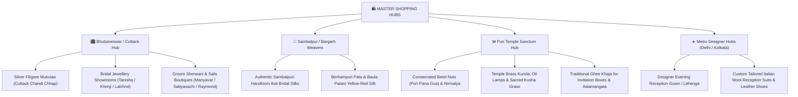

# 🛍️ Master Shopping, Trousseau & Gifting Register (`SHP-###`)

**Specification Code:** `SPEC-PROC-SHOP-001`  
**Domain Pillar:** `04_PROCUREMENT_VENDORS`  
**WBS Scope:** `4.0 Wardrobe, Jewellery & Asset Custody`  
**Version:** `1.0.0` (Production Baseline)  
**Parent SSOT:** [`ARCHITECTURE_SPEC.md`](file:///d:/GitHub_Repo/Sree_Krushna/ARCHITECTURE_SPEC.md) & [`MASTER_WBS_BLUEPRINT.md`](file:///d:/GitHub_Repo/Sree_Krushna/00_GOVERNANCE/MASTER_WBS_BLUEPRINT.md)

---

## 1. Master Shopping Itinerary & Geographic Sourcing Map

Wedding procurement in Odisha requires strategic multi-city sourcing across specialized artisanal clusters:

---

## 2. Itemized Bridal Trousseau Inventory (`SHP-BRD-###`)

| Item ID | Item Category | Description & Sourcing Origin | Target Event | Primary Custodian | Status |
| :--- | :--- | :--- | :--- | :--- | :--- |
| `SHP-B01` | **Sacred Wedding Pata** | Pure Mulberry Silk Sambalpuri Bridal Red Saree with gold temple border (*Bargarh Handloom*) | EVT-004 (Main Wedding) | Sree (Bride) / Mother | **Purchased** |
| `SHP-B02` | **Baula Patani Silk** | Traditional Auspicious Yellow Silk Saree with Crimson Red border for Vedic Rites (*Berhampur*) | EVT-004 (Mandap Entry) | PER-006 (Bride Mother) | **Purchased** |
| `SHP-B03` | **Mehendi Attire** | Bohemian Floral Hand-Embroidered Lehenga in Magenta & Violet with mirror work | EVT-002 (Mehendi Night)| Sree (Bride) | In Alterations |
| `SHP-B04` | **Haldi Cotton Silk** | Lightweight Sunshine Marigold Yellow Chanderi Kurta-Skirt set | EVT-003 (Haldi Snana) | Sree (Bride) | Ready |
| `SHP-B05` | **Grand Reception Gown** | Midnight Blue / Champagne Gold Designer Sequin Lehenga with structured dupatta | EVT-005 (Reception) | Sree (Bride) | Trial Scheduled |
| `SHP-B06` | **Silver Bridal Mukuta**| Handcrafted Cuttack Tarakasi Silver Filigree Crown (`AST-005`) with velvet padding | EVT-004 (Wedding Mandap)| PER-006 (Green Room) | **Box Ready** |
| `SHP-B07` | **Bridal Footwear Suite**| 1 Pair Embellished Bridal Block Heels + 2 Pairs Comfortable Gold Juttis / Flats | All Events | Sree (Bride) | Ready |
| `SHP-B08` | **Vanity & Skincare Kit**| Premium skincare, waterproof luxury cosmetics, emergency touch-up kit, perfumes | Green Room | Sree (Bride) | Packed |

---

## 3. Itemized Groom Wardrobe & Styling Inventory (`SHP-GRM-###`)

| Item ID | Item Category | Description & Sourcing Origin | Target Event | Primary Custodian | Status |
| :--- | :--- | :--- | :--- | :--- | :--- |
| `SHP-G01` | **Vedic Mandap Dhoti** | Pure Matka Silk Unstitched Off-White/Yellow Kurta-Dhoti with consecrated red border | EVT-004 (Mandap Rites) | Krushna (Groom) | **Purchased** |
| `SHP-G02` | **Barat Royal Sherwani**| Royal Ivory Velvet Embroidered Sherwani with Raw Silk Churidar & Embroidered Stole | EVT-004 (Barat Procession)| PER-008 (Groom Lead) | In Alterations |
| `SHP-G03` | **Royal Safa & Kalgi** | Consecrated Royal Burgundy / Ivory Safa with Antique Gold & Ruby *Kalgi* Brooch | EVT-004 (Barat Procession)| PER-008 (Groom Lead) | Ready |
| `SHP-G04` | **Silver Groom Mukuta** | Handcrafted Cuttack Solapitha / Silver Filigree Groom Crown (`AST-006`) | EVT-004 (Mandap Entry) | PER-008 (Green Room) | **Box Ready** |
| `SHP-G05` | **Reception 3-Piece Suit**| Custom-tailored Midnight Blue Italian Wool 3-Piece Tuxedo with silk lapels | EVT-005 (Reception) | Krushna (Groom) | Fitting Complete |
| `SHP-G06` | **Groom Footwear Suite**| Handcrafted Royal Embroidered Leather Mojaris/Juttis + Formal Italian Oxfords | All Events | Krushna (Groom) | Ready |
| `SHP-G07` | **Accessories & Grooming**| Pearl Mala necklace for Sherwani, gold cufflinks, beard grooming kit, luxury cologne | Hotel Suite | Krushna (Groom) | Packed |

---

## 4. Family Gifting, Shagun & Relative Bhaar (`SHP-FAM-###`)

| Item ID | Target Recipient Group | Item Description | Quantity | Sourcing Lead | Status |
| :--- | :--- | :--- | :--- | :--- | :--- |
| `SHP-F01` | **Mothers & Elder Aunts** | Pure Silk Handloom Sambalpuri / Bomkai Sarees | 25 Sets | PER-006 / PER-007 | 18/25 Procured |
| `SHP-F02` | **Fathers & Elder Uncles** | Pure Cotton-Silk Kurta-Pajama Sets with Traditional Stoles | 25 Sets | PER-005 / PER-008 | 20/25 Procured |
| `SHP-F03` | **Sisters & Cousins** | Semi-Stitched Designer Anarkalis / Party Sarees | 20 Sets | Bride / Groom Leads | In Progress |
| `SHP-F04` | **Brothers & Groomsmen** | Coordinated Pastel Kurta-Bundi Jacket Sets | 15 Sets | PER-008 (Groom Lead) | Ordered |
| `SHP-F05` | **Shagun Cash Envelopes**| Gold foil stamped embossed monetary gift envelopes | 200 Units | Family Treasurer | Ready |
| `SHP-F06` | **Astamangala Gift Bhaar**| Brass bell-metal plates (*Kansa Thali*), sweets, sarees, coconuts | 8 Hampers | Parents Council | Sourced |

---

## 5. Sacred Liturgical Samagri Shopping Checklist (`SHP-SAM-###`)

*   [x] **Puri Temple Consecrated Offerings**: 50 Whole dried betel nuts (*Gua*), unbroken rice (*Akshata*), sacred *Nirmalya*.
*   [x] **Sacred Fire Wood (*Samidha*)**: 5 kg dry mango and peepal wood sticks for *Lajahoma*.
*   [ ] **Pure Desi Cow Ghee**: 5 kg organic Vedic cow ghee for Yajna kunda offerings.
*   [ ] **Auspicious Brass Vessels**: 4 Brass *Ghatas / Purna Kumbhas*, 2 Arati Thalis, 10 Brass Diyas.
*   [ ] **Puffed Rice (*Khai / Laja*)**: 3 kg fresh roasted paddy puffed rice for bride's brother fire oblations.
*   [ ] **Sacred Grass (*Kusha*) & Mango Leaves**: Sourced fresh on T-2 days.
