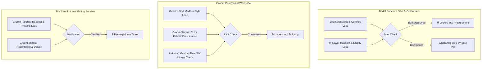

# SPEC-PROC-TROUSSEAU-001: Wedding Trousseau, "Sara" (Bhara) Gifting & Bhubaneswar Shopping Master Specification

**Specification Reference:** `SPEC-PROC-TROUSSEAU-001`  
**Governing Decision:** `AC-DEC-2026-018` / `UI-DEC-2026-014`  
**Standard Reference:** `P-SHOPPING-CONSENSUS-001` (Multi-Stakeholder Trousseau & Gifting Consensus Engine)  
**Parent Framework:** `P-COMPARE-SHARE-001` (Frictionless Deep-Linking & WhatsApp Consensus)  
**Date:** 2026-09-15  
**Execution Horizon:** T-45 Days to T-35 Days (10-Day Runway Gate for In-Laws & Bride Bhubaneswar Visit)  
**Primary Retail Hub:** Bhubaneswar, Odisha (Janpath, Saheed Nagar, Bapuji Nagar, Market Building Unit-2, Master Canteen)  

---

## 1. Executive Summary & Cultural Foundation

In traditional Odia Hindu wedding liturgy, apparel and ornaments are not merely personal accessories; they are consecrated liturgical items central to Vedic rites (*Hastaganthi*, *Saptapadi*, *Laja Homa*, *Kanyadaan*). Furthermore, the **"Sara"** (also known as *Saja* or *Bhara*) represents the reciprocal formal trousseau exchange between the two families (*Barapaksha* and *Kanyapaksha*), symbolizing mutual respect, prosperity, and the welcoming of the bride as *Gruhalakshmi*.

With the Bride's family (*Kanyapaksha*) arriving in Bhubaneswar within the next 10 days, this specification establishes an exhaustive, categorized, and multi-stakeholder consensus roadmap covering:
1. **Category A — Bridal Sanctum Trousseau & Ceremonial Wardrobe**
2. **Category B — Groom Liturgical & Event Wardrobe**
3. **Category C — Bridal Ornaments, Temple Gold & Sacred Silver Tarakasi**
4. **Category D — The "Sara" (Bhara) In-Laws Gifting Bundles & Sisters' Wardrobe**
5. **Spatial Logistics: 5-Day Time-Boxed Bhubaneswar Retail Run Sheet**

---

## 2. Category Breakdown & Itemized Checklist

### Category A: Bridal Sanctum Trousseau & Event Wardrobe

| Item ID | Nomenclature | Liturgical / Event Role | Fabric & Craft Spec | Preferred Color Palette | Bhubaneswar Sourcing Hub | Stakeholder Veto / Approval |
|:---|:---|:---|:---|:---|:---|:---|
| `TRS-BR-01` | **Sacred Vivaha Pata** | Day 2 Hastaganthi & Mandap Ritual (12:00 PM) | Authentic Pure Mulberry Silk Sambalpuri Pata or Khandua Pata with traditional temple *Kumbha* border and bandha motifs | Sacred Crimson Red, Sindoor Red, or Sunset Ochre | Boyanika / Priyadarshini / Sambalpuri Bastralaya | Bride & In-Laws (Mandatory) |
| `TRS-BR-02` | **Bridal Sangeet Lehenga** | Day 1 Sangeet & Performance Night | Heavy silk velvet or raw silk flared lehenga with zardozi/sequin embroidery, lightweight can-can | Midnight Royal Blue, Wine, or Rose Gold | Kalamandir / Manyavar Mohey / Saheed Nagar Boutiques | Bride & Sisters |
| `TRS-BR-03` | **Haldi Handloom Saree** | Day 1 Haldi & Mangala Snana | Lightweight pure cotton-silk handloom Sambalpuri saree with contrast border | Bright Turmeric Yellow / Mustard | Boyanika / Utkalika | Bride |
| `TRS-BR-04` | **Mehendi Festive Outfit** | Day 1 Mehendi Garden Promenade | Floral printed georgette or lightweight organza Lehenga / Anarkali suit (easy sleeve access) | Emerald Green, Mint, or Sage | Amber / Kalamandir / Janpath | Bride & Sisters |
| `TRS-BR-05` | **Reception Grand Saree** | Post-Vivaha Reception & Bhoji | Heavy Kanjeevaram Silk or Banarasi Brocade silk with gold zari border | Deep Rani Pink, Magenta, or Royal Maroon | Kalamandir / Saheed Nagar | In-Laws & Bride |
| `TRS-BR-06` | **Bridal Odhani / Chunri** | Hastaganthi Mandap Veil | Fine red net or silk tissue odhani with gold gota patti and sacred *Subha Vivaha* embroidery | Crimson Red with Gold Zari | Market Building Unit-2 / Kalamandir | Bride & In-Laws |
| `TRS-BR-07` | **Post-Wedding Daily Silks (Set of 5)** | Post-wedding temple visits & relatives' greetings | Soft Bomkai, Berhampuri Pata, and Ikkat silk sarees | Pastel, Mustard, Teal, Coral, Maroon | Boyanika / Master Canteen | Bride & Sisters |

---

### Category B: Groom Liturgical & Event Wardrobe

| Item ID | Nomenclature | Liturgical / Event Role | Fabric & Craft Spec | Preferred Color Palette | Bhubaneswar Sourcing Hub | Stakeholder Approval |
|:---|:---|:---|:---|:---|:---|:---|
| `TRS-GR-01` | **Mandap Pure Silk Dhoti-Kurta** | Day 2 Hastaganthi & Mandap Fire Rituals | Pure unstitched Tussar/Raw Silk Dhoti with red/gold temple border + Pure Silk Kurta | Natural Raw Silk Beige / Cream with Gold Border | Boyanika / Manyavar / Utkalika | Groom & In-Laws |
| `TRS-GR-02` | **Ceremonial Silk Patta (Angavastra)** | Mandatory for Hastaganthi knot tying with Bride's Odhani | 2.5m Pure Silk Stole with woven *Gita Govinda* or floral shloka border | Off-White & Red Zari | Boyanika / Sambalpuri Bastralaya | Groom & In-Laws |
| `TRS-GR-03` | **Barat Royal Sherwani** | Day 2 Morning Barat Procession | Hand-embroidered Raw Silk / Jacquard Sherwani with churidar or flared pajama | Ivory, Antique Gold, or Soft Champagne | Manyavar (Janpath) / Sherwani House (BMC Keshari Mall) | Groom & Sisters |
| `TRS-GR-04` | **Groom Safa (Turban) & Kalgi** | Barat & Arrival Royal Insignia | Chanderi Silk or crushed tissue Safa with jeweled antique feather Kalgi brooch | Royal Peach, Maroon, or Gold | Market Building / Manyavar | Sisters & Groom |
| `TRS-GR-05` | **Barat Royal Stole & Pearl Mala** | Barat Accoutrements | Velvet / Silk embroidered stole + Multi-layered emerald/pearl necklace | Maroon/Emerald + Off-white Pearls | Saheed Nagar Boutiques / Manyavar | Sisters & Bride |
| `TRS-GR-06` | **Sangeet Tuxedo / Bandhgala** | Day 1 Sangeet Concert & Party | Custom-tailored Italian wool Tuxedo or Royal Jodhpuri Bandhgala suit | Midnight Black or Deep Navy | Raymond Custom Tailoring (Janpath) | Groom & Sisters |
| `TRS-GR-07` | **Haldi Kurta-Pajama** | Day 1 Haldi Ceremony | Breathable Lucknowi Chikan or Cotton-Silk Kurta with Churidar | Bright Turmeric Yellow / Gold | Fabindia / Manyavar (Janpath) | Groom |
| `TRS-GR-08` | **Traditional Juttis / Mojaris (2 Pairs)** | Barat & Mandap Footwear | Embroidered leather Mojaris (1 Ceremonial, 1 Comfortable) | Antique Gold & Raw Silk Ivory | Market Building Unit-2 | Groom |

---

### Category C: Bridal Ornaments, Temple Gold & Sacred Silver Tarakasi

| Item ID | Nomenclature | Significance | Material & Craft Spec | Preferred Jeweller Hub | Stakeholder Approval |
|:---|:---|:---|:---|:---|:---|
| `TRS-JW-01` | **Chandra Haar / Temple Choker** | Central bridal neckpiece for Hastaganthi | 22K Hallmarked Gold, handcrafted temple architecture or antique floral motif | Khimji Jewellers (Janpath) / Lalchnd Jewellers | Bride & In-Laws |
| `TRS-JW-02` | **Long Haram (Sita Haar)** | Majestic layered neckpiece | 22K Gold with peacock or lotus emblems, matching choker | Khimji / Lalchnd / Epari Govindam | Bride & In-Laws |
| `TRS-JW-03` | **Matha Patti & Maang Tikka** | Sacred forehead adornment | 22K Gold with dangling pearls and kundan detailing | Lalchnd Jewellers / Tanishq | Bride & Sisters |
| `TRS-JW-04` | **Jhumkas & Kaanbali** | Traditional ear adornments | 22K Gold traditional tiered jhumkas with hair chain support (*Kaan-pasha*) | Khimji Jewellers / Kalyan | Bride |
| `TRS-JW-05` | **Gold Kadas / Bangles (Set of 4-6)** | Auspicious arm adornment | 22K Gold filigree or nakshi kadas paired with red and green glass bangles | Khimji / Epari Govindam | Bride & In-Laws |
| `TRS-JW-06` | **Kamarbandh (Waist Belt)** | Saree draping anchor | 22K Gold or high-grade antique gold-plated filigree waist chain | Lalchnd / Saheed Nagar | Bride & Sisters |
| `TRS-JW-07` | **Silver Bridal Payal (Nupur)** | Sacred ankle bells (Gold strictly forbidden on feet) | Pure 925 Sterling Silver handcrafted Cuttack *Tarakasi* filigree with bells | Tarakasi Artisans / Cuttack / Khimji | Bride & Sisters |
| `TRS-JW-08` | **Silver Bichhiya (Toe Rings - 2 Sets)** | Auspicious symbol of married woman | Pure Sterling Silver traditional Odia engraved toe rings | Khimji / Market Building | Bride & In-Laws |
| `TRS-JW-09` | **Silver Sindoor Farua & Kajal Lata** | Liturgical accessories for Mandap rituals | Pure Sterling Silver carved Sindoor container and ceremonial Kajal Lata | Epari Govindam / Lalchnd | In-Laws & Groom |

---

### Category D: The "Sara" (Bhara) In-Laws Gifting Bundles & Sisters' Wardrobe

| Item ID | Recipient Group | Package Contents | Specification Details | Sourcing Hub | Primary Deciders |
|:---|:---|:---|:---|:---|:---|
| `TRS-SA-01` | **Mother-in-Law (Bride's Mother)** | *Samandhi Vastra* Package 1 | Premium Bomkai Silk or Berhampuri Pata Saree with pure zari pallu + Silver Puja Thali token | Boyanika / Kalamandir | Groom's Parents & Sisters |
| `TRS-SA-02` | **Father-in-Law (Bride's Father)** | *Samandhi Vastra* Package 2 | Pure Silk Tussar Kurta-Dhoti Set OR Premium Raymond Super-120s Italian wool suiting fabric + Silk Shawl | Boyanika / Raymond Shop (Janpath) | Groom's Parents |
| `TRS-SA-03` | **Bride's Immediate Siblings** | Brother/Sister-in-law Hampers | Kurta-Pajama set for Brother; Designer Georgette/Silk Saree or Kurti set for Sister-in-law | Manyavar / Amber (Janpath) | Groom's Sisters |
| `TRS-SA-04` | **Groom's Sisters (2 Sets each)** | Sangeet & Vivaha Outfits | Set 1: Designer Semi-Bridal Lehenga for Sangeet. Set 2: Festive Sambalpuri Pata or Banarasi Silk for Vivaha | Kalamandir / Posh Affair Saheed Nagar | Groom's Sisters |
| `TRS-SA-05` | **Ceremonial Shringar & Kula Trunk** | Ritual Trousseau Presentation | Handcrafted brass or painted bamboo *Kula*, high-grade Sindoor, Alta bottles, Kumkum, Chandan paste, perfume, glass bangles | Market Building Unit-2 | Sisters & In-Laws |
| `TRS-SA-06` | **Dry Fruit & Pitha Trays (5 Baskets)** | Auspicious Hospitality Baskets | Cashews, Almonds, Pistachios, Kishmish, Figs + vacuum-packed traditional Odia *Chhena Poda* & *Arisha Pitha* | Saheed Nagar / Nimapada Sweets / Janpath | Groom's Family |

---

## 3. Spatial Retail Logistics: 5-Day Bhubaneswar Market Run Sheet

```
┌─────────────────────────────────────────────────────────────────────────────┐
│                    BHUBANESWAR WEDDING SHOPPING ITINERARY                   │
├──────────────┬─────────────────────────────┬────────────────────────────────┤
│ DAY & TIME   │ PRIMARY MARKET ZONE         │ FOCUS DELIVERABLES             │
├──────────────┼─────────────────────────────┼────────────────────────────────┤
│ Day 1 (Full) │ Master Canteen & Janpath    │ Boyanika, Sambalpuri Bastralaya│
│ 10:00 - 19:30│ Kharavela Nagar             │ • Sacred Vivaha Pata (TRS-BR01)│
│              │                             │ • Samandhi Silk Sarees (TRS-SA)│
├──────────────┼─────────────────────────────┼────────────────────────────────┤
│ Day 2 (Full) │ Janpath Retail Strip        │ Lalchnd Jewellers, Khimji      │
│ 10:30 - 20:00│ Master Canteen Junction     │ • Chandra Haar & Gold Necklaces│
│              │                             │ • Silver Tarakasi Payal & Nupur│
├──────────────┼─────────────────────────────┼────────────────────────────────┤
│ Day 3 (Full) │ Janpath & Ashok Nagar       │ Manyavar Mohey, Sherwani House │
│ 11:00 - 19:30│ BMC Keshari Mall            │ • Groom Mandap Dhoti-Kurta     │
│              │                             │ • Barat Sherwani, Safa, Mojaris│
├──────────────┼─────────────────────────────┼────────────────────────────────┤
│ Day 4 (Full) │ Saheed Nagar & Bapuji Nagar │ Kalamandir, Boutiques          │
│ 11:00 - 20:00│ Designer District           │ • Sangeet Lehengas (Bride & Sis│
│              │                             │ • Raymond Custom Suiting Cuts  │
├──────────────┼─────────────────────────────┼────────────────────────────────┤
│ Day 5 (Half) │ Market Building (Unit-2)    │ Kala Niketan, Bangle Stalls    │
│ 14:00 - 19:00│ Ashok Nagar Plaza           │ • Shringar Kula, Alta, Bindi   │
│              │                             │ • Trousseau Trunk Packing Kits │
└──────────────┴─────────────────────────────┴────────────────────────────────┘
```

---

## 4. Multi-Stakeholder Consensus Matrix (`P-SHOPPING-CONSENSUS-001`)

To prevent decision deadlock among the bride, groom's sisters, and in-laws, decisions follow a structured approval hierarchy:



---

## 5. Architectural Implementation Contract

1. **Shared Data Layer (`js/shopping-data.js` & `public/js/shopping-data.js`)**:
   - Stores categories, items, sizing schemas, store directories, and real-time consensus counts.
   - Enforces 100% byte-for-byte parity across `js/` and `public/js/`.
2. **Interactive Web Module (`shopping-registry.html` & `public/shopping-registry.html`)**:
   - Strictly scoped CSS (`#shoppingRegistryRoot`, `.shop-*`) compliant with `INC-086`.
   - Touch-optimized for mobile screens (320px to 414px) without horizontal overflow.
   - 1-Click WhatsApp sharing generator copying pre-formatted vote invites to clipboard.
3. **Automated Verification Gate (`scripts/test-shopping-registry.cjs`)**:
   - Validates byte parity, DOM contract integrity, store schemas, and WhatsApp links.
