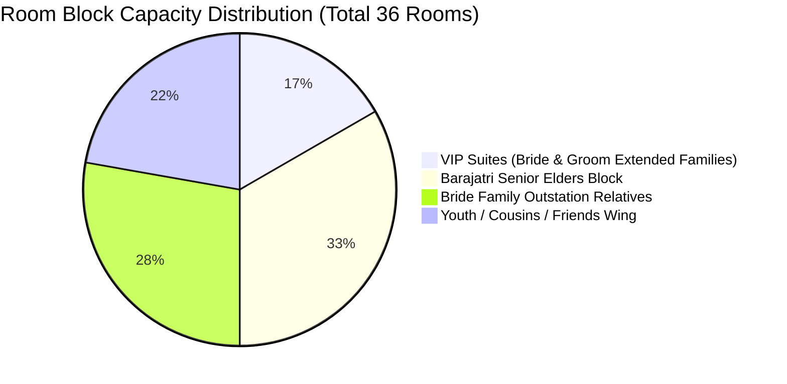

# 🏨 Master Hotel Accommodation & Room Allocation Matrix

**Specification Code:** `SPEC-OPS-ACC-001`  
**Domain Pillar:** `05_OPERATIONS_LOGISTICS`  
**WBS Scope:** `5.3 Hotel Room Block Reservations & Key Allotment`  
**Version:** `1.0.0` (Production Baseline)  
**Parent SSOT:** [`ARCHITECTURE_SPEC.md`](file:///d:/GitHub_Repo/Sree_Krushna/ARCHITECTURE_SPEC.md) & [`MASTER_WBS_BLUEPRINT.md`](file:///d:/GitHub_Repo/Sree_Krushna/00_GOVERNANCE/MASTER_WBS_BLUEPRINT.md)

---

## 1. Property Overview & Capacity Allocation

To ensure seamless hospitality for 350+ guests, a primary block of **36 rooms and suites** has been reserved at Mayfair Convention Hub (`VEN-001`) and Mayfair Lagoon, complemented by a secondary corporate block at Ginger Hotel (`VEN-002`).



---

## 2. Master Room Allocation Register (`ACC-ROOM-###`)

| Room # | Room Category | Property Wing | Assigned Family Unit | Headcount | Key Escort Lead | Early Check-in | Welcome Hamper ID |
| :--- | :--- | :--- | :--- | :---: | :--- | :---: | :--- |
| **Suite 101** | Presidential Suite | Mayfair Main Block | `FAM-001` (Sree — Bride Core Family) | 4 | PER-006 (Bride Mother) | 07:00 AM | `HMP-001 (VIP Silk)` |
| **Suite 102** | Executive Suite | Mayfair Main Block | `FAM-002` (Krushna — Groom Core Family)| 4 | PER-008 (Groom Lead) | 08:00 AM | `HMP-002 (VIP Silk)` |
| **Suite 103** | Deluxe Suite | Mayfair Heritage Wing| `FAM-003` (Bride Maternal Grandparents) | 2 | Hospitality Escort | 09:00 AM | `HMP-003 (Elder Care)`|
| **Suite 104** | Deluxe Suite | Mayfair Heritage Wing| `FAM-004` (Groom Paternal Grandparents) | 2 | Hospitality Escort | 09:00 AM | `HMP-004 (Elder Care)`|
| **Room 201** | Executive Deluxe | Mayfair Lagoon Wing | `FAM-005` (Bride Senior Uncle & Aunt) | 3 | Floor Coordinator | 10:00 AM | `HMP-005 (Standard)` |
| **Room 202** | Executive Deluxe | Mayfair Lagoon Wing | `FAM-006` (Bride Elder Uncle & Aunt) | 3 | Floor Coordinator | 10:00 AM | `HMP-006 (Standard)` |
| **Room 203** | Executive Deluxe | Mayfair Lagoon Wing | `FAM-007` (Groom Senior Uncle & Aunt) | 3 | Floor Coordinator | 10:00 AM | `HMP-007 (Standard)` |
| **Room 204** | Executive Deluxe | Mayfair Lagoon Wing | `FAM-008` (Groom Elder Uncle & Aunt) | 3 | Floor Coordinator | 10:00 AM | `HMP-008 (Standard)` |
| **Room 205-210**| Deluxe Double | Mayfair Garden Wing | `FAM-009..014` (Barajatri Outstation Relatives)| 15 | Transit Lead | 11:00 AM | `HMP-009..014` |
| **Room 301-308**| Deluxe Twin | Mayfair Courtyard | `FAM-015..022` (Bride Outstation Relatives) | 20 | Transit Lead | 11:00 AM | `HMP-015..022` |
| **Room 401-408**| Superior Club | Ginger Hub Wing | `FAM-023..030` (College Friends & Cousins) | 24 | Youth Lead | 12:00 PM | `HMP-023..030 (Snack Kit)`|

---

## 3. In-Room Welcome Hamper Composition (`HMP-###`)

Every reserved room is stocked prior to guest arrival with a curated traditional welcome hamper:

```
┌─────────────────────────────────────────────────────────────┐
│ 🎁 SREE KRUSHNA WELCOME HAMPER BASKET                       │
├─────────────────────────────────────────────────────────────┤
│ 1. Gourmet Odia Snacks: Pure Ghee Khaja, Nimki, Masala Kaju │
│ 2. Hydration Pack: 4× Premium Mineral Water (1L) + ORS      │
│ 3. Emergency Wellness Kit: Paracetamol, Band-aids, Eno      │
│ 4. Ceremonial Essentials: Sandalwood scented soap, wet wipes │
│ 5. Laminated Event Run-Sheet & Coordinator Hotline Pocket Guide│
│ 6. Personal Handwritten Welcome Note signed by the Couple   │
└─────────────────────────────────────────────────────────────┘
```

---

## 4. Hospitality Helpdesk & Concierge SOP

1. **Lobby Welcome Kiosk**: Dedicated registration desk in the main hotel lobby manned by two hospitality coordinators with digital tablets.
2. **Luggage Sanitization & Room Escort**: Bellboy staff assigned to transport luggage directly to assigned rooms using color-coded room tags.
3. **Breakfast & Dining Service**: Buffet breakfast vouchers active from 07:00 to 10:30 AM at the hotel restaurant with specialized Sattvic Jain/Brahmin food counters.
4. **Late Checkout Coordination**: Pre-approved late checkout (until 16:00 PM) for post-wedding departure day.
