# 📐 Architecture Specification: Sree Krushna Marriage OS

**Specification Code:** `SPEC-MARRIAGE-ARCH-002`  
**Version:** `2.0.0` (Production-Grade Control Plane Baseline)  
**Status:** CANONICAL ARCHITECTURAL SPECIFICATION & SSOT  

---

## 1. Domain Entities & Identifier Registry

Every entity within the repository is identified by a standardized, padded 3-digit ID prefix.

| Entity Type | Prefix | Schema / Canonical Directory | Description |
| :--- | :--- | :--- | :--- |
| **Event** | `EVT-###` | `01_TIMELINE_EVENTS/` | A discrete temporal gathering / milestone |
| **Ritual** | `RIT-###` | `02_RITUALS_CULTURE/specs/` | A cultural, religious, or ceremonial liturgy |
| **Person** | `PER-###` | `03_PEOPLE_GUESTS/directory/` | A unique human entity (guest, family, coordinator, VIP) |
| **Family Unit** | `FAM-###` | `03_PEOPLE_GUESTS/families/` | A household invitation & accommodation grouping |
| **Venue** | `VEN-###` | `05_OPERATIONS_LOGISTICS/venues/` | A physical location, hall, or accommodation property |
| **Vendor** | `VDR-###` | `04_PROCUREMENT_VENDORS/vendors/` | A commercial service provider or supplier |
| **Contract** | `CTR-###` | `04_PROCUREMENT_VENDORS/contracts/` | A formal service agreement with scope & milestones |
| **Task** | `TSK-###` | `00_GOVERNANCE/tasks/` | An atomic, actionable work item with an owner |
| **Decision** | `DEC-###` | `00_GOVERNANCE/decisions/` | A major architectural, financial, or family choice |
| **Payment** | `PAY-###` | `06_FINANCE_COMMERCIALS/ledger/` | A monetary transaction record with receipt reference |
| **Risk** | `RSK-###` | `00_GOVERNANCE/risks/` | An identified vulnerability and mitigation plan |
| **Precious Asset**| `AST-###`| `04_PROCUREMENT_VENDORS/attire_and_jewellery/` | Gold/Jewellery custody record & locker transfer |
| **Change Event**| `CHG-###` | `00_GOVERNANCE/` | Formal change impact propagation record |
| **Operational Gate**| `GATE-##`| `05_OPERATIONS_LOGISTICS/day_of_run_sheets/` | Disruption-resistant synchronization gate |
| **Contingency Playbook**| `CP-###`| `00_GOVERNANCE/contingency_playbooks/` | Pre-approved SOP for event disruptions |

---

## 2. The Cross-Cutting Control Plane Architecture

```mermaid
flowchart TD
    M["💍 MARRIAGE OS"]

    M --> CP["CONTROL PLANE"]

    CP --> IAM["Identity & Access (RBAC + SoD)"]
    CP --> SSOT["Attribute Ownership Matrix"]
    CP --> DEC["Formal Decisions (DEC)"]
    CP --> CHG["Change Control & Propagation (CHG)"]
    CP --> DEP["Dependency Graph"]
    CP --> RSK["Risk & Contingency Playbooks (CP-001..013)"]
    CP --> AST["Precious Asset Custody (AST)"]
    CP --> AUD["Audit / Immutable History"]
    CP --> CMD["Operational Command & Gates (GATE-01..04)"]

    M --> DOM["9 DOMAIN PILLARS"]

    DOM --> GOV["00_GOVERNANCE"]
    DOM --> EVT["01_TIMELINE_EVENTS"]
    DOM --> RIT["02_RITUALS_CULTURE"]
    DOM --> PER["03_PEOPLE_GUESTS"]
    DOM --> VDR["04_PROCUREMENT_VENDORS"]
    DOM --> OPS["05_OPERATIONS_LOGISTICS"]
    DOM --> FIN["06_FINANCE_COMMERCIALS"]
    DOM --> DOC["07_DOCUMENTS_ARCHIVE"]
    DOM --> REF["08_RESEARCH_REFERENCE"]

    EVT --> GATE["Operational Gates"]

    GATE --> TRK["6 Multi-Track Execution Swimlanes"]
    TRK --> B["Bride Team"]
    TRK --> G["Groom Team"]
    TRK --> P["Vedic Purohits"]
    TRK --> H["Hospitality & Food"]
    TRK --> M2["Photo & Media"]
    TRK --> F["Fleet & Custody"]

    CP --> VIEWS["Presentation & Derived Views"]
    VIEWS --> DASH["Executive 1-Page Summary (BMS)"]
    VIEWS --> CON["Interactive Standalone Swimlanes (UG-Farmhouse)"]
    VIEWS --> RUN["Role-Scoped Run Sheets & Pocket Cards"]
```

---

## 3. Single Source of Truth (SSOT) & Attribute Ownership

Authoritative attribute mapping is governed by [`00_GOVERNANCE/attribute_ownership_matrix.md`](file:///d:/GitHub_Repo/Sree_Krushna/00_GOVERNANCE/attribute_ownership_matrix.md):
- **Vendor Cost & Terms:** Authored strictly in `04_PROCUREMENT_VENDORS/contracts/CTR-xxx.md`.
- **Payment Outflow:** Authored strictly in `06_FINANCE_COMMERCIALS/ledger/PAY-xxx.md`.
- **Master Date & Muhurat:** Authored strictly in `01_TIMELINE_EVENTS/master_timeline.md`.
- **Guest Contact & RSVP:** Authored strictly in `03_PEOPLE_GUESTS/directory/PER-xxx.md`.
- **Liturgical Sequence & Samagri:** Authored strictly in `02_RITUALS_CULTURE/specs/RIT-xxx.md`.

---

## 4. Fine-Grained Role-Based Access Control (RBAC) & Separation of Duty

Permissions are evaluated across **Role $\times$ Domain $\times$ Action $\times$ Object $\times$ Sensitivity**, governed by [`00_GOVERNANCE/authority_and_access_matrix.md`](file:///d:/GitHub_Repo/Sree_Krushna/00_GOVERNANCE/authority_and_access_matrix.md):
- **Tier 1 (Core Couple):** Full Master Control, Unrestricted Ledger, Gold Custody, Decision Freezing.
- **Tier 2 (Parents & Planning Council):** Milestone Roadmaps, Category Budgets, Co-Decision Sign-off.
- **Tier 3 (Functional Leads & Coordinators):** Scoped Run-Sheets, Assigned Tasks, Samagri Custody (No overall financial visibility).
- **Tier 4 (Guests & Relatives):** Personal Itinerary, Venue Maps, Attire Themes, Room Allocation.

---

## 5. Operational Gates & Disruption Recovery

Live event handshakes are modeled as **Operational Gates** (`GATE-01` to `GATE-04`) with defined:
1. **Planned vs Earliest vs Drop-Dead Timestamps**
2. **Preconditions & Required Witnesses**
3. **Go / No-Go Decision Authority**
4. **Delay Thresholds & Automatic Activation of Playbooks (`CP-001` through `CP-013`)**

---

## 6. Web Application Architecture & Sub-Engine Module Boundaries

The web control plane (`public/`) follows strict separation between shell orchestration and feature engines:
1. **Host App Shell (`public/js/app.js`):** Acts exclusively as the top-level lifecycle coordinator (Authentication, Tab Navigation, Theme Toggling, Drawer Mounting, GA4 Web Vitals). It MUST NEVER contain duplicate rendering logic of sub-modules (`STD-MOD-SHADOW-001`).
2. **5-Zone Precedence DAG Studio (`public/js/modules/dopkos-engine.js`):** Standalone canonical engine for `#tab-dopkos` (Executive HUD, Stage Strip, Infinite Multi-Track Swimlane, Bézier Precedence DAG, Slide-over Inspector, Command Console Sheet) and `#tab-planning` (Planning Suite 2D Matrix).
3. **CSS Scoping Isolation (`public/css/dopkos-engine.css`):** All studio styling is 100% namespace-scoped under `#tab-dopkos #dopkos-5zone-frame`. Global element resets (`*`, `html`, `body`) are strictly forbidden (`STD-CSS-SCOPE-001`).
4. **Localhost Service Worker Bypass (`public/sw.js`):** Development on `localhost` / `127.0.0.1` automatically bypasses cache to guarantee zero stale cache during development cycles (`STD-PWA-DEV-001`).
5. **Sub-Engine Shadowing Guard (`STD-MOD-SHADOW-001`):** Sub-engine modules must not duplicate shell controllers. Notice: Universal Intake & Change Request dispatching is canonically unified in `public/js/app.js` and backed by `public/js/modules/firestore-client.js`; legacy `intake-engine.js` is deprecated and shadowed.

---

## 7. Real-Time Cloud Synchronization & Data Layer (SK-004)

To enable remote collaboration between distributed family leads (e.g. bride & groom across different cities/venues), mutable operational data is synchronized in real time via Firebase Firestore with IndexedDB offline caching (`persistentLocalCache`):

| Firestore Collection | Document ID | Purpose & Data Model |
| :--- | :--- | :--- |
| `change_requests` | `CR-###` (e.g. `CR-004`) | Digital proposals & change requests (`title`, `targetDomain`, `intentType`, `submitterEmail`, `submittedAt`, `status`, `payload`). Gated against immutable field tampering and hard-denied deletions for audit trail preservation. |
| `task_status` | `TSK-###` (matches `marriage-state.js`) | Mutable overlay for operational tasks (`status`, `done`, `checklist`, `updatedBy`, `updatedAt`). Static WBS hierarchy and dependencies remain git-tracked in `marriage-state.js`. |
| `counters/change_requests` | `change_requests` (singleton) | Atomic monotonic sequence (`seq`) incremented via Firestore transactions (`runTransaction`), preventing multi-device ID collisions. |

**Client Bridge (`public/js/modules/firestore-client.js`):**
- Uses `initializeFirestore(app, { localCache: persistentLocalCache() })` to provide automatic IndexedDB offline-readiness.
- Exposes `window.fsDispatchChangeRequest`, `fsUpdateChangeRequestStatus`, `fsListenChangeRequests`, `fsSetTaskStatus`, and `fsListenTaskStatus` for UI script consumption without requiring ES module refactoring across the entire web app.

---

## 8. Multi-Viewport Responsive Modernization & Modular Layout Architecture (SK-005)

**Ruling:** `AC-DEC-2026-034` / `UI-DEC-2026-030` (`P-MULTI-VIEWPORT-RESPONSIVE-001`)  
**SSOT Specification:** [`docs/references/SPEC-ARCH-MUTABLE-TABLE-001.md`](docs/references/SPEC-ARCH-MUTABLE-TABLE-001.md)

To support executive operations across diverse mobile, tablet, laptop, and ultra-wide form factors without visual degradation:
1. **Header Saturation Gate (`#stickyHeaderShell` & `#headerQuickActionsPopover`):**
   - On compact viewports ($\le 360\text{px}$), secondary buttons (Cockpit, Decisions, Shopping, Share, Intake) collapse automatically into a single `[⚡ Actions ▾]` popover button with 3-trigger dismissibility (`INV-LIFECYCLE-03`).
2. **Mutable Table Dual-Mode Card/Table Reflow (`#shoppingRegistryFrame` / `FKL-DI-022`):**
   - On desktop ($>768\text{px}$), renders fluid table with sticky frozen column `th/td:first-child` (`position: sticky; left: 0; z-index: 2;`).
   - On mobile ($\le 768\text{px}$), collapses `tr` into self-contained vertical card pods with `td::before { content: attr(data-col-label); }`, preserving real-time inline editing without horizontal panning.
3. **SDCA At-Rule Scoping Invariant (`INV-SDCA-004` / `FKL-AL-006`):**
   - SDCA build compilers (`cockpit_src/build.cjs`, `shopping_src/build.cjs`, `decision_registry_src/build.cjs`) scope CSS partials using `/^@(media|container|supports|layer)[^{]*\{/` to prevent `@container` queries from being mangled with parent selector prefixes.
4. **Fluid Vedic Liturgy Grid (`#tab-rituals`):**
   - Auto-fit ritual cards (`repeat(auto-fit, minmax(min(100%, 280px), 1fr))`) and accessible touch-target feedback (`min-height: 44px; touch-action: manipulation;`).
5. **DO-PKOS Dynamic Viewport Scaling (`#tab-dopkos`):**
   - Dynamic viewport calculation (`height: calc(100dvh - 110px) !important; min-height: 480px !important;` at $\le 768\text{px}$), wrapping HUD stats, and horizontal touch-scrolling toolbar.
