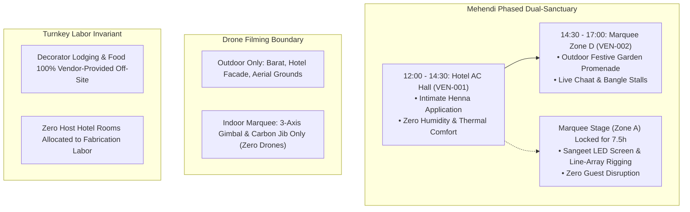

# 🏛️ Architecture Council Review & Certified Decision: Open-Ground Venue Operations & Mehendi Strategic Split

**Decision ID:** `AC-DEC-2026-007`  
**Council:** Architecture Council  
**Session Type:** FULL  
**Date:** 2026-09-13  
**Status:** **APPROVED & CERTIFIED**  
**Governance Standard:** `SOP-WFL-ARCH-COUNCIL-001` (Council Deliberation Protocol v1.0 & RFG-001)  
**Target Specifications:**  
- `01_TIMELINE_EVENTS/master_timeline.md` (`EVT-002`)  
- `04_PROCUREMENT_VENDORS/decor_and_design/open_ground_marquee_modular_base_spec.md` (`SPEC-PROC-DECOR-MARQUEE-001`)  
- `05_OPERATIONS_LOGISTICS/venues/open_ground_spatial_zoning.md` (`SPEC-OPS-VENUE-GROUND-001`)  
- `04_PROCUREMENT_VENDORS/contracts/DECORATOR_RFP_RIDER_GROUND_MARQUEE.md` (`CTR-DECOR-RIDER-001`)  
**Parent Hubs:** `01_TIMELINE_EVENTS/HUB.md`, `04_PROCUREMENT_VENDORS/HUB.md`, `05_OPERATIONS_LOGISTICS/HUB.md`

---

## 1. Executive Summary & Problem Framing

The Architecture Council was convened to evaluate three pending strategic and operational forks surrounding the Open-Ground Marquee (`VEN-002`) and Hotel Venue (`VEN-001`):
1. **Decision 1 (Mehendi Venue Split):** Should Mehendi (`EVT-002`) be held in the air-conditioned hotel banquet hall (`VEN-001`), the open-ground marquee (`VEN-002`), or an engineered hybrid arrangement?
2. **Decision 2 (Aerial Drone Filming Safety):** How to reconcile high-end 4K drone videography (`SPEC-PROC-PHOTO-001`) with internal marquee obstacles (chandeliers, drapes, havan flames)?
3. **Decision 3 (Decorator Fabrication Crew Boarding):** Establishing contractual boundaries for vendor crew lodging and food without inflating host hotel room costs.

---

## 2. Independent Council Member Deliberations

### Seat 1: The Operational Flow & Timeline Auditor (`change-impact-analysis`)
- **Deliberation on Mehendi:** A naive approach of holding all Mehendi on the open ground creates an irreconcilable timeline collision:
  $$\text{Haldi concludes: 10:00 AM} \longrightarrow \text{Mehendi: 12:00–16:00 PM} \longrightarrow \text{Sangeet starts: 19:00 PM}$$
  The technical crew requires **minimum 6 to 8 continuous hours** to rig the 24ft P3 LED screen, focus 32 DMX moving heads, and tune the digital line-arrays for Sangeet. If Mehendi occupies the marquee from 12:00 to 16:00, the crew is forced to perform loud acoustic checks and heavy mechanical rigging directly over seated guests, or rush Sangeet setup into an impossible 2-hour panic window (17:00–19:00).
- **Finding:** Moving the initial henna application indoors to `VEN-001` liberates the open ground for technical production.

### Seat 2: The Thermal & Human Ergonomics Auditor (`systematic-debugging`)
- **Deliberation:** Rayagada afternoon temperatures peak between 12:30 and 15:30 (33°C–35°C). Henna application requires brides and bridesmaids to sit completely motionless for 3 to 4 hours. Evaporative desert coolers in Zone D introduce 80%+ relative humidity, which impedes henna paste drying and causes perspiration that smears intricate bridal patterns.
- **Finding:** The bride and close family must be in a hermetically sealed, dry, air-conditioned environment (`VEN-001` Hotel Hall) during active application.

### Seat 3: The Liturgical & Safety Integrity Auditor (`02_RITUALS_CULTURE` & `RSK-001`)
- **Deliberation on Drone Filming:** Flying a 900g DJI Mavic 3 Pro Cine with rotating carbon-fiber blades inside a 16ft-high marquee with suspended fabric swags, crystal chandeliers, and elderly guests is a catastrophic physical hazard. Propeller downdrafts also disturb delicate flower arrangements and blow sparks from early Mandap preparations.
- **Ruling:** **Zero indoor drone flights inside the marquee.** Aerial drones are restricted strictly to outdoor grounds, Barat processions, and hotel facade overviews. Indoor footage must be captured via 3-axis motorized gimbals and telescopic carbon-fiber jibs.

### Seat 4: The Commercial & Procurement Auditor (`table-schema-documentation` & `RFG-001`)
- **Deliberation on Crew Boarding:** In Rayagada, decorators often claim "unexpected crew lodging expenses" post-event. Booking 6–8 hotel rooms for 20 fabrication laborers at ₹3,000/night incurs ₹36,000–₹48,000 of unbudgeted leakage.
- **Ruling:** Enforce the **Turnkey Self-Sufficiency Standard** in `CTR-DECOR-RIDER-001`: The decorator is contractually responsible for all labor boarding, meals, and local transport off-site. The host provides zero hotel rooms for fabrication crew.

### Seat 5: The Dissenter Seat (Constructive Challenge)
- **Challenge:** *"If Mehendi is moved indoors to the hotel, why did we spend ₹2.4L building a 6,500 sq ft luxury open-ground marquee with garden cabanas?"*
- **Resolution:** We do not abandon the outdoor marquee. The Council certifies the **"Phased Dual-Sanctuary" Hybrid Model (Option 1C)**:
  - **Phase 1 (12:00 – 14:30):** Intimate Henna Application in Hotel AC Hall (`VEN-001`). Calm, chilled, sitar music, high-tea.
  - **Phase 2 (14:30 – 17:00):** Festive Outdoor Promenade in Marquee Zone D (`VEN-002`). Live chaat stalls, bangle bars, photo-op booths, and folk dance.
  - **Stage Isolation:** Zone A (Main Stage) remains screened off behind heavy acoustic drapes, allowing the Sangeet technical production crew to complete LED and sound checks without guest disruption.

---

## 3. Architecture Council Certified Rulings

1. **Ruling 1 (Mehendi Architecture):** Adopt the **Phased Dual-Sanctuary Hybrid Model**. Update `master_timeline.md` (`EVT-002`) and `open_ground_spatial_zoning.md`.
2. **Ruling 2 (Drone Aviation Protocol):** Formalize the **Outdoor-Only Drone Invariant** in `SPEC-PROC-PHOTO-001` and `open_ground_spatial_zoning.md`.
3. **Ruling 3 (Labor Commercial Scope):** Mandate **Vendor Turnkey Labor Self-Sufficiency** in `CTR-DECOR-RIDER-001`.

---

## 4. Referral Note to UI/UX Council

> **Architecture Referral Note to UI/UX Council (`AC-REF-2026-001`):**  
> The Architecture Council has certified the Phased Dual-Sanctuary Mehendi model, the Outdoor-Only Drone safety rule, and Turnkey Labor Invariant.  
> The UI/UX Council is instructed to:
> 1. Ingest these operational parameters into `public/decorator-cockpit.html` and root `decorator-cockpit.html`.
> 2. Apply **`impeccable` craft standards** to the Cockpit interface: elevate visual hierarchy, refine responsive layout for 300px–768px on-ground tablet usage, and harden the printable Tender Annexure (`#tenderDocContainer`) into an authentic, executive-grade legal contract sheet.
