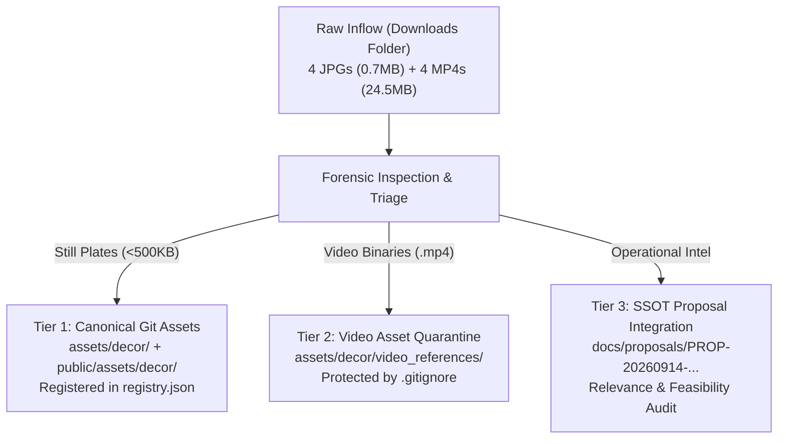

# 🏛️ Architecture & UI Council Review: Reference Media Ingestion & Asset Governance Pipeline

**Decision ID:** `AC-DEC-2026-013` / `UI-DEC-2026-009`  
**Council:** Architecture Council + UI/UX Council (Joint Session)  
**Session Type:** FULL (Reversibility=YES [Git packfile history is irreversible without filter-repo], Boundary=YES [Touches Git asset tracking, SDCA Lookbook Registry, and Proposal SSOT], Disagreement=YES [Direct git binary commit vs. external decoupling])  
**Date:** 2026-09-14  
**Status:** **APPROVED & CERTIFIED**  
**Governing Standard:** `SOP-WFL-ARCH-COUNCIL-001` + `P-ASSET-GOV-001`  
**Target Surfaces:** `assets/decor/`, `public/assets/decor/`, `assets/decor/registry.json`, `.gitignore`, `docs/proposals/PROP-20260914-ideation-intake.md`, `User_Created/Discussion Threads/Council/Council_Ledger.md`

---

## 0. Grounding Snapshot (RFG-001 Maturity Anchor)

Pre-launch, single-family wedding operations repository. Static HTML + PWA architecture deployed via Firebase Hosting and GitHub Pages. 
The repository tracks code, configuration, SSOT documentation, and lightweight visual assets. 
A batch of 8 external inspiration media files (4 high-res JPG images ~0.7MB, 4 MP4 video clips ~24.5MB, total ~25.2MB) was provided from local downloads for ingestion, evaluation, and decorator planning.

---

## Phase 0: Evidence Collection & Git Infrastructure Audit

1. **Git Packfile Risk**: Git stores every revision of binary files as full blobs. Committing 25MB of MP4 video files directly into Git tracking bloats the permanent `.git` history, swells clone times for all collaborators, risks hitting GitHub's 100MB file limit or 2GB repository ceiling, and violates web deployment performance standards (`SPEC-SAP-DEPLOY-GATE-001`).
2. **Web Deployment & Service Worker Constraints**: `sw.js` and `public/sw.js` precache application assets. Caching multi-megabyte video streams in a PWA cache quota will fail on mobile devices and exhaust IndexedDB/CacheStorage quotas.
3. **Decorator Cockpit Contract**: `assets/decor/registry.json` and `cockpit_src/data/canonical_plates.json` require 16:9 or 4:3 still photographs (`.jpg`/`.webp`) and scalable vector blueprints (`.svg`) for instant Lightbox modal rendering and printable A4 tender annexures. Monolithic MP4s cannot serve directly as printable plate annexures.
4. **Current `.gitignore` State**: Only ignores `node_modules/`, `.firebase/`, `*.log`, and `scratch/`. It does **not** protect against accidental commits of heavy `.mp4` video files.

---

## Phase 1: Evaluation of Available Ingestion Options

| Criterion | Option 1: In-Situ Downloads Inspection | Option 2: Monolithic Direct Git Commit | Option 3: Raw Research Dump (`08_RESEARCH_REFERENCE`) |
| :--- | :--- | :--- | :--- |
| **Asset Location** | Files remain in `C:\Users\TEMP\Downloads\` | All 8 files copied directly into `assets/decor/` | All 8 files copied into `08_RESEARCH_REFERENCE/inspiration/` |
| **Git Hygiene** | **Excellent**: 0 bytes added to repo | **Hazardous**: Bloats Git packfile by 25.2MB permanently | **Hazardous**: Bloats Git packfile by 25.2MB |
| **Cockpit Integration** | **Zero**: Cockpit cannot reference external `C:\Users` paths | **High**: Files exist in repo, but MP4s break plate schema | **Low**: Orphan research files detached from SDCA |
| **Reproducibility** | **Fragile**: Files lost if user cleans Downloads | **Permanent**: Tracked in Git history | **Permanent**: Tracked in Git history |
| **Council Verdict** | **REJECTED**: Leaves operational gap | **REJECTED**: Violates binary asset hygiene | **REJECTED**: Fails to bridge into decorator topics |

---

## Phase 2: The Architecture Council Certified Hybrid Approach: *Three-Tier Asset Governance Pipeline (`P-ASSET-GOV-001`)*

To solve all underlying issues without leaving any gaps, the Council mandates a **Three-Tier Asset Governance Pipeline**:

### 1. Tier 1: Canonical Git Asset Ingestion (Still Plates)
- All 4 JPG images are standardized with semantic, kebab-case filenames and copied into `assets/decor/` and `public/assets/decor/`:
  1. `assets/decor/tunnel/photo-wedding-trail-fairylight-canopy.jpg` (Aisle Fairy-Light Tunnel)
  2. `assets/decor/mandap/photo-royal-telugu-vedic-mandap-carved.jpg` (Carved Temple Pillars Mandap)
  3. `assets/decor/mandap/photo-suspended-lotus-mandap-dome.jpg` (Suspended Lotus Altar)
  4. `assets/decor/sangeet/photo-midnight-blooms-mirror-stage.jpg` (Midnight Blooms Garden Stage)
- Formally registered as Canonical Plates in `assets/decor/registry.json` (`PLATE-07`, `PLATE-08`, `PLATE-09`, `PLATE-10`) for use in the Decorator Cockpit Lightbox and lookbook.

### 2. Tier 2: Video Asset Quarantine & Local Staging
- Heavy MP4 video files are placed in `assets/decor/video_references/` to ensure they are safely stored in the project workspace for local inspection and playback.
- **Rule `P-GIT-MEDIA-001`**: `.gitignore` is immediately updated to exclude `assets/decor/video_references/*.mp4` and `*.mp4`, strictly safeguarding Git packfiles from binary bloat and deployment cache failure.

### 3. Tier 3: Relevance Audit & Proposal Integration
- Detailed operational evaluation documented in `docs/proposals/PROP-20260914-ideation-intake.md` breaking down:
  - **What Fits**: Telugu Vedic ritual authenticity, German marquee ceiling draping, fairy light tunnel feasibility.
  - **What Does Not Fit**: Daytime colored smoke shells indoors, slippery balloon surfaces on dance stages.
  - **Decorator Tender Rider Clauses**: Precise technical questions for vendor meetings.

---

## Phase 3: Formal Council Ruling & Certifications

1. **CERTIFIED**: Enforce `P-ASSET-GOV-001` across the repository.
2. **CERTIFIED**: Add `assets/decor/video_references/*.mp4` to `.gitignore`.
3. **CERTIFIED**: Ingest the 4 still plates into `assets/decor/` and `public/assets/decor/`.
4. **CERTIFIED**: Register `PLATE-07` through `PLATE-10` in `assets/decor/registry.json`.
5. **CERTIFIED**: Append the comprehensive 8-item visual relevance audit to `docs/proposals/PROP-20260914-ideation-intake.md`.
