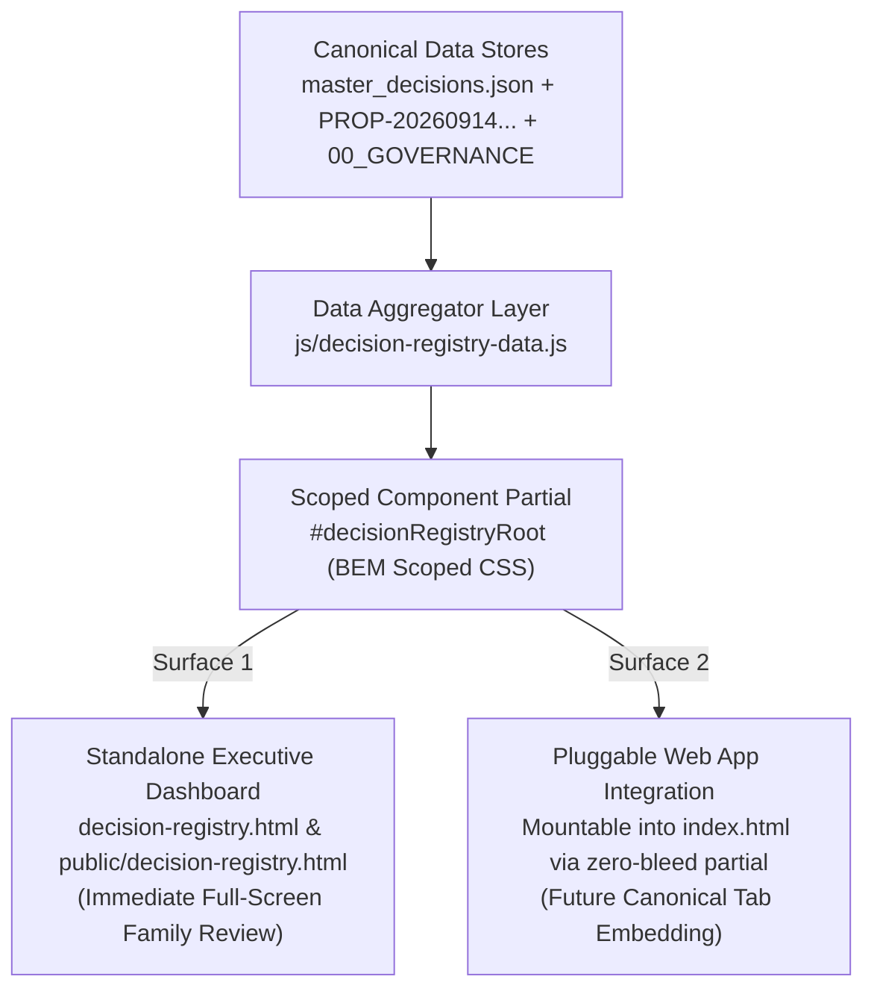

# 🏛️ Architecture & UI Council Review: Unified Pending Decision Registry & Idea Incubator Executive Dashboard

**Decision ID:** `AC-DEC-2026-014` / `UI-DEC-2026-010`  
**Council:** Architecture Council + UI/UX Council (Joint Session)  
**Session Type:** FULL (Reversibility=YES [State aggregation contract affects decision tracking and future app tab routing], Boundary=YES [Unifies Master Decisions JSON, Governance Docs, and Proposal Ledger into an embeddable/standalone UI surface], Disagreement=YES [Standalone HTML file vs. Cockpit sub-workspace vs. Canonical App Tab])  
**Date:** 2026-09-14  
**Status:** **APPROVED & CERTIFIED**  
**Governing Standard:** `SOP-WFL-ARCH-COUNCIL-001` + `P-DECISION-REG-001` + `INC-086`  
**Target Surfaces:** `decision-registry.html`, `public/decision-registry.html`, `js/decision-registry-data.js`, `cockpit_src/data/master_decisions.json`, `docs/proposals/PROP-20260914-ideation-intake.md`, `User_Created/Discussion Threads/Council/Council_Ledger.md`

---

## 0. Grounding Snapshot (RFG-001 Maturity Anchor)

Pre-launch single-family wedding planning repository. The couple and key family members need a single, executive-grade window to review all pending choices:
- 6 Pending Decorator Choices (e.g. Master Color Palette `DEC-08`, Material Discipline `DEC-09`, Floral Reuse `DEC-12`, Furniture `DEC-13`, Stalls `DEC-15`, Event Transformation `DEC-16`).
- 4 Vendor Deliverables awaiting submission (`DEC-02`, `DEC-05`, `DEC-19`, `DEC-20`).
- 7 Incubated Experiential Ideas (`PROP-01` to `PROP-07`) and 8 Reference Media plates (`PLATE-09` to `PLATE-12`).
- Institutional Governance decisions (`00_GOVERNANCE/decisions/`).

Currently, these live fragmented across three separate silos: `master_decisions.json`, `docs/proposals/`, and markdown files in `00_GOVERNANCE/`. The family has no single screen to evaluate what is unresolved before the upcoming vendor negotiations.

---

## Phase 0: Evidence Collection & Boundary Auditing

1. **Fragmented SSOT State**:
   - `cockpit_src/data/master_decisions.json`: Holds 20 sequential decor decisions (10 locked, 6 pending, 4 vendor).
   - `docs/proposals/PROP-20260914-ideation-intake.md`: Holds 7 high-ROI experiential ideas and 8 audited media references.
   - `00_GOVERNANCE/decisions/`: Holds formal governance records (`DEC-002`).
2. **INC-086 CSS Scoping Invariant**:
   - Monolithic ports without scoped root selectors bleed global CSS resets (`html, body { overflow: hidden; font-size: 13px; }`) into host SPAs.
   - Any new dashboard meant to plug into `index.html` as well as run standalone MUST namespace all styling under a dedicated root ID (`#decisionRegistryRoot`) and avoid untargeted tag selectors.
3. **PWA & Offline Resilience**:
   - Must operate 100% client-side with zero external CDN dependencies or fragile runtime bundlers, using existing local fonts and design tokens (`--theme-*`).
   - State mutations (e.g., selecting options or promoting an idea) must persist to `localStorage` with a clean JSON export/import capability.

---

## Phase 1: Comparative Evaluation of Available Options

| Evaluation Axis | Option 1: Standalone HTML File Only | Option 2: Cockpit Sub-Workspace Mode | Option 3: Direct Main App Tab (`tab-decisions`) |
| :--- | :--- | :--- | :--- |
| **Primary Scope** | Independent file `decision-registry.html` | Extra tab inside `decorator-cockpit.html` | First-class tab in `index.html` |
| **Host Experience** | Immediate executive window for family review | High friction (mixes negotiation battlecards with broad family ideas) | Requires modifying `FEATURE_CATALOG.json` and nav dock before content is settled |
| **Embeddability** | Zero if written with monolithic un-scoped CSS | High within SDCA only | High within SPA only |
| **Decoupling** | **High**: Zero risk to production SPA | **Low**: Coupled to 519KB cockpit compiler | **Low**: Coupled to main routing monolith |
| **Council Verdict** | **REJECTED**: Missing embed contract | **REJECTED**: Pollutes decorator negotiation tool | **REJECTED**: Premature production navigation change |

---

## Phase 2: The Architecture Council Certified Hybrid Approach: *Dual-Surfacing Scoped Decision Engine (`P-DECISION-REG-001`)*

To achieve complete zero-gap synergy without compromising production stability or coupling, the Council mandates the **Dual-Surfacing Scoped Decision Engine**:

### Key Architectural Invariants:
1. **Single-Window Executive HUD**:
   - High-contrast KPI banner displaying: Total Items, Pending Choices, Vendor Deliverables, Incubated Ideas, and Certified/Locked Decisions.
   - Quick Filter Pills: `[All Pending]`, `[Decor & Stage]`, `[Idea Incubator]`, `[Vendor Action]`, `[Certified Locked]`.
2. **Unified Item Model**:
   - Normalizes disparate items into a shared card schema: `id`, `category`, `domainIcon`, `title`, `dilemma`, `benchmark`, `options`, `status`, and `actionType`.
3. **INC-086 Strict CSS Isolation**:
   - 100% of stylesheet rules scoped strictly inside `#decisionRegistryRoot` or `.dr-*` namespaces.
   - Zero root `body` or `html` resets, ensuring 100% plug-and-play embeddability into `index.html` with zero styling bleed.
4. **Dual-Distribution Byte Parity**:
   - Built into root `decision-registry.html` and mirrored into `public/decision-registry.html` for dev-server and Firebase Hosting parity.

---

## Phase 3: Formal Council Ruling & Certifications

1. **CERTIFIED**: Adopt `P-DECISION-REG-001` as the canonical standard for decision aggregation.
2. **CERTIFIED**: Create `js/decision-registry-data.js` containing normalized master data (Decor Decisions + Idea Incubator Proposals + Governance records).
3. **CERTIFIED**: Build `decision-registry.html` and `public/decision-registry.html` with Scoped BEM CSS (`.dr-*`).
4. **CERTIFIED**: Maintain `localStorage` persistence (`sk_decision_registry_v1`) for local vote selection and proposal promotion tracking.
5. **CERTIFIED**: Pass all pre-flight deployment and smoke gates.
