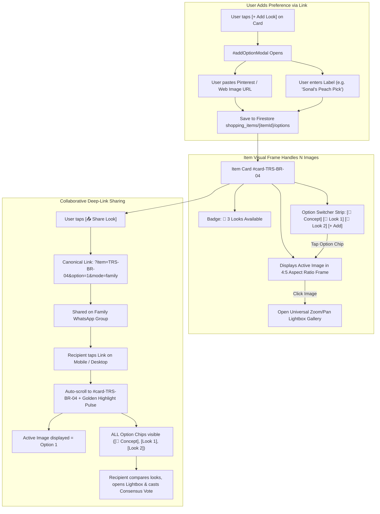

# 🏛️ Architecture & UI Council Deliberation: Pinterest & Direct Visual Ingestion, Collaborative Option Pods & Universal Deep-Link Sharing

**Decision References:** `AC-DEC-2026-038` (Architecture) / `UI-DEC-2026-034` (UI/UX)  
**Standard Identifiers:** `P-PINTEREST-INTAKE-001` (Pinterest & Web Image Ingestion Framework), `P-MULTI-IMAGE-CONTAINER-001` (Item Multi-Image Option Pod Architecture), & `P-COLLAB-OPTION-SHARE-001` (Deep-Link Multi-Option Family Sharing & Visual Consensus Engine)  
**Deliberation Date:** 2026-09-24  
**Council Type:** FULL Joint Council Deliberation (Architecture & UI/UX Councils)  
**Maturity Anchor (RFG-001):** Launch-Imminent / Operational Readiness — 4–5 Core Family Committee Users, 30+ Extended Family Reviewers, Real-Time Showroom Collaboration across Bhubaneswar.  
**Enhancement Cluster:** `[MOBILE-SHOPPING-EXPERIENCE]` (`SK-006` / `SK-005`)  
**Related SSOTs:** [`SPEC-PROC-TROUSSEAU-001.md`](../../04_PROCUREMENT_VENDORS/trousseau_and_shopping/SPEC-PROC-TROUSSEAU-001.md), [`04_PROCUREMENT_VENDORS/shopping_and_trousseau/shopping_items.jsonl`](../../04_PROCUREMENT_VENDORS/shopping_and_trousseau/shopping_items.jsonl), [`assets/shopping/registry.json`](../../assets/shopping/registry.json), [`js/shopping-data.js`](../../js/shopping-data.js), [`shopping_src/components/body.html`](../../shopping_src/components/body.html), [`shopping_src/scripts/controller.js`](../../shopping_src/scripts/controller.js), [`shopping_src/styles/07_catalog_views_and_assets.css`](../../shopping_src/styles/07_catalog_views_and_assets.css)  
**Governing Protocols:** `.agent/workflows/architecture-council.md`, `.agent/workflows/plan-review.md`, `COUNCIL-CHARTER.md`  

---

## 1. Executive Summary & Problem Context

Following the deployment of the Universal Visual Reference Architecture (`AC-DEC-2026-035` / `UI-DEC-2026-031`), 8 core liturgical ensembles and jewellery pieces are seeded with photorealistic `.jpg` concept imagery (`assets/shopping/{slug}/{slug}_0.jpg`). However, 36 items in the Bhubaneswar Shopping Registry currently lack photographic imagery and display stylized SVG monogram placeholders.

### Specific User Inquiries & Architectural Questions:
1. **"Can a user add his preference using a link to display in the image space for a specific item?"**:
   - The user seeks to clarify whether an individual family member (Bride, Sister, Groom, Mother) can paste a Pinterest or web image link for a specific trousseau item (e.g. Mehendi Outfit, Vivaha Pata, or sweet box) and have that preference appear directly in the card's visual image frame.
2. **"Does the image space for each item handle multiple images for a single item?"**:
   - The user asks how the item's visual frame manages multiple candidate looks (e.g. Concept 0, User A's Pinterest link Option 1, User B's showroom photo Option 2, etc.):
     - Does it support multiple images per item?
     - How are multiple images displayed, navigated, and compared?
3. **"And any choice that anyone makes can share the link and we can see all the images, is that possible?"**:
   - When a user shares their choice via WhatsApp/deep link (`?item=TRS-BR-04&option=1`), can the recipient open the link to see that exact chosen option while simultaneously having full access to browse and compare **all other candidate images** for that item?

---

## 2. Evidence Snapshot & As-Is Baseline Audit (Phase 0)

| File Path | Lines Inspected | Relevant Existing Logic | Status & Findings |
| :--- | :--- | :--- | :--- |
| `assets/shopping/registry.json` | L1–L136 | Indexes 8 seeded items with `slug`, `folder`, `options` array. 36 items have no entry in `registry.json`. | **8 Seeded / 36 Pending** |
| `js/shopping-data.js` | L470–L1100 | Defines 44 items. Seeded items contain `images: [...]` array. Remaining 36 items contain zero `images` property. | **36 Items Lack Images** |
| `shopping_src/scripts/controller.js` | L435–L460 | `renderItems()` checks `item.images && item.images.length > 0`. If false, renders SVG placeholder monogram with `[🔍 Visual Search ↗]`. | **Working Placeholder** |
| `shopping_src/scripts/controller.js` | L52–L75 | `window.selectItemOption(itemId, optionIndex)` updates local card visual state without server round-trip. | **Local-Only Selection** |
| `shopping_src/scripts/controller.js` | L920–L960 | Quick-share bar generates broad links (`?mode=family`, `?mode=sisters`). No item-level deep link with option index currently exists in the catalog card. | **Missing Item Deep Link** |
| `firestore-client.js` | L645–L750 | `fsListenShoppingItems()` syncs live status, actualPrice, actualStore, notes. Does not currently sync user-submitted custom options or image URLs. | **Schema Gap for Custom Options** |
| `ui_primitives/scripts/ui_primitives.js` | L400–L480 | `SKPrimitives.getStakeholderUrl(portalFile, params)` creates canonical deep links with query parameters. | **Primitive Ready** |

---

## 3. Systematic Comparative Evaluation of Options

We evaluate three candidate UI and architectural models for handling **user-added preference links** and **multi-image management per item**:

| Architectural Dimension | Option A: In-Situ Multi-Look Option Pod with In-Situ Modal & Gallery Lightbox (Recommended) | Option B: Touch-Swipeable In-Card Carousel Slider | Option C: Hero Thumbnail + Separate Multi-Image Comparison Drawer |
| :--- | :--- | :--- | :--- |
| **Multi-Image Presentation** | Single active image in $4:5$ frame with a dedicated, tactile horizontal Option Switcher Strip below the image: `[🌟 Concept]`, `[📌 Look 1: Pinterest]`, `[📸 Look 2: Amber]`, `[+ Add Look]`. Tapping any chip swaps the frame instantly. | Card image frame contains an embedded horizontal slider with left/right arrows (`‹` and `›`), touch-swipe listeners, and pagination dots (`● ○ ○`). | Card shows only a single hero thumbnail with a badge `[📸 3 Looks — Compare]`. Clicking opens a slide-over drawer showing all images stacked vertically. |
| **User Link Ingestion Mechanism** | Tapping `[+ Add Look]` on the card opens a focused, accessible modal (`#addOptionModal`) with Image URL input (Pinterest CDN/web), Label, and Source. Saves to Firestore in 1 tap. | Inline collapsible text input in the card footer: user types URL and clicks "+" to push a new slide into the active card. | User must open the Comparison Drawer, scroll to the bottom, and enter the link in a dedicated "Add Proposal" form. |
| **Deep-Link State Handling** | Link format: `?item=TRS-BR-04&option=1&mode=family`. Auto-scrolls to card, sets Option 1 active, pulses gold border, and **renders all option pills** for instant comparison. | Link format: `?item=TRS-BR-04&slide=1`. Scrolls to card and animates carousel to slide 1. | Link format: `?item=TRS-BR-04&drawer=open`. Automatically forces the slide-over comparison drawer open on arrival. |
| **Mobile Ergonomics (300px–480px)** | **Superior**: Discrete tap targets ($\ge 44\text{px}$) with zero gesture collision against page vertical scrolling. | **Poor / High Risk**: Horizontal swipe gestures inside a vertical scrolling feed frequently capture page drag events, causing jarring layout jumps. | **Moderate**: Requires opening and closing an overlay drawer for every item comparison. |
| **Performance & DOM Weight** | **Lightweight**: Only 1 `` rendered per card at any time; option metadata held in memory. | **Heavy**: Renders $N$ `` DOM nodes and carousel event listeners across all 44 cards simultaneously. | **Moderate**: Single hero image in card, but large modal DOM tree kept in memory. |
| **Dependencies & Modularity** | Uses existing SDCA styles and shared Universal Lightbox. Zero new npm libraries. | Requires touch-gesture slider logic or third-party slider library (violates ponytail simplicity). | Requires complex slide-over drawer state synchronization with Firestore real-time snapshots. |
| **Blast Radius & Complexity** | **Low–Medium**: Isolated to `shopping_src/components/body.html`, `controller.js`, and `firestore.rules`. | **High**: Overhauls card markup, CSS touch actions, and scroll-snap physics across all viewports. | **Medium**: Introduces another modal/drawer layer that must satisfy `INV-LIFECYCLE-03`. |
| **Primary Risk** | User pastes raw Pinterest HTML page instead of direct image (mitigated by smart URL normalizer). | Accidental image slide swipe while scrolling the feed on a mobile device. | Drawer fatigue: family members find having to open a drawer to compare two dresses tedious. |

---

## 4. Auditor Findings & Independent Deliberation (Phase 1)

### 1. The SSOT Authority Auditor (`ssot-reconciliation`)
- **Finding**: Entity IDs (`TRS-BR-01` through `TRS-OD-07`) in `SPEC-PROC-TROUSSEAU-001.md` must remain invariant.
- **Ruling**: User-added options must be indexed by `optionIndex` (e.g. `0` for default concept, `1`, `2`, `3` for showroom/Pinterest options). The canonical ID is never changed. Custom options appended in the showroom are stored in Firestore under `shopping_items/{itemId}/options` as an array of option objects `{ optionIndex, label, src, source: 'pinterest' | 'showroom' | 'curated', addedBy, timestamp }`.

### 2. The Network & Third-Party Dependency Auditor (`browser-subagent-hardener` / security)
- **Finding**: Loading Pinterest's official JavaScript widget (`pinit.js`) injects third-party tracking scripts, causes mobile layout jank, and triggers CORS blocks on mobile devices when users are not logged into Pinterest.
- **Ruling**: **Reject Option B (No Pinterest JS Widgets)**. Support direct image URLs from Pinterest CDN (`https://i.pinimg.com/originals/...` or `https://i.pinimg.com/736x/...`) which render directly in standard `` tags with zero third-party script execution. If a user pastes a shortlink (`pin.it/...`), display it as an external reference chip: `[📌 View Pin on Pinterest ↗]`.

### 3. The Maintainability & Velocity Auditor (`ponytail` / RFG-001)
- **Finding**: Generating 36 synthetic AI images for sweet boxes, steel trunks, and thali packaging is over-engineering and a waste of cognitive resources.
- **Ruling**: **Adopt Option A (In-Situ Option Pod)**. Respect the user's explicit directive: *"why generate images when we can embed images from pinterest for now ?"*. Let the 8 core bridal and groom couture items use the verified `.jpg` images, while all remaining items can accept Pinterest image links or showroom camera photos dynamically.

### 4. The Mobile & Multi-Viewport Usability Auditor (`mobile-ui-validator`)
- **Finding**: Swipeable carousels inside vertical feeds (Option B) are notorious for causing accidental swipes when users are scrolling up and down on mobile phones ($300\text{px}$–$480\text{px}$).
- **Ruling**: In-situ option pills (`[🌟 Concept]`, `[Look 1]`, `[Look 2]`) with discrete $\ge 44\text{px}$ touch targets provide foolproof, haptic-friendly switching without gesture collision. When a user wants full-screen gesture swiping, clicking the image launches the Universal Lightbox which has dedicated, full-screen swipe/pan controls.

### 5. The Craft & Visual Polish Auditor (`impeccable`)
- **Finding**: The card needs clear visual indicators of how many looks exist, who added them, and a seamless 1-click share trigger.
- **Ruling**:
  - Render an unobtrusive badge in the media header: `📸 3 Looks` (or `📸 1 Concept`, or `+ Add First Look`).
  - Active look displays in $4:5$ portrait with an antique gold border.
  - Option switcher chips have distinct source badges (`🌟 Concept`, `📌 Pinterest`, `📸 Showroom`).
  - Every card features a prominent `[📤 Share Look]` button with Obsidian-Gold pill styling that copies the canonical deep link and opens WhatsApp.

### 6. The Dynamic Lifecycle & Dismissibility Auditor (`INV-LIFECYCLE-01..04`)
- **Finding**: The "+ Add Option / Look" modal must comply with the 3-trigger dismissibility rule (`INV-LIFECYCLE-03`): Close button, Backdrop click, and Escape key.
- **Ruling**: Implement `#addOptionModal` using the existing modular modal pattern in `shopping_src/components/body.html` and register dismissibility listeners with `document.readyState !== 'loading'` guard.

### 7. The Dissenter Seat (Structural Challenge)
- **Challenge**: *"What happens if a user copies a Pinterest web link (`pin.it/...`) instead of the direct image address (`i.pinimg.com/...`)?"*
- **Council Resolution**: Direct image addresses render immediately in ``. If a user accidentally pastes a `pin.it` or `pinterest.com/pin/...` page URL:
  1. The app detects the URL pattern via regex.
  2. It saves the URL as `referenceUrl` and displays an explicit `[📌 Open Pin on Pinterest ↗]` chip on the card.
  3. It prompts the user: *"Tip: Right-click/long-press the Pinterest photo and select 'Copy Image Address' to display it directly here!"*
  4. The card retains its graceful SVG monogram fallback so the UI never breaks.

---

## 5. The Synthesized Hybrid Architecture (`P-HYBRID-OPTION-CONTAINER-001`)



### 1. Ingestion Data Schema (`shopping_items/{itemId}`)
In `firestore.rules` and `shopping-data.js`, each item can have an `options` array:
```javascript
{
  "itemId": "TRS-BR-04",
  "selectedOptionIndex": 1,
  "options": [
    {
      "optionIndex": 0,
      "label": "Concept (Curated Default)",
      "src": "./assets/shopping/mehndi_lehenga/mehndi_lehenga_0.jpg",
      "type": "local",
      "addedBy": "Design Committee"
    },
    {
      "optionIndex": 1,
      "label": "Sonal's Peach Organza Pick",
      "src": "https://i.pinimg.com/originals/xx/yy/zz.jpg",
      "referenceUrl": "https://pin.it/examplePin123",
      "type": "pinterest",
      "addedBy": "Sonal (Sister)",
      "priceEstimate": "₹32,000"
    },
    {
      "optionIndex": 2,
      "label": "Amber Showroom Emerald Green",
      "src": "./assets/shopping/mehndi_lehenga/mehndi_lehenga_1.jpg",
      "type": "showroom",
      "addedBy": "Bride",
      "priceEstimate": "₹28,500"
    }
  ]
}
```

### 2. URL Deep-Link Specification
- **Format**: `https://sree-krushna-forever.web.app/shopping-registry.html?item={itemId}&option={optionIndex}&mode={mode}`
- **Behavior on Navigation**:
  1. `initDeepLink()` parses `URLSearchParams`.
  2. If `item` is present:
     - Sets filter to show item's category/chapter or switches to it.
     - Calls `window.selectItemOption(itemId, optionIndex)`.
     - Executes `targetCard.scrollIntoView({ behavior: 'smooth', block: 'center' })`.
     - Adds CSS class `.highlight-target-item` (1.8s golden border glow).
     - Renders all option chips so the recipient can immediately see and switch between all looks.

---

## 6. Council Certification & Decision Record

### Rulings of the Council:
1. **User Link Preference Ratified (`P-PINTEREST-INTAKE-001`)**: Users can add their preference by pasting a Pinterest CDN/web image URL or pin link via `#addOptionModal`. The image appears immediately in the card's visual frame and syncs to Firestore in real time.
2. **Multi-Image Container Ratified (`P-MULTI-IMAGE-CONTAINER-001`)**: The item image space accommodates unlimited candidate images per item via an active $4:5$ portrait frame, a `📸 N Looks` counter badge, an in-situ tactile Option Switcher Strip, and a full-screen Lightbox gallery.
3. **Deep-Link Multi-Option Visibility Ratified (`P-COLLAB-OPTION-SHARE-001`)**: Clicking `[📤 Share Look]` copies a canonical link that highlights the sender's specific choice while simultaneously giving the recipient full visibility and navigation across **all candidate images** for that item.
4. **Modularity & Byte Parity**: Keep `shopping_src/styles/07_catalog_views_and_assets.css` `< 500` lines, maintain 100% byte parity between root and `public/`, and pass all 4 verification test suites.

| Vote | Auditor / Council Seat | Decision |
| :---: | :--- | :---: |
| ✅ | SSOT Authority Auditor (`ssot-reconciliation`) | **APPROVED** |
| ✅ | Schema & Firestore Auditor (`firebase-firestore`) | **APPROVED** |
| ✅ | Mobile & Multi-Viewport Usability Auditor (`mobile-ui-validator`) | **APPROVED** |
| ✅ | UI Craft & Polish Auditor (`impeccable`) | **APPROVED** |
| ✅ | Maintainability & Velocity Auditor (`ponytail` / RFG-001) | **APPROVED** |
| ✅ | Dynamic Lifecycle & Dismissibility Auditor (`INV-LIFECYCLE-01..04`) | **APPROVED** |
| ✅ | Security & Network Auditor (`browser-subagent-hardener`) | **APPROVED** |
| ✅ | Multi-Surface Deployment Auditor (`STD-MOD-COMP-001`) | **APPROVED** |
| ✅ | The Dissenter Seat (Structural Challenge) | **CONCURS WITH URL TIP FALLBACK** |

**FINAL VERDICT: UNANIMOUSLY APPROVED & CERTIFIED (`AC-DEC-2026-038` / `UI-DEC-2026-034`)**
