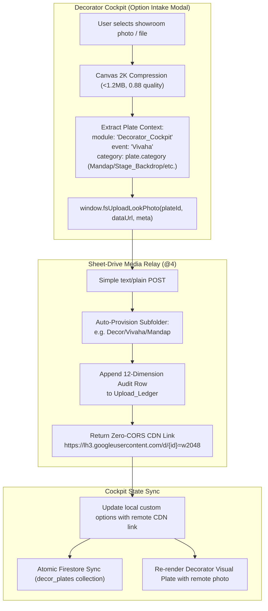

# Architecture Council Deliberation & Certified Decision (`AC-DEC-2026-058`)

**Subject**: Decorator Cockpit Cloud Media Intake & Protocol Onboarding  
**Governing Standard**: `STD-MEDIA-HIERARCHY-001` / Prime Invariant `INV-MODULE-UPLOAD-INTAKE-001`  
**Enhancement Ticket**: [`SK-018`](file:///d:/GitHub_Repo/Sree_Krushna/enhancement-notes/SK-018/00_ENHANCEMENT_INDEX.md) (`Cluster: [UI QUALITY] & [INFRASTRUCTURE]`)  
**Council Ledger Entry**: Recorded in [`Council_Ledger.md`](file:///d:/GitHub_Repo/Sree_Krushna/User_Created/Discussion%20Threads/Council/Council_Ledger.md)  
**Date**: 2026-09-26  

---

## 1. Ground Truth & Problem Analysis

Following the certification and live verification of `SK-017` (Multi-Module Google Drive Hierarchy & Sheet Self-Provisioning), an architectural inspection of the **Decorator Cockpit** (`cockpit_src/scripts/controller.js`) revealed a critical data transit flaw (`INC-099` pattern):

1. **LocalStorage Base64 Storage Anti-Pattern**:
   - In `cockpit_src/scripts/controller.js`, lines 922–923:
     ```javascript
     if (localUploadedDataUrl) {
       commitLook(localUploadedDataUrl, '', 'showroom_upload');
     }
     ```
   - When users select a local image file via the Option Intake Modal (`#skFileInput`), the controller commits the raw Base64 dataURL directly into `localStorage` (`sk_decor_custom_options`).
   - *Impact*: Bloats localStorage, risks browser quota exceptions (`QUOTA_EXCEEDED_ERR`), does not sync across family devices, and completely bypasses the newly verified Google Drive Media Relay.

2. **Unmet Mandatory Onboarding Invariant (`INV-MODULE-UPLOAD-INTAKE-001`)**:
   - `STD-MEDIA-HIERARCHY-001` established authoritative routing routes for Decorator Cockpit in `media-routing-taxonomy.json` and `Config_Routing`:
     - `Decor/Vivaha/Mandap`
     - `Decor/Vivaha/Stage_Backdrop`
     - `Decor/Vivaha/Entry_Arch`
     - `Decor/Vivaha/Dining_Pandal`
     - `Decor/Lighting_Atmosphere`
     - `Decor/Floral_Installations`
     - `Decor/Photo_Lounges`
   - However, `cockpit_src` does not invoke `window.fsUploadLookPhoto()`, leaving this domain orphaned from the cloud media pipeline.

---

## 2. Certified Technical Solution

The Architecture Council certifies the onboarding of Decorator Cockpit to `STD-MEDIA-HIERARCHY-001`:



### Key Requirements:
1. **Dynamic Category Normalization**: Map plate category IDs (`mandap`, `stage`, `entry`, `dining`, `lighting`, `florals`, `lounge`) to canonical taxonomy names (`Mandap`, `Stage_Backdrop`, `Entry_Arch`, `Dining_Pandal`, `Lighting`, `Florals`, `Lounge`).
2. **Progress Feedback**: Show progress bar animation and toast feedback during upload (`☁️ Uploading decor concept to Drive...`).
3. **Graceful Fallback**: If offline or unauthenticated, fall back safely to local preview without breaking the UI.
4. **Dual-Release Byte Parity**: Rebuild `decorator-cockpit.html` and `cockpit-fragment.html` via `node cockpit_src/build.cjs` and verify 100% byte parity with `/public`.

---

## 3. Phased Implementation Roadmap (`SK-018`)

- **Phase 1: Controller Cloud Upload Integration**: Wire `skBtnSubmitOption` in `cockpit_src/scripts/controller.js` to invoke `window.fsUploadLookPhoto()` with explicit `module: 'Decorator_Cockpit'`, `event: 'Vivaha'`, and normalized category.
- **Phase 2: SDCA Recompilation & Parity Gate**: Run `node cockpit_src/build.cjs` and verify byte parity between root and `/public` artifacts.
- **Phase 3: Automated Contract & Smoke Verification**: Update `scripts/test-media-hierarchy-contract.cjs` to assert both `Shopping` and `Decorator_Cockpit` controllers forward valid parameters. Run `npm test` and `npm run test:cockpit`.

---

## 4. Council Certification

This decision is ratified under **`AC-DEC-2026-058`** and entered into the master council ledger.
