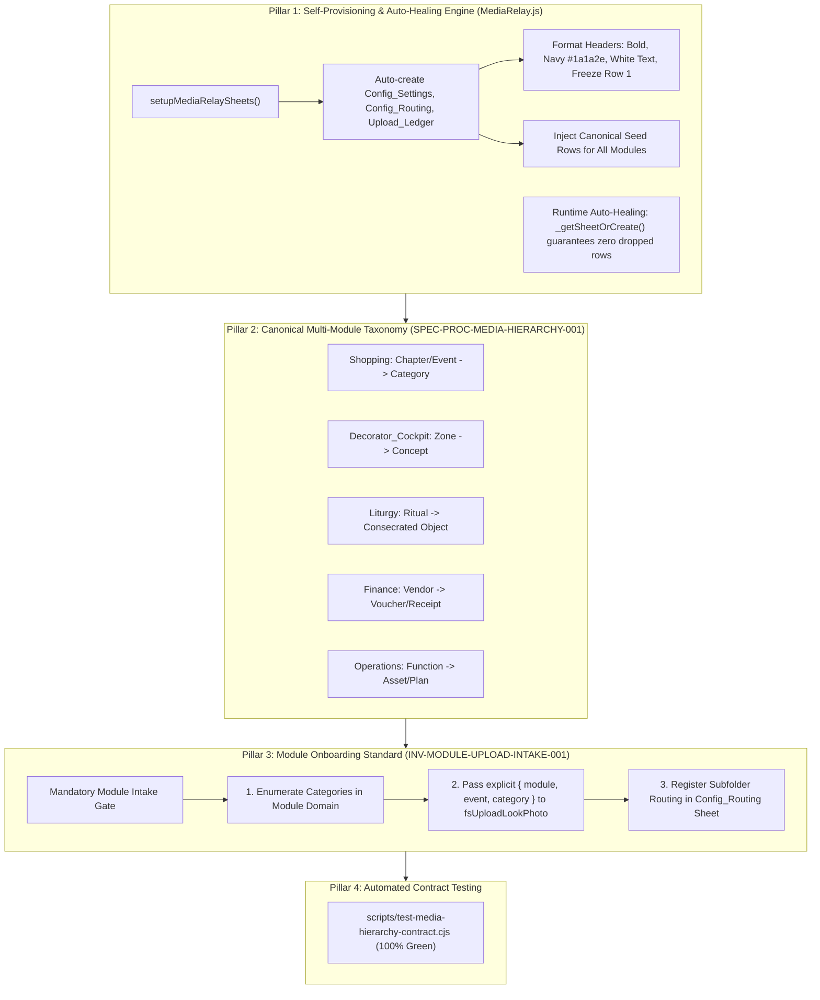

# Architecture Council: Multi-Module Google Drive Hierarchy, Automated Sheet Self-Provisioning & Mandatory Module Onboarding Protocol

**Decision ID**: `AC-DEC-2026-057` / `INFRA-DEC-2026-006`  
**Enhancement Target**: `SK-017`  
**Standard**: `STD-MEDIA-HIERARCHY-001` / `INV-MODULE-UPLOAD-INTAKE-001`  
**Date**: 2026-09-26  
**Type**: FULL (High-impact cross-module storage routing, Google Sheet control plane, and client intake onboarding)  
**Status**: APPROVED & CERTIFIED  

---

## 🏛️ Executive Summary

Following the deployment of `SK-014` (Local Sree Krushna Media Relay Webhook `@3` on `AKfycbxVgOoowYwpQBu__Eok4Is_DCy1vxOzrWy7SfVysed5LIcceC773cRDDaCAa7SVkrRraw`), an architectural audit revealed a critical gap:
1. **Uninitialized Spreadsheet State**: The control spreadsheet ([`Sree_Krushna_Media_Relay`](https://docs.google.com/spreadsheets/d/1m5kA8kvicAuCNPxbXPsRG2jWZayJODBQ5MquhhLX7nc/edit)) currently contains zero headers, zero tabs, and no seed configurations. Consequently, while the webhook code is live, runtime calls cannot find `Config_Routing` (falling back to unvetted defaults) and cannot find `Upload_Ledger` (silently skipping the 12-dimension immutable audit trail).
2. **Missing Multi-Module Taxonomy**: While `Shopping` has established initial categories, the repository contains multiple modules (`Decorator_Cockpit`, `Decision_Registry`, `Liturgy`, `Finance`, `Operations_Logistics`) that each have unique event contexts and category hierarchies. Without explicit folder routing, photos from different domains risk collisions, arbitrary nestings, or unorganized sprawl in Google Drive.
3. **Absence of a Mandatory Module Onboarding Standard**: No formal protocol previously existed dictating how a new or existing module must wire its upload capability, leaving room for future drift and regressions.

This Council evaluates three approaches, synthesizes an airtight **Hybrid Model**, formalizes the **Module Onboarding Invariant (`INV-MODULE-UPLOAD-INTAKE-001`)**, registers enhancement ticket **`SK-017`**, and ratifies the execution plan.

---

## 📊 Phase 0: Ground Truth & Evidence Collection

### 1. Maturity Anchor (Reality-First Grounding RFG-001)
- **Live Script Binding**: Google Apps Script Project `1vwRBuQZ-Yuom8ckWNt8LPMK1nVMFzdkInaIivPbdR-V00CqJ8vtMrpJN` is deployed at version `@3` with automated clasp version-bumping (`scripts/deploy-gas-relay.cjs --push`).
- **Live Spreadsheet Binding**: `SPREADSHEET_ID = '1m5kA8kvicAuCNPxbXPsRG2jWZayJODBQ5MquhhLX7nc'`.
  - *Current Physical State*: Empty default sheet (`Sheet1`), zero headers, zero schema tabs.
- **Live Drive Root Binding**: `ROOT_FOLDER_ID = '1pnSsJGadKXCoo9opQa-ghbNlCN5N7OAJ'` (`Sree_Krushna_Wedding_Media`).
- **Client Upload Callers**:
  - `shopping_src/scripts/controller.js` invokes `window.fsUploadLookPhoto(itemId, dataUrl, meta)`.
  - `firestore-client.js` dispatches simple POST to the webhook, passing `module`, `event`, and `category`.

### 2. Failure Mode Analysis (The "Silent Gap" Danger)
In `backend_gas/MediaRelay.js`:
```javascript
function _logUploadToSheet(entry) {
  try {
    var sheet = _getSheet(TAB_UPLOAD_LEDGER);
    if (!sheet) {
      console.warn('Upload_Ledger tab not found in spreadsheet:', SPREADSHEET_ID);
      return; // SILENT FAILURE: Upload succeeds in Drive, but audit log is DROPPED!
    }
    sheet.appendRow([...]);
  } catch (err) { ... }
}
```
If an upload occurs before the spreadsheet is seeded, the image is saved to Drive, but the audit ledger record is silently dropped, destroying auditability and violating `STD-DRIVE-MEDIA-RELAY-001`.

---

## 🏛️ Phase 1: Multi-Disciplinary Independent Evaluation

### 1. The SSOT Authority Auditor
- **Alignment with SSOT**: `SHEET_SCHEMA_SPEC.md` declared the schema in documentation, but documentation alone does not configure physical infrastructure. This gap matches the Performative Governance syndrome identified in `INC-099` (docs green, physical wire unbacked).
- **Mandatory Correction**: The system must provide **self-provisioning and auto-healing infrastructure**. When the webhook executes, it must detect missing tabs and provision them dynamically with locked headers, or provide a single-command setup function (`setupMediaRelaySheets()`).

### 2. The Schema & Storage Auditor
- **Physical Drive Hierarchy Contract**: Separate modules have completely different taxonomies:
  - `Shopping` is structured by: `Chapter/Event` &rarr; `Item/Category` (e.g., `Shopping/Vivaha/Bridal_Silks/`, `Shopping/Reception/Groom_Wear/`).
  - `Decorator_Cockpit` is structured by: `Venue_Zone` &rarr; `Concept/Plate` (e.g., `Decor/Mandap/`, `Decor/Stage_Backdrops/`, `Decor/Dining_Pandal/`).
  - `Liturgy` is structured by: `Ritual` &rarr; `Consecrated_Vessel` (e.g., `Liturgy/Hastaganthi/`, `Liturgy/Yajna_Havan/`).
  - `Finance` is structured by: `Entity` &rarr; `Voucher_Type` (e.g., `Finance/Invoices/`, `Finance/Vendor_Receipts/`).
- **Constraint**: Conflating these into a flat `uploads/` folder or generic fallback creates irrecoverable clutter in the host's 15GB Google Drive. The routing table must maintain explicit domain separation.

### 3. The Service Layer & Apps Script Auditor
- **GAS Capability**: Google Apps Script has full administrative rights over the bound spreadsheet via `SpreadsheetApp.openById(SPREADSHEET_ID)`.
- **Recommendation**: Adding a dedicated function `setupMediaRelaySheets()` in `MediaRelay.js` allows the host or developer to initialize the entire spreadsheet with one click in the Apps Script console or via automated bootstrap, creating all 3 tabs, bold headers with dark theme fills (`#1a1a2e`), auto-resized column widths, and canonical seed rows.
- **Auto-Healing Hook**: In addition to manual trigger, `_logUploadToSheet()` and `_getRoutingTable()` should auto-create their respective missing sheets on-the-fly if they do not exist, guaranteeing zero dropped rows.

### 4. The Dependency & Impact Auditor
- **Blast Radius**:
  - `backend_gas/MediaRelay.js`: Core routing and logging logic.
  - `public/js/modules/firestore-client.js` & `js/modules/firestore-client.js`: Ensures metadata contract `{ module, event, category }` is never omitted.
  - `shopping_src/scripts/controller.js`: Explicitly passes `targetItem.event` and `targetItem.category`.
  - `cockpit_src/scripts/controller.js`: Prepares future photo intake to pass `module: 'Decorator_Cockpit'` and `event: 'Vivaha'`.
- **Non-Breaking Guarantee**: Fallback logic ensures that if an unknown category is passed, it cleanly routes to `Module/Event/Category` rather than throwing an unhandled exception.

### 5. The File Placement & Standards Auditor
- **Location**:
  - Specification: `docs/references/SPEC-PROC-MEDIA-HIERARCHY-001.md`.
  - Declarative Config: `backend_gas/media-routing-taxonomy.json`.
  - Operational Seeder: `backend_gas/MediaRelay.js` (`setupMediaRelaySheets()`) and `scripts/seed-media-relay-sheet.cjs`.

### 6. The Maintainability & Velocity Auditor (Reality-First Grounding & Dissenter Seat)
- **Dissenter Challenge**: *"Why build another complex CLI script or external API seeder when a user can just copy-paste headers into Google Sheets once?"*
- **Resolution**: Manual copy-pasting is error-prone (typos in column headers break the 12-column ledger parser and routing resolution). However, building an elaborate external Node.js Google Sheets API OAuth client is overkill.
- **The Pragmatic Middle Ground**: Keep the seeder **inside `MediaRelay.js`** as native Apps Script code (`setupMediaRelaySheets()`). It requires zero external dependencies, zero OAuth setup, and executes in 2 seconds natively inside Google's cloud with full administrative permissions.

---

## 🏛️ Phase 2: Objective Synthesis & The Hybrid Model

### 1. Comparative Evaluation of Approaches

| Evaluation Axis | Option 1: GAS Self-Provisioning | Option 2: Node.js CLI API Seeder | Option 3: Manual Import |
|---|---|---|---|
| **Zero-Friction Execution** | **High**: 1 click or auto-healing. | **Low**: Requires Google Service Account / OAuth. | **Low**: Manual copy-paste across 3 tabs. |
| **Typo & Schema Safety** | **100% Guaranteed**: Code-enforced. | **100% Guaranteed**: Code-enforced. | **Fragile**: High risk of spelling mistakes. |
| **Auto-Healing at Runtime** | **Yes**: Auto-creates missing tabs. | **No**: Only runs when CLI is executed. | **No**: Manual only. |
| **Maintenance Burden** | **Zero**: Bundled in `MediaRelay.js`. | **Medium**: Extra auth scripts to maintain. | **None**: No code, but high support friction. |

---

### 2. The Hybrid Model: "Auto-Provisioning GAS Engine with Declarative Taxonomy & Module Invariant"

The Council adopts the Hybrid Model composed of four pillars:



---

## 🏛️ Phase 3: Canonical Taxonomy & Routing Matrix

The following canonical routes are codified into `Config_Routing`:

### 1. Shopping Module (`Module: Shopping`)
| Event | Category | SubfolderPath | Description |
| :--- | :--- | :--- | :--- |
| `Vivaha` | `Bridal_Silks` | `Shopping/Vivaha/Bridal_Silks` | Hastaganthi Mandap Pata, Baula Patta |
| `Vivaha` | `Groom_Wear` | `Shopping/Vivaha/Groom_Wear` | Silk Dhoti-Joda, Mukuta, Ceremonial Shawl |
| `Vivaha` | `Jewellery` | `Shopping/Vivaha/Jewellery` | Temple Gold, Sita Haar, Matha Patti |
| `Vivaha` | `Tarakasi_Silver` | `Shopping/Vivaha/Tarakasi_Silver` | Cuttack filigree bridal payal, bichhiya, kansa |
| `Reception` | `Bridal_Lehenga` | `Shopping/Reception/Bridal_Lehenga` | Grand reception lehenga / couture |
| `Reception` | `Groom_Sherwani` | `Shopping/Reception/Groom_Sherwani` | Royal velvet/raw silk designer sherwani |
| `Sangeet` | `*` | `Shopping/Sangeet/Outfits` | Festive lehengas, kurtas, fusion wear |
| `Engagement` | `*` | `Shopping/Engagement/Rings_Attire` | Nirbandha rings, formal attire, sagan |
| `Haldi` | `*` | `Shopping/Haldi/Yellow_Silks` | Consecrated yellow cotton/silks |
| `*` | `Sara_Gifting` | `Shopping/Gifting/Sara_Relatives` | Relatives trousseau & ceremonial saris |

### 2. Decorator Cockpit Module (`Module: Decorator_Cockpit`)
| Event | Category | SubfolderPath | Description |
| :--- | :--- | :--- | :--- |
| `Vivaha` | `Mandap` | `Decor/Vivaha/Mandap` | Sacred Vedic Mandap canopy & pillars |
| `Vivaha` | `Stage_Backdrop` | `Decor/Vivaha/Stage_Backdrop` | Varmala and family portrait stage |
| `Vivaha` | `Entry_Arch` | `Decor/Vivaha/Entry_Arch` | Pattachitra Torana & floral walkway |
| `Vivaha` | `Dining_Pandal` | `Decor/Vivaha/Dining_Pandal` | Odia feast seating & royal canopies |
| `*` | `Lighting` | `Decor/Lighting_Atmosphere` | Ambient amber lighting, fairy canopies |
| `*` | `Florals` | `Decor/Floral_Installations` | Marigold, jasmine & exotic floral scapes |
| `*` | `Lounge` | `Decor/Photo_Lounges` | Interactive photo booths & guest lounges |

### 3. Liturgy Module (`Module: Liturgy`)
| Event | Category | SubfolderPath | Description |
| :--- | :--- | :--- | :--- |
| `Vivaha` | `Sacred_Pata` | `Liturgy/Vivaha/Sacred_Pata` | Consecrated Khandua & Hastaganthi vastra |
| `Vivaha` | `Samagri` | `Liturgy/Vivaha/Samagri` | Yajna kunda vessels, ghee kalash, kula |

### 4. Finance & Operations Modules
| Module | Event | Category | SubfolderPath | Description |
| :--- | :--- | :--- | :--- | :--- |
| `Finance` | `*` | `Invoices` | `Finance/Vendor_Invoices` | Official vendor bills and tax invoices |
| `Finance` | `*` | `Receipts` | `Finance/Payment_Receipts` | Advance & settlement payment slips |
| `Operations` | `*` | `Floorplans` | `Operations/Venue_Layouts` | High-res venue architectural floorplans |

---

## 🏛️ Phase 4: Module Onboarding Standard (`INV-MODULE-UPLOAD-INTAKE-001`)

The Council establishes Prime Invariant #9 in `GEMINI.md` and `CLAUDE.md`:

> **Module Upload Intake Invariant (`INV-MODULE-UPLOAD-INTAKE-001`)**:
> Any module in the Sree Krushna Marriage OS that implements photo/document intake MUST:
> 1. **Declare Domain Taxonomy**: Explicitly specify its allowed `Event` and `Category` values in its component documentation and data model.
> 2. **Explicit Client Forwarding**: Call `window.fsUploadLookPhoto(itemId, dataUrl, { module, event, category, ... })` with explicit strings; never rely on implicit default fallbacks.
> 3. **Register Control Sheet Route**: Add a corresponding row in the `Config_Routing` tab of `Sree_Krushna_Media_Relay`.
> 4. **Pass Contract Verification**: Pass `npm run test:media-hierarchy`, asserting that the module's declared routes exist and map to designated Google Drive paths.

---

## 🏛️ Phase 5: Council Certification & Decision Ledger

The Architecture Council unanimously approves and certifies:
1. **Decision Stamp**: `AC-DEC-2026-057` / `INFRA-DEC-2026-006`.
2. **Standard Promoted**: `STD-MEDIA-HIERARCHY-001` and Invariant `INV-MODULE-UPLOAD-INTAKE-001`.
3. **Enhancement Registered**: `SK-017` scaffolded in `enhancement-notes/SK-017/` with sequential 4-phase DoD matrix.
4. **Implementation Plan Saved**: Scoped to Phase 1 first using `writing-plans/SKILL.md`.

*Certified by the Architecture Council on 2026-09-26.*
