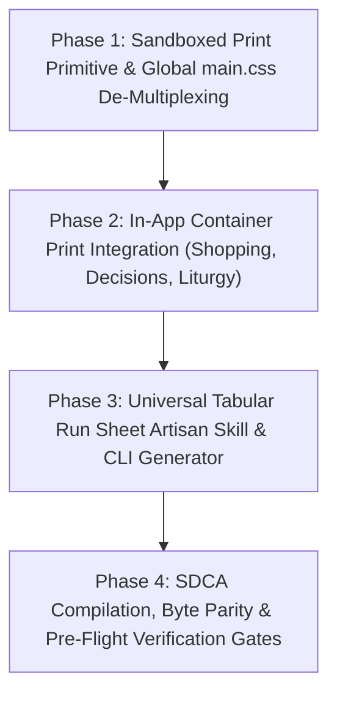

# 🏛️ Architecture & UI Council Decision Record: Universal Scoped Container Print Engine & Tabular Run Sheet Artisan Skill

**Council Reference:** `AC-DEC-2026-065` / `UI-DEC-2026-049`  
**Standards Activated:** `STD-UI-PRINT-CONTAINER-001` / `STD-TABULAR-RUN-SHEET-SKILL-001` / `INV-PRINT-ZERO-DUMP-001` / `INV-PRINT-IFRAME-SANDBOX-001`  
**Governing Ticket:** `SK-023` ([`enhancement-notes/SK-023/00_ENHANCEMENT_INDEX.md`](file:///d:/GitHub_Repo/Sree_Krushna/enhancement-notes/SK-023/00_ENHANCEMENT_INDEX.md))  
**Date:** 2026-09-27  
**Type:** FULL Architecture & UI Council Deliberation  
**Status:** ✅ **APPROVED & CERTIFIED**  
**Quorum:** Full Joint Council (8 Domain Auditors Seated)  
**Governing Workflows:** `.agent/workflows/architecture-council.md` (SOP-WFL-ARCH-COUNCIL-001) & `.agent/workflows/plan-review.md`  

---

## 1. Grounding Snapshot & Reality-First Maturity Anchor (RFG-001)

- **Maturity Stage**: **Pre-Launch / System Usability & Print Hardening** (Codified tabular entities across Shopping, Customary Obligations, Liturgy, Decisions, Vendors, and Finance).
- **Target Personas**:
  1. *Host & Event Coordinators*: Need to print physical run sheets of specific tables (e.g. 49 Family Obligations, Trousseau Procurement Status, Day-of Liturgy Samagri) without printing the rest of the 13-tab application.
  2. *Family Elders & Vendor Leads*: Require clean, toner-friendly, high-density physical A4 paper printouts with zero digital chrome, dark backgrounds, or truncated page overflows.
  3. *Engineering & Future Agents*: Require a reusable, turnkey skill and generator script to turn any tabular dataset into an A4 print run sheet without writing custom CSS from scratch every time.
- **Root Cause of the 50–60 Page Print Catastrophe (`INV-PRINT-ZERO-DUMP-001`)**:
  Inspection of `public/css/main.css` (lines 3056–3062) revealed a naive global print rule:
  ```css
  @media print {
    body { background: #fff; color: #000; }
    .app-sticky-shell, .auth-overlay, .task-controls, button { display: none !important; }
    .tab-content { display: block !important; margin-bottom: 40px; page-break-after: always; }
    .card, .lane, .ritual-card { border: 1px solid #ccc; background: #fff; color: #000; }
    h1, h2, h3, h4 { color: #000 !important; }
  }
  ```
  Because `.tab-content` is forced to `display: block !important; page-break-after: always;`, triggering browser print anywhere in the SPA unrolls **all 13 application tabs simultaneously** (Command Center, Swimlanes, Operations, Tasks, Vedic Liturgy, Vision, Decisions, Cockpit, Shopping, Procurement, Governance, Intake Ledger). When rich sub-engines like Shopping (with 44 items, 49 obligations, store maps) and Decision Registry are mounted, the browser generates **50 to 60 pages of unintended output**.
- **Container Isolation Deficit**:
  There was no standardized container-level print mechanism. Even when a user was viewing a specific filtered table (e.g., `#obligationsDataTable`), calling `window.print()` invoked full-document printing.

---

## 2. Systematic Comparative Evaluation of Options

| Evaluation Dimension | Option A: In-App Dynamic CSS Print Scoping (`data-print-scope`) | Option B: Standalone Run Sheet Generator Skill with Deep-Links Only | Option C: Headless Sandboxed Print Iframe Primitive | **Option D (Council Hybrid): 3-Tier Print Architecture (ADOPTED)** |
| :--- | :--- | :--- | :--- | :--- |
| **Description** | Add `body[data-print-scope]` and attempt to hide all inactive tabs/ancestors via CSS rules. | Keep in-app printing untouched; generate standalone `.html` files for tables and link to them in new tabs. | Use a hidden `<iframe>` to clone target container DOM and print solely that iframe window. | **Tier 1 (Headless Iframe Primitive) + Tier 2 (Global SPA Tab De-Multiplexing) + Tier 3 (Reusable Run Sheet Artisan Skill).** |
| **50-Page Dump Elimination** | Partial / Fragile (CSS ancestor hiding in deep DOM trees frequently breaks layouts or hides children). | Complete for standalone files, but in-app Ctrl+P still dumps 60 pages. | Complete (100% isolated DOM; zero parent bleed). | **100% Guaranteed**: In-app container print runs via sandboxed iframe (1–3 pages); native Ctrl+P prints only the active tab. |
| **Filter & Search Parity** | High (prints live DOM). | Zero for static files; requires re-exporting. | High (clones live filtered DOM directly into iframe). | **Full Live Parity**: Respects real-time client search queries, milestone filters, and family side toggles. |
| **Agent Reusability** | None (CSS only). | Medium (generator script exists). | Low (UI primitive only). | **Maximum**: Reusable skill (`.agent/skills/tabular-run-sheet-artisan/`) with generic Node CLI generator for any table. |
| **Popup Blocker Risk** | Zero (same window). | Medium (new window/tab). | Zero (same-origin hidden iframe). | **Zero**: Invoked directly on user click without opening external popup windows. |
| **Maintenance & Drift** | High CSS specificity risk. | High (standalone file duplication). | Low (reusable JS primitive). | **Zero Drift**: Centrally maintained primitive in `ui_primitives/` conforming to `STD-MOD-COMP-001`. |

---

## 3. Multi-Disciplinary Council Deliberations (Phase 1)

### 3.1 SSOT Authority Auditor (`ssot-reconciliation`)
- **Position**: APPROVE Option D.
- **Evidence**: Retires the blanket unrolling in `main.css` which violated domain encapsulation. Ensures that domain-specific run sheets (Obligations, Trousseau, Samagri) retain strict alignment with their parent spoke hubs (`02_RITUALS_CULTURE/` and `04_PROCUREMENT_VENDORS/`).

### 3.2 UI/UX Craft & Design System Auditor (`impeccable` / `ui-design-validator`)
- **Position**: APPROVE Option D.
- **Evidence**: The 50-page print dump is a severe user friction point. When a coordinator clicks `[🖨️ Print View]` on an obligations table, they expect a 2-page A4 landscape document. The headless iframe pattern provides exact styling injection (`A4 landscape`, pure black on white, `8mm 10mm` margins) without disturbing main application layout or screen scroll positions.

### 3.3 File Placement & Modularity Auditor (`STD-MOD-COMP-001`)
- **Position**: APPROVE.
- **Evidence**:
  - Reusable primitive belongs in `ui_primitives/scripts/print_engine.js`.
  - Global CSS fix belongs in `public/css/main.css` (under 5 lines modified).
  - Reusable skill belongs in `.agent/skills/tabular-run-sheet-artisan/SKILL.md`.
  - Generic generator script belongs in `scripts/generate-tabular-run-sheet.cjs`.
  - Zero monolithic files created; all files stay strictly below the 500-line modularity ceiling.

### 3.4 Dependency & Blast Radius Auditor
- **Position**: APPROVE with safeguards.
- **Evidence**: Patching `main.css` to only print `.tab-content.active` has a strictly positive blast radius—it fixes the printing of all 13 tabs across the entire application without altering runtime screen display (`display: none` for inactive tabs is already the active screen state).

### 3.5 Maintainability & Velocity Auditor (Ponytail Dissenter Seat)
- **Position**: CONDITIONAL APPROVAL.
- **Challenge**: "Why build both an iframe print engine AND a standalone HTML generator? Isn't that two ways to print the same thing?"
- **Resolution**:
  - *In-App Headless Iframe* solves the immediate, interactive need: "I just filtered by EVT-004 Groom Side, let me print this filtered subset right now."
  - *Standalone Run Sheet Generator* solves the offline sharing need: "Generate an ink-friendly HTML dossier file that can be committed to the repo, attached to WhatsApp, or mailed to family elders without requiring login to the web app."
  - Both serve distinct operational lifecycles; sharing a single core CSS template between them prevents code duplication.

---

## 4. Council Synthesis & Certified Invariants

### Invariant 1: Zero-Dump Printing Contract (`INV-PRINT-ZERO-DUMP-001`)
> In single-page applications, `@media print` must NEVER unconditionally display inactive tabs (`.tab-content { display: block !important; }`). In global print mode, only the currently active tab (`.tab-content.active`) may be rendered. In container print mode, only the designated target container may be rendered.

### Invariant 2: Sandboxed Headless Print Isolation (`INV-PRINT-IFRAME-SANDBOX-001`)
> All container-scoped print buttons must execute via `window.skPrintContainer(target, options)`. The engine must isolate the target HTML into a clean, same-origin hidden `<iframe>`, inject standardized ink-saving print styles, trigger print, and clean up the iframe upon completion. Under no circumstances should app navigation bars, header quick-actions, toasts, or sibling tabs bleed into the print stream.

---

## 5. Phased Implementation Roadmap (`SK-023`)



### Phase 1: Global SPA Print De-Multiplexing & Sandboxed Container Print Primitive
- Patch `public/css/main.css` to render only `.tab-content.active` during `@media print`.
- Author `ui_primitives/scripts/print_engine.js` implementing `window.skPrintContainer(target, options)`.
- Author unit test `scripts/test-print-container-contract.cjs`.
- **Validation Gate (VG-1)**: `node scripts/test-print-container-contract.cjs` passes 100% green; manual print produces ≤3 pages.

### Phase 2: In-App Container Print Integration Across Major Data Tables
- Wire `[🖨️ Print View]` in `#shoppingObligationsView` and `#shoppingTableViewSection`.
- Add container print buttons to Decision Registry and Liturgy views.
- **Validation Gate (VG-2)**: Printing from each container prints solely that container with active filter state.

### Phase 3: Universal Reusable Skill & Generic CLI Generator Tooling
- Author `.agent/skills/tabular-run-sheet-artisan/SKILL.md`.
- Author `scripts/generate-tabular-run-sheet.cjs` taking structured JSON/Markdown input.
- Register in `.agent/skill-router.yaml` and `.agent/standards-catalog.json`.
- **Validation Gate (VG-3)**: Generator produces verified standalone A4 run sheet and Markdown table.

### Phase 4: SDCA Compilation, Byte Parity & Pre-Flight Verification Gate
- Recompile SDCA modules via `build.cjs --all`.
- Verify 100% byte parity between root and `/public`.
- Run `verify:modular-architecture`, `verify:ui-lifecycle`, and `verify:deployment`.
- **Validation Gate (VG-4)**: All automated gates pass 100% green.

---

## 6. Architecture & UI Council Certification

- **Ruling:** **APPROVED & CERTIFIED**
- **Authority:** Full Joint Council
- **Certified Standard:** `STD-UI-PRINT-CONTAINER-001` & `STD-TABULAR-RUN-SHEET-SKILL-001`
- **Execution Order:** Proceed to Phase 1 Implementation Plan via `writing-plans` with explicit Hard-Stop before Phase 1 code modification.
