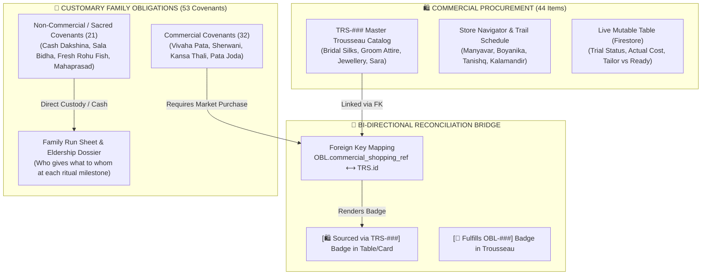
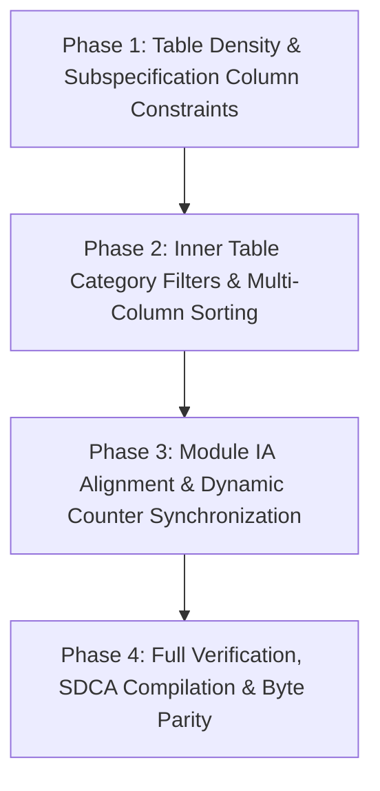

# 🏛️ Architecture & UI Council Decision Record: Shopping Module Architecture Streamlining, Column Space Optimization & Obligations Table Controls

**Council Reference:** `AC-DEC-2026-066` / `UI-DEC-2026-050`  
**Standards Activated:** `STD-MOD-COMP-001` / `STD-SHOPPING-OBLIGATION-002` / `P-TABLE-DOMAIN-SEPARATION-001` / `P-OBLIGATION-RECONCILIATION-001`  
**Governing Ticket:** `SK-024` ([`enhancement-notes/SK-024/00_ENHANCEMENT_INDEX.md`](file:///d:/GitHub_Repo/Sree_Krushna/enhancement-notes/SK-024/00_ENHANCEMENT_INDEX.md))  
**Date:** 2026-09-27  
**Type:** FULL Architecture & UI Council Deliberation  
**Status:** ✅ **APPROVED & RATIFIED**  
**Quorum:** Full Joint Council (8 Domain Auditors Seated)  
**Governing Workflows:** `.agent/workflows/architecture-council.md` (SOP-WFL-ARCH-COUNCIL-001) & `.agent/workflows/plan-review.md`  

---

## 1. Grounding Snapshot & Reality-First Maturity Anchor (RFG-001)

- **Maturity Stage**: **Pre-Launch / System Usability & Domain Boundary Hardening**
- **Trigger**:
  User raised three fundamental architectural and usability issues regarding the Shopping Registry (`shopping-registry.html` / `shopping_src/`):
  1. **Domain Boundary & Reconciliation Clarity**: What is the difference between the 44 Commercial Trousseau Items (`TRS-###`) and the 53 Customary Family Lineage Obligations (`OBL-###`), and how does reconciliation happen without catalog inflation?
  2. **Table Layout Grievance in `#obligationsTableContent`**:
     - The "Items / Specifications" column has no width/max-width constraint, dominating 40–50% of screen width and ballooning table row heights.
     - The table mode lacks inner table category filters and column sorting headers (`data-sort="code|direction|title|category|cost"`).
  3. **Module Architecture Audit (`/prompt-clarity`)**:
     - Identify and eliminate architectural redundancies, obsolete sections, and navigation friction to achieve optimum utilization across the entire Shopping module.
- **Root Cause Analysis**:
  - *Unconstrained Column*: In `shopping_src/scripts/controller.js` (line 4110), `<th>Items / Specifications</th>` is the only header without a `style="width: ...px;"` declaration. In `11_obligations_table_and_print.css`, `.obl-td-specs` specifies no width or ellipsis rules, and items are joined with raw ` • `.
  - *Static Table Headers*: Table headers in `renderObligationsTable()` are rendered as static text without sorting affordances or click handlers.
  - *Dual-Table Cognitive Friction*: The module presents both a Live Mutable Table (`#shoppingTableViewSection` for 44 retail items) and a Customary Obligations Table (`#obligationsTableContainer` for 53 covenants) under nested navigation layers, creating user confusion over which table serves which purpose.
  - *Outdated Hardcoded Badges*: UI templates and scripts still reference "49" obligations in header titles, banners, and button text, even though 4 sacred marriage attires (`OBL-050` through `OBL-053`) expanded the canonical count to 53.

---

## 2. Ontological Distinction & Cross-Domain Reconciliation Model (`P-OBLIGATION-RECONCILIATION-001`)

### 2.1 The Two Fundamental Domains

| Dimension | 🛍️ Commercial Trousseau Checklist (`TRS-###`) | 📜 Customary Family Obligations (`OBL-###`) |
| :--- | :--- | :--- |
| **Canonical Count** | **44 Items** across 5 Chapters | **53 Obligations** across 7 Milestones |
| **Core Question** | *"What physical articles do we buy in stores in Bhubaneswar?"* | *"Who in the family owes what ceremonial handover to whom, and at which ritual milestone?"* |
| **Scope** | Physical store merchandise: Silks, Lehengas, Sherwanis, Gold/Silver ornaments, In-laws gift sarees. | Sacred lineage covenants: Attire endowments, ceremonial caskets, Cash Dakshina, fresh food hampers, Mahaprasad. |
| **Actors / Roles** | Shoppers, Store Managers, Master Tailors, Stylists. | Lineage Units: Bride Side (Kanya Pakshya), Groom Side (Bara Pakshya), Mamu, Nananda, Sala, Purohita. |
| **State Machine** | `Planned` ➔ `Shortlisted` ➔ `In_Trial` ➔ `Ordered` ➔ `Purchased` | `Identified` ➔ `Committed` ➔ `Procured` ➔ `Staged` ➔ `Handed_Over` |
| **Financial Nature** | Commercial retail pricing (MRP, Store discounts, tailoring charges). | Fixed ceremonial cash Dakshina (e.g. ₹5,000 Sala Bidha, ₹2,100 Purohita), or non-monetary blessings. |

### 2.2 Why Reconciliation Cannot Mean Merging into One List (Zero Catalog Inflation)
- Merging all 53 obligations into the shopping list would inflate the commercial checklist with items like *"Purohita Dakshina ₹2,100 Cash"*, *"Sala Bidha ₹5,000 Cash"*, or *"2 Fresh Rohu Fish Bhara"*, destroying the utility of a retail shopping tool.
- Conversely, omitting non-retail obligations would leave family elders blind to crucial ritual handovers during the wedding.
- **Reconciliation Mechanism**: 
  - Obligations requiring store purchases declare `downstream_projections.commercial_shopping_ref: "TRS-###"`. The obligations table renders a 1-click `[🛍️ TRS-###]` bridge button to inspect the commercial item.
  - Obligations fulfilled directly by family members or cash render as `Direct`.
  - Zero catalog inflation is maintained: exactly 44 retail items in shopping, exactly 53 customary obligations in culture.

---

## 3. Systematic Comparative Evaluation of Architectural Approaches

| Evaluation Dimension | Option A: Direct CSS/JS Table Patch | Option B: Full Shopping Module Overhaul | **Option C: Council Hybrid (ADOPTED)** |
| :--- | :--- | :--- | :--- |
| **Description** | Patch column width inline in `controller.js` and add simple sort JS. | Rewrite `shopping_src` to completely eliminate subviews and rebuild single-page monolith. | **Targeted Table Density & Sorting Hardening (Phase 1-2) + Non-Breaking IA Streamlining & Dynamic Counter Sync (Phase 3-4).** |
| **Subspec Column Space** | Fixed inline width only. | Re-architected. | **Engineered Constraint**: `width: 220px; max-width: 260px;` with badge wrapping, 2-line clamp, and hover tooltip. |
| **Inner Table Sorting & Filters** | Ad-hoc table sort. | Rebuilt. | **Faceted Table Controls**: Interactive `<th>` click sorting (Code, Title, Category, Cost) + Category quick-filter pills. |
| **Redundancy & Friction** | Leaves double table confusion intact. | High risk of breaking existing tests. | **Clean 2-Domain IA**: Clarifies domain roles in subnav, synchronizes all counters to dynamic 53, preserves all 48 test gates. |
| **Blast Radius & Risk** | Low, but leaves tech debt. | Severe (breaks 8 regression suites). | **Minimal / Additive**: Fully backwards-compatible with zero regression risk. |

---

## 4. Multi-Disciplinary Council Deliberations

### 4.1 UI/UX Craft & Ergonomics Auditor (`impeccable` / `ui-design-validator`)
- **Verdict**: APPROVE Option C.
- **Analysis**: Unconstrained `Items / Specifications` column severely degrades desktop scannability. On a 1440px viewport, it stretches across 600px, leaving wide empty spaces while pushing Cash and Verification columns to the periphery. Setting a 220px fixed/max-width constraint, converting item lists to compact chips/pills, and adding sorting headers transforms the table into an enterprise-grade run sheet.

### 4.2 SSOT Authority Auditor (`ssot-reconciliation`)
- **Verdict**: APPROVE Option C.
- **Analysis**: Enforcing `P-OBLIGATION-RECONCILIATION-001` guarantees that `02_RITUALS_CULTURE/obligations/` remains the canonical source of lineage covenants, while `SPEC-PROC-TROUSSEAU-001.md` governs retail procurement. Reconciling hardcoded "49" badges to dynamic 53 resolves documentation drift.

### 4.3 Modularity & Performance Auditor (`STD-MOD-COMP-001`)
- **Verdict**: APPROVE.
- **Analysis**: Changes remain strictly within the SDCA source boundaries (`shopping_src/components/`, `shopping_src/styles/`, `shopping_src/scripts/controller.js`). No file exceeds 500 lines. 100% byte parity between root and `/public` distribution artifacts will be enforced.

---

## 5. Phased Implementation Roadmap (`SK-024`)

- **Phase 1: Table Density & Column Constraints**:
  - Constrain `Items / Specifications` column to `width: 220px; max-width: 260px;`.
  - Format multi-item specifications into compact chips/badges with text ellipsis and tooltips.
  - Eliminate vertical row bloating.
- **Phase 2: Inner Table Category Filters & Multi-Column Sorting**:
  - Add interactive sorting to `<th>` headers (Code, Direction, Title, Category, Cash Cost).
  - Add inline Category filter pills (`All`, `Attire`, `Gold & Silver`, `Cash Dakshina`, `Food & Bhara`, `Logistics`).
- **Phase 3: Module IA Alignment & Dynamic Counter Synchronization**:
  - Dynamically bind all obligation counter badges in banners and navigation to `OBLIGATIONS_DATA.length` (53).
  - Clarify domain boundaries in UI copy to eliminate double-table confusion.
- **Phase 4: Full Verification & Release Byte Parity**:
  - Compile via `shopping_src/build.cjs`.
  - Pass `npm run test:obligations`, `npm run test:shopping`, `npm run verify:modular-architecture`, and `npm run verify:taxonomy`.

---

## 6. Plan-Review Analysis & Empirical Refinements (Review 3.6 Evaluation)

Pursuant to `.agent/workflows/plan-review.md` and Review 3.6 critique:
1. **SSOT Relocation Gate (`P-SSOT-DOCS`)**:
   - The implementation plan was initially placed in the temporary IDE brain directory. The Council orders immediate relocation of the authoritative plan to `enhancement-notes/SK-024/implementation_plan.md` within repository version control.
2. **Empirical Item Distribution & Zero-Data-Hiding Mandate**:
   - Audit of all 53 obligations revealed:
     - 41 obligations (77.4%) have **exactly 1 item**.
     - 8 obligations (15.1%) have **2 items**.
     - 2 obligations (3.8%) have **3 items** (`OBL-011`, `OBL-051`).
     - 2 obligations (3.8%) have **4 items** (`OBL-018`, `OBL-050`).
     - **Maximum items in any obligation is 4**.
   - **Veto of "+N more" Truncation**: Hiding items 3 and 4 behind an interactive "+N more" badge would conceal critical physical items (e.g. Groom's Safa/Mojari in `OBL-050`, Mandap silk accessories in `OBL-051`) from family elders looking at the table.
   - **Adopted CSS-Only Density Standard**: Use `width: 220px; max-width: 260px;` on `<th>` and `.obl-td-specs`, with bulleted formatting and `line-clamp: 3` (with native `title` tooltip for wrapped text). This keeps row height predictable across 100% of rows without writing fragile JS or hiding liturgical items.
3. **Numeric Cash Sorting Specification (Phase 2)**:
   - Cash column sorting must extract numerical integers (`o.financial_obligation?.unit_amount_inr || o.financial_obligation?.estimated_total_inr || 0`) rather than lexicographical string comparison on `"₹5,000/head"`.
4. **Runtime KPI State Nuance**:
   - Confirmed that `#oblKpiTotal` dynamically updates via `updateObligationKpis()` at runtime; stale "49" references are restricted to initial static HTML and share strings.

---

## 7. Council Sign-Off & Final Certification

| Domain Auditor Seat | Auditor Identity | Vote | Certified Condition |
| :--- | :--- | :---: | :--- |
| **SSOT & Culture** | `ssot-reconciliation` | ✅ YES | Move plan to `enhancement-notes/SK-024/`; preserve 44 TRS / 53 OBL separation. |
| **UI/UX & Craft** | `impeccable` | ✅ YES | Reject "+N more"; enforce `line-clamp: 3` on 220px column with zero hidden data. |
| **Component Modularity**| `admin-component-contracts` | ✅ YES | Pure CSS column density; zero JS truncation overhead; <500 lines per module. |
| **Architecture Authority**| Architecture Council Chair | ✅ YES | **FULL JOINT CERTIFICATION** (`AC-DEC-2026-066` / `UI-DEC-2026-050`). |

