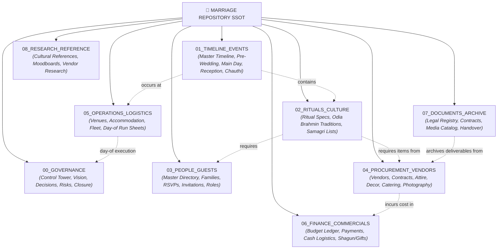
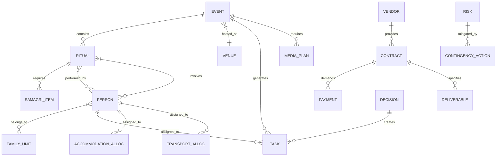
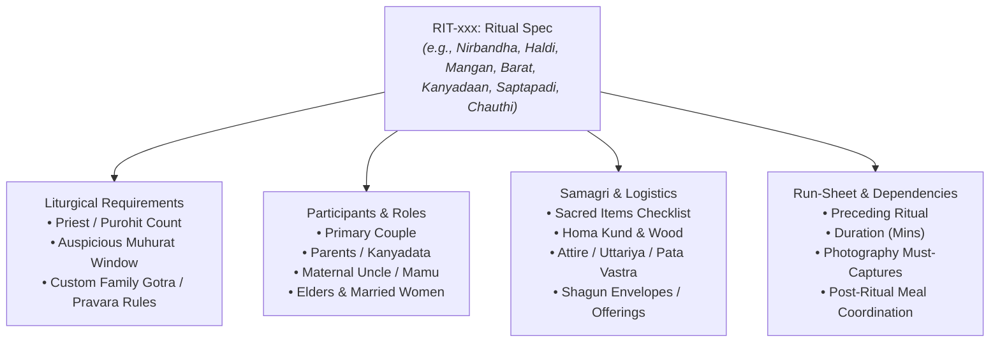
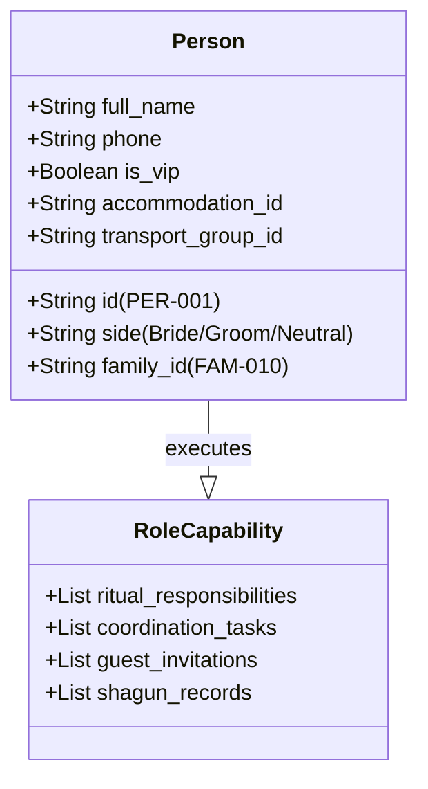
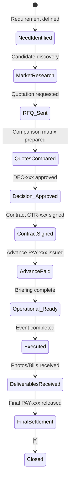
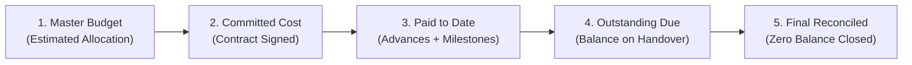
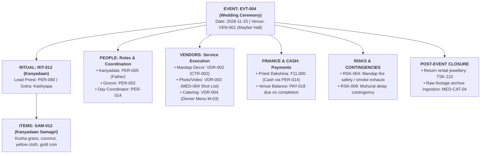

# Directive MARRIAGE-ARCH-001: Marriage Repository Domain Architecture & Information Model Discovery

**Status:** ARCHITECTURE DIRECTIVE DELIVERABLE (READY FOR REVIEW)  
**Target Repository:** `d:\GitHub_Repo\Sree_Krushna`  
**Architectural Baseline:** Clean-slate repository initialization  
**Author:** Antigravity Architecture Engine  

---

## 1. Repository Baseline

```
d:\GitHub_Repo\Sree_Krushna\
└── (Clean Initial State - No pre-existing legacy files or schema conflicts)
```

- **Current State:** The target repository directory is pristine and completely empty.
- **Git Context:** Part of the active multi-project workspace `goldenage399/GitHub_Repo`.
- **Architectural Implications:** 
  - Zero technical debt or legacy schema migrations required.
  - Complete freedom to establish a mathematically rigorous, relational, SSOT-driven Markdown + YAML Frontmatter knowledge architecture from Day 1.
  - Strict enforcement of naming conventions, entity IDs, metadata schemas, and bidirectional linking rules before any content ingestion begins.

---

## 2. Architectural Objective

Establish a **durable, relational, human-navigable, and machine-actionable Marriage Operating System (SSOT)** designed to serve the complete marriage lifecycle: from early vision and decision-making through procurement, minute-by-minute execution, post-wedding rituals (e.g., Chauthi, Astamangala), legal registrations, financial reconciliation, and multi-decade digital archival retrieval.

### Core Architecture Axioms:
1. **SSOT (Single Source of Truth):** Every fact (a phone number, a contract amount, a ritual item, a venue gate number) has exactly **one canonical home**. All other locations reference it.
2. **Bidirectional Traceability:** Upward from micro-logistics ("Who has the mandap flowers?") to governance/cost/timeline, and downward from governance ("What is pending 7 days out?") to actionable tasks and responsible individuals.
3. **Separation of Form vs Content:** Raw canonical data (entities) vs operational run-sheets and dashboards (derived views/indexes).
4. **Anti-Duplication:** People are single entities regardless of whether they act as guests, coordinators, ritual participants, or family elders.
5. **Phase-Agnostic Durability:** The repository remains useful and structured during planning, under execution pressure, and during post-wedding archival.

---

## 3. Domain Decomposition & Taxonomy Critique

### Evaluation of the Candidate 23-Domain Hypothesis

| Candidate Domain | Architectural Assessment | Recommendation |
| :--- | :--- | :--- |
| `00 Governance & Master Control` | Vital; control tower for metrics, open decisions, and health | **Retain as Core Pillar `00_GOVERNANCE`** |
| `01 Marriage Vision & Decisions` | Essential for decision rationale and boundaries | Merge under `00_GOVERNANCE/decisions` & `vision` |
| `02 Master Timeline & Event Sequence` | Central backbone entity for all temporal coordination | **Promote to Core Pillar `01_TIMELINE_EVENTS`** |
| `03 Ceremonies & Rituals` | Deep domain with distinct liturgical & samagri needs | **Promote to Core Pillar `02_RITUALS_CULTURE`** |
| `04 People, Families & Guests` | Core entity domain (people, households, RSVPs, roles) | **Promote to Core Pillar `03_PEOPLE_GUESTS`** |
| `05 Venues & Logistics` | Spatial anchor for events | Group with operations under `05_OPERATIONS_LOGISTICS` |
| `06 Vendors & Procurement` | Commercial backbone (procurement lifecycle) | **Promote to Core Pillar `04_PROCUREMENT_VENDORS`** |
| `07 Attire, Jewellery & Personal Prep` | High-value inventory & trial schedules | Model as specialized inventory under `04_PROCUREMENT` + `02_RITUALS` |
| `08 Invitations, Cards & Communication` | Communications & distribution lifecycle | Model as guest-lifecycle sub-domain under `03_PEOPLE_GUESTS` |
| `09 Decor, Floral & Visual Design` | Vendor service category + spatial design | Model under `04_PROCUREMENT` & `05_OPERATIONS` |
| `10 Food, Hospitality & Catering` | Vendor service category + menu operations | Model under `04_PROCUREMENT` & `05_OPERATIONS` |
| `11 Photography, Video & Media` | Vendor service + shot lists + coverage plans | Model planning under `04_PROCUREMENT`, deliverables in `07_ARCHIVE` |
| `12 Gifts, Shagun & Family Exchange` | Financial/Inventory exchange tracking | Model under `06_FINANCE` & `03_PEOPLE_GUESTS` |
| `13 Finance, Payments & Budget` | Quantitative ledger (Estimated/Committed/Paid) | **Promote to Core Pillar `06_FINANCE_COMMERCIALS`** |
| `14 Transport, Stay & Movement` | Fleet and room allocation logistics | Sub-domain of `05_OPERATIONS_LOGISTICS` |
| `15 Wedding-Day Operations` | Derived dynamic run-sheets and mission control | View layer under `05_OPERATIONS_LOGISTICS` + `00_GOVERNANCE` |
| `16 Reception & Post-Wedding Events` | Temporal event instances (not architectural layers) | Model as canonical `EVENT` entities in `01_TIMELINE_EVENTS` |
| `17 Chauthi / Post-Marriage Customs` | Temporal event + ritual cluster | Model as canonical `EVENT` & `RITUAL` entities |
| `18 Documents & Legal / Admin` | Official certificates, IDs, and statutory filings | Model under `07_DOCUMENTS_ARCHIVE` |
| `19 Risks, Contingencies & Backups` | Cross-cutting risk register | Model under `00_GOVERNANCE/risks` |
| `20 Photos, Videos & Digital Archive` | Long-term asset links, raw/edited media index | Model under `07_DOCUMENTS_ARCHIVE` |
| `21 Post-Wedding Closure` | Checklist & reconciliation workflow | Model under `00_GOVERNANCE/closure` |
| `22 Reference Library` | Static knowledge, traditions, vendor research | **Promote to Core Pillar `08_RESEARCH_REFERENCE`** |

---

## 4. Synthesized 9-Pillar Canonical Architecture



---

## 5. Canonical Entity Model & Metadata Schemas

Every core entity is represented as a structured Markdown file with standard YAML Frontmatter and strict type definitions:



### Entity Definition Table

| Entity Type | Entity ID Prefix | Canonical Directory | Mandatory Frontmatter Fields |
| :--- | :--- | :--- | :--- |
| **Event** | `EVT-xxx` | `01_TIMELINE_EVENTS/` | `id, title, date, start_time, end_time, venue_id, lead_coordinator_id, dress_code, status` |
| **Ritual** | `RIT-xxx` | `02_RITUALS_CULTURE/specs/` | `id, event_id, name, tradition, duration_mins, priest_required, key_participants, samagri_checklist_id` |
| **Person** | `PER-xxx` | `03_PEOPLE_GUESTS/directory/` | `id, full_name, family_id, relation_side (Bride/Groom), category (VIP/Elder/Friend), phone, accommodation_req, rsvp_status` |
| **Family Unit** | `FAM-xxx` | `03_PEOPLE_GUESTS/families/` | `id, household_name, head_person_id, city, total_pax, invitation_sent, invitation_mode` |
| **Venue** | `VEN-xxx` | `05_OPERATIONS_LOGISTICS/venues/` | `id, name, location, contact_person, capacity, spaces_available, power_backup_type, curfew_time` |
| **Vendor** | `VDR-xxx` | `04_PROCUREMENT_VENDORS/vendors/` | `id, category, business_name, primary_contact, phone, contract_id, total_committed, paid_to_date, status` |
| **Contract** | `CTR-xxx` | `04_PROCUREMENT_VENDORS/contracts/` | `id, vendor_id, scope_summary, total_cost, advance_paid, balance_due, payment_milestones, contract_file` |
| **Task** | `TSK-xxx` | `00_GOVERNANCE/tasks/` | `id, title, event_id, owner_id, deadline, priority, depends_on, status (Backlog/In-Progress/Done)` |
| **Decision** | `DEC-xxx` | `00_GOVERNANCE/decisions/` | `id, title, status (Proposed/Approved/Frozen), deciders, date_decided, options_considered, impact` |
| **Payment** | `PAY-xxx` | `06_FINANCE_COMMERCIALS/ledger/` | `id, contract_id, vendor_id, amount, payment_mode, paid_date, paid_by, transaction_ref, receipt_link` |
| **Risk** | `RSK-xxx` | `00_GOVERNANCE/risks/` | `id, title, category, severity, probability, owner_id, mitigation_plan, trigger_event, fallback_contact` |
| **Media Plan** | `MED-xxx` | `04_PROCUREMENT_VENDORS/photography/` | `id, event_id, vendor_id, must_have_shots, crew_count, drone_allowed, expected_delivery_date` |

---

## 6. Event-Centric Architecture vs Domain Matrix

**Architectural Justification:**  
A wedding is experienced **temporally** during execution, but prepared **functionally** during planning. 

Therefore, our architecture uses a **Dual-Index Model**:
1. **Canonical Entity Records** are organized by functional domain (e.g., `PER-014` in `03_PEOPLE_GUESTS`, `VDR-003` in `04_PROCUREMENT_VENDORS`).
2. **Event Specifications (`EVT-xxx`)** act as orchestration hubs that link relational entities into concrete time-bound instances.

```
                  ┌───────────────────────────────┐
                  │      EVT-004: Wedding Day     │
                  └───────────────┬───────────────┘
                                  │
       ┌──────────────────────────┼──────────────────────────┐
       ▼                          ▼                          ▼
┌──────────────┐           ┌──────────────┐           ┌──────────────┐
│   RIT-012    │           │   VEN-001    │           │   VDR-002    │
│  Kanyadaan   │           │ Main Mandap  │           │ Photographer │
└──────┬───────┘           └──────────────┘           └──────┬───────┘
       │                                                     │
       ▼                                                     ▼
┌──────────────┐                                      ┌──────────────┐
│   PER-005    │                                      │   MED-003    │
│ Bride Father │                                      │  Shot List   │
└──────────────┘                                      └──────────────┘
```

---

## 7. Ritual & Cultural Model (Odia Brahmin Traditions Framework)

Rituals are modeled with strict liturgical requirements, temporal sequencing, and material (Samagri) requirements:



---

## 8. People, Family, Guest & Accommodation Model

A human is represented **once** as `PER-xxx` to prevent duplicate phone numbers, discordant dietary preferences, and confusion.



---

## 9. Vendor, Procurement & Lifecycle Model

Every vendor engagement progresses through a governed state machine:



---

## 10. Financial Model: Planned vs Committed vs Actual

Financial truth is governed through strict accounting states:



- **Cash & Envelope Management:** Dedicated register for Day-of cash envelopes (Priest Dakshina, Tips, Emergency Overtime, Shagun) with allocated cash handlers (`PER-xxx`).

---

## 11. Task, Dependency & Decision Architecture

- **Lightweight Frontmatter Tracking:** Tasks are tracked via standard fields (`id, title, owner, event, due_date, status, blocked_by`).
- **Formal Decision Records (`DEC-xxx`):** Any choice involving >₹10,000 budget variation, date changes, vendor selection, or family-wide policy requires an explicit Decision Record.

```
DEC-008: Selection of Wedding Day Venue
├── Context & Requirements (Capacity 500+, Odia catering allowed, Mandap space)
├── Options Evaluated (Venue A, Venue B, Venue C)
├── Financial & Logistical Comparison
├── Approved Choice & Stakeholder Sign-Off
└── Downstream Actions (Generate CTR-002, TSK-045 Advance Payment)
```

---

## 12. Single Source of Truth (SSOT) Map

| Information Class | Canonical SSOT Location | Prohibited Duplicate Locations | Derived Views / Consumers |
| :--- | :--- | :--- | :--- |
| **Event Master Dates & Muhurats** | `01_TIMELINE_EVENTS/master_timeline.md` | Vendor notes, chat logs, invitations drafts | `00_GOVERNANCE/dashboard.md`, Run sheets |
| **Ritual Sequence & Rules** | `02_RITUALS_CULTURE/specs/RIT-xxx.md` | General word docs, email notes | Master Day-of Run Sheet, Priest Brief |
| **Guest Phone & Address** | `03_PEOPLE_GUESTS/directory/PER-xxx.md` | Multiple spreadsheets, address books | Invitation tracker, Room allocations |
| **Vendor Pricing & Scope** | `04_PROCUREMENT_VENDORS/contracts/CTR-xxx.md`| WhatsApp chats, informal scraps | `06_FINANCE_COMMERCIALS/budget.md` |
| **Payment Transactions** | `06_FINANCE_COMMERCIALS/ledger/PAY-xxx.md` | Individual vendor notes, bank slips alone | Vendor payment tracker, Budget summary |
| **Venue Floor Plans & Logistics** | `05_OPERATIONS_LOGISTICS/venues/VEN-xxx.md` | Decorator notes, caterer emails | Decor briefing, Seating plan |
| **Photography Shot List** | `04_PROCUREMENT_VENDORS/photography/MED-xxx.md`| Personal phone notes | Day-of media coordinator run-sheet |
| **Official Documents & Registrations** | `07_DOCUMENTS_ARCHIVE/legal/` | Random desk drawers / scattered scans | Legal verification checklist, Passport office |

---

## 13. Proposed Repository File Structure

```text
d:\GitHub_Repo\Sree_Krushna\
├── 00_GOVERNANCE/
│   ├── dashboard.md                       # Master marriage control center & KPIs
│   ├── vision_and_principles.md           # Couple & family aesthetic/scale guidelines
│   ├── decisions/                         # DEC-xxx formal decision records
│   ├── tasks/                             # TSK-xxx cross-cutting task registers
│   ├── risks/                             # RSK-xxx risk register & contingency matrices
│   └── closure/                           # Post-wedding closure checklist & sign-offs
│
├── 01_TIMELINE_EVENTS/
│   ├── master_timeline.md                 # Complete milestone roadmap (Months -> Weeks -> Days)
│   ├── pre_wedding/                       # EVT-001 (Nirbandha/Ashirbad), EVT-002 (Mehendi/Haldi)
│   ├── wedding_day/                       # EVT-003 (Mangan/Barat), EVT-004 (Kanyadaan/Saptapadi)
│   ├── reception/                         # EVT-005 (Grand Reception)
│   └── post_wedding/                      # EVT-006 (Chauthi / Astamangala / Grihapravesh)
│
├── 02_RITUALS_CULTURE/
│   ├── ritual_master_index.md             # Full chronological ritual taxonomy
│   ├── specs/                             # RIT-xxx liturgical specs (Priest, Gotra, Mantras)
│   ├── samagri_checklists/                # SAM-xxx sacred materials & procurement lists
│   └── family_customs_reference.md        # Clan/Kula specific rites and elder guidance
│
├── 03_PEOPLE_GUESTS/
│   ├── people_master_index.md             # Aggregated queryable guest register
│   ├── directory/                         # PER-xxx canonical individual profiles
│   ├── families/                          # FAM-xxx household units for card distribution
│   ├── invitations/                       # Card designs, distribution routes, RSVP tracking
│   └── responsibility_matrix.md           # RACI matrix for family & coordinators
│
├── 04_PROCUREMENT_VENDORS/
│   ├── vendor_master_index.md             # Status summary of all vendor domains
│   ├── vendors/                           # VDR-xxx business profiles & contacts
│   ├── contracts/                         # CTR-xxx scopes, deliverables & terms
│   ├── photography/                       # Shot lists, crew schedules, raw/edited media pipeline
│   ├── decor_and_design/                  # Moodboards, stage layouts, floral specs
│   ├── food_and_catering/                 # Menus, tastings, VIP/Priest food arrangements
│   └── attire_and_jewellery/              # Wardrobe inventory, fitting timelines, safety vaults
│
├── 05_OPERATIONS_LOGISTICS/
│   ├── venues/                            # VEN-xxx layouts, permissions, generator backups
│   ├── accommodation/                     # Hotel block contracts, rooming lists, check-in leads
│   ├── transport_and_fleet/               # Vehicle assignments, airport/station pickup rosters
│   └── day_of_run_sheets/                 # Minute-by-minute operational run sheets
│
├── 06_FINANCE_COMMERCIALS/
│   ├── budget_master.md                   # Category-wise Planned vs Committed vs Actual ledger
│   ├── ledger/                            # PAY-xxx payment receipts & advance vouchers
│   ├── cash_logistics.md                  # Day-of petty cash, tips, and Priest Dakshina custody
│   └── gifts_and_shagun/                  # GFT-xxx exchange ledger (incoming & outgoing)
│
├── 07_DOCUMENTS_ARCHIVE/
│   ├── legal/                             # Marriage registration, affidavit templates, IDs
│   ├── vendor_contracts_archive/          # Signed PDF copies
│   └── digital_media_catalog.md           # Cloud drive links (Raw photos, 4K film, edited albums)
│
├── 08_RESEARCH_REFERENCE/
│   ├── cultural_knowledge/                # Odia marriage Vedic manuals, slokas, traditions
│   ├── vendor_benchmarks/                 # Market rates, shortlisted alternatives
│   └── inspiration_boards/                # Decor/attire references & color palettes
│
├── README.md                              # Repository entry point & navigation guide
└── ARCHITECTURE_SPEC.md                   # Frozen architectural manifest
```

---

## 14. Naming & Identity Conventions

| Domain | ID Format | File Naming Syntax | Example |
| :--- | :--- | :--- | :--- |
| **Event** | `EVT-###` | `EVT-###_<event_slug>.md` | `EVT-004_kanyadaan_and_saptapadi.md` |
| **Ritual** | `RIT-###` | `RIT-###_<ritual_name>.md` | `RIT-012_saptapadi_seven_vows.md` |
| **Person** | `PER-###` | `PER-###_<firstname_lastname>.md` | `PER-045_rajesh_mohapatra.md` |
| **Family** | `FAM-###` | `FAM-###_<household_name>.md` | `FAM-012_mohapatra_cuttack.md` |
| **Venue** | `VEN-###` | `VEN-###_<venue_short_name>.md` | `VEN-002_mayfair_convention_hall.md` |
| **Vendor** | `VDR-###` | `VDR-###_<service>_<vendor_name>.md` | `VDR-003_photo_creative_studio.md` |
| **Contract** | `CTR-###` | `CTR-###_<vendor_short>_<service>.md` | `CTR-003_creative_studio_wedding_film.md` |
| **Task** | `TSK-###` | `TSK-###_<action_summary>.md` | `TSK-089_confirm_priest_samagri_list.md` |
| **Decision** | `DEC-###` | `DEC-###_<decision_topic>.md` | `DEC-004_select_caterer_menu_tier.md` |
| **Payment** | `PAY-###` | `PAY-###_<date>_<vendor_short>.md` | `PAY-023_20261110_mayfair_advance.md` |
| **Risk** | `RSK-###` | `RSK-###_<risk_summary>.md` | `RSK-007_monsoon_waterlogging_venue.md` |

---

## 15. Scenario Stress-Test Verification

We rigorously tested this architecture against the 14 mandatory operational stress scenarios:

| # | Stress Scenario | Architectural Resolution Route | Traceability Proof |
| :--- | :--- | :--- | :--- |
| **1** | *"Who is responsible for the photographer on the wedding day?"* | `05_OPERATIONS_LOGISTICS/day_of_run_sheets/` & `03_PEOPLE_GUESTS/responsibility_matrix.md` | Resolves to designated lead `PER-008` (Coordinator), linked to `VDR-003` contact and `MED-002` shot list. |
| **2** | *"What rituals happen between 10 AM and lunch?"* | `01_TIMELINE_EVENTS/wedding_day/` → `05_OPERATIONS_LOGISTICS/day_of_run_sheets/` | Filters `EVT-004` sub-events between 10:00 and 13:30; surfaces `RIT-008` (Mangan) and `RIT-009` (Snana). |
| **3** | *"What does the photographer need to capture during the wedding?"* | `04_PROCUREMENT_VENDORS/photography/MED-004_wedding_shot_list.md` | Directly itemizes mandatory rituals (`RIT-011` to `RIT-015`), key family members (`PER-001` to `PER-012`), and stage timing. |
| **4** | *"Which vendors still have outstanding payments?"* | `06_FINANCE_COMMERCIALS/budget_master.md` | Computes column `(Committed - Paid = Outstanding)` grouped by `VDR-xxx` with due dates. |
| **5** | *"Which guests need accommodation?"* | `03_PEOPLE_GUESTS/people_master_index.md` | Queries `accommodation_req: true` mapped directly to hotel room blocks in `05_OPERATIONS_LOGISTICS/accommodation/`. |
| **6** | *"What items are required for Ritual X?"* | `02_RITUALS_CULTURE/specs/RIT-012.md` → `samagri_checklist_id: SAM-012` | Single file lists items, quantities, who procures them, and delivery deadline. |
| **7** | *"Which tasks must be completed before the reception?"* | `00_GOVERNANCE/tasks/` queried for `event_id: EVT-005` & `status != Done` | Surfaces stage handover check, DJ soundcheck, gift table custodian, and change-room key allocation. |
| **8** | *"What happens if the photographer cancels?"* | `00_GOVERNANCE/risks/RSK-003_photographer_noshow.md` | Direct link to backup vendor shortlist in `08_RESEARCH_REFERENCE/vendor_benchmarks/` with signed SLA terms. |
| **9** | *"What has been decided regarding the invitation cards?"* | `00_GOVERNANCE/decisions/DEC-006_invitation_format.md` | Complete record of physical vs digital card count, printer `VDR-007`, approved text proofs, and distribution schedule. |
| **10** | *"How much has actually been spent versus the planned budget?"* | `06_FINANCE_COMMERCIALS/budget_master.md` | Aggregated real-time variance table: `Planned Budget` vs `Committed (Contracts)` vs `Actual Cash/Bank Outflow`. |
| **11** | *"Show everything associated with the Chauthi event."* | `01_TIMELINE_EVENTS/post_wedding/EVT-006_chauthi.md` | Orchestrates `RIT-019` (Chauthi Puja), `VEN-004` (Home Setup), `PER-xxx` (In-laws attendees), `VDR-003` (Photo), `GFT-005` (Customary Gifts). |
| **12** | *"What remains unresolved one week before the wedding?"* | `00_GOVERNANCE/dashboard.md` (Open Decisions + Overdue Tasks + Unconfirmed RSVPs) | Single glance shows all un-frozen `DEC-xxx`, overdue `TSK-xxx`, and pending `CTR-xxx`. |
| **13** | *"Where are all final wedding photographs and videos?"* | `07_DOCUMENTS_ARCHIVE/digital_media_catalog.md` | Canonical cloud storage catalog organized by Event ID, with checksums, master album links, and raw file hard drive custody. |
| **14** | *"What obligations remain after the wedding?"* | `00_GOVERNANCE/closure/post_wedding_closure.md` | Comprehensive checklist: Vendor final balances, rental costume returns, marriage certificate issuance, thank-you notes, and photo album approvals. |

---

## 16. Event Dependency Propagation Example (Traceability Demonstration)

To illustrate how a single event cleanly integrates across all domains without duplication:



---

## 17. Implementation Gate: Review & Next Steps

```
========================================================================================
                                 GATEWAY STATUS
========================================================================================
[✔] READY FOR REVIEW
    - Complete 9-Pillar Information Architecture.
    - Entity Schemas & Relationship Graph.
    - SSOT Mapping & Anti-Duplication Rules.
    - 14 Scenario Stress-Test Validations.
    - Naming and Identifier Conventions.

[?] REQUIRES HUMAN CONFIRMATION / DECISION
    1. Confirm the 9-Pillar directory structure as the canonical organization.
    2. Confirm whether Odia Hindu / Brahmin specific rituals (Nirbandha, Mangan, Kanyadaan, Saptapadi, Chauthi, Astamangala) should be pre-scaffolded as empty canonical template specs.
    3. Confirm currency standard (INR ₹ default) and ID numbering format (3-digit vs 4-digit padding).

[🔒] SAFE TO AUTOMATE AFTER APPROVAL (DO NOT EXECUTE YET)
    - Generation of root `README.md` and `ARCHITECTURE_SPEC.md`.
    - Creation of 9 core pillar directories and placeholder index files.
    - Provision of standard Markdown template files (`event_template.md`, `person_template.md`, `vendor_template.md`, `task_template.md`, `decision_template.md`).
    - Implementation of `00_GOVERNANCE/dashboard.md` master tracker.
========================================================================================
```
