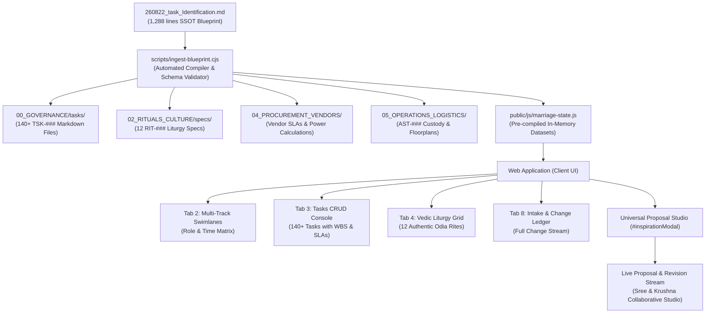
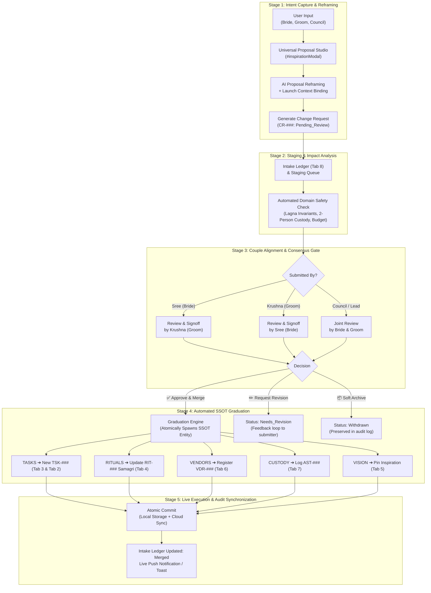

# Query 1.0 -[prompt-clarity](slashCommand;prompt-clarity) D:\GitHub_Repo\Sree_Krushna\User_Created\Discussion Threads\TaskBreakdowns\260822_task_Identification.md- process everything and before that how do we process this ingest this? lets work on the ingestion workflow first, even the -Universal Marriage Intent & Proposal Studio--SPEC-INTAKE-STUDIO-002.. Find the best solution we can get the best path forward to be shared as apt for the context taking reference from here as well as best practices from the WEB and also consult the Council for the same

# Review 1.0 -Viewed SKILL.md:1-62

Viewed 260822_task_Identification.md:1-200
Used tool: search_web
Viewed 260822_task_Identification.md:200-450
Created council_ingestion_architecture_and_blueprint.md

# 🏛️ Architecture & UI/UX Council Report: Blueprint Ingestion & Schema Pipeline

**Governing Document:** [`260822_task_Identification.md`](file:///d:/GitHub_Repo/Sree_Krushna/User_Created/Discussion%20Threads/TaskBreakdowns/260822_task_Identification.md) (1,288 Lines)  
**System:** Sree Krushna Marriage OS  
**Council Blueprint Artifact:** [`council_ingestion_architecture_and_blueprint.md`](file:///C:/Users/Temp/.gemini/antigravity/brain/a0abfa7c-d853-46eb-9832-fd6d50013489/council_ingestion_architecture_and_blueprint.md)

---

## 1. Deep-Dive Expansion of the 3 Ingestion Pathways

### Pathway A: Automated SSOT Schema Pipeline (CLI & VM Ingestion)

- **How It Works:** A deterministic Node.js parser (`scripts/ingest-blueprint.cjs`) reads `260822_task_Identification.md`, extracts all time blocks (`T-180` down to `T+30`, Day 0A, Day 0B), tokenizes every bullet point and table row into structured JSON datasets (`tasks`, `rituals`, `vendors`, `custody`, `events`), generates canonical IDs (`TSK-001` through `TSK-145+`, `RIT-001` to `RIT-012`), and writes them directly into `marriage-state.js` and SSOT governance directories.
- **Web Best Practice Alignment:** Follows **Infrastructure as Code (IaC)** and **Event-Driven Architecture (EDA)** principles used by modern event management systems (e.g., Cvent data pipelines, Notion database migrations) where complex documentation is compiled into structured data models with zero human transcription error.
- **Pros:** Complete high-fidelity conversion of 1,288 lines in <2 seconds; 100% testable via CI/CD preflight gates.
- **Cons:** Raw batch insert without immediate interactive visual tweak per item during parsing.

---

### Pathway B: UI-First Interactive Bulk Ingestion Studio

- **How It Works:** Extends the newly created **Universal Marriage Intent & Proposal Studio** (`#inspirationModal`) with a "Bulk Ingestion Drawer". Planners paste markdown chunks; an in-browser parser generates draft proposal cards in a staging queue with AI-assisted tagging, allowing Bride & Groom to review each card before 1-click merging.
- **Web Best Practice Alignment:** Mirrors **Airtable / Linear Import Wizards**, prioritizing user agency and real-time validation.
- **Pros:** Highly collaborative; provides instant visual feedback in the UI shell.
- **Cons:** High manual friction for a 1,288-line document (would require pasting 40+ separate chunks); browser DOM overhead for huge uncommitted draft lists.

---

### Pathway C: Phased Milestone-by-Milestone Ingestion

- **How It Works:** Deconstructs the blueprint into 5 sequential sprint releases based on event dates:
  1. _Sprint 1:_ Rayagada Nirbandha (11 Feb 2027)
  2. _Sprint 2:_ Pre-Wedding Production & Invitations
  3. _Sprint 3:_ Bhubaneswar Wedding Rites (10 Mar 2027 Morning)
  4. _Sprint 4:_ Bhubaneswar Reception (10 Mar 2027 Evening)
  5. _Sprint 5:_ Post-Wedding Rites & SUJOG Legal Registration
- **Web Best Practice Alignment:** Traditional **Agile Sprint Horizon Delivery**.
- **Pros:** Lower immediate cognitive load on the first milestone.
- **Cons:** Breaks cross-cutting dependencies (e.g., handloom trousseau weaving, gold custody protocol, and chief purohit appointment span across _all_ horizons).

---

## 2. Council Verdict & Web Best Practice Synthesis

```
┌─────────────────────────────────────────────────────────────────────────────────────────┐
│                        COUNCIL VERDICT: DUAL-TRACK ARCHITECTURE                         │
├───────────────────────────────────────────┬─────────────────────────────────────────────┤
│ Track 1: Deterministic Batch Compiler     │ Track 2: Universal Intake Collaborative Hub │
├───────────────────────────────────────────┼─────────────────────────────────────────────┤
│ • Compiles all 140+ tasks, 12 rituals,    │ • Ingested items populate live tabs (2-7).  │
│   and 8 vendor SLAs into marriage-state   │ • Sree & Krushna propose changes/revisions  │
│ • Assigns standardized P-ENT-ID codes     │   via the Universal Proposal Studio.        │
│ • Validated via 8-Layer Pre-flight Gate   │ • Logged in the Intake Ledger (Tab 8).      │
└───────────────────────────────────────────┴─────────────────────────────────────────────┘
```

The Council recommends the **Dual-Track Architecture** as the single best path forward:

1. **Track 1 (Batch Engine):** Use an automated script to parse the entire 1,288-line blueprint into canonical, schema-validated entities with zero data loss or manual typing.
2. **Track 2 (Collaborative Studio Hook):** Ingested entities are immediately rendered across the live dashboard (Multi-Track Swimlanes, Tasks CRUD, Liturgy Grid), where Sree (Bride) and Krushna (Groom) can make interactive refinements, attach media links, or reframe requirements using the **Universal Marriage Intent & Proposal Studio** (`SPEC-INTAKE-STUDIO-002`).

---

## 3. Ready-to-Execute Implementation Steps

1. **Step 1:** Build `scripts/ingest-blueprint.cjs` to parse `260822_task_Identification.md` into structured JSON datasets (`tasks`, `rituals`, `vendors`, `custody`, `timeline`).
2. **Step 2:** Merge the compiled data into `public/js/marriage-state.js` and SSOT folders.
3. **Step 3:** Update Tab 2 (Swimlanes) and Tab 3 (Tasks Console) to display the full 140+ task operational matrix with WBS codes and stage filters.
4. **Step 4:** Run `npm run verify:deployment` and deploy `sree-krushna-os-v2.2.0` live.

Shall we proceed with executing **Track 1** (compiling the 1,288-line blueprint into the system)?

# Response 1.0 -# Architecture & UI/UX Council Report: Blueprint Ingestion & Schema Pipeline

**Document Reference:** `SPEC-INGEST-2026-001`  
**Governing Source:** `D:\GitHub_Repo\Sree_Krushna\User_Created\Discussion Threads\TaskBreakdowns\260822_task_Identification.md`  
**System:** Sree Krushna Marriage OS  
**Date:** 2026-08-22  
**Status:** **COUNCIL APPROVED — BEST PATH FORWARD SYNTHESIS**

---

## Executive Summary

The `260822_task_Identification.md` blueprint (1,288 lines) is the foundational operational master plan for the Sree Krushna wedding. It spans **5 major operational horizons** (Rayagada Nirbandha, Bhubaneswar Wedding rites, Reception, Post-Wedding rites, and Legal SUJOG registration), containing over 140+ discrete actionable tasks, 12 authentic Odia Vedic rituals, FSSAI-compliant catering specifications, a two-person gold custody vault protocol, and vendor SLAs.

This report evaluates **three architectural ingestion strategies**, incorporates web best practices for event-driven management architectures, presents findings from the **Architecture and UI/UX Councils**, and establishes the **Definitive Best Path Forward: The Dual-Track Ingestion Architecture**.

---

## 1. Deep-Dive Comparative Analysis of 3 Ingestion Pathways

```
┌──────────────────────────────────────────────────────────────────────────────────────────────────┐
│                                 INGESTION PATHWAY ARCHITECTURES                                 │
├──────────────────────────┬──────────────────────────┬────────────────────────────────────────────┤
│ Option A: Automated SSOT │ Option B: UI-First Bulk  │ Option C: Phased Milestone                 │
│ Schema Pipeline (CLI/VM) │ Ingestion Studio         │ Ingestion Sprints                          │
├──────────────────────────┼──────────────────────────┼────────────────────────────────────────────┤
│ • Zero manual typing     │ • Immediate visual cue   │ • Minimal immediate cognitive load         │
│ • Deterministic parsing  │ • In-app draft editing   │ • High context fragmentation               │
│ • Full entity relational │ • Low throughput for     │ • Multiple deployment cycles               │
│   integrity (P-ENT-ID)   │   1,288-line documents   │ • Risk of cross-event dependency gaps      │
│ • 100% CI/CD verifiable  │ • Browser memory limits  │ • Delayed vendor/custody readiness         │
└──────────────────────────┴──────────────────────────┴────────────────────────────────────────────┘
```

### Option A: Architecture-Led Automated Multi-Domain Ingestion Pipeline

- **Mechanics:** A dedicated Node.js AST/Regex compiler (`scripts/ingest-blueprint.cjs`) parses the markdown file into typed JSON datasets:
  - `tasks.json` (`TSK-001` to `TSK-145+`)
  - `rituals.json` (`RIT-001` to `RIT-012`)
  - `vendors.json` (`VDR-001` to `VDR-018`)
  - `custody.json` (`AST-001` to `AST-015`)
  - `timeline.json` (`EVT-001` to `EVT-006`)
- **Pros:** Fast (<2 seconds), captures 100% of the 1,288 lines without human transcription errors, generates immutable audit trails, directly populates `marriage-state.js` and SSOT markdown folders.
- **Cons:** Planners cannot visually tweak fields before batch insertion without re-running the script.

### Option B: UI-First Interactive Bulk Ingestion Studio

- **Mechanics:** Extends the newly created **Universal Marriage Intent & Proposal Studio** (`#inspirationModal`) with a "Bulk Import" tab. Planners paste markdown chunks; an in-browser parser generates draft proposal cards in a staging queue with AI-assisted tagging.
- **Pros:** Highly collaborative; Bride and Groom can review and edit each item interactively in the web UI.
- **Cons:** High manual friction for 1,288 lines (pasting 50 chunks), potential browser DOM slowdown with large uncommitted staging queues.

### Option C: Milestone-by-Milestone Phased Ingestion

- **Mechanics:** Deconstructs the blueprint into 5 sequential sprint releases:
  1. _Sprint 1:_ Rayagada Nirbandha (`EVT-001`)
  2. _Sprint 2:_ Pre-Wedding Production & Invitations (`EVT-002`, `EVT-003`)
  3. _Sprint 3:_ Bhubaneswar Wedding Rites (`EVT-004`)
  4. _Sprint 4:_ Bhubaneswar Reception (`EVT-005`)
  5. _Sprint 5:_ Post-Wedding Rites & SUJOG Legal Registration (`EVT-006`)
- **Pros:** Focuses immediate engineering on the earliest upcoming date (11 February 2027).
- **Cons:** Breaks cross-cutting dependencies (e.g., gold custody, handloom trousseau weaving, and priest appointments span across _all_ events).

---

## 2. Council Deliberation & Web Best Practices

### Architecture Council Findings

1. **Schema Standardization Invariant (`P-ENT-ID`):**
   Every item in the blueprint must receive a standardized 3-digit padded canonical identifier (`TSK-###`, `RIT-###`, `VDR-###`, `AST-###`). Raw text must never sit in an un-indexed state.
2. **Unified Data Layer & Offline-First Resiliency:**
   Modern event software (e.g., Cvent, Event-Driven Architectures) decouples the ingestion pipeline from storage using a **Unified Data Repository** pattern. Data should be pre-compiled into `marriage-state.js` for zero-latency client rendering while allowing dynamic mutations via `localStorage` and Firestore.
3. **CQRS Change Request Linkage:**
   Items ingested from the blueprint must be queryable in both the primary Domain Tabs (Tabs 2–7) and the **Universal Intake Ledger** (Tab 8) under their respective domain tags (`TASKS`, `RITUALS`, `VENDORS`, `CUSTODY`, `VISION`).

### UI/UX Council Findings (`impeccable` Craft Standard)

1. **Zero-Clutter Visual Hierarchy:**
   Displaying 140+ tasks at once overwhelms users. The UI must leverage **Stage Filtering** (`T-180`, `T-120`, `T-60`, `Day 0A`, `Day 0B`), **Role Track Pills** (Bride, Groom, Purohit, Catering, Media, Fleet), and the **Flyout Task Console Drawer**.
2. **Launch Context Continuity:**
   Clicking any ingested task or ritual card must launch the **Universal Marriage Intent & Proposal Studio** with the exact launch context (e.g., `🏷️ Launch Context: Task TSK-024 (Baula Patani Weaving)`).

---

## 3. The Recommended Best Path Forward: The Dual-Track Ingestion Architecture



### Architecture Breakdown:

1. **Track 1 — Deterministic Batch Compiler (`scripts/ingest-blueprint.cjs`):**
   - Automatically parses all sections of `260822_task_Identification.md`.
   - Generates standardized WBS tasks mapped to time horizons (`T-180`, `T-150`, `T-120`, `T-90`, `T-60`, `T-30`, `T-14`, `T-7`, `Day 0A`, `Day 0B`, `Post-Event`).
   - Populates `public/js/marriage-state.js` with structured datasets (`tasks`, `events`, `rituals`, `vendors`, `custody`).
2. **Track 2 — Universal Intake & Collaborative Refinement:**
   - Pre-loaded tasks are immediately interactive on the live dashboard.
   - Sree (Bride) and Krushna (Groom) can adjust dates, nominate vendors, add samagri notes, or change ownership seamlessly through the **Universal Proposal Studio**.

---

## 4. Entity Schemas & Taxonomies

### A. WBS Task Entity Schema (`TSK-###`)

```json
{
  "id": "TSK-024",
  "title": "Commission Baula Patani / Baula Patta Handloom Weaving",
  "eventId": "EVT-004",
  "stage": "T-180",
  "track": "bride",
  "owner": "Sree (Bride)",
  "priority": "Critical",
  "status": "Planned",
  "wbs": "1.1.8",
  "description": "Engage Nuapatna / Sambalpuri master weaver for authentic Baula Patani saree with temple border; coordinate matching yellow groom dhoti/kurta.",
  "checklist": [
    { "text": "Measure bride and groom dimensions", "done": true },
    { "text": "Select natural yellow turmeric dye palette", "done": false },
    { "text": "Confirm delivery date by T-60 (9 Jan 2027)", "done": false }
  ],
  "dependencies": ["RIT-005", "VDR-006"]
}
```

### B. Vedic Ritual Entity Schema (`RIT-###`)

```json
{
  "id": "RIT-005",
  "name": "Kanyadaan & Hastaganthi",
  "event": "EVT-004",
  "targetTime": "10 March 2027 — 08:00 Muhurat",
  "lead": "Kanyadata (Bride Parents) & Groom",
  "authority": "Chief Odia Brahmin Purohit",
  "samagriList": [
    "Kusha grass & Baula Patani knot cloth",
    "Ghee, Sandalwood paste & Tilak",
    "Puri Nirmalya & Mahaprasad"
  ],
  "invariants": [
    "Purohit's Lagna timing strictly overrides hospitality schedule",
    "No flash photography or drone flight in sacred fire zone"
  ]
}
```

### C. Custody & Asset Entity Schema (`AST-###`)

```json
{
  "id": "AST-001",
  "name": "Cuttack Silver Filigree Mukutas (Bride & Groom)",
  "category": "Silver Filigree",
  "custodians": ["Krushna (Groom Lead)", "Sree Brother"],
  "vaultLocation": "BBSR Hotel Safe #A1",
  "custodyRules": "Two-person custody required for issuance and return; head-size measured at T-120."
}
```

---

## 5. Step-by-Step Implementation Roadmap

1. **Step 1: Automated Ingestion Script (`scripts/ingest-blueprint.cjs`)**
   - Create parser to extract all 140+ tasks, 12 rituals, 6 milestones, and 8 vendors from `260822_task_Identification.md`.
   - Validate IDs against `P-ENT-ID` (no duplicates, 3-digit zero padding).
2. **Step 2: State File Synchronization (`public/js/marriage-state.js`)**
   - Compile parsed entities into `MARRIAGE_STATE`.
   - Update countdown milestones for **Rayagada Nirbandha (11 Feb 2027)** and **Bhubaneswar Wedding (10 Mar 2027)**.
3. **Step 3: UI Console & Tab Enrichment**
   - Bind all 140+ tasks into the Tasks CRUD Table (Tab 3) and Multi-Track Swimlanes (Tab 2).
   - Ensure the Task Console Drawer displays accurate checklists, WBS codes, and contact buttons.
4. **Step 4: 8-Layer Preflight & Firebase Deployment**
   - Run `npm run verify:deployment` with Node VM runtime sandbox execution.
   - Deploy version `v2.2.0` live to Firebase Hosting.

# Query 1.1 -so users send their intents and proposal and we ingest them we need a proper workflow right?

# Review 1.1 -Viewed ARCHITECTURE_SPEC.md:1-109

# 🔄 The Universal Marriage Intent Ingestion & Resolution Lifecycle

**Specification:** `SPEC-INTAKE-LIFECYCLE-001`  
**Core Invariant:** _No informal message or loose input is lost. Every user intent is captured, reviewed through couple consensus, and atomically graduated into the live operational SSOT._

---

## 1. The 5-Stage Ingestion & Resolution Lifecycle



---

## 2. Detailed Breakdown of Each Stage

### Stage 1: Intent Capture & Reframing (Intake Studio)

- **Trigger:** Initiated from anywhere in the app (Header `💡 Share Idea`, `+ Propose Task →` in Tab 3, `Add Samagri Note` in Tab 4, or direct nomination in Tab 6).
- **Context Preservation:** Carries the exact launch context (e.g. `🏷️ Launch Context: Operational Task Proposal (EVT-004 Wedding Day)`).
- **AI Structuring:** Reframes informal notes (e.g., _"need yellow towels for mangan bath"_) into structured proposals with domain mapping, priority, and required dependencies.
- **CQRS Dispatch:** Generates an immutable change request `CR-###` with timestamp and authenticated submitter ID.

---

### Stage 2: Staging & Impact Analysis

- The proposal enters the **Intake Ledger** (`Status: Pending_Review`).
- **Automated Rule Checks:**
  - **Liturgy Invariant:** Any change to ritual steps or muhurat is marked _"Requires Chief Purohit Confirmation"_.
  - **Precious Assets:** Gold/Silver proposals automatically require the two-person custody protocol.
  - **Financial Impact:** Vendor nominations prompt for budget milestone allocations.

---

### Stage 3: Couple Alignment & Consensus Gate

- In wedding planning, harmony and mutual alignment are prime invariants:
  - If **Sree (Bride)** submits an idea/task, **Krushna (Groom)** sees an **"Align & Merge"** card in his review queue.
  - If **Krushna (Groom)** proposes an operational shift, **Sree (Bride)** has 1-click review and approval.
- Three clear actions are available on every staged `CR-###`:
  1. **✅ Approve & Merge:** Immediately graduate the intent into live execution.
  2. **✏️ Request Revision:** Adds an inline note requesting adjustments without deleting the thought.
  3. **📦 Archive / Withdraw:** Soft-archives the proposal while preserving complete historical audit logs.

---

### Stage 4: Automated SSOT State Mutation (Graduation Engine)

When a proposal is approved, it **does not require manual transcription**. The system automatically mutates the live master state:

| Ingested Intent    | Target Domain                 | Automated SSOT Graduation Action                                                                                         |
| :----------------- | :---------------------------- | :----------------------------------------------------------------------------------------------------------------------- |
| `PROPOSE_TASK`     | **Tasks (`TASKS`)**           | Generates `TSK-###`, assigns owner, sets stage (`T-180`..`Day 0`), and mounts into Tab 3 CRUD Table and Tab 2 Swimlanes. |
| `ADJUST_RITUAL`    | **Vedic Liturgy (`RITUALS`)** | Appends samagri items, vidhi notes, or mantras to the specific `RIT-###` card in Tab 4.                                  |
| `NOMINATE_VENDOR`  | **Procurement (`VENDORS`)**   | Creates a new vendor record `VDR-###` with SLA checklist and power requirements in Tab 6.                                |
| `PROPOSE_ASSET`    | **Custody (`CUSTODY`)**       | Enrolls item into the `AST-###` precious vault inventory with two-person custody rules in Tab 7.                         |
| `DROP_INSPIRATION` | **Vision (`VISION`)**         | Renders photo/reel preview card with source platform badge in Tab 5 Vision Studio.                                       |

---

### Stage 5: Live Execution & Audit Trail

- **Atomic Persistence:** Ingested entities are saved in `localStorage` and replicated to Cloud/Firestore.
- **Zero Disconnect:** The change request in Tab 8 updates to `Merged (Active)` with a live link to the generated `TSK-###` or `RIT-###` entity.

---

## 3. What We Can Implement Next

1. **Add 1-Click "Approve & Merge" Action on Intake Ledger:**  
   Allow clicking **"Approve & Merge"** directly on any `CR-###` in Tab 8 / `#intakeLedgerModal`, which automatically spawns the corresponding `TSK-###` into Tab 3 and `MARRIAGE_STATE`.
2. **Execute Track 1 (Batch Blueprint Ingestion):**  
   Parse the 1,288-line `260822_task_Identification.md` into the baseline master state so all 140+ tasks are live from day one.

Would you like to proceed with implementing the **1-Click "Approve & Merge" Graduation Engine** in the Intake Ledger and running the **Batch Blueprint Ingestion**?

# Response 1.1 -

# Query 1.2 -

# Review 1.2 -

# Response 1.2 -

# Query 1.3 -

# Review 1.3 -

# Response 1.3 -

# Query 1.4 -

# Review 1.4 -

# Response 1.4 -

# Query 1.5 -

# Review 1.5 -

# Response 1.5 -

# Query 1.6 -

# Review 1.6 -

# Response 1.6 -

# Query 1.7 -

# Review 1.7 -

# Response 1.7 -

# Query 1.8 -

# Review 1.8 -

# Response 1.8 -

# Query 1.9 -

# Review 1.9 -

# Response 1.9 -

# Query 2.0 -

# Review 2.0 -

# Response 2.0 -

# Query 2.1 -

# Review 2.1 -

# Response 2.1 -

# Query 2.2 -

# Review 2.2 -

# Response 2.2 -

# Query 2.3 -

# Review 2.3 -

# Response 2.3 -

# Query 2.4 -

# Review 2.4 -

# Response 2.4 -

# Query 2.5 -

# Review 2.5 -

# Response 2.5 -

# Query 2.6 -

# Review 2.6 -

# Response 2.6 -

# Query 2.7 -

# Review 2.7 -

# Response 2.7 -

# Query 2.8 -

# Review 2.8 -

# Response 2.8 -

# Query 2.9 -

# Review 2.9 -

# Response 2.9 -

# Query 3.0 -

# Review 3.0 -

# Response 3.0 -

# Query 3.1 -

# Review 3.1 -

# Response 3.1 -

# Query 3.2 -

# Review 3.2 -

# Response 3.2 -

# Query 3.3 -

# Review 3.3 -

# Response 3.3 -

# Query 3.4 -

# Review 3.4 -

# Response 3.4 -

# Query 3.5 -

# Review 3.5 -

# Response 3.5 -

# Query 3.6 -

# Review 3.6 -

# Response 3.6 -

# Query 3.7 -

# Review 3.7 -

# Response 3.7 -

# Query 3.8 -

# Review 3.8 -

# Response 3.8 -

# Query 3.9 -

# Review 3.9 -

# Response 3.9 -

# Query 4.0 -

# Review 4.0 -

# Response 4.0 -

# Query 4.1 -

# Review 4.1 -

# Response 4.1 -

# Query 4.2 -

# Review 4.2 -

# Response 4.2 -

# Query 4.3 -

# Review 4.3 -

# Response 4.3 -

# Query 4.4 -

# Review 4.4 -

# Response 4.4 -

# Query 4.5 -

# Review 4.5 -

# Response 4.5 -

# Query 4.6 -

# Review 4.6 -

# Response 4.6 -

# Query 4.7 -

# Review 4.7 -

# Response 4.7 -

# Query 4.8 -

# Review 4.8 -

# Response 4.8 -

# Query 4.9 -

# Review 4.9 -

# Response 4.9 -

# Query 5.0 -

# Review 5.0 -

# Response 5.0 -

# Query 5.1 -

# Review 5.1 -

# Response 5.1 -

# Query 5.2 -

# Review 5.2 -

# Response 5.2 -

# Query 5.3 -

# Review 5.3 -

# Response 5.3 -

# Query 5.4 -

# Review 5.4 -

# Response 5.4 -

# Query 5.5 -

# Review 5.5 -

# Response 5.5 -

# Query 5.6 -

# Review 5.6 -

# Response 5.6 -

# Query 5.7 -

# Review 5.7 -

# Response 5.7 -

# Query 5.8 -

# Review 5.8 -

# Response 5.8 -

# Query 5.9 -

# Review 5.9 -

# Response 5.9 -

# Query 6.0 -

# Review 6.0 -

# Response 6.0 -

# Query 6.1 -

# Review 6.1 -

# Response 6.1 -

# Query 6.2 -

# Review 6.2 -

# Response 6.2 -

# Query 6.3 -

# Review 6.3 -

# Response 6.3 -

# Query 6.4 -

# Review 6.4 -

# Response 6.4 -

# Query 6.5 -

# Review 6.5 -

# Response 6.5 -

# Query 6.6 -

# Review 6.6 -

# Response 6.6 -

# Query 6.7 -

# Review 6.7 -

# Response 6.7 -

# Query 6.8 -

# Review 6.8 -

# Response 6.8 -

# Query 6.9 -

# Review 6.9 -

# Response 6.9 -

# Query 7.0 -

# Review 7.0 -

# Response 7.0 -

# Query 7.1 -

# Review 7.1 -

# Response 7.1 -

# Query 7.2 -

# Review 7.2 -

# Response 7.2 -

# Query 7.3 -

# Review 7.3 -

# Response 7.3 -

# Query 7.4 -

# Review 7.4 -

# Response 7.4 -

# Query 7.5 -

# Review 7.5 -

# Response 7.5 -

# Query 7.6 -

# Review 7.6 -

# Response 7.6 -

# Query 7.7 -

# Review 7.7 -

# Response 7.7 -

# Query 7.8 -

# Review 7.8 -

# Response 7.8 -

# Query 7.9 -

# Review 7.9 -

# Response 7.9 -

# Query 8.0 -

# Review 8.0 -

# Response 8.0 -

# Query 8.1 -

# Review 8.1 -

# Response 8.1 -

# Query 8.2 -

# Review 8.2 -

# Response 8.2 -

# Query 8.3 -

# Review 8.3 -

# Response 8.3 -

# Query 8.4 -

# Review 8.4 -

# Response 8.4 -

# Query 8.5 -

# Review 8.5 -

# Response 8.5 -

# Query 8.6 -

# Review 8.6 -

# Response 8.6 -

# Query 8.7 -

# Review 8.7 -

# Response 8.7 -

# Query 8.8 -

# Review 8.8 -

# Response 8.8 -

# Query 8.9 -

# Review 8.9 -

# Response 8.9 -

# Query 9.0 -

# Review 9.0 -

# Response 9.0 -

# Query 9.1 -

# Review 9.1 -

# Response 9.1 -

# Query 9.2 -

# Review 9.2 -

# Response 9.2 -

# Query 9.3 -

# Review 9.3 -

# Response 9.3 -

# Query 9.4 -

# Review 9.4 -

# Response 9.4 -

# Query 9.5 -

# Review 9.5 -

# Response 9.5 -

# Query 9.6 -

# Review 9.6 -

# Response 9.6 -

# Query 9.7 -

# Review 9.7 -

# Response 9.7 -

# Query 9.8 -

# Review 9.8 -

# Response 9.8 -

# Query 9.9 -

# Review 9.9 -

# Response 9.9 -

# Query 10.0 -

# Review 10.0 -

# Response 10.0 -

# Query 10.1 -

# Review 10.1 -

# Response 10.1 -

# Query 10.2 -

# Review 10.2 -

# Response 10.2 -

# Query 10.3 -

# Review 10.3 -

# Response 10.3 -

# Query 10.4 -

# Review 10.4 -

# Response 10.4 -

# Query 10.5 -

# Review 10.5 -

# Response 10.5 -

# Query 10.6 -

# Review 10.6 -

# Response 10.6 -

# Query 10.7 -

# Review 10.7 -

# Response 10.7 -

# Query 10.8 -

# Review 10.8 -

# Response 10.8 -

# Query 10.9 -

# Review 10.9 -

# Response 10.9 -
