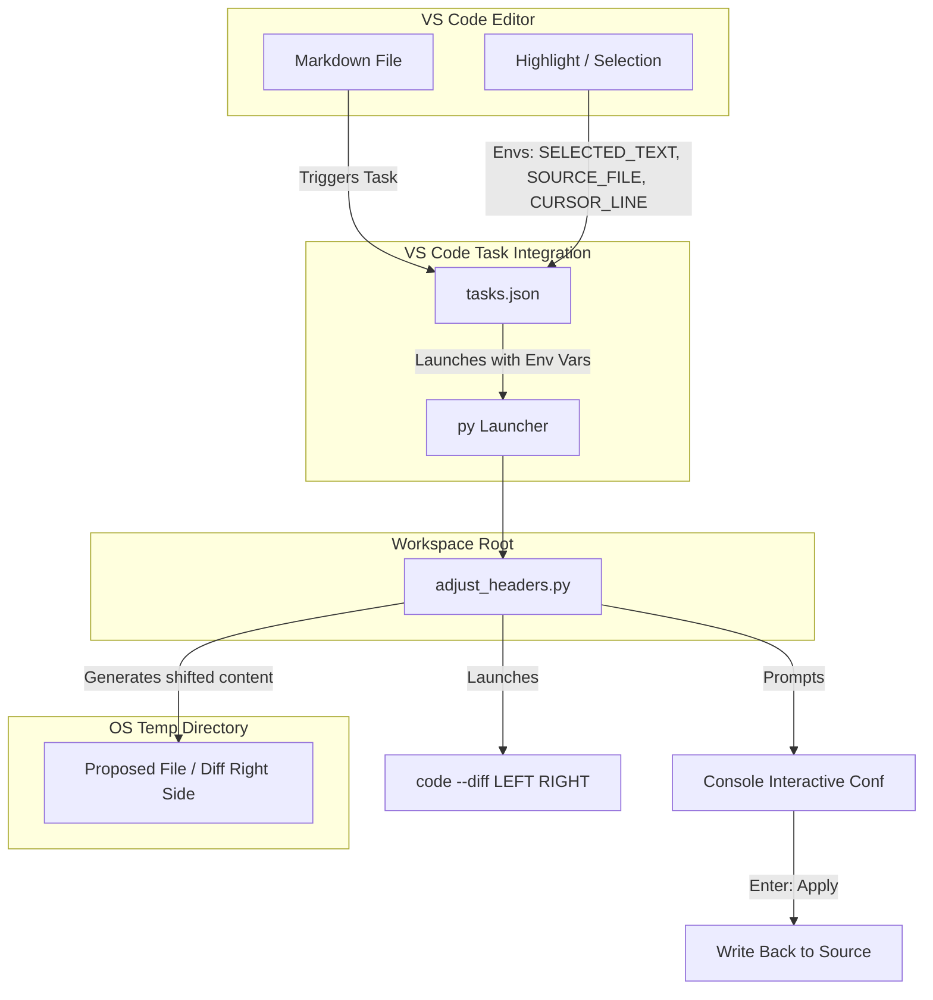

# Markdown Header Level Adjuster — System Synopsis

This document provides a complete high-level synopsis of the **Markdown Header Level Adjuster** integration, detailing its core rules, design implementation, integration mechanics, step-by-step instructions, and successful execution results.

---

## 🎯 1. Core Objectives & Rules

The tool automatically restructures Markdown document headers to maintain consistent hierarchical depth for documentation engines and AST parsers. It operates under three strict rules:

1. **Rule 1 (Section Preservation)**: Query/Review/Response headers (e.g., `# Query X.Y -`, `# Review X.Y -`, `# Response X.Y -`) are treated as the only true top-level sections and **always stay at H1**.
2. **Rule 2 (Content Demotion)**: All content headers are shifted down by exactly one level:
   - `# Content` $\rightarrow$ `## Content` (H1 $\rightarrow$ H2)
   - `## Sub-header` $\rightarrow$ `### Sub-header` (H2 $\rightarrow$ H3)
3. **Rule 3 (Preserve Skipping)**: If a content header is already nested under a gap (e.g., H1 followed immediately by H3 without an intermediate H2), the nested header is left untouched (remains H3) to maintain the original subordinate hierarchy.

---

## 📂 2. File Placement ("What to Put Where")

```text
your-project/
├── adjust_headers.py       ← Workspace Root
└── .vscode/
    └── tasks.json          ← Configured tasks
```

* **Script Location**: [adjust_headers.py](file:///d:/GitHub_Repo/Task-Dashboard/adjust_headers.py)
* **Task Config**: [.vscode/tasks.json](file:///d:/GitHub_Repo/Task-Dashboard/.vscode/tasks.json)
* **Keybindings Guide**: `keybindings.json` goes in your local **user config** (not version-controlled in the workspace) to map `Ctrl+Shift+H` directly to the task.

---

## 🚀 3. Exact Interaction, Step by Step

1. **Open your `.md` file** in VS Code.
2. **Highlight the section** you want to fix (or skip this — the task falls back to the whole file).
3. **Trigger the task** via `Ctrl+Shift+P` $\rightarrow$ **Tasks: Run Task**:
   - **`Adjust Markdown Headers (Selection)`**: Standard GUI diff on selection.
   - **`Adjust Markdown Headers (Full File)`**: Standard GUI diff on full file.
   - **`Adjust Markdown Headers (Terminal Preview - Selection)`**: Terminal diff preview with Enter confirmation on selection.
   - **`Adjust Markdown Headers (Terminal Preview - Full File)`**: Terminal diff preview with Enter confirmation on full file.
   - **`Adjust Markdown Headers (Bypassed - Selection)`**: Instant auto-apply without GUI diff or prompt on selection.
   - **`Adjust Markdown Headers (Bypassed - Full File)`**: Instant auto-apply without GUI diff or prompt on full file.
4. **Terminal panel opens and prints**:
   ```text
   ┌─────────────────────────────────────────────────────┐
   │  File   : my_notes.md                               │
   │  Range  : lines 12-47                               │
   │                                                     │
   │  Opening diff in VS Code ...                        │
   │    LEFT  (original) : /path/to/my_notes.md          │
   │    RIGHT (proposed) : /tmp/adj_headers_xxxx.md      │
   │                                                     │
   │  Review the diff, then come back here.              │
   │  Press Enter to APPLY changes, or Ctrl+C to CANCEL. │
   └─────────────────────────────────────────────────────┘
   ```
5. **VS Code diff tab opens automatically**:
   - **LEFT** = your current file (unchanged)
   - **RIGHT** = proposed output (green = additions, red = removals)
6. **Review the changes**:
   - Click back on the terminal panel.
   - Press **Enter** $\rightarrow$ file is written, VS Code shows a "File Changed Externally" reload prompt $\rightarrow$ click **Reload**.
   - Press **Ctrl+C** $\rightarrow$ aborts process, nothing is changed.

---

## 🛠️ 4. System Architecture & Components

The implementation is highly modular and follows a clean separation of concerns:



---

## 🧪 5. Validation & In-Place Execution

A complete execution test was performed on the active workspace log file [260626_Th7_UI_Improvements.md](file:///d:/GitHub_Repo/Task-Dashboard/User_Created/Discussion%20Threads/Task_log/260626_Th7_UI_Improvements.md):

### Before vs After Diff Preview

```diff
  # Query 1.0 -# Task Details UX & Architecture Enhancement Backlog  <-- Kept at H1 (Rule 1)
  
- # Enhancement Group A — Task Details Information Architecture & UX Redesign
+ ## Enhancement Group A — Task Details Information Architecture & UX Redesign  <-- Shifted H1 -> H2 (Rule 2)
  
- ## Objective
+ ### Objective                                                                <-- Shifted H2 -> H3 (Rule 2)
  
- ### Scope
- ### A1. Rework Information Hierarchy
+ #### Scope                                                                  <-- Shifted H3 -> H4 (Rule 2)
+ #### A1. Rework Information Hierarchy                                        <-- Shifted H3 -> H4 (Rule 2)
```
