# INC-099 — Mock Persistence & Intake Preview Hierarchy Blind Spot (The "Process-Result Divergence" Autopsy)

**Incident ID**: INC-099
**Date**: 2026-09-18
**Severity**: High (Governance & Data-Integrity)
**Governing Ticket**: `SK-007` (root cause), `SK-011` (physical fix), `SK-012` (systemic hardening)
**Discovered In**: `User_Created/Discussion Threads/Shopping/260918_ShoppingList.md`, Query/Response 7.1–7.3
**Status**: RESOLVED (Case Study + Pattern Wiring via `SK-012`)
**Affected Components**: `shopping_src/scripts/controller.js` (Base64/localStorage intake), `firestore-client.js` (custom-option sync gap), `AC-DEC-2026-035` ("Tri-Modal Visual Intake")

---

## Executive Summary

A user reported a single missing catalog entry ("Sacred Bibapata" showroom photo). Root-cause tracing revealed the report was a symptom of a systemic, unbacked capability: the entire "Tri-Modal Visual Intake" feature — ratified by name at `AC-DEC-2026-035` — stored user-submitted images as Base64 strings in `localStorage` instead of a physical, multi-device-reachable cloud store. Five independent governance layers (Prompt Clarity, Writing Plans/Plan Review, Architecture Council, 6 automated verification gates, and the agent's own diagnostic turn) each had a clean pass or a low-friction patch available, and none of them surfaced the systemic gap. This is the canonical repo instance of **Process-Result Divergence** (a.k.a. **Performative Governance**): every ceremony reported green while the underlying capability was a transient, single-device illusion.

---

## Layer-by-Layer Failure Analysis

```mermaid
flowchart TD
    subgraph Layer1["1. Prompt Clarity (Entity-Anchoring Trap)"]
        A["User reports 'Sacred Bibapata option missing'"] --> B["Anchored on the entity (TRS-BR-01)"]
        B --> C["Treated symptom as the scope instead of asking: 'Why did intake fail?'"]
    end
    subgraph Layer2["2. Writing Plans & Plan Review (Mock-as-Done Fallacy)"]
        D["SK-007 Plan: 'Add device upload intake'"] --> E["Accepted Canvas Base64 -> localStorage"]
        E --> F["Plan Review checked off 'intake code exists' without verifying physical byte destination"]
    end
    subgraph Layer3["3. Architecture Council (Verbosity Shield & Paper Architecture)"]
        G["Ratified 'Tri-Modal Visual Ingestion' (AC-DEC-2026-035)"] --> H["Noted 'firestore-client does not sync custom options' in its own table"]
        H --> I["Approved release anyway; architectural prose masked the missing physical pipe"]
    end
    subgraph Layer4["4. Verification Gates (Syntactic Shells vs Semantic Pipelines)"]
        J["verify:modular-architecture / verify:ui-buttons / verify:ui-lifecycle / verify:deployment"] --> M["All 6 gates passed 100% green"]
        M --> N["Zero gates tested whether bytes ever left the client to a remote store"]
    end
    subgraph Layer5["5. Agent Diagnostic Turn (Patchwork Reflex)"]
        O["Correctly diagnosed the three root causes"] --> P["Instinctively proposed the lowest-friction fix: seed one static JPEG"]
        P --> Q["Treated the single instance instead of engineering the systemic engine"]
    end
```

### Layer 1 — Prompt Clarity: The Entity-Anchoring Trap
`meta-prompt.md`'s Step 1 ambiguity scan checks for multiple readings, missing constraints, vague referents, and goal/means confusion — it had **no sensor for instance-vs-systemic-invariant**. It never asked: *"Is this a single data error, or a signal that an entire capability is unbacked?"*

### Layer 2 — Writing Plans & Plan Review: The "Mock-as-Done" Fallacy
`SK-007`'s plan said "support device photo intake"; the implementation satisfied it with Canvas→Base64→`localStorage`. Plan review verified *functional execution in the local test harness* but had no **Physical Storage & Transit Contract** — no requirement to answer "where do the bytes live when the tab closes?" or "what happens on a second device?"

### Layer 3 — Architecture Council: The Verbosity Shield
`AC-DEC-2026-035` recorded, in its own evidence table, that `firestore-client.js` does not sync custom options — and approved the release anyway. Architectural polish substituted for physical verification.

### Layer 4 — Verification Gates: Syntactic vs. Semantic
All 6 gates check structure (line counts, class names, teardown, byte parity) — none simulate "upload → assert a network call left the browser → assert a durable URL came back."

### Layer 5 — Agent Diagnostic Reflex: The Patchwork Bias
Even after correctly tracing the root cause, the immediate proposal was to seed one static file — the lowest-friction path to conversation closure, not the systemic fix.

---

## Generalized Defect Pattern

**Process-Result Divergence / Performative Governance**: a stack of high-ceremony review layers each individually pass while the composite system delivers an unbacked capability, because no layer's pass condition actually tests physical data survival across the trust boundary (device, session, or client-to-cloud).

## Preventive Guardrails (see `SK-012`)

1. `INV-SYSTEMIC-ABSTRACTION-001` — Prompt Clarity must treat a single-entity report as a symptom and evaluate the systemic pipeline first.
2. `INV-DATA-TRANSIT-001` — Every plan touching user intake must declare Storage Target, Multi-Device Transit, and prohibit binary/Base64 in `localStorage`.
3. `INV-COUNCIL-GROUND-TRUTH-001` — A council may not ratify an architecture that records an unbacked data-transit gap without blocking release.
4. `scripts/verify-pipeline-contracts.cjs` — automated gate for `localStorage` binary writes and shell/fragment dependency parity.

## Cross-References
- Sibling case study: [`INC-077`](./INC-077-pseudo-council-declaration-unfired-telemetry-and-preflight-suppression.md) — the "prose ceremony vs. executable validation" failure mode this incident shares at every layer.
- Ratifying council decision (this hardening pass): `AC-DEC-2026-056` — see `260926_arch_council_institutional_governance_safeguards_hardening.md`.
- Governing ticket: `enhancement-notes/SK-012/00_ENHANCEMENT_INDEX.md`.
