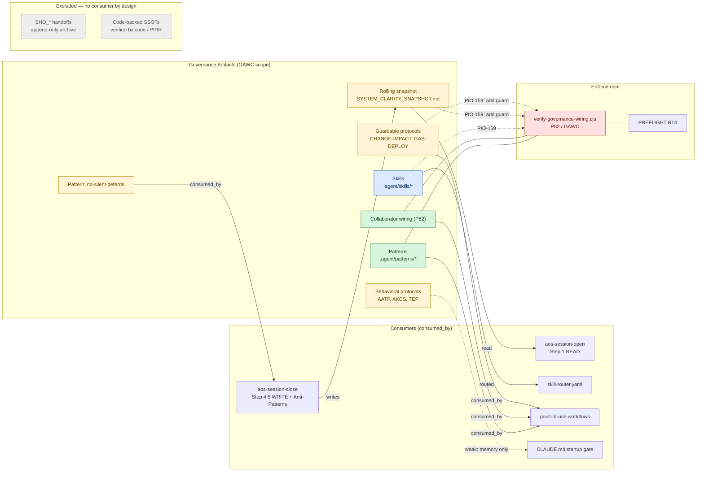
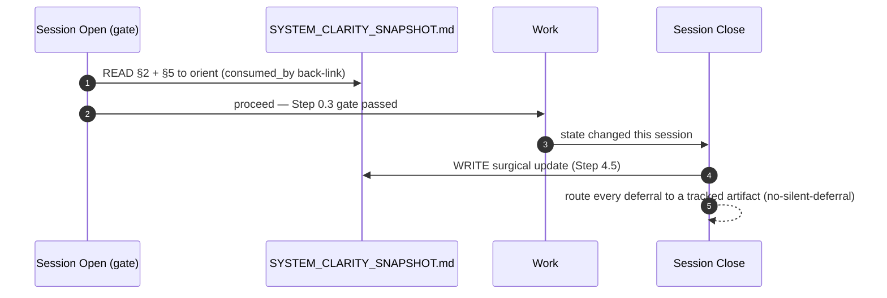

# Pattern Activation Contract (PACT-001) — System Manual

> **Status**: Active · Standard PACT-001
> **Origin**: Task-Dashboard, 2026-06-13 — surfaced while auditing how `/capture-pattern` patterns are consumed
> **Canonical source repo**: `Task_Dashboard`
> **Scope**: All SAP-linked repos. **Widened 2026-06-14 (PIO-159)** from `.agent/patterns/` only to the full governance-artifact layer — see §1A.
> **Enforced by**: `scripts/verify-governance-wiring.cjs` (P82 / GAWC), PREFLIGHT row R14
> **⚠️ Diverges from `PACT-001` canonical (`Task_Dashboard`)** — scope generalized to all governance artifact classes (§1A) **and the §2 frontmatter contract generalized** (`artifact_type` discriminator; `consumed_by` / `activation_tier` / `status` made universal). The pattern instance's schema is preserved verbatim. **Cross-repo propagation to canonical + SAP-linked repos is tracked by PIO-160** — this divergence is registered, not silent (see `.agent/patterns/no-silent-deferral.md`). Review by 2026-09-14.

---

## 1. Purpose & The Problem It Solves

`/capture-pattern` reliably *captures* process intelligence into `.agent/patterns/`. But capture
is only half the loop. The other half — **consumption** — was implicit and unverified:

> A captured pattern only ever fired if (a) some parent workflow happened to reference it, (b)
> that workflow was invoked, and (c) the agent obeyed. Nothing checked that the reference existed,
> nothing surfaced the pattern on its own keywords, and nothing distinguished a "reference-only
> playbook" from a "should-be-enforced rule." Patterns could be captured and silently orphaned.

**PACT-001 closes the loop.** Every pattern must declare *how it is consumed*, and a gate verifies
that wiring is real and bidirectional. The result: **no orphan patterns, and an explicit
graduation path from playbook → enforced rule.**

This is the consumption-side complement to the propagation metadata that already existed in some
repos (`canonical_source`, `porting_effort`). Together they form the complete pattern contract:
*how it is consumed* (this standard) **+** *how it propagates* (Section 6).

---

## 1A. Scope — The Governance Artifact Wiring Contract (GAWC)

> **Widened 2026-06-14 (PIO-159).** PACT-001's thesis is not pattern-specific. It is the general
> law of this repo's governance layer:
>
> **A captured artifact is inert until something pulls it. Every governance artifact must declare
> how it is consumed, and a gate must verify the back-link is real and bidirectional.**

`verify-governance-wiring.cjs` already enforces this for **two** artifact classes — collaborator-class
wiring (`P82` / INC-006) and patterns (`PACT-001`). The verifier dispatches **by artifact type**, so the
contract generalizes by *registering new artifact types under the same gate* — not by inventing a new
framework. This umbrella is **GAWC** (Governance Artifact Wiring Contract); **PACT-001 is its
pattern-shaped instance.**

### Governance artifact classes

Apply the contract **by failure mode**, not blanket. An artifact is *in scope* only when its consumer is
a **referenceable file** AND it can **silently orphan** (exist while nothing pulls it).

| Class | In scope? | Consumer (`consumed_by`) | Tier |
|---|---|---|---|
| Patterns (`.agent/patterns/*.md`) | ✅ PACT-001 | a workflow / router / guard | reference \| routed \| guarded |
| Collaborator wiring | ✅ P82 | orchestrator import + delegation map | guarded |
| Rolling snapshot (`SYSTEM_CLARITY_SNAPSHOT.md`) | ✅ NEW | session-open gate read | reference → graduate to guarded |
| Skills (`.agent/skills/*`) | ✅ NEW | `skill-router.yaml` entry | routed |
| Routed / guardable protocols | ✅ NEW | a workflow at point-of-use, or a guard script | reference \| routed \| guarded |
| Behavioral protocols (AATP, AKCS, TEP) | ⚠️ reference-only | CLAUDE.md / startup gate | reference (cannot be scanned — honest default) |
| Session Handoff (`SHO_*`) | ❌ excluded | append-only archive; consumer is a future forensic reader (no fixed back-link) | — |
| Code-backed SSOTs (schemas, contracts) | ❌ excluded | consumed by *code*; verified by PIRR / typecheck, a different mechanism | — |

**Exclusions are decisions on record** (the same move PACT makes for `README.md`): forcing a
`consumed_by` onto an append-only archive or a code-verified doc is false precision and makes the gate
*lie*. The thesis is universal; the **grep-bidirectional mechanism is not** — never widen enforcement
past where the mechanism can honestly assert the back-link.

> **Projection of this wiring** (the `governance-wiring.json` data store + generated view) is governed by
> its own appropriated contract: **`GOVERNANCE_WIRING_PROJECTION_ARCHITECTURE.md`** (GWPA). Reference GWPA,
> not QSR, for the data/compiler/viewport model.

> **Rollout** is tracked by **PIO-159**: a per-artifact GAWC analysis (tier + verified `consumed_by` +
> orphan/broken-link flag) for every in-scope class, graduating guardable artifacts to `guarded`.
> PIO-155 covers the patterns class; PIO-159 covers every other class under this widened scope.

### Visual map — artifacts → consumers → enforcement

> The PACT relation is a *static wiring graph*: every in-scope artifact has an arrow to a real
> consumer (`consumed_by`) and to the gate. **Excluded artifacts have no consumer arrow — that
> absence is the decision**, not an omission.

> ⚠️ **Hand-authored placeholder (PIO-159).** This diagram is maintained by hand *for now*. It will be
> **generated from `governance-wiring.json`** and marked ⚠️ Generated. Until then it is not drift-proof —
> the JSON link graph, not this picture, is the queryable source of truth.



### Lifecycle — the one temporal relation (snapshot produce/consume)



---

## 2. The Contract (frontmatter schema)

Every GAWC-governed artifact declares the contract below. For the **`pattern`** artifact type it lives
in the `.agent/patterns/*.md` frontmatter (except `README.md`); other artifact types (§1A) carry the
same universal fields in their own registry/frontmatter.

```yaml
---
artifact_type: pattern               # pattern | rolling-snapshot | skill | protocol | collaborator-wiring (§1A)
pattern: <slug>                      # id field for the `pattern` type — must match the filename (without .md)
activation_tier: reference           # reference | routed | guarded   ← the consumption mechanism (UNIVERSAL)
status: HYPOTHESIS                    # HYPOTHESIS | VALIDATED   (UNIVERSAL)
consumed_by:                          # ≥1 entry REQUIRED — the anti-orphan back-link (UNIVERSAL)
  - file: .agent/workflows/<name>.md
    at: "<phase/section where it is read>"
triggers: []                         # REQUIRED (non-empty) if activation_tier == routed
guard: ""                            # REQUIRED (non-empty) if activation_tier == guarded
# ── propagation metadata (Section 6) ──
portability: repo-specific           # universal | repo-specific
canonical_source: <repo-id>
porting_effort: low                  # low | medium | high
---
```

> **Field generalization (PIO-159).** `consumed_by`, `activation_tier`, and `status` are the
> **universal anti-orphan core** — required for *every* artifact type. `pattern` / `triggers` / `guard`
> are the pattern-shaped fields; other artifact types substitute their own id + wiring (e.g. a
> `rolling-snapshot` artifact's `consumed_by` is its session-open read; a `skill` artifact's is its
> `skill-router.yaml` entry). The `pattern` instance keeps this schema verbatim, so existing patterns
> and the `checkPatternWiring` verifier are unaffected.

---

## 3. The Three Tiers (a graduation ladder)

The tier names the **primary mechanism** that pulls the pattern. Each tier is *stronger* than the
last, in a different dimension. `consumed_by` is the **universal** requirement at every tier.

| Tier | Pulled by | Choose when | Adds (over `reference`) |
|---|---|---|---|
| **`reference`** | A workflow reads it on demand | Process/design playbook that **cannot be mechanically scanned** | — (just the back-link) |
| **`routed`** | Natural-language detection | It should surface on its **own keywords**, independent of any parent workflow | `triggers` + a `skill-router.yaml` entry |
| **`guarded`** | An executable check | It maps to a rule that can **fail a command** (ESLint, ast-grep, preflight) | `guard:` command resolving to a real `package.json` script |

**Graduation**: a pattern can start at `reference` and move up as it earns stronger wiring. A
design methodology may live at `reference` forever (correct — it can't be scanned). A pattern that
later gets an ESLint rule graduates to `guarded`. Changing the tier just means adding the wiring
the new tier requires; the verifier enforces it.

```
   reference  ──add triggers + router entry──▶  routed
       │                                          │
       └──────add guard script + PREFLIGHT row──▶ guarded
```

### Decision aid
- **Can it fail a command?** → `guarded` (wire a PREFLIGHT row + guard script).
- **Should "how do I X" surface it by keyword?** → `routed` (add triggers + router entry).
- **Is it a playbook only a workflow pulls?** → `reference` (the honest default for methodology).

---

## 4. How Enforcement Works (the verifier)

`verify-governance-wiring.cjs` adds an `agent-pattern` artifact type with a dedicated checker
(`checkPatternWiring`). For each pattern it asserts:

1. **Contract present** — frontmatter parses and `activation_tier` is one of the three valid values.
2. **Not orphaned** — `consumed_by` has ≥1 entry.
3. **Bidirectional** — each `consumed_by` file **exists** AND **actually contains the string**
   `.agent/patterns/<slug>.md`. A claimed consumer that never references the pattern = broken
   back-link = failure. *(This is the key check — a one-way claim is not enough.)*
4. **`routed`** → `triggers` non-empty AND a `skill-router.yaml` entry references the pattern or a trigger.
5. **`guarded`** → `guard` non-empty AND every `npm run <script>` in it resolves to a real `package.json` script.

```
npm run verify:governance-wiring          # diff mode — only changed patterns
npm run verify:governance-wiring -- --all  # audit every pattern in the repo
```

Exit `1` on any unwired pattern. Wired at **PREFLIGHT R14** and run at **session-close** (P82),
so a broken contract blocks the session before commit.

### Worked examples (Task-Dashboard, all green)
| Pattern | Tier | `consumed_by` back-link | Guard |
|---|---|---|---|
| `external-iterative-design-gate` | `reference` | `external-ui-redesign.md` (3 phases) | — |
| `P66-P67-collection-ownership` | `guarded` | PREFLIGHT R1 | `npm run preflight` |
| `mutation-contract-pattern` | `guarded` | PREFLIGHT R2 | `npm run sg:inv005` |

---

## 5. Lifecycle — Capture → Contract → Wire → Verify

Driven by `/capture-pattern` (`.agent/workflows/capture-pattern.md`):

1. **Capture** (Steps 0–3) — worthiness filter, classify, write the pattern body.
2. **Declare the contract** (Step 3.5) — choose the tier using the decision aid.
3. **Wire it** (Step 4) — fill `consumed_by` and make the back-link real; add router entry if
   `routed`; add guard + PREFLIGHT row if `guarded`; update `.agent/patterns/README.md`.
4. **Verify** (Step 5) — `npm run verify:governance-wiring` must pass.

---

## 6. Cross-Repo Propagation

There are 11 SAP-linked repos with `.agent/` directories. PACT-001 propagates two things: the
**mechanism** (the verifier + workflow) and, selectively, **universal patterns** themselves.

### 6a. Propagate the mechanism (one-time, per repo)

For each repo that has (or will have) a `.agent/patterns/` directory:

```
# 1. Copy the verifier (or sync it from the canonical source)
cp Task_Dashboard/scripts/verify-governance-wiring.cjs <repo>/scripts/

# 2. Register the npm script (if not already present)
#    package.json → "verify:governance-wiring": "node scripts/verify-governance-wiring.cjs"

# 3. Copy the capture workflow's contract section + the patterns README template
#    .agent/workflows/capture-pattern.md  (Step 3.5 + Step 4 + Step 5 gate)
#    .agent/patterns/README.md            (adapt the repo tag in the router-entry hint)

# 4. Add PREFLIGHT row R14 (or local equivalent) to route .agent/patterns/*.md → this gate

# 5. Backfill: add a PACT-001 contract to every existing pattern, then:
node scripts/verify-governance-wiring.cjs --all   # must reach green
```

**Per-repo adaptation points** (the only things that differ):
- `repo: [<repo-id>]` in any router-entry fix hints.
- Guard commands map to *that repo's* checks (GAS repos → `clasp`/lint; Firebase webapps →
  `ast-grep`/preflight). A `guarded` pattern in a GAS repo uses GAS guards.
- `canonical_source` stays pointed at the repo that **owns** the pattern.

### 6b. Propagate universal patterns (ongoing)

A pattern with `portability: universal` is a candidate to copy into other repos. The
`canonical_source` repo owns the master; consumers import and **re-declare their own
`consumed_by` + tier** (consumption wiring is always local — the same pattern may be `reference`
in one repo and `guarded` in another that has a scannable check for it).

```
Universal pattern lifecycle:
  canonical_source repo  ──(portability: universal)──▶  candidate for sync
        │
        ▼
  consumer repo: copy body → set local consumed_by + tier → verify green
```

> **Rule**: never copy a pattern into another repo without giving it a *local* Activation
> Contract. An imported pattern with no `consumed_by` is an orphan in its new home and the
> verifier there will reject it. This is the whole point — the contract travels with the pattern.

### 6c. The propagation workflow

`.agent/workflows/sap-sync.md` is the carrier. (At time of writing it is an empty stub in
Task-Dashboard — populating it with the 6a/6b procedure above is the next step to make universal
propagation a one-command operation.)

---

## 7. File Locations & Navigation

| Concern | File |
|---|---|
| This manual | `docs/protocols/PATTERN-ACTIVATION-CONTRACT-MANUAL.md` |
| The gate | `scripts/verify-governance-wiring.cjs` (`checkPatternWiring`) |
| npm entry | `npm run verify:governance-wiring [-- --all]` |
| Capture workflow | `.agent/workflows/capture-pattern.md` (Step 3.5 tier, Step 4 wiring, Step 5 gate) |
| Pattern index | `.agent/patterns/README.md` |
| Preflight routing | `.agent/PREFLIGHT.md` row R14 |
| Standard registration | `.agent/standards-catalog.json` → P82 |
| Cross-repo carrier | `.agent/workflows/sap-sync.md` |

---

### TL;DR

> A captured pattern is inert until something pulls it. PACT-001 makes every pattern **declare** how
> it is consumed (`reference` / `routed` / `guarded`), and the P82 gate **verifies** the wiring is
> real and bidirectional — so patterns can't be silently orphaned, and they have a clear path to
> graduate from playbook to enforced rule. The contract travels with the pattern across repos.
