# SPEC-PROC-TROUSSEAU-001: Wedding Trousseau, "Sara" (Bhara) Gifting & Bhubaneswar Shopping Master Specification

**Specification Reference:** `SPEC-PROC-TROUSSEAU-001`  
**Governing Decisions:** `AC-DEC-2026-018` (Baseline), `AC-DEC-2026-022` (Odia Heirlooms), `AC-DEC-2026-024` (Visual AI & Engagement), `AC-DEC-2026-025` (Dual-Look Groom & Liturgical Regalia)  
**Standard References:**  
- `P-SHOPPING-CONSENSUS-001` (Multi-Stakeholder Trousseau & Gifting Consensus Engine)  
- `P-SHOPPING-DISCOVERY-001` (Contextual Visual AI Discovery & Geolocation Navigation Engine)  
- `P-LITURGICAL-ATTIRE-001` (Dual-Look Groom Transition & Vedic-Odia Liturgical Regalia Invariant)  
- `P-SURVEY-PRINT-001` (Dual-Surface Family Consultation Survey & Decision Gates)  
**Version:** `2.0.0` (Comprehensive 44-Item Liturgical & Sourcing Baseline)  
**Execution Horizon:** T-45 Days to T-35 Days (10-Day Runway Gate for In-Laws & Bride Bhubaneswar Visit)  
**Primary Retail Hub:** Bhubaneswar, Odisha (Janpath, Saheed Nagar, Bapuji Nagar, Market Building Unit-2, Master Canteen)  

---

## 1. Executive Summary & Cultural Foundation

In traditional Odia Hindu wedding liturgy, apparel and ornaments are consecrated liturgical items central to Vedic rites (*Hastaganthi*, *Saptapadi*, *Laja Homa*, *Kanyadaan*). Furthermore, the **"Sara"** (also known as *Saja* or *Bhara*) represents the reciprocal formal trousseau exchange between the two families (*Barapaksha* and *Kanyapaksha*), symbolizing mutual respect, prosperity, and the welcoming of the bride as *Gruhalakshmi*.

Following the deliberations of the Architecture & UI Council (`AC-DEC-2026-025`), this specification codifies the definitive **44-Item Canonical Trousseau Catalog** across 5 chapters and incorporates the **Dual-Look Groom Transition Protocol**:

### 1.1 The Dual-Look Groom Transition Protocol (`P-LITURGICAL-ATTIRE-001`)
A critical liturgical reconciliation distinguishes public celebration attire from mandap fire ritual regalia:
1. **Look 1: Barat & Varmala Stage (`TRS-GR-03`)**:
   - Royal embroidered Sherwani with Safa, Kalgi, stole, and Mojaris.
   - Worn for the Barat procession, Milni, and the Varmala garland exchange where 85%+ of wedding portraits and media are captured.
2. **Pre-Muhurtham Green Room Change (15-Minute Window)**:
   - Dedicated pause between stage photos and muhurtham for groom to transition into sanctified pure silk.
3. **Look 2: Mandap Muhurtham & Havan Rites (`TRS-OD-04` & `TRS-OD-05`)**:
   - Consecrated unstitched pure silk Sambalpuri Joda & Dhoti (*Ahatavasana*) with matching silk Uttariya and Shola/Tarakasi Mukuta crown.
   - Mandatory for Vedic Homa oblations, keeping the right shoulder unencumbered and avoiding heat distress from the havan fire.

---

## 2. Canonical 44-Item Trousseau Inventory (5 Chapters)

### Chapter 0: Engagement & Nirbandha Ceremony (`chapter_engagement`) — 5 Items

| Item ID | Nomenclature | Liturgical / Event Role | Fabric & Material Spec | Est. Budget | Verified Bhubaneswar Store | Approval Leads |
| :--- | :--- | :--- | :--- | :--- | :--- | :--- |
| `TRS-EG-01` | **Engagement Rings (Bride & Groom)** | Nirbandha Ring Exchange | Solitaire Diamond & 18K/22K Hallmarked Gold Couple Bands | ₹45,000 – ₹95,000 | Khimji Jewellers (Janpath) / Lalchnd | Bride & Groom |
| `TRS-EG-02` | **Bride Engagement Saree / Lehenga** | Nirbandha Ceremony Attire | Pastel Pure Handloom Silk Saree or Designer Flared Lehenga | ₹25,000 – ₹45,000 | Kalamandir (Janpath) / Boyanika | Bride & Sisters |
| `TRS-EG-03` | **Groom Engagement Kurta Ensemble** | Engagement Celebration Attire | Pure Silk Kurta-Pajama with Embroidered Bundi Jacket | ₹12,000 – ₹22,000 | Manyavar (Janpath) / Raymond | Groom & Sisters |
| `TRS-EG-04` | **Decorative Ring Platter & Sagan Thali** | Ritual Ring Presentation | Handcrafted Velvet Platter with Floral Accents & Sagan Hampers | ₹4,500 – ₹9,500 | Market Building (Unit-2) | Sisters & In-Laws |
| `TRS-EG-05` | **In-Laws Return Vastra & Odia Sweets** | Nirbandha Honorific Exchange | Premium Silk Stoles, Sarees & Vacuum-Sealed Nimapada Sweets | ₹18,000 – ₹32,000 | Boyanika / Nimapada Sweets | Parents Council |

---

### Chapter 1: Bridal Sanctum Trousseau & Vivaha Pata (`chapter_bridal_silks`) — 10 Items

| Item ID | Nomenclature | Liturgical / Event Role | Fabric & Craft Spec | Est. Budget | Verified Store | Approval Leads |
| :--- | :--- | :--- | :--- | :--- | :--- | :--- |
| `TRS-BR-01` | **Sacred Vivaha Pata** | Day 2 Hastaganthi Mandap Muhurtham | Pure Mulberry Silk Sambalpuri/Khandua Pata with Kumbha border | ₹35,000 – ₹75,000 | Boyanika (Master Canteen) | Bride & In-Laws |
| `TRS-BR-02` | **Madhuparkam Handloom Saree** | Jeelakarra-Bellam Ritual | Unstitched auspicious yellow/white handloom with red border | ₹3,500 – ₹7,500 | Boyanika / Kalamandir | Bride & In-Laws |
| `TRS-BR-03` | **Bridal Sangeet Lehenga** | Sangeet Dance & Concert Night | Silk velvet flared lehenga with zardozi/sequin embroidery | ₹32,000 – ₹65,000 | Kalamandir (Janpath) | Bride & Sisters |
| `TRS-BR-04` | **Mehendi Festive Outfit** | Mehendi Garden Promenade | Floral georgette / lightweight organza Lehenga or Anarkali | ₹16,000 – ₹28,000 | Kalamandir / Amber | Bride & Sisters |
| `TRS-BR-05` | **Reception Grand Saree** | Post-Vivaha Formal Reception | Heavy Kanjeevaram Silk or Banarasi Brocade with gold zari | ₹28,000 – ₹55,000 | Kalamandir (Janpath) | In-Laws & Bride |
| `TRS-BR-06` | **Bridal Odhani / Granthi Veil** | Mandap Veil & Granthi Tie | Red net or silk tissue veil with gold gota patti embroidery | ₹4,500 – ₹9,500 | Market Building (Unit-2) | Bride & In-Laws |
| `TRS-BR-07` | **Post-Wedding Silks (Set of 5)** | Post-wedding temple visits & greetings | Soft Bomkai, Berhampuri, and Nuapatna silk sarees | ₹35,000 – ₹65,000 | Boyanika (Master Canteen) | Bride & Sisters |
| `TRS-OD-01` | **Nuapatna Khandua Pata Saree** | Diya Mangula & Morning Puja | Sacred Gita Govinda calligraphy pure silk handloom | ₹14,000 – ₹26,000 | Boyanika / Utkalika | Bride & In-Laws |
| `TRS-OD-06` | **Baula Patta & Hastaganthi Vastra** | Sacred Tie-Knotting Liturgy | Auspicious yellow tussar silk Granthi cloth & Baula Patta | ₹8,000 – ₹15,000 | Boyanika (Master Canteen) | Priest & In-Laws |
| `TRS-BR-08` | **Bride Haldi Saree & Floral Suite** | Morning Mangala Snana Ceremony | Yellow handloom cotton saree + fresh marigold/jasmine jewellery | ₹6,500 – ₹12,000 | Kalamandir (Janpath) | Bride & Sisters |

---

### Chapter 2: Groom Liturgical & Ceremonial Wear (`chapter_groom_wear`) — 10 Items

| Item ID | Nomenclature | Liturgical / Event Role | Fabric & Silhouette Spec | Est. Budget | Verified Store | Approval Leads |
| :--- | :--- | :--- | :--- | :--- | :--- | :--- |
| `TRS-GR-01` | **Mandap Pure Silk Pancha & Kurta** | Mandap Welcome & Initial Rites | Raw silk / Tussar unstitched dhoti with gold border + silk kurta | ₹6,000 – ₹12,000 | Boyanika / Manyavar | Groom & In-Laws |
| `TRS-GR-02` | **Ceremonial Silk Patta Stole** | Sacred Mandap Angavastra | Pure Silk stole with woven temple borders or sacred verses | ₹4,000 – ₹8,500 | Boyanika (Master Canteen) | Groom & In-Laws |
| `TRS-GR-03` | **Barat Royal Embroidered Sherwani** | Look 1: Barat Entry & Varmala | Raw silk / jacquard sherwani with hand embroidery | ₹14,000 – ₹55,000 | Sherwani House / Manyavar | Groom & Sisters |
| `TRS-GR-04` | **Groom Safa & Jeweled Kalgi** | Barat Royal Headwear Insignia | Chanderi silk / tissue Safa with antique jeweled kalgi brooch | ₹4,500 – ₹9,500 | Market Building / Manyavar | Sisters & Groom |
| `TRS-GR-05` | **Barat Stole & Royal Pearl Mala** | Barat Accoutrements | Embroidered silk/velvet stole with multi-layer pearl necklace | ₹4,500 – ₹9,000 | Manyavar / Saheed Nagar | Sisters & Bride |
| `TRS-GR-06` | **Sangeet Bandhgala Suit / Tuxedo** | Sangeet Concert & Party | Custom-tailored Italian wool Tuxedo or Royal Bandhgala | ₹16,000 – ₹35,000 | The Raymond Shop (Janpath) | Groom & Sisters |
| `TRS-GR-07` | **Haldi Ceremony Kurta-Pajama** | Haldi Celebration Party | Lightweight Lucknowi Chikan or cotton kurta with churidar | ₹3,500 – ₹7,500 | Manyavar / Fabindia | Groom |
| `TRS-GR-08` | **Traditional Mojaris & Juttis (2 Pairs)** | Barat & Mandap Footwear | Embroidered ceremonial mojaris + cushioned reception shoes | ₹3,500 – ₹7,500 | Market Building (Unit-2) | Groom |
| `TRS-OD-04` | **Sambalpuri Groom Silk Joda** | Look 2: Mandap Havan Muhurtham | Pure silk consecrated unstitched dhoti & matching silk chadar | ₹14,000 – ₹22,000 | Boyanika (Master Canteen) | Groom & In-Laws |
| `TRS-GR-10` | **Groom Snana Haldi Silk Ensemble** | Mangala Snana Anointing | Mustard yellow Tussar silk kurta & dhoti with temple border | ₹5,500 – ₹10,500 | Manyavar / Boyanika | Groom & Sisters |

---

### Chapter 3: Bridal Ornaments, Temple Gold & Sacred Silver Tarakasi (`chapter_jewellery`) — 11 Items

| Item ID | Nomenclature | Liturgical / Adornment Role | Material & Craft Spec | Est. Budget | Verified Store | Approval Leads |
| :--- | :--- | :--- | :--- | :--- | :--- | :--- |
| `TRS-JW-01` | **Chandra Haar / Temple Choker** | Central Bridal Neckpiece | 22K Hallmarked Gold handcrafted temple architecture motif | ₹120,000 – ₹190,000 | Khimji Jewellers (Janpath) | Bride & In-Laws |
| `TRS-JW-02` | **Long Haram (Sita Haar)** | Royal Layered Bridal Garland | 22K Hallmarked Gold with antique peacock/lotus medallions | ₹180,000 – ₹280,000 | Khimji / Lalchnd | Bride & In-Laws |
| `TRS-JW-03` | **Matha Patti & Maang Tikka** | Sacred Forehead Adornment | 22K Gold with dangling pearls and kundan detailing | ₹45,000 – ₹85,000 | Lalchnd Jewellers (Janpath) | Bride & Sisters |
| `TRS-JW-04` | **Jhumkas & Kaan-pasha Chains** | Traditional Ear Regalia | 22K Gold tiered traditional jhumkas with hair support chain | ₹55,000 – ₹95,000 | Khimji / Lalchnd | Bride |
| `TRS-JW-05` | **Gold Kadas Suite (Set of 4-6)** | Auspicious Wrist Adornment | 22K Gold nakshi & filigree bangles paired with glass bangles | ₹140,000 – ₹220,000 | Khimji Jewellers (Janpath) | Bride & In-Laws |
| `TRS-JW-06` | **Kamarbandh (Waist Belt)** | Saree Silhouette Anchor | 22K Gold or high-grade antique gold filigree waist chain | ₹65,000 – ₹110,000 | Lalchnd Jewellers | Bride & Sisters |
| `TRS-JW-07` | **Silver Bridal Payal (Tarakasi Nupur)**| Sacred Ankle Adornment (No gold on feet) | Pure 925 Sterling Silver Cuttack filigree with bells | ₹9,500 – ₹18,000 | Cuttack Filigree / Khimji | Bride & Sisters |
| `TRS-JW-08` | **Silver Bichhiya (Toe Rings, 2 Sets)** | Auspicious Married Woman Symbol | Pure Sterling Silver traditional Odia engraved toe rings | ₹2,500 – ₹5,500 | Khimji / Market Building | Bride & In-Laws |
| `TRS-JW-09` | **Silver Sindoor Farua & Kajal Lata** | Mandap Liturgical Samagri | Pure Sterling Silver carved vermilion box & ceremonial stylus | ₹6,000 – ₹12,000 | Lalchnd / Khimji | In-Laws & Groom |
| `TRS-OD-03` | **Cuttack Tarakasi Silver Sindura Phuda**| Sacred Odia Heirloom Casket | Authentic silver filigree peacock vermilion & betel box | ₹14,000 – ₹24,000 | Cuttack Artisans / Khimji | In-Laws & Bride |
| `TRS-OD-05` | **Odia Sacred Mukuta Set (Shola/Silver)**| Bride & Groom Mandap Crowns | White shola pith with Cuttack Tarakasi silver filigree crowns | ₹3,500 – ₹7,500 | Cuttack Filigree Centre | In-Laws & Groom |

---

### Chapter 4: The "Sara" (Bhara) In-Laws Gifting Bundles & Paraphernalia (`chapter_sara_gifting`) — 8 Items

| Item ID | Nomenclature | Recipient / Purpose | Specification Details | Est. Budget | Verified Store | Approval Leads |
| :--- | :--- | :--- | :--- | :--- | :--- | :--- |
| `TRS-SA-01` | **Mother-in-Law Samandhi Vastra 1** | Bride's Mother Honorific | Bomkai / Berhampuri Pata Silk Saree + Silver Puja Thali | ₹28,000 – ₹45,000 | Boyanika / Kalamandir | Groom's Parents |
| `TRS-SA-02` | **Father-in-Law Samandhi Vastra 2** | Bride's Father Honorific | Pure Tussar Kurta-Dhoti Set OR Raymond Suiting + Silk Shawl | ₹14,000 – ₹24,000 | Raymond / Boyanika | Groom's Parents |
| `TRS-SA-03` | **Immediate Siblings Hampers** | Brothers & Sisters-in-Law | Silk Kurta sets for brothers; designer silk sarees for sisters | ₹22,000 – ₹38,000 | Manyavar / Amber (Janpath) | Groom's Sisters |
| `TRS-SA-04` | **Groom's Sisters Ensembles** | Adapaduchu Katnam (2 Sets each) | Sangeet Designer Lehenga + Vivaha Sambalpuri/Banarasi Pata | ₹38,000 – ₹65,000 | Kalamandir (Janpath) | Groom's Sisters |
| `TRS-SA-05` | **Ceremonial Shringar & Kula Trunk** | Ritual Trousseau Presentation | Brass/bamboo trunk, Alta, Sindoor, glass bangles, chandan | ₹6,500 – ₹12,000 | Market Building (Unit-2) | Sisters & In-Laws |
| `TRS-SA-06` | **Dry Fruit & Pitha Trays (5 Trays)** | Auspicious Hospitality Baskets | Dry fruit hampers + vacuum-sealed Odia Chhena Poda & Pitha | ₹9,000 – ₹16,000 | Nimapada Sweets / Janpath | Groom's Family |
| `TRS-OD-02` | **Balakati Kansa 7-Piece Dinner Set**| Traditional Bell Metal Service | Auspicious handcrafted bell-metal kansa dining service | ₹8,500 – ₹15,000 | Utkalika / Balakati Hub | In-Laws & Parents |
| `TRS-OD-07` | **Sacred Bamboo Kula & Alta Ritual Set**| Laja Homa Oblations & Grihapravesha | Handcrafted painted bamboo winnowing fan + natural red Alta | ₹2,200 – ₹4,500 | Market Building (Unit-2) | Priest & In-Laws |

---

## 3. Spatial Retail Logistics: 8 Categorized Stores with 1-Click Google Maps Navigation

All 8 verified stores in Bhubaneswar are categorized into 4 specialty retail domains and equipped with direct navigation URLs:

| Store Name | Specialty Domain | Address & Zone | Operating Hours | 1-Click Navigation Link |
| :--- | :--- | :--- | :--- | :--- |
| **Boyanika** | `silks` | Master Canteen Junction, Kharavela Nagar | 10:00 – 20:30 | [Navigate via Google Maps](https://www.google.com/maps/search/?api=1&query=Boyanika+Master+Canteen+Bhubaneswar) |
| **Kalamandir** | `silks` | 344 Janpath Rd, Kharavela Nagar | 10:30 – 21:00 | [Navigate via Google Maps](https://www.google.com/maps/search/?api=1&query=Kalamandir+Janpath+Bhubaneswar) |
| **Khimji Jewellers** | `jewellery` | 621 Janpath Rd, Saheed Nagar | 10:30 – 20:30 | [Navigate via Google Maps](https://www.google.com/maps/search/?api=1&query=Khimji+Jewellers+Janpath+Bhubaneswar) |
| **Lalchnd Jewellers** | `jewellery` | Station Square, Master Canteen | 10:30 – 20:30 | [Navigate via Google Maps](https://www.google.com/maps/search/?api=1&query=Lalchnd+Jewellers+Master+Canteen+Bhubaneswar) |
| **Manyavar & Mohey** | `groomswear` | Janpath Rd, Opp. Ram Mandir | 11:00 – 21:00 | [Navigate via Google Maps](https://www.google.com/maps/search/?api=1&query=Manyavar+Mohey+Janpath+Bhubaneswar) |
| **Sherwani House** | `groomswear` | BMC Keshari Mall, 1st Floor, Ashok Nagar | 11:00 – 20:30 | [Navigate via Google Maps](https://www.google.com/maps/search/?api=1&query=Sherwani+House+BMC+Keshari+Mall+Bhubaneswar) |
| **The Raymond Shop** | `groomswear` | Janpath Rd, Near Sriya Talkies Square | 10:30 – 21:00 | [Navigate via Google Maps](https://www.google.com/maps/search/?api=1&query=The+Raymond+Shop+Janpath+Bhubaneswar) |
| **Market Building** | `accessories` | Unit-2 Shopping Plaza, Ashok Nagar | 11:00 – 21:30 | [Navigate via Google Maps](https://www.google.com/maps/search/?api=1&query=Market+Building+Unit+2+Bhubaneswar) |

---

## 4. Multi-Stakeholder Consensus Matrix (`P-SHOPPING-CONSENSUS-001`)

To prevent family friction or logistical bottlenecks, the 5 clustered decision pods operate under defined veto and approval authorities:

```mermaid
graph TD
    subgraph C1["Cluster 1: Sacred Vivaha Pata"]
        B1[Bride: Weave Comfort & Color] --> V1{Joint Veto Gate}
        L1[In-Laws: Vedic Purity & Temple Kumbha] --> V1
        V1 -->|Both Approved| S1[🔒 Procured at Boyanika]
    end

    subgraph C2["Cluster 2: Groom Mandap Attire (Dual-Look)"]
        G1[Groom: Fit & Modern Style] --> V2{Liturgy & Fit Gate}
        S2[Sisters: Palette Coordination] --> V2
        L2[In-Laws: Mandap Pure Silk Invariant] --> V2
        V2 -->|Option B Certified| S3[🔒 Dual-Look: Sherwani + Silk Joda]
    end

    subgraph C3["Cluster 3: Engagement Couple Rings"]
        G2[Groom Choice] --> V3{Aesthetic Gate}
        B2[Bride Choice] --> V3
        V3 -->|Consensus| S4[🔒 Khimji / Lalchnd]
    end

    subgraph C4["Cluster 4: Bridal Sangeet Lehenga"]
        B3[Bride Choice] --> V4{Style Gate}
        S5[Sisters Choice] --> V4
        V4 -->|Consensus| S6[🔒 Kalamandir]
    end

    subgraph C5["Cluster 5: The Sara In-Laws Gifting"]
        P1[Groom Parents] --> V5{Protocol Gate}
        S7[Groom Sisters] --> V5
        V5 -->|Certified| S8[🔒 Packaging in Trunk]
    end
```

---

## 5. Architectural Implementation Contract

1. **Shared Data Layer (`js/shopping-data.js` & `public/js/shopping-data.js`)**:
   - Holds the definitive 44-item array across 5 chapters, 5 clustered decision pods, and 8 store models.
   - Enforces 100% byte parity between root and `public/` distributions (`scripts/test-shopping-registry.cjs`).
2. **Interactive UI Engine (`shopping-registry.html` & `public/shopping-registry.html`)**:
   - Scoped strictly under `#shoppingRegistryRoot` in adherence to `INC-086`.
   - Dual-Surface Segmented View Switcher: `[🛍️ Trousseau Catalog]` ⟷ `[📝 Family Survey Studio]`.
   - 1-Click Contextual Visual AI discovery (`window.openVisualSearch`) triggering Google Images grid (`udm=2`).
   - Sticky Live Budget Aggregator Bar calculating real-time family spend and custom tailoring savings.
3. **Automated Verification Gate (`npm run test:shopping`)**:
   - Audits byte parity, DOM contract integrity, 44/44 item counts, 5 chapters, and store geolocation navigation links.

<!-- SSOT: docs/incidents/INC-089-liturgical-attire-conflation-and-trousseau-catalog-drift.md — INC-089 -->
