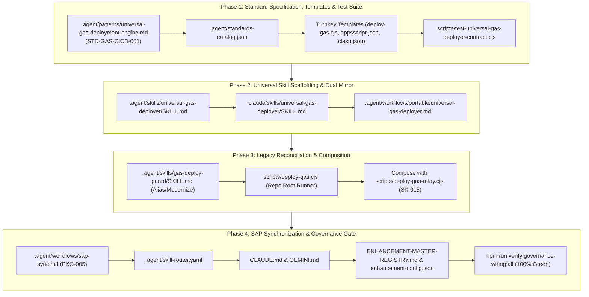

# Implementation Plan: Universal Google Apps Script CI/CD Engine (`SK-016` / `STD-GAS-CICD-001` / `PKG-005`)

This implementation plan formalizes the **Hybrid Model** evaluated and chosen during Prompt Clarity, elevating Google Apps Script deployment from a localized script into a **universal, portable developer capability** (`STD-GAS-CICD-001` / `PKG-005`). It establishes an OS-agnostic Node.js runner, automated in-place version bumping (`clasp deploy --deploymentId`), multi-stage pre-flight syntax and safety gates, legacy `gas-deploy-guard` reconciliation, and cross-repo SAP synchronization.

---

## User Review Required

> [!IMPORTANT]
> **Preservation of Existing Deployments (`INV-GAS-VERSION-BUMP-001`)**:
> The automated version-bumping engine guarantees zero URL drift. When deploying an update, it requires `--deploymentId <id>` (or discovers it in `.clasp.json`), updating the existing deployment version in-place without spawning new URLs or altering client configurations.

> [!NOTE]
> **Legacy `gas-deploy-guard` Reconciliation**:
> The legacy PIOps-specific `.agent/skills/gas-deploy-guard/SKILL.md` (which previously blocked raw clasp and mandated PowerShell `deploy.ps1`) will be updated to formally alias and delegate to `universal-gas-deployer`, modernizing the rule while preserving historical Protocol 10 intent.

---

## Proposed Architectural Invariants (`STD-GAS-CICD-001`)

1. **In-Place Version Bump Invariant (`INV-GAS-VERSION-BUMP-001`)**:
   - `clasp push` updates `@HEAD` only.
   - Pinned production endpoints (`/macros/s/{deploymentId}/exec`) require `clasp deploy --deploymentId <id> --description "<desc>"` to update in-place.
   - Bare `clasp deploy` (without `--deploymentId`) is strictly prohibited in automated CI/CD to prevent orphan deployments and broken URLs.
2. **Cross-Platform Node.js Execution (`INV-GAS-NODE-RUNNER-001`)**:
   - Deployer must be implemented in Node.js (`.cjs`), eliminating PowerShell `.ps1` dependencies and executing identically across Windows, macOS, Linux, and GitHub Actions.
3. **Multi-Stage Pre-Flight Gate (`INV-GAS-PREFLIGHT-GATE-001`)**:
   - Stage 1: Static AST syntax verification (`node -c`) on all `.js` files before touching clasp.
   - Stage 2: Manifest validation (`appsscript.json`) verifying V8 runtime and web app configuration.
   - Stage 3: Clasp credential and target discovery (`.clasp.json` checking `scriptId` and `deploymentId`).
4. **Declarative Multi-Target Routing (`INV-GAS-MULTI-TARGET-001`)**:
   - Supports `--target-dir=<dir>` (default: `backend_gas` or `.`) and optional `.gasrc.json` for custom build staging or file filtering.
5. **Dual-Mirror Parity & SAP Registration (`INV-GAS-SAP-SYNC-001`)**:
   - Canonical skill in `.agent/skills/universal-gas-deployer/SKILL.md` mirrored to `.claude/skills/universal-gas-deployer/SKILL.md` with 100% byte parity.
   - Registered as `PKG-005` in `.agent/workflows/sap-sync.md`.

---

## Sequential Implementation Blueprint



---

## Detailed Task Breakdown: Phase 1 (TDD First)

### Phase 1: Canonical Standard Pattern, Test Suite & Turnkey Templates

#### [NEW] [universal-gas-deployment-engine.md](file:///d:/GitHub_Repo/Sree_Krushna/.agent/patterns/universal-gas-deployment-engine.md)
- **Standard**: `STD-GAS-CICD-001`
- **PACT-001 Contract**: Declare activation conditions, 5 Universal Invariants, safe version-bumping mechanics, and error recovery ladders.

#### [MODIFY] [standards-catalog.json](file:///d:/GitHub_Repo/Sree_Krushna/.agent/standards-catalog.json)
- Register `STD-GAS-CICD-001` under the `CI_CD_DEPLOYMENT` domain with references to `SK-016` and `PKG-005`.

#### [NEW] [deploy-gas.cjs](file:///d:/GitHub_Repo/Sree_Krushna/.agent/skills/universal-gas-deployer/templates/deploy-gas.cjs)
- Universal turnkey deployment script supporting:
  - `--target-dir=<dir>` (default: `backend_gas` or `.`)
  - `--push` (executes syntax check, clasp push, and automated deployment bump)
  - `--deployment-id=<id>` (overrides `.clasp.json`)
  - `--desc=<text>` (defaults to automated timestamp)
  - Regex version extraction (`@\d+`) and live Web App URL output.

#### [NEW] [appsscript.json](file:///d:/GitHub_Repo/Sree_Krushna/.agent/skills/universal-gas-deployer/templates/appsscript.json)
- Production-grade manifest configuring V8 runtime, web app access, and exception logging.

#### [NEW] [.clasp.json.template](file:///d:/GitHub_Repo/Sree_Krushna/.agent/skills/universal-gas-deployer/templates/.clasp.json.template)
- Parameterized clasp configuration declaring `scriptId`, `deploymentId`, and `rootDir`.

#### [NEW] [test-universal-gas-deployer-contract.cjs](file:///d:/GitHub_Repo/Sree_Krushna/scripts/test-universal-gas-deployer-contract.cjs)
- Automated verification script checking:
  1. Pattern file exists and satisfies PACT-001 activation contract.
  2. Standards catalog contains `STD-GAS-CICD-001`.
  3. Turnkey `deploy-gas.cjs` compiles cleanly via `node -c` and handles CLI arguments.
  4. Template `appsscript.json` is valid JSON and declares V8 runtime.
  5. Template `.clasp.json.template` contains expected placeholder structure.

- **Validation Gate (VG-1)**:
  ```powershell
  node scripts/test-universal-gas-deployer-contract.cjs
  # Expected: 🎉 All 5/5 Universal GAS Deployer contract checks passed!
  ```

---

## Sequential Phasing & DoD Matrix

### Phase 2: Universal Skill Scaffolding, Portable Workflow & Dual Mirror
- [ ] **Canonical Skill Definition**: Create `.agent/skills/universal-gas-deployer/SKILL.md` with SAP core boundaries `<!-- shared:std.agent.universal-gas-deployer.core:start/end -->`.
- [ ] **Dual Mirror Synchronization**: Mirror to `.claude/skills/universal-gas-deployer/SKILL.md` with **100% byte parity**.
- [ ] **Portable Workflow**: Create `.agent/workflows/portable/universal-gas-deployer.md` providing slash-command `/universal-gas-deployer` orchestration.
- [ ] **Validation Gate (VG-2)**: Git diff between `.agent` and `.claude` mirrors is empty (100% byte parity verified).

### Phase 3: Legacy Reconciliation, Composition & Root Runner
- [ ] **Modernize Legacy Guard**: Update `.agent/skills/gas-deploy-guard/SKILL.md` to formally alias and delegate to `universal-gas-deployer`.
- [ ] **Instantiate Root Runner**: Place `scripts/deploy-gas.cjs` at repository root.
- [ ] **Compose with SK-015**: Ensure `scripts/deploy-gas-relay.cjs` either delegates to or shares the core engine of `deploy-gas.cjs`.
- [ ] **Validation Gate (VG-3)**: Dry-run `node scripts/deploy-gas.cjs --target-dir=backend_gas` completes with 0 errors.

### Phase 4: SAP Synchronization Manifest, Governance Wiring & Verification
- [ ] **SAP Sync Integration**: Register **`PKG-005`** alongside **`PKG-004`** in `.agent/workflows/sap-sync.md`.
- [ ] **Skill Router & Operating Manuals**: Register `universal-gas-deployer` in `.agent/skill-router.yaml`, `CLAUDE.md`, and `GEMINI.md`.
- [ ] **Enhancement Registration**: Update `ENHANCEMENT-MASTER-REGISTRY.md` and increment `enhancement-config.json` (`next_id: 17`).
- [ ] **Validation Gate (VG-4)**: Execute `npm run verify:governance-wiring:all` with 100% green pass and zero unreferenced artifacts.

---

## Verification Plan

### Automated Verification
```powershell
# 1. Universal Contract Verification (VG-1)
node scripts/test-universal-gas-deployer-contract.cjs

# 2. Dual Mirror Parity Check (VG-2)
git diff .agent/skills/universal-gas-deployer/SKILL.md .claude/skills/universal-gas-deployer/SKILL.md

# 3. Dry-Run Execution Check (VG-3)
node scripts/deploy-gas.cjs --target-dir=backend_gas

# 4. Governance Wiring Audit (VG-4)
npm run verify:governance-wiring:all
```
