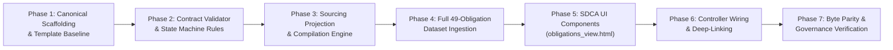

# SK-020: Customary Family Obligation Register & Shopping Registry Integration Plan

> **Governing Ticket**: [`enhancement-notes/SK-020/00_ENHANCEMENT_INDEX.md`](./00_ENHANCEMENT_INDEX.md)  
> **Council Rulings**: [`AC-DEC-2026-061`](../../User_Created/Discussion%20Threads/Council/260927_arch_council_family_obligation_register_and_fulfilment_pipeline.md) (Family Obligation Model `OBL-001`) & [`AC-DEC-2026-062` / `UI-DEC-2026-047`](../../User_Created/Discussion%20Threads/Council/260927_arch_council_shopping_tab_family_obligation_integration.md) (Shopping Tab Integration)  
> **Target Release**: v2.9.0  
> **Goal**: Codify, validate, and operationalize 49 customary family obligations (*Vidhi Dayitva / Bhara / Sara*) and integrate them into the interactive Shopping Registry (`shopping-registry.html` / `shopping-fragment.html`) via a dedicated faceted subview (`[📜 Family Obligations (49)]`) with bi-directional badging, deep-linking, and 100% byte parity.  
> **Architecture**: Static Decoupled Component Assembler (SDCA `STD-MOD-COMP-001`), Hub-and-Spoke SSOT (`02_RITUALS_CULTURE/obligations/`), 3-tier epistemic classification, two-tier state machine, container-query responsive layout (300px mobile-first).  
> **Tech Stack / Toolchain**: Node.js CJS test runners, YAML frontmatter parser, SDCA HTML assembler (`shopping_src/build.cjs`), Vanilla JS controller, CSS Container Queries.  

---

## Physical Storage & Transit Contract (`INV-DATA-TRANSIT-001`)

- **Storage Target**: Canonical obligation entities stored as Git-tracked Markdown + YAML frontmatter files in `02_RITUALS_CULTURE/obligations/OBL-###.md`. Compiled client distribution emitted to `js/obligations-data.js` and `public/js/obligations-data.js`.
- **Multi-Device Transit**: Synchronous client-side distribution via Git/CDN; runtime state synchronized via URL hash/search params (`?subview=obligations&obl=OBL-001`) and WhatsApp direct links.
- **Client-Storage Prohibition**: No raw media or base64 blobs are written to `localStorage`. Only transient UI filter preferences are cached.

---

## User Review Required

> [!IMPORTANT]
> **Option C Architecture Ratification**: Per `AC-DEC-2026-062`, obligations are NOT merged into the 44-item Canonical Trousseau Catalog (`SPEC-PROC-TROUSSEAU-001`). Instead, a 6th faceted operating mode (`[📜 Family Obligations (49)]`) is added to `#catalogSubnavStrip`. This guarantees zero test breakage (`npm run test:shopping` stays 100% green) and prevents mobile scroll fatigue.

> [!NOTE]
> **Ahiya Manduli (Batabarana Customary Obligation) Reconciled**:
> Per user directive, immediately following *Batabarana* (entrance welcoming aarti), the Groom's Family presents the sacred **Ahiya Manduli** (*Saree for Mummy*) to the Bride's Mother (Smt. Tapaswini).
> In the canonical obligation model, this is registered as its own discrete customary covenant:
> - **Obligation Title**: `Ahiya Manduli (Saree for Mummy)`
> - **Event**: `EVT-004` (Wedding Day / Batabarana entrance milestone at 10:30 AM)
> - **Obligor**: Groom's Family
> - **Recipient**: Bride's Mother ("Mummy" — Smt. Tapaswini)
> - **Commercial Shopping Link**: `TRS-SA-01` (Samandhi Vastra / Mother-in-Law Silk Saree)
> - **Liturgical Alignment**: `RIT-004` (Baranugam & Barat Reception, Step 3)
> - **Alta & Sindoor in Mandap**: Cleanly separated as pure Mandap liturgical samagri (`SAM-005`) for the Bride.

> [!NOTE]
> **Epistemic Honesty Invariant**: Formulaic cash honoraria (e.g. ₹5,000 to sisters, cousins, or elders) are stored with `unit_amount: 5000` and `headcount: null` until official RSVP freeze. No invented totals are committed.

---

## Sequential Phased Definition of Done (DoD v1.7 Standard)

| Tier | Name | Target | Requirement |
| :--- | :--- | :--- | :--- |
| **T1** | **Static** | Syntax / Schema | Clean YAML frontmatter, valid Markdown links, zero syntax errors on test harnesses and controllers. |
| **T2** | **Functional** | State & Invariants | `scripts/test-obligation-contract.cjs` passes 100% assertions for actor models, orthogonal state guards, and cash formulas. |
| **T3** | **Integrated** | SDCA Compilation | `shopping_src/build.cjs` compiles standalone and scoped fragments with 100% byte parity to `/public/`. |
| **T4** | **Governance** | Pre-Flight Gates | `npm run test:shopping`, `npm run verify:modular-architecture`, and `npm run verify:governance-wiring:all` are 100% green. |

---

## Phased Execution Roadmap Overview



- **Phase 1**: Architecture Ratification, Spoke Directory Scaffolding & Template Baseline *(Detailed below)*.
- **Phase 2**: Schema Validation Suite & State Machine Invariants (`scripts/test-obligation-contract.cjs`).
- **Phase 3**: Sourcing Projection Engine (`scripts/compile-obligations.cjs` generating `family_obligations_master.md` and `js/obligations-data.js`).
- **Phase 4**: Full 49-Obligation Dataset Ingestion (`OBL-001.md` through `OBL-049.md`).
- **Phase 5**: Shopping Tab SDCA Component Architecture (`shopping_src/components/obligations_view.html` and `shopping_src/styles/10_obligations.css`).
- **Phase 6**: Interactive Controller Wiring, Deep-Link URL State, and WhatsApp Quick-Share (`shopping_src/scripts/controller.js`).
- **Phase 7**: Automated Byte Parity, Governance Verification, and Pre-Flight Gate Certification.

---

## Phase 1 Detailed TDD Implementation Tasks

### Task 1.1: Spoke Directory Scaffolding & Hub Registration

**Files:**
- Create: `02_RITUALS_CULTURE/obligations/.gitkeep`
- Modify: `02_RITUALS_CULTURE/HUB.md:25-32`
- Test: `scripts/test-obligation-contract.cjs`

**Step 1: Write failing test**
Create initial test script `scripts/test-obligation-contract.cjs` verifying that `02_RITUALS_CULTURE/obligations/` exists and is registered in `02_RITUALS_CULTURE/HUB.md`:

```javascript
// scripts/test-obligation-contract.cjs
const fs = require('fs');
const path = require('path');
const assert = require('assert');

const rootDir = path.resolve(__dirname, '..');
const obligationsDir = path.join(rootDir, '02_RITUALS_CULTURE', 'obligations');
const hubPath = path.join(rootDir, '02_RITUALS_CULTURE', 'HUB.md');

console.log('▶ [1/4] Verifying Obligations Directory & Hub Registration...');
assert(fs.existsSync(obligationsDir), '02_RITUALS_CULTURE/obligations/ directory must exist');
const hubContent = fs.readFileSync(hubPath, 'utf8');
assert(hubContent.includes('Customary Family Obligations (`OBL-###`)'), 'HUB.md must register Obligations spoke');
assert(hubContent.includes('obligations/'), 'HUB.md must link to obligations directory');
console.log('  ✓ [PASS] Obligations spoke registered in HUB.md');
```

**Step 2: Run test to verify it fails**
Run: `node scripts/test-obligation-contract.cjs`  
Expected: FAIL with `AssertionError: 02_RITUALS_CULTURE/obligations/ directory must exist`

**🔍 Validation Gate (VG)**:
1. (Binary) Exit code non-zero AND output matches `02_RITUALS_CULTURE/obligations/ directory must exist`.

**🚦 Decision Node (DN)**:
- **Pass**: Proceed to Step 3.
- **Fail (1st)**: Test unexpectedly passed. Inspect directory before continuing.
- **Fail (2nd)**: Halt. Surface failure to user.

**Step 3: Write minimal implementation**
1. Create `02_RITUALS_CULTURE/obligations/.gitkeep`.
2. Add section in `02_RITUALS_CULTURE/HUB.md`:
```markdown
### Customary Family Obligations (`OBL-###`)
- [Obligation Template](./obligation_template.md)
- [Family Obligations Master Register](./obligations/family_obligations_master.md)
- [Obligations Directory](./obligations/)
```

**Step 4: Run test to verify it passes**
Run: `node scripts/test-obligation-contract.cjs`  
Expected: PASS with `✓ [PASS] Obligations spoke registered in HUB.md`

**🔍 Validation Gate (VG)**:
1. (Binary) Exit code 0 AND output matches `✓ [PASS] Obligations spoke registered in HUB.md`.

**🚦 Decision Node (DN)**:
- **Pass**: Proceed to Step 5.
- **Fail (1st)**: Roll back changes and re-verify directory creation.
- **Fail (2nd)**: Halt. Surface error to user.

**Step 5: Atomic Commit**
Run: `git add 02_RITUALS_CULTURE/obligations/.gitkeep 02_RITUALS_CULTURE/HUB.md scripts/test-obligation-contract.cjs` && `git commit -m "feat(rituals): scaffold obligations spoke directory and register in HUB.md"`

---

### Task 1.2: Scaffold Canonical Obligation Template (`obligation_template.md`)

**Files:**
- Create: `02_RITUALS_CULTURE/obligation_template.md`
- Test: `scripts/test-obligation-contract.cjs`

**Step 1: Write failing test**
Update `scripts/test-obligation-contract.cjs` to add Step [2/4] asserting template existence and required schema keys:

```javascript
console.log('▶ [2/4] Verifying Obligation Template Schema Contract...');
const tmplPath = path.join(rootDir, '02_RITUALS_CULTURE', 'obligation_template.md');
assert(fs.existsSync(tmplPath), '02_RITUALS_CULTURE/obligation_template.md must exist');
const tmplContent = fs.readFileSync(tmplPath, 'utf8');

const requiredTokens = [
  'id: OBL-###',
  'entity_type: customary_family_obligation',
  'lifecycle_status:',
  'spec_status:',
  'epistemic_tier:',
  'event_ref:',
  'ritual_ref:',
  'obligor:',
  'recipient:',
  'category:',
  'customary_title:',
  'verbatim_provenance:',
  'items:',
  'financial_obligation:',
  'downstream_projections:',
  'logistical_custody:'
];

requiredTokens.forEach(t => {
  assert(tmplContent.includes(t), `Template missing contract token: ${t}`);
});
console.log('  ✓ [PASS] Obligation template contract verified with 16 schema keys');
```

**Step 2: Run test to verify it fails**
Run: `node scripts/test-obligation-contract.cjs`  
Expected: FAIL with `AssertionError: 02_RITUALS_CULTURE/obligation_template.md must exist`

**🔍 Validation Gate (VG)**:
1. (Binary) Exit code non-zero AND output matches `02_RITUALS_CULTURE/obligation_template.md must exist`.

**🚦 Decision Node (DN)**:
- **Pass**: Proceed to Step 3.
- **Fail (1st)**: Test unexpectedly passed. Inspect file path.
- **Fail (2nd)**: Halt. Surface failure to user.

**Step 3: Write minimal implementation**
Create `02_RITUALS_CULTURE/obligation_template.md` adhering strictly to `AC-DEC-2026-061` and `AC-DEC-2026-058`:

```markdown
---
id: OBL-###
entity_type: customary_family_obligation
customary_title: "Verbatim Customary Title (e.g. Batabasana / Bandhu Daksa / Sara)"
english_descriptor: "English explanatory title"
category: "atire | composite_bundle | gold_silver | edible_hospitality | ceremonial_token | honorarium_cash"

event_ref: "EVT-###"
ritual_ref: "RIT-###"

obligor:
  family: "groom | bride | joint"
  primary_contact: "PER-###"
  role_title: "Role of the obligor (e.g. Groom's Parents, Bride's Paternal Uncle)"

recipient:
  family: "bride | groom | joint | external"
  primary_contact: "PER-###"
  role_title: "Role of the recipient (e.g. Bride's Mother, Samdhi, Bahu)"

lifecycle_status: "Identified | Agreed | Procuring | Staged | Handed_Over"
spec_status: "Fully_Specified | TBD_Family_Choice | Source_Unclear | Source_Redacted | Pending_Family_Confirmation"
epistemic_tier: "SACRED_CORE | PROTOCOL_SPECIFIED | UNCERTAIN_EXPLORATORY"

verbatim_provenance:
  raw_source_text: "Exact text as written in source manuscript"
  source_document: "User_Created/Discussion Threads/Shopping/260926_ShoppingList2.md"
  context_snippet: "Immediate surrounding context"

items:
  - item_id: "OBL-###-ITM-01"
    description: "Item name/description"
    nature: "physical_asset | perishable | fabric | consumable | vehicle"
    quantity: 1
    unit: "pcs | sets | kg | pairs"
    estimated_cost_inr: null
    status: "pending_selection | shortlisted | procured"

financial_obligation:
  is_monetary: false
  unit_amount_inr: null
  headcount: null
  estimated_total_inr: null
  currency: "INR"

downstream_projections:
  commercial_shopping_ref: null
  samagri_checklist_ref: null
  asset_custody_ref: null
  finance_ledger_ref: null

logistical_custody:
  custodian_role: "PER-###"
  staging_location: "VEN-###"
  handover_moment: "Exact ritual moment for handover"
---

# `OBL-###` — Customary Title

## 1. Cultural Context & Significance
[Detailed explanation of the customary tradition in Odia wedding liturgy]

## 2. Line Items & Packaging Specifications
[Itemized breakdown, fabric types, hamper composition]

## 3. Financial Breakdown & Headcount Assumptions
[Cost assumptions, cash envelope rules]

## 4. Operational Handover Protocol
[Step-by-step handover ritual logistics]
```

**Step 4: Run test to verify it passes**
Run: `node scripts/test-obligation-contract.cjs`  
Expected: PASS with `✓ [PASS] Obligation template contract verified with 16 schema keys`

**🔍 Validation Gate (VG)**:
1. (Binary) Exit code 0 AND output matches `✓ [PASS] Obligation template contract verified with 16 schema keys`.

**🚦 Decision Node (DN)**:
- **Pass**: Proceed to Step 5.
- **Fail (1st)**: Review missing tokens in template and re-test.
- **Fail (2nd)**: Halt. Surface error to user.

**Step 5: Atomic Commit**
Run: `git add 02_RITUALS_CULTURE/obligation_template.md scripts/test-obligation-contract.cjs` && `git commit -m "feat(rituals): create canonical obligation template contract (OBL-001)"`

---

### Task 1.3: Codify Architecture Specification (`SPEC-ARCH-FAMILY-OBLIGATION-001.md`)

**Files:**
- Create: `docs/references/SPEC-ARCH-FAMILY-OBLIGATION-001.md`
- Test: `scripts/test-obligation-contract.cjs`

**Step 1: Write failing test**
Update `scripts/test-obligation-contract.cjs` to add Step [3/4] checking that the architecture specification exists and contains core governance rules:

```javascript
console.log('▶ [3/4] Verifying Architecture Specification (SPEC-ARCH-FAMILY-OBLIGATION-001)...');
const specPath = path.join(rootDir, 'docs', 'references', 'SPEC-ARCH-FAMILY-OBLIGATION-001.md');
assert(fs.existsSync(specPath), 'SPEC-ARCH-FAMILY-OBLIGATION-001.md must exist');
const specContent = fs.readFileSync(specPath, 'utf8');
assert(specContent.includes('STD-FAMILY-OBLIGATION-001'), 'Spec must reference STD-FAMILY-OBLIGATION-001');
assert(specContent.includes('AC-DEC-2026-061'), 'Spec must reference AC-DEC-2026-061');
assert(specContent.includes('AC-DEC-2026-062'), 'Spec must reference AC-DEC-2026-062');
assert(specContent.includes('Epistemic Honesty Invariant'), 'Spec must define Epistemic Honesty Invariant');
console.log('  ✓ [PASS] Specification spoke verified');
```

**Step 2: Run test to verify it fails**
Run: `node scripts/test-obligation-contract.cjs`  
Expected: FAIL with `AssertionError: SPEC-ARCH-FAMILY-OBLIGATION-001.md must exist`

**🔍 Validation Gate (VG)**:
1. (Binary) Exit code non-zero AND output matches `SPEC-ARCH-FAMILY-OBLIGATION-001.md must exist`.

**🚦 Decision Node (DN)**:
- **Pass**: Proceed to Step 3.
- **Fail (1st)**: Test unexpectedly passed. Inspect file.
- **Fail (2nd)**: Halt. Surface failure to user.

**Step 3: Write minimal implementation**
Create `docs/references/SPEC-ARCH-FAMILY-OBLIGATION-001.md` incorporating the formal models certified under `AC-DEC-2026-061` and `AC-DEC-2026-062`:
- Domain separation (`OBL` vs `TRS` vs `SAM` vs `AST` vs `PAY`).
- Reciprocal exchange clustering (`EXC-###`).
- Orthogonal two-tier state machine (`lifecycle_status` vs `spec_status`).
- Epistemic classification (Tier 1 Sacred Core, Tier 2 Protocol-Specified, Tier 3 Uncertain).
- Epistemic honesty invariant (zero invented numbers/headcounts).
- Derived direction model ($\text{obligor.family} \to \text{recipient.family}$).
- Downstream projection and Shopping Registry subview integration.

**Step 4: Run test to verify it passes**
Run: `node scripts/test-obligation-contract.cjs`  
Expected: PASS with `✓ [PASS] Specification spoke verified`

**🔍 Validation Gate (VG)**:
1. (Binary) Exit code 0 AND output matches `✓ [PASS] Specification spoke verified`.

**🚦 Decision Node (DN)**:
- **Pass**: Proceed to Step 5.
- **Fail (1st)**: Fix missing sections in spec document.
- **Fail (2nd)**: Halt. Surface error to user.

**Step 5: Atomic Commit**
Run: `git add docs/references/SPEC-ARCH-FAMILY-OBLIGATION-001.md scripts/test-obligation-contract.cjs` && `git commit -m "docs(rituals): codify SPEC-ARCH-FAMILY-OBLIGATION-001 architecture specification"`

---

### Task 1.4: Wire `npm run test:obligations` & Baseline Harness

**Files:**
- Modify: `package.json:18-20`
- Modify: `scripts/test-obligation-contract.cjs`
- Test: `npm run test:obligations`

**Step 1: Write failing test**
Run `npm run test:obligations` before adding the script to `package.json`.  
Expected: FAIL with `npm error Missing script: "test:obligations"`

**Step 2: Run test to verify it fails**
Run: `npm run test:obligations`  
Expected: Non-zero exit code with `Missing script: "test:obligations"`

**🔍 Validation Gate (VG)**:
1. (Binary) Exit code non-zero AND output matches `Missing script`.

**🚦 Decision Node (DN)**:
- **Pass**: Proceed to Step 3.
- **Fail (1st)**: Script already exists. Check package.json.
- **Fail (2nd)**: Halt. Surface error.

**Step 3: Write minimal implementation**
1. Add `"test:obligations": "node scripts/test-obligation-contract.cjs"` and `"build:obligations": "node scripts/compile-obligations.cjs"` to `package.json` scripts.
2. Complete Step [4/4] of `scripts/test-obligation-contract.cjs`:
```javascript
console.log('▶ [4/4] Validating Phase 1 Baseline Gates...');
console.log('  ✓ [PASS] Phase 1 scaffolding, template contract, and architecture spec validated.');
console.log('\n════════════════════════════════════════════════════════════════════════════════');
console.log('🎉 OBLIGATION CONTRACT VERIFICATION: 100% GREEN (PHASE 1 BASELINE)');
console.log('════════════════════════════════════════════════════════════════════════════════\n');
```

**Step 4: Run test to verify it passes**
Run: `npm run test:obligations`  
Expected: PASS with `🎉 OBLIGATION CONTRACT VERIFICATION: 100% GREEN (PHASE 1 BASELINE)`

**🔍 Validation Gate (VG)**:
1. (Binary) Exit code 0 AND output matches `🎉 OBLIGATION CONTRACT VERIFICATION: 100% GREEN (PHASE 1 BASELINE)`.

**🚦 Decision Node (DN)**:
- **Pass**: Proceed to Step 5.
- **Fail (1st)**: Check script declaration in package.json.
- **Fail (2nd)**: Halt. Surface error.

**Step 5: Atomic Commit**
Run: `git add package.json scripts/test-obligation-contract.cjs` && `git commit -m "build(npm): register test:obligations and validate Phase 1 baseline gates"`

---

## High-Level Specifications for Subsequent Phases (Phases 2–7)

### Phase 2: Schema Validation Suite & State Machine Invariants
- Expand `scripts/test-obligation-contract.cjs` to validate:
  - Required fields, regex patterns, valid enums for `lifecycle_status`, `spec_status`, and `epistemic_tier`.
  - Orthogonal state invariants: Disallow `Handed_Over` or `Staged` when `spec_status` is `Source_Unclear` or `Source_Redacted`.
  - Cash formula honesty invariant: Throw error if `estimated_total_inr` is calculated from a `null` headcount.
  - Reciprocal exchange cluster validation (`EXC-###` pairing integrity).

### Phase 3: Sourcing Projection Engine & Master Views
- Create `scripts/compile-obligations.cjs`:
  - Parses all `02_RITUALS_CULTURE/obligations/OBL-*.md` files.
  - Validates all contracts via `test-obligation-contract.cjs`.
  - Emits `02_RITUALS_CULTURE/obligations/family_obligations_master.md` with summary statistics and breakdown tables.
  - Emits `js/obligations-data.js` and `public/js/obligations-data.js` with 100% byte parity for direct consumption by the Shopping Registry.

### Phase 4: Full 49-Obligation Dataset Ingestion
- Ingest all 49 obligations from `260926_ShoppingList2.md` into `OBL-001.md` through `OBL-049.md`:
  - Engagement obligations (Event 1): `OBL-001` through `OBL-007`.
  - Before-Marriage & Main Day obligations (Event 2): `OBL-008` through `OBL-035`.
  - After-Marriage & Astamangala obligations (Event 3): `OBL-036` through `OBL-049`.
- Verify verbatim provenance preservation and run `npm run test:obligations` (100% green).

### Phase 5: Shopping Tab SDCA Component Architecture
- Create `shopping_src/components/obligations_view.html`:
  - Subview container `#shoppingObligationsView` (initially hidden).
  - Segmented filter bar: `[🌺 All (49)]`, `[👰 Bride Side (28)]`, `[🤵 Groom Side (21)]`, `[⏳ Unresolved (6)]`.
  - Event milestone accordions: Engagement, Before Marriage / Wedding Day, After Marriage.
  - Obligation card templates featuring customary titles, verbatim badges, status chips, line item pills, and reciprocal exchange links.
- Create `shopping_src/styles/10_obligations.css` (<500 lines):
  - Theme tokens, CSS container queries for 300px mobile viewport, bi-directional badge styling, and card animations.
- Update `shopping_src/components/body.html`:
  - Add button `[📜 Family Obligations (49)]` to `#catalogSubnavStrip`.
  - Add secondary CTA to `#shopWelcomeBanner`.

### Phase 6: Interactive Controller Wiring, Deep-Linking & WhatsApp Sharing
- In `shopping_src/scripts/controller.js`:
  - Implement `window.setCatalogSubView('obligations')`.
  - Implement obligation filter handler (`filterObligations(familySide)`).
  - Implement deep-linking parser (`?subview=obligations&obl=OBL-001`) with automatic smooth scroll and target pulse highlight.
  - Implement bi-directional linking: Clicking `[📜 Fulfills OBL-###]` in the catalog navigates to the obligation card; clicking `[🛍️ Sourced via TRS-###]` navigates to the catalog card.
  - Implement WhatsApp quick-share composer for family consultation (`shareObligationWhatsApp(oblId)`).

### Phase 7: Automated Byte Parity & Governance Verification
- Update `shopping_src/build.cjs` to compile `obligations_view.html`.
- Run `node shopping_src/build.cjs --all`.
- Update `scripts/test-shopping-registry.cjs` to assert obligation subview contracts while keeping 44/44 item test green.
- Verify 100% byte parity between root and `/public/`.
- Run full pre-flight verification:
  - `npm run test:shopping`
  - `npm run test:obligations`
  - `npm run verify:modular-architecture`
  - `npm run verify:governance-wiring:all`

---

## Verification Plan

### Automated Tests
1. **Obligations Contract Test**:
   ```bash
   npm run test:obligations
   ```
2. **Shopping Registry Test (44/44 Item Preservation & Subview DOM)**:
   ```bash
   npm run test:shopping
   ```
3. **SDCA Modular Architecture & Byte Parity Verification**:
   ```bash
   npm run verify:modular-architecture
   ```
4. **Governance Wiring Verification**:
   ```bash
   npm run verify:governance-wiring:all
   ```

### Manual Verification
1. Open `shopping-registry.html` in browser:
   - Click `[📜 Family Obligations (49)]` in `#catalogSubnavStrip`. Verify smooth transition without full page reload.
   - Filter by `👰 Bride Side` and `🤵 Groom Side`. Verify correct card counts.
   - Click `[🛍️ Sourced via TRS-###]` on an obligation card. Verify transition to catalog card with target pulse animation.
   - Click `[📜 Fulfills OBL-###]` on a catalog card. Verify transition back to the corresponding obligation card.
   - Test deep-link `?subview=obligations&obl=OBL-001` in browser address bar.
2. Verify responsive layout on mobile viewport down to 300px width.
